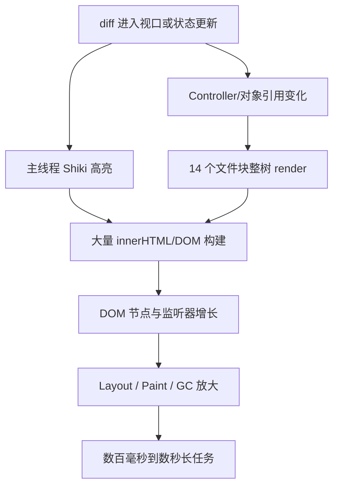

# Review 工作区 Performance Trace 分析

- 分析日期：2026-08-14
- 分析对象：Review 工作区打开、连续滚动、搜索三类操作
- 目标：定位 Renderer 主线程卡顿来源，为优化计划排序提供证据
- 结论置信度：Renderer 结论高；Main/Git 链路未知

## 1. 执行结论

当前 Review 卡顿的首要原因已经可以定位为两个相互放大的问题：

1. `@pierre/diffs` 的 Shiki JavaScript 高亮器运行在 Renderer 主线程。在滚动记录中，`findNextMatchSync` 的采样时间为 5.61 秒，内部正则执行 `#execCore` 为 2.64 秒；搜索记录中二者分别为 3.36 秒和 2.04 秒。当前代码又显式设置了 `disableWorkerPool`。
2. Review controller 和多个函数/对象的引用不稳定，使 14 个文件块反复整体重渲染。打开、滚动、搜索记录分别捕获到 70、224、168 次 `ReviewFileBlock` render，恰好是 14 个文件的 5、16、12 轮完整遍历。

全量挂载文件块及其关闭状态下的 Dialog/菜单子树又扩大了 DOM、布局和绘制成本。滚动记录峰值达到 41,562 个 DOM 节点、1,739 个 JS 事件监听器、118.5 MiB JS heap；`Layout` 累计 1.15 秒、`Paint` 累计 1.10 秒。

相反，滚轮和搜索输入事件本身不是首要瓶颈：153 次 wheel handler 总计 45.2 ms、单次最大 9.3 ms；6 次 input 单次最大 71.8 ms。真正的阻塞大多发生在事件触发后的异步 diff 加载、高亮、React render 和布局阶段。

本批 trace 只覆盖 Renderer，无法验证 Main process 中 Git snapshot 是否存在子进程放大。该项仍是高风险静态假设，但必须先补 Main instrumentation，再决定是否实施批量 Git 改造。

## 2. 输入与分析方法

### 2.1 输入文件

| 场景 | 文件 | 压缩后 | 解压后 | Trace 时长 | 事件数 |
| --- | --- | ---: | ---: | ---: | ---: |
| 打开 Review | `/Users/nallylin/Downloads/review-open.json.gz` | 4.7 MiB | 54.0 MiB | 12.05 s | 228,756 |
| 连续滚动 | `/Users/nallylin/Downloads/review-scroll-before.json.gz` | 13.7 MiB | 150.3 MiB | 48.68 s | 669,028 |
| 搜索 | `/Users/nallylin/Downloads/review-search-before.gz` | 13.7 MiB | 176.1 MiB | 54.11 s | 779,154 |

三份文件解压后合计约 398.6 MB。分析通过本地流式解压、JSON 解析和聚合脚本完成；原始 trace 没有进入模型上下文，只有统计结果和少量源代码定位进入分析。因此文件大小主要消耗本机 CPU/内存，不按原始 398 MB 计入模型 token。

### 2.2 提取内容

- `CrRendererMain` 的 RunTask、长任务、布局、绘制、GC 和 DOM counter。
- Event Timing 中的 click、wheel、scroll、input 等交互耗时。
- CPU profile 采样中的函数热点，并映射回 Vite 预构建依赖。
- React Performance Track 中组件 B/E span、Changed Props 和引用不稳定警告。
- 与当前 Review 源代码做交叉定位。

### 2.3 解释限制

- React 组件耗时是嵌套的 inclusive time，父子组件数值不能相加当作总 CPU 时间。
- 文中的“近似 TBT”是所有 Renderer `RunTask > 50ms` 的超额部分，包含 DevTools profiler 启动和记录期间的其他界面活动，不等同于一次纯净业务操作的 Web Vitals TBT。
- 滚动和搜索记录持续 49–54 秒，其中包含点击、弹窗、侧边栏或其他 workspace 更新，不是严格隔离的单动作 benchmark。
- Trace 没有 Main process 的 Git 命令数和 snapshot IPC timing，因此不能用本批记录确认或排除 Main/Git 瓶颈。
- CPU sampling 是统计估计，适合判断热点优先级，不适合作为逐毫秒的精确计费。

## 3. 总体基线

| 指标 | 打开 | 滚动 | 搜索 |
| --- | ---: | ---: | ---: |
| `>50ms` RunTask | 13 | 45 | 38 |
| `>100ms` RunTask | 11 | 34 | 30 |
| `>200ms` RunTask | 10 | 27 | 23 |
| 近似总阻塞时间 | 8.67 s | 36.47 s | 30.55 s |
| DOM 节点峰值 | 10,707 | 41,562 | 30,097 |
| JS listener 峰值 | 1,145 | 1,739 | 1,648 |
| JS heap 峰值 | 78.6 MiB | 118.5 MiB | 118.8 MiB |
| `UpdateLayoutTree` | 238 ms | 1,250 ms | 1,692 ms |
| `Layout` | 205 ms | 1,153 ms | 779 ms |
| `Paint` | 425 ms | 1,098 ms | 564 ms |
| Minor GC | 266 ms | 279 ms | 286 ms |
| Major GC | 70 ms | 293 ms | 498 ms |

这些绝对总量受记录长度和混合操作影响，不能横向直接比较“哪个场景慢几倍”。可稳定比较的是：三个场景都出现大量超过 200 ms 的主线程任务，且 React 整体重渲染、Shiki 高亮和布局热点在多份记录中重复出现。

## 4. 按影响排序的发现

### P0：Shiki JavaScript 高亮占用 Renderer 主线程（高置信）

CPU profile 的业务热点如下：

| 采样函数 | 打开 | 滚动 | 搜索 | 源码映射 |
| --- | ---: | ---: | ---: | --- |
| `findNextMatchSync` | 571 ms | 5,611 ms | 3,360 ms | `@shikijs/engine-javascript` scanner |
| `#execCore` | 129 ms | 2,639 ms | 2,037 ms | Shiki emulated RegExp |
| `set innerHTML` | 274 ms | 176 ms | 1,068 ms | diff/highlight DOM 内容写入 |
| `get scrollTop` | 163 ms | 634 ms | 557 ms | 滚动/定位布局读取 |
| `getChangeLineData` | — | 154 ms | — | `@pierre/diffs` line diff |
| `iterateOverDiff` | — | — | 51 ms | `@pierre/diffs` diff 遍历 |

本地 Vite 依赖映射确认：

- `desktop-app/node_modules/.vite/deps/chunk-GGL5I7GV.js:11930` 是 `@shikijs/engine-javascript` 的 `JavaScriptScanner.findNextMatchSync`。
- 同文件 `:11718` 是 EmulatedRegExp 的 `#execCore`。
- `desktop-app/node_modules/.vite/deps/chunk-2OEBA4CI.js:2787,3214` 分别是 `@pierre/diffs` 的 `iterateOverDiff` 和 `getChangeLineData`。
- 当前 `ReviewFileDiff.tsx:132-159` 给 `<FileDiff>` 传入了 `disableWorkerPool`。

判断：滚动到尚未解析或尚未高亮的 diff 时，主线程承担大量正则扫描和 DOM 构建，形成数秒级 RunMicrotasks/FunctionCall。应把 worker pool 的 packaged Electron 可行性实验提前到 P0，而不是留在后期的可选优化。

### P0：14 个文件块被反复完整重渲染（高置信）

| 组件 | 打开 render / inclusive time | 滚动 render / inclusive time | 搜索 render / inclusive time |
| --- | ---: | ---: | ---: |
| `ReviewDiffStack` | 6 / 3,308 ms | 18 / 8,722 ms | 14 / 5,417 ms |
| `ReadyReviewDiffStack` | 5 / 2,473 ms | 16 / 8,498 ms | 12 / 5,028 ms |
| `ReviewFileBlock` | 70 / 2,445 ms | 224 / 8,465 ms | 168 / 5,008 ms |
| `ReviewSection` | 70 / 504 ms | 224 / 1,954 ms | 167 / 1,348 ms |
| `SectionDiff` | 47 / 479 ms | 117 / 1,491 ms | 97 / 1,285 ms |
| `ReviewFileDiff` | 12 / 243 ms | 56 / 1,197 ms | 40 / 928 ms |
| `ParsedReviewFileDiff` | 12 / 238 ms | 56 / 1,168 ms | 40 / 888 ms |
| `ReviewToolbar` | 7 / 924 ms | 18 / 2,516 ms | 14 / 1,448 ms |
| `ReviewFileTree` | 7 / 111 ms | 18 / 55 ms | 14 / 85 ms |
| `ReviewFindBar` | 7 / 4 ms | 16 / 47 ms | 13 / 5 ms |

三份记录中的 Review 数据集均为 14 个文件组。`ReviewFileBlock` 的 70、224、168 次 render 分别等于 14 × 5、14 × 16、14 × 12，说明多次状态更新都遍历了全部文件块，而不是只更新变化或可见的文件。

React Performance Track 直接记录了以下 Changed Props：

- `ReviewDiffStack`、`ReadyReviewDiffStack`、`ReviewFileBlock`、`ReviewToolbar` 等每轮都收到新的 `controller`。
- `setActivePath`、`setTreeFilter`、`setDiffMode`、`setWrap`、`setFullFiles`、`setCollapsed`、`refresh`、`setSearchQuery`、`selectSearchMatch` 等 action 被标记为“Referentially unequal function closure”。
- `ReviewSection.onRequestRevert`、`ReviewFileDiff.hunkActions`、`fullContentRequest` 也出现相同引用不稳定警告。

源代码与 trace 一致：

- `useReviewWorkspaceController.ts:435-447` 的 `replaceSection()` 会 spread 所有 group，即使目标 section 不在该 group 中。
- 同文件 `:756-889` 每次 render 返回新 controller，并创建大量内联 action。
- `ReviewDiffStack.tsx:51-85` 的加载与 IntersectionObserver effect 依赖完整 controller。
- `ReviewFileBlock.tsx:363-405` 每次为 diff 创建新的 `hunkActions` 和 `fullContentRequest`。

判断：先稳定数据和 action identity、缩小组件 props，再做 memo。只在现有完整 controller 上加 `React.memo`，无法阻止这些 render。

### P1：全量 DOM 和关闭状态的交互子树放大布局/绘制（高置信）

`ReviewDiffStack.tsx:93-99` 仍对全部 `groups` 执行 `map`。`ReviewFileBlock.tsx:58-211` 则为每个文件挂载 header、actions、section 容器和 Dialog 相关子树，即使 Dialog 没有打开。

在一次 14 文件的完整 Review render 中，React trace 可看到约 30 个 `Dialog`、30 个 `DialogPortal`、15 个 `DialogProvider`，还包括多组 Dropdown/Menu/Popper 组件。它们单个不一定昂贵，但在整树重复 render 时形成明显乘数。

滚动记录中 DOM 节点达到 41,562，且 `Layout`、`Paint` 分别累计 1.15 秒和 1.10 秒；搜索记录的 `UpdateLayoutTree` 累计 1.69 秒，单次最大 389 ms。应通过窗口化让挂载文件块数量有上限，同时只在动作实际触发时挂载确认 Dialog/菜单内容。

### P1：同步布局读写是放大项（中高置信）

`get scrollTop` 在滚动和搜索 trace 中分别采样 634 ms、557 ms；`set innerHTML` 在搜索中达到 1.07 秒。布局树更新、Layout、PrePaint 和 Paint 也在三份记录中反复形成长任务。

这说明 diff DOM 写入后又发生定位/测量，容易形成大树上的昂贵 layout。需要用窗口化、稳定 observer、按帧合并 scroll/layout 操作和 `contain` 减少影响范围。Trace 不能单独证明某一处代码构成强制同步 layout，实施时应增加 performance marks 或 Chrome forced reflow 定位再做局部修改。

### P2：搜索输入存在轻度延迟，但不是主因（高置信）

- 6 次 `input` 总计 206 ms，单次最大 71.8 ms。
- `keypress` 和 `textInput` 单次最大约 73 ms。
- `ReviewFindBar` 在整份搜索 trace 中只 render 13 次、inclusive time 4.8 ms。
- 搜索期间仍出现 12 轮 14 文件的完整 `ReviewFileBlock` render，以及数秒 Shiki 高亮采样。

因此 `useDeferredValue` 可作为 P2 改善输入余量，但不能替代 controller 边界、高亮 worker 和 DOM 窗口化。

### P2：其他 workspace/侧边栏任务会干扰 Review（高证据，原因未知）

搜索记录中一个 4.15 秒长任务主要由 `CodexSidebar`/`SidebarRoot` 约 2.94 秒 render 构成；另一个 1.22 秒任务包含 305 次 `ConversationRow` render，inclusive time 约 918 ms。

这证明 Review 操作期间存在跨区域主线程竞争，但 trace 不能证明是 Review 状态直接触发了侧边栏更新，还是记录中包含了其他用户操作。下一轮应在干净场景中加 workspace/side bar Profiler 标识；只有复现“Review 单一动作导致侧边栏 render”后，才进入具体修复。

### 待验证：Main/Git snapshot 放大（静态高风险，Trace 无覆盖）

静态分析发现 `createReviewSnapshot()`、`listReviewFiles()`、`computeFileRevision()` 可能按文件数放大 Git 调用；但三份 Chromium trace 没有 Main process 命令数量和 IPC 分段 timing。

这项不能因为 Renderer 已发现大热点就被删除，也不能直接按已证实 P0 开工。正确顺序是先加入 Main 侧 Git invocation counter、snapshot 分阶段 measure 和 Renderer IPC mark；若 500/1000 文件 fixture 证明占比高，再实施批量 revision/限流改造。

## 5. 典型长任务解读

### 5.1 打开

- 约 1.62 秒任务中，`ReviewDiffStack` 892 ms、14 个 `ReviewFileBlock` 合计约 890 ms、`ReviewToolbar` 350 ms。
- 另一个约 1.46 秒任务中，Review tree 同样完整 render，并伴随约 141 ms Minor GC。
- 唯一 click 的 Event Timing 为 563 ms；对应任务中有较多 dropdown/menu mount，Review toolbar 仅占约 31 ms。不能把这次 click 全部归因于 diff。

### 5.2 滚动

- 两个最大任务约 7.52 秒、7.36 秒，主体是 `RunMicrotasks`，没有对应 React component span；CPU profile 中 Shiki scanner/RegExp 是主要可识别业务热点。
- 多个 1.2–2.0 秒任务包含 14 个文件块的整轮 render；其中一个任务同时有约 264 ms Layout。
- wheel handler 本身最大仅 9.3 ms，所以优化 wheel listener 不是首选。

### 5.3 搜索

- 一轮 Review 完整 render 的 `ReviewDiffStack`/`ReadyReviewDiffStack` 达 1.34 秒，14 个文件块合计也约 1.34 秒。
- 搜索 click 的一次 Event Timing 约 395 ms，对应任务包含 14 个文件块的 140 ms 整体 render。
- 最慢的 4.15 秒任务主要是侧边栏；搜索 trace 不能被当作纯 Review 搜索耗时总量。

## 6. 根因关系

这是“CPU 解析 + React 放大 + DOM 放大”的组合问题。任何单点优化都可能改善一部分，但 P0 阶段至少需要同时处理高亮线程和稳定渲染边界。

## 7. 建议的验证顺序

1. 先补轻量 instrumentation：React 每次 action 的 render count、Main snapshot timing/Git invocation count、Shiki/highlight measure。
2. 在同一 14 文件 fixture 复录三份短 trace，每份只做一个动作，录制 10–20 秒；DevTools 开始后等待稳定，再执行动作。
3. 稳定 controller/actions 和 `replaceSection` 结构共享，复测一次 section ready 是否仍 render 14 个 block。
4. 做 `@pierre/diffs` worker pool 的 packaged Electron spike，比较 `shiki-js`/`shiki-wasm`、长行限制和错误回退。
5. 窗口化文件块并延迟挂载 Dialog/菜单内容，再复测节点、Layout、Paint 和滚动长任务。
6. 只有 Main instrumentation 证明 snapshot 占比高，才执行 Git 批量化方案。

## 8. 建议验收指标

- 单个 section 从 loading 变 ready 时，不应让全部 14 个 `ReviewFileBlock` render；目标为变化文件加当前窗口，固定场景中不超过 4 个。
- worker 启用后，Renderer 主线程的 `findNextMatchSync` 采样时间相对同 fixture 下降至少 90%，且没有可归因于高亮的 `>200ms` RunMicrotasks。
- 同一 14 文件滚动场景 DOM 节点峰值从 41,562 降到 15,000 以下；更大 fixture 则以挂载文件块上限作为硬门。
- 连续滚动 5 秒不出现 `>200ms` 单个业务长任务，`>50ms` 总阻塞时间较干净基线下降至少 60%。
- 搜索 input p95 低于 50 ms；搜索结果预算单独度量，不能用整份 54 秒 trace 总量代替。
- Main snapshot 只有在 instrumentation 后设时间和 Git invocation 预算，避免拿 Renderer-only trace 推导 Main 目标。

## 9. 分析结论对应的计划变化

- 将“稳定 controller/props 与结构共享”和“diff 高亮 worker packaged spike”并列提升到 P0。
- 窗口化和关闭状态 Dialog/菜单的延迟挂载列为 P1。
- 搜索 deferred、布局 containment、代码分包列为 P2。
- Main/Git snapshot 从“直接优化”改为“先插桩、证实后优化”。
- 下一轮基线必须拆成三份独立短 trace；本批混合 trace 保留为问题发现证据，不作为最终 before/after 的硬门。

