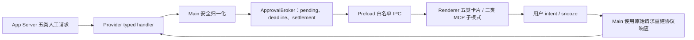

# App Server 审批／待处理交互完整对齐计划

> 计划模式：`$plan` direct mode
> 设计约束：`DESIGN.md`
> 参考实现：`reference-projects/codex-electron-26.707.72221-beautified/`
> 前置成果：`.omx/plans/p0-06-approval-and-structured-input-parity.md`
> 语义优先级：本计划是审批与结构化输入后续实施的唯一依据；与 P0-06 重叠或冲突时以本计划为准
> 计划状态：实施中（本次四项语义修订已完成并通过自动化验证）
> 最后更新：2026-07-28

## 一、目标结果

在不修改 `codex/codex-rs/app-server/`、不绕过 Codex App Server 的前提下，让桌面端完整承接当前 App Server 协议中所有需要用户处理的请求，并复刻参考项目对应的交互语义：

1. `item/commandExecution/requestApproval`：普通命令、网络命令、附加权限、一次／会话／规则审批。
2. `item/fileChange/requestApproval`：文件列表、diff、一次／会话审批。
3. `item/tool/requestUserInput`：选项、Other、自由文本、秘密输入、多问题、自动处理倒计时。
4. `item/permissions/requestApproval`：网络、文件读取、文件写入、混合权限，以及 turn/session 作用域。
5. `mcpServer/elicitation/request`：typed form、`openai/form`、URL 三种协议模式，以及 accept/decline/cancel 的准确区别。

完成后，Provider 不再对权限请求固定返回空权限；Renderer 不再把协议支持的 OpenAI 表单全部降级为“不支持”；自动处理、跳过、取消和授权范围都能经过 Renderer → IPC → Main → Provider 精确返回 App Server。

P0-06 中以下旧结论被本计划明确取代，不能再作为实现依据：

- MCP `approve-mcp-session`、`approve-mcp-always` 和 `_meta.persist` 假持久化；
- 将 `decline` 与 `cancel` 合并为一个拒绝动作；
- 将缺失／`null` 的 `availableDecisions` 与显式空数组 `[]` 视为同一种情况；
- 可选 number/integer 空值参与数字校验，而不是从提交值中省略。

## 二、范围裁剪

### 2.1 协议内、必须补齐

App Server 当前定义了五种需要人工处理的 v2 ServerRequest，见 `codex/codex-rs/app-server-protocol/src/protocol/common.rs:1445-1482`：

| App Server 请求 | 当前状态 | 本计划结论 |
| --- | --- | --- |
| `item/commandExecution/requestApproval` | 已有主链路 | 补齐附加权限详情、actor 文案和动作边界 |
| `item/fileChange/requestApproval` | 已有主链路 | 保持现有 diff 与 session 行为，补齐统一取消／来源语义 |
| `item/tool/requestUserInput` | 已有主链路 | 补齐自动处理、交互后暂停、Other 互斥和 dismiss 行为 |
| `item/permissions/requestApproval` | Provider 固定返回空权限 | 新增完整可交互链路 |
| `mcpServer/elicitation/request` | typed form/URL 部分支持，OpenAI form 固定拒绝 | 补齐三种模式、严格校验和 accept/decline/cancel |

协议证据：

- v2 请求全集：`codex/codex-rs/app-server-protocol/src/protocol/common.rs:1445-1482`。
- 命令、文件、结构化提问参数：`codex/codex-rs/app-server-protocol/src/protocol/v2/item.rs:1333-1529`。
- 权限请求和 turn/session 响应：`codex/codex-rs/app-server-protocol/src/protocol/v2/permissions.rs:743-778`。
- MCP 仅有 `form`、`openai/form`、`url` 三种模式：`codex/codex-rs/app-server-protocol/src/protocol/v2/mcp.rs:635-663`。
- MCP 响应区分 `accept`、`decline`、`cancel`：`codex/codex-rs/app-server-protocol/src/protocol/v2/mcp.rs:258-289`、`:707-716`。

### 2.2 明确跳过

以下参考项目交互没有当前 App Server 人工请求协议承载，本计划不实现：

- `optionPicker`
- `setupCodexContextPicker`
- `setupCodexStep`
- `implementPlan`
- MCP 产品扩展：`generic`、`mcpToolCall`、`toolSuggestion`、`connectorAuth`
- 网站全局授权、Browser Origin 授权、Computer Use 应用授权

参考项目顶层分发包含上述产品请求，见 `reference-projects/codex-electron-26.707.72221-beautified/webview/assets/app-initial~app-main~page-DRgkI91I.js:58921-59092`；但当前 App Server 的 MCP request enum 只有三种模式，因此不能用本地 UI kind 伪造这些能力。

以下虽然是 App Server ServerRequest，但不是人工审批／待处理弹窗，也不纳入本计划：

- `item/tool/call`
- `account/chatgptAuthTokens/refresh`
- `attestation/generate`
- `currentTime/read`

它们应继续由客户端服务或工具执行层处理，不能混入审批面板。

App Server enum 还保留两种 deprecated v1 人工审批请求：

- `applyPatchApproval`
- `execCommandApproval`

它们位于 `codex/codex-rs/app-server-protocol/src/protocol/common.rs:1503-1515`，但当前桌面聊天链路
通过 v2 `turn/start` 工作，Provider 只路由上述五种 v2 人工请求，因此本计划不恢复 legacy API。
若未来重新启用 v1，请分别复用现有 file-change／command shell 和响应语义，不新增第六、第七种
主体弹窗。协议清单测试必须保留这项显式分类，避免把“未实现”误写成“协议中不存在”。

## 三、现状与主要缺口

### 3.1 当前只有四种 Renderer-safe kind

`desktop-app/src/shared/codexApprovalApi.ts:3` 仅定义：

- `command`
- `file-change`
- `tool-user-input`
- `mcp-elicitation`

缺少 `permission-request`。Provider 虽监听 `item/permissions/requestApproval`，但在 `desktop-app/vendors/ai-sdk-provider-codex-asp/src/approvals.ts:193-198` 直接返回 `{ permissions: {}, scope: "turn" }`，用户没有机会批准真实权限。

### 3.2 Tool User Input 自动处理未执行

协议的 `autoResolutionMs` 位于 `codex/codex-rs/app-server-protocol/src/protocol/v2/item.rs:1506-1514`。当前 DTO 在 `desktop-app/src/shared/codexApprovalApi.ts:77-83` 保留该值，但 Renderer 和 broker 没有倒计时、自动空回复或交互后暂停逻辑。

参考项目在 `page-DRgkI91I.js:59224-59390`：

- 展示剩余时间；
- dismiss 时按请求状态返回空 answers 或中断；
- 用户开始交互后 snooze 自动处理；
- 不重置原始请求 deadline。

### 3.3 Tool User Input 的 Other 行为与参考不一致

当前 E2E 允许同一题同时返回选项和 Other 文本，见 `desktop-app/tests/e2e/approval-panels.e2e.ts:92-130`。参考项目的答案组装在 `page-DRgkI91I.js:60075-60102`，选项与 Other 是互斥来源，一题最终只返回一个答案。

### 3.4 权限详情被压成布尔值

命令请求的 `additionalPermissions` 当前只被转换为 `{ network?: boolean, fileSystem?: boolean }`，见 `desktop-app/src/shared/codexApprovalApi.ts:247-258`、`:403-414`。这无法告诉用户具体读取、写入或网络权限。

独立权限请求支持：

- 网络 `enabled`
- 旧式 read/write 路径
- 新式 filesystem entries：path/glob/special + read/write/deny
- glob 扫描深度限制 `globScanMaxDepth`

协议结构见 `codex/codex-rs/app-server-protocol/src/protocol/v2/permissions.rs:58-68`、`:201-231`、
`:253-330`、`:475-482`。`globScanMaxDepth` 必须作为权限边界展示；无法完整解释时整项
fail closed，不能静默丢弃后仍允许批准。

### 3.5 MCP 交互语义不完整

当前实现：

- typed form 可提交；
- `openai/form` 固定 `supported: false`，见 `desktop-app/src/shared/codexApprovalApi.ts:306-313`；
- Renderer 对 OpenAI form 只能拒绝，见 `desktop-app/src/renderer/src/components/assistant-ui/server-request-panel.tsx:643-653`；
- typed form 缺少独立的 Skip=`decline`、Dismiss/Escape=`cancel`；
- URL 没有严格复刻“先打开链接，再 Continue 才 accept”的两步流程；
- Renderer 暴露 session/always MCP 操作，但 App Server 转换响应时丢弃 `_meta`，见 `codex/codex-rs/app-server-protocol/src/protocol/v2/mcp.rs:719-727`。

因此本计划删除没有真实协议效果的 MCP session/always 操作，只保留协议有效的 accept/decline/cancel。

### 3.6 不完整 schema 可能被部分展示

`desktop-app/src/shared/codexApprovalApi.ts:322-343` 会跳过无法识别的 MCP 字段。如果一个表单包含 3 个字段、其中 1 个不支持，当前 UI 可能只展示 2 个字段并提交不完整内容。

目标行为必须是全有或全无：

- 根 schema、所有 properties 和约束全部被安全编译，才显示可提交表单；
- 任一字段无法识别，则显示参考项目式 unsupported card；
- Renderer 永远不接收原始 arbitrary JSON schema。

### 3.7 `availableDecisions` 三态被错误合并

当前 `desktop-app/src/shared/codexApprovalApi.ts` 先把 `availableDecisions` 转为空数组，再用
`length === 0` 判断旧版兼容路径，因此无法区分：

- 字段缺失或显式 `null`：旧版 App Server 没有声明动作列表；
- 非空数组：App Server 明确声明允许的动作；
- 显式空数组 `[]`：App Server 明确声明当前没有可选动作。

本计划采用 App Server 的新语义：

1. 字段缺失或 `null`：才允许复刻
   `ExecApprovalRequestEvent::default_available_decisions` 的历史推导：
   - 网络请求：`accept`、`acceptForSession`、存在合法 allow amendment 时增加对应规则动作、
     `cancel`；
   - `additionalPermissions` 请求：`accept`、`cancel`；
   - 普通命令：`accept`、存在合法 execpolicy amendment 时增加对应规则动作、`cancel`。
2. 显式非空数组：完全权威；Renderer 和 Main 都不得补充数组外的动作。
3. 显式空数组：不创建 Renderer 审批卡；Main 记录不含敏感参数的协议诊断并立即返回
   `cancel`，让当前 turn 中断。
4. 数组包含未知、畸形或无法完整重建的 decision：整项 fail closed，按显式空数组处理。
5. `decline` 与 `cancel` 都是 App Server 声明的用户决定：前者拒绝后继续 turn，后者拒绝并
   立即中断 turn。

## 四、参考交互契约

### 4.1 命令、网络和文件

保持 P0-06 已完成的命令折叠、文件 diff、网络目标和授权菜单，同时补齐：

- 主 Agent 与子 Agent 使用不同 actor 文案；无法安全解析 actor 时使用通用 “Codex”，参考 `page-DRgkI91I.js:59523-59563`。
- 命令请求按 3.7 的三态规则处理 `availableDecisions`；显式数组中的每个有效 decision 都
  独立映射为用户动作，不合成、补充或吞掉动作，协议定义见 `item.rs:40-92`。
- `additionalPermissions` 使用与独立权限请求相同的详情组件，但响应仍走命令 approval decision。
- 命令显式声明 `decline` 时显示“拒绝并继续”，显式声明 `cancel` 时显示“拒绝并停止”；
  两者同时存在时必须作为两个不同动作展示和校验。
- 文件审批没有 `availableDecisions` 字段：`acceptForSession` 只在存在合法 `grantRoot` 时
  提供，`decline` 与 `cancel` 分别表示继续 turn 和中断 turn。

### 4.2 权限请求

复刻参考项目 `page-DRgkI91I.js:54170-54440`：

- 纯网络请求头为“网络访问”；
- 文件系统请求头为“权限”；
- 标题说明 actor 想访问什么；
- 详情逐项区分读取、写入、读写、拒绝、glob 和特殊目录；
- 存在 `globScanMaxDepth` 时显示为 glob 扫描深度限制，不能把有界 glob 展示成无界访问；
- 显示 reason、cwd 和 environment（存在时）；
- 操作为“拒绝”“允许本轮”“本次会话允许”；
- 空权限或无法完整解释的权限自动 fail closed，不显示可误导的批准按钮；
- Renderer 只回传 scope intent，Main 使用原始请求重建 granted permissions。
- `strictAutoReview` 不是 Renderer 可选权限；当前产品没有参考项目对应的可信模式开关时保持
  `undefined`，不能由批准按钮顺带开启。

### 4.3 Tool User Input

复刻参考项目 `page-DRgkI91I.js:59224-59390`：

- 多问题逐题前进，保留返回修改；
- option 与 Other 互斥；
- 无 options 使用自由文本；
- `isSecret` 使用密码输入，答案不进入日志、快照或报错；
- 自动处理显示秒级倒计时；
- 第一次输入、选择、前后题导航即 snooze；
- deadline 由 Main 持有，刷新和切换会话不能重新计时；
- deadline 到期返回 `{ answers: {} }`，并只结算一次；
- 手动 dismiss 在自动处理请求中返回空 answers；普通请求的 Escape 走现有 turn interrupt 能力，不伪造答案。
- Renderer 的 option 自动跳题计时器与 Main 的 auto-resolution timer 是两个不同计时器；
  submit、dismiss、reject、cancel 和组件卸载必须先清除自动跳题计时器，再执行终态动作。

### 4.4 MCP typed form

复刻参考项目 `page-DRgkI91I.js:51445-51704`：

- 标题、server label、字段、Skip、Continue 和右上角 Cancel；
- Enter 提交，Escape cancel；
- Skip → `decline`；
- Continue → `accept + content`；
- Cancel/Escape → `cancel`。

覆盖协议声明的全部 typed schema：

- string；`email`、`uri`、`date`、`date-time`
- number、integer、minimum、maximum
- boolean
- enum / oneOf 单选
- array enum / anyOf 多选
- required、default、minLength、maxLength、minItems、maxItems

Main 必须再次验证字段名、类型、约束和 enum 成员，不能只依赖浏览器表单验证。

number/integer 输入在 Renderer 编辑阶段保留原始文本和空状态；提交时：

- optional 空值不进入 `values`；
- required 空值返回必填错误；
- 非空值先转换为有限 number，再验证 integer、minimum 和 maximum；
- Renderer 与 Main 使用同一语义，不能把空字符串当成 `0` 或无效数字回传。

### 4.5 MCP `openai/form`

参考项目同时有 supported 和 unsupported 两条路径，见 `page-DRgkI91I.js:52743-53179`：

- 安全编译成功：显示完整表单，Continue/Skip/Cancel 语义与 typed form 相同；
- 安全编译失败：显示“不支持此请求”，提供：
  - Skip → `decline`，继续当前 turn；
  - Dismiss → `cancel`，取消请求；
- 支持参考项目已展示的基础字段类型及 image-template 单选；
- 图片 URL、URI 字段和默认值必须通过 Main 白名单；
- 任意 HTML、脚本、组件描述、远程执行信息和未知 schema 关键字不能进入 Renderer。

### 4.6 MCP URL

复刻参考项目 `page-DRgkI91I.js:49999-50191`：

1. 初始主按钮为“打开链接”。
2. 只允许通过现有外链策略打开 `http/https`。
3. 打开后主按钮变为“继续”。
4. 只有点击“继续”才返回 `accept`。
5. 拒绝或 Escape 返回 `decline`。
6. 无效 URL 只允许 decline/cancel，不能把空 URL 当成已批准。

### 4.7 主体风格继承

新增审批／待处理类型只扩展卡片内容和状态，不另起一套主体视觉：

- `ServerRequestPanel` 继续作为 composer footer 中唯一的待处理入口。
- 所有类型复用现有 `RequestShell`、标题区、内容区、错误区、`ActionRow`、
  `ApprovalActions` 和 `Button`；不得新增 viewport modal、独立 dialog 或第二种外层卡片。
- 新增 `permission`、自动处理和 MCP 子组件只负责内容、校验与状态，不自行绘制外层背景、
  边框、圆角、阴影、宽度或悬浮层。
- 背景、边框、圆角、阴影、字体、间距、按钮尺寸、busy/error 状态和窄宽度折行均沿用
  当前审批卡片的语义 token 与布局规则；不得为新类型添加 raw color 或一次性视觉 token。
- 不同类型只允许在标题、说明、详情内容、输入控件和协议有效动作上产生差异。
- 组件测试和截图测试同时校验共享 shell 与类型特有内容，防止功能补齐后出现视觉分叉。

## 五、目标架构



### 5.1 安全不变量

1. 不修改生成的 `desktop-app/vendors/ai-sdk-provider-codex-asp/src/protocol/app-server-protocol/**`。
2. 不修改 `codex/codex-rs/app-server/`；Rust 协议文件只作为事实来源。
3. Renderer 不接收 raw permission profile、raw OpenAI schema、原始 policy amendment 或 provider 配置。
4. Renderer 对权限只提交 `approve + scope`，不能提交任意路径、host 或 permission object。
5. Renderer 对命令规则只提交枚举 intent，Main 从原请求 `availableDecisions` 取回精确对象。
6. unsupported schema 不得部分渲染、部分提交。
7. secret answer 不进入 pending snapshot、diagnostics、localStorage、错误消息或测试附件。
8. 每个 request ID 最多结算一次；timeout、stop、crash、刷新和用户点击竞争时必须保持幂等。

### 5.2 Renderer-safe DTO

扩展 `desktop-app/src/shared/codexApprovalApi.ts`：

- `CodexApprovalKind` 新增 `permission-request`。
- 共用 `CodexPermissionDetail`：
  - `resource`: network/path/glob/special
  - `access`: read/write/read-write/deny/connect
  - 只读 display value
  - 可选 `globScanMaxDepth`，仅用于展示原请求的 glob 扫描边界
- command 的 `requestedPermissionScope` 替换为完整安全详情数组。
- permission request 包含 reason、cwd、environmentLabel、details、availableScopes。
- tool input 包含 `deadlineAt` 和 `autoResolutionState`，不包含答案。
- MCP form 使用 `supported: true + fields` 或 `supported: false + reasonCode`，不传 raw schema。
- MCP field 增加 format、image-select 和完整约束。

响应 intent 增加：

- `approvePermissions` + `scope: turn | session`
- `cancel`
- 保留 `decline`
- MCP 提交继续使用结构化 values

MCP 的 `approveForSession`、`alwaysApprove` 从可见动作和 response schema 中移除，除非未来 App Server 协议明确提供可验证的持久化语义。

### 5.3 Renderer 组件边界

- 保留现有 `server-request-panel.tsx` 的外层 shell 和排版入口。
- 建议拆出的 `permission-details`、`permission-request-card`、`request-auto-resolution`、
  `mcp-elicitation-card` 均是 shell 内部的内容／状态模块，不拥有新的卡片主体样式。
- 若拆分 `RequestShell`、`ActionRow` 或 `ApprovalActions`，只做现有样式的无行为变化提取；
  先用回归测试锁定当前 command、file-change、tool-user-input 和 mcp-elicitation 的结构与视觉类名。
- 新类型接入后，五类请求都应经过同一个 `data-slot="server-request-panel"` 根节点与相同的
  shared-shell contract。

## 六、可测试验收标准

### AC-01：人工请求类型完整

- Provider 对五种人工请求都有 callback。
- `item/permissions/requestApproval` 不再固定返回空权限。
- `CodexApprovalKind` 穷举包含五种类型；新增协议人工请求时类型测试失败。
- dynamic tool、token refresh、attestation 和 current time 不出现在审批面板。

### AC-01A：主体视觉不分叉

- 五类请求和三类 MCP 子模式都使用现有 `ServerRequestPanel`／`RequestShell` 主体。
- 新增内容组件不创建新的 overlay、dialog、外层背景、边框、圆角、阴影或宽度规则。
- command、file-change、tool-user-input 和现有 MCP 的 shell 回归断言保持通过。
- permission、自动处理、MCP OpenAI form 和 URL 截图与现有卡片具有相同主体结构；
  差异仅限于请求内容、字段和协议有效动作。

### AC-02：权限请求准确

- network-only、read-only、write-only、read+write、entries、glob、special path 和 mixed 请求都有组件测试。
- `globScanMaxDepth` 被准确展示并由 Main 从原请求保真返回；无效或无法解释的深度使整项
  unsupported/fail closed，不能静默忽略后批准。
- 批准 turn 返回原始请求权限 + `scope: "turn"`。
- 批准 session 返回原始请求权限 + `scope: "session"`。
- 拒绝返回 `{ permissions: {}, scope: "turn" }`。
- `strictAutoReview` 在没有可信 Main 配置时保持缺省，Renderer 不能注入该字段。
- Renderer 伪造额外路径、host、scope 或 permission object 被 Main 拒绝。
- 空权限和任一未支持 entry 不提供批准按钮。

### AC-03：命令附加权限可核对

- 带 `additionalPermissions` 的命令卡显示具体权限项，不只显示“文件系统/网络”布尔标签。
- 缺失／`null`、显式非空数组、显式空数组和畸形数组分别有测试；只有前两类可进入
  Renderer。
- 显式非空数组完全权威；Main 只接受其中可精确重建的 decision。
- 显式空数组或畸形数组不显示审批卡，记录协议诊断并恰好返回一次 `cancel`。
- `decline` 和 `cancel` 可同时显示；前者继续 turn，后者中断 turn。
- 不带 command 但带权限详情时显示参考项目式“请求权限”卡，不显示空命令框。

### AC-04：Tool User Input 行为一致

- option 和 Other 互斥，一题最多回传一个用户答案。
- 多问题、自由文本、secret 和回退修改均通过单测。
- `autoResolutionMs=3000` 时显示倒计时，使用 fake timer 到期后恰好发送一次空 answers。
- 第一次用户交互会 snooze；继续推进 fake timer 不自动提交。
- 选择 option 后立即 submit、dismiss、reject 或 cancel，再推进自动跳题 timer，只能产生一次
  响应，题目索引不再变化。
- 刷新恢复后沿用原 deadline，不重新获得完整 3000ms。
- secret 不出现在 pending snapshot、错误日志和 Playwright attachment。

### AC-05：MCP typed form 完整

- 所有协议字段类型和约束都有正向／反向测试。
- optional boolean 的“未填写”和显式 false 不被错误合并。
- optional number/integer 空值从提交结果省略；required 空值报错；非空值转换为有限 number
  后再验证 integer、minimum 和 maximum。
- integer 拒绝小数，enum 拒绝未知值，多选保持数组。
- Skip、Cancel/Escape、Continue 分别返回 decline、cancel、accept。
- 任一未知字段导致整张表单进入 unsupported，不得静默丢字段。

### AC-06：OpenAI form 安全支持

- 安全 schema 能渲染并保持值类型。
- image-template 单选支持键盘、可见焦点、坏图降级和 URL 白名单。
- 不支持 schema 显示 Skip 和 Dismiss 两个不同动作。
- raw schema、HTML 和未知对象不出现在 Renderer DTO 或 DOM。

### AC-07：URL 两阶段结算

- 点击“打开链接”只打开外链，不结算请求。
- 打开后点击“继续”才返回 accept。
- Escape/拒绝返回 decline。
- 非 http/https URL 不调用外链 API，也不能 accept。
- 重复点击、窗口切换或 settled 通知不会重复响应。

### AC-08：生命周期与路由

- pending 卡仍只阻塞对应 active thread 的 composer。
- 其他会话的请求保留在 broker snapshot 中，切换后可处理。
- 同一会话多个请求独立 busy/settled。
- refresh、stream failure、stop、app-server crash 和 timeout 都清理 timer，并只通知一次 settled。
- 能从 agent lifecycle 安全解析 actor 时显示 actor；否则显示通用 Codex，不显示内部 thread ID。

### AC-09：视觉和无障碍

- 五类请求复用 `DESIGN.md` 定义的 composer-footer 卡片。
- 360px 宽度下无横向溢出；权限列表和表单内部滚动，动作区保持可见。
- Escape、Enter、Tab、方向键和菜单键盘行为有组件测试。
- 倒计时有可读 aria label，不每秒强制抢占 live region。
- command、file、network、permission、tool auto-resolution、MCP typed/OpenAI/unsupported/URL 均有 desktop 和 narrow 截图证据。

## 七、实施步骤

### 步骤 1：锁定协议清单和回归基线

涉及文件：

- `desktop-app/vendors/ai-sdk-provider-codex-asp/tests/approvals.test.ts`
- `desktop-app/src/shared/codexApprovalApi.test.ts`
- `desktop-app/src/main/codexApprovalBroker.test.ts`
- `desktop-app/src/renderer/src/components/assistant-ui/server-request-panel.test.tsx`

动作：

1. 先增加失败测试，证明当前 permission 固定拒绝、autoResolution 未执行、OpenAI form 固定 unsupported、MCP cancel 缺失、URL 会过早批准。
2. 增加四项已锁定语义的失败测试：`availableDecisions` 三态及畸形值、decline/cancel
   分流、终态清除自动跳题 timer、optional number/integer 空值省略。
3. 为五类 v2 人工请求、两类 deprecated v1 人工请求和四类非人工 ServerRequest 建立分类测试，
   避免后续新增 ServerRequest 时静默漏接；v1 只验证显式 out-of-scope，不恢复 legacy handler。
4. 保留 P0-06 已通过且不与本计划冲突的命令、文件、网络和 typed form 测试作为行为锁；
   MCP session/always 和合并 decline/cancel 的旧断言必须删除或改写。

完成条件：新测试能稳定暴露本计划列出的缺口，原 P0-06 测试未被删除或弱化。

### 步骤 2：Provider 增加权限 callback

涉及文件：

- `desktop-app/vendors/ai-sdk-provider-codex-asp/src/approvals.ts`
- `desktop-app/vendors/ai-sdk-provider-codex-asp/src/provider-settings.ts`
- `desktop-app/vendors/ai-sdk-provider-codex-asp/src/model.ts`
- `desktop-app/vendors/ai-sdk-provider-codex-asp/src/index.ts`
- `desktop-app/vendors/ai-sdk-provider-codex-asp/tests/approvals.test.ts`

动作：

1. 新增 `CodexPermissionsApprovalRequest`、`PermissionsApprovalHandler`。
2. 在 provider-level 和 per-call approvals 设置中传递 `onPermissionsApproval`。
3. 将 `item/permissions/requestApproval` 路由到 callback。
4. 无 callback 时继续 fail closed：空 permissions + turn。
5. 测试 per-call 优先级、provider fallback、默认拒绝和响应值保真。

完成条件：Provider 测试证明权限请求可以到达 Main，且默认路径仍不扩大权限。

### 步骤 3：扩展安全 DTO 和 schema 编译器

涉及文件：

- `desktop-app/src/shared/codexApprovalApi.ts`
- `desktop-app/src/shared/codexApprovalApi.test.ts`
- `desktop-app/src/shared/codexIpcApi.ts`

动作：

1. 增加 `permission-request` union variant 和 permission detail DTO。
2. 将 command `additionalPermissions` 转为完整安全详情。
3. 为 legacy read/write、entries 和 `globScanMaxDepth` 建立统一、安全、完整性可检测的权限编译器。
4. typed form 编译器增加 format，并改为全有或全无。
5. 新增 OpenAI form 安全编译器和 supported/unsupported DTO。
6. 响应 schema 增加 permission scope 与 cancel；移除无协议效果的 MCP 持久化动作。
7. 命令 normalizer 保留 `availableDecisions` 的缺失／`null`／显式数组状态；显式数组使用
   all-or-nothing 编译，不能通过 `arrayValue` 抹平空数组和畸形值。
8. 所有 normalizer 增加 unknown-field、坏 URL、坏默认值、约束冲突测试。

完成条件：Shared 单测证明 Renderer DTO 不含 raw params，且无法把部分 schema/permission 伪装成完整可批准请求。

### 步骤 4：Broker 承担 deadline、snooze 和一次性结算

涉及文件：

- `desktop-app/src/main/codexApprovalBroker.ts`
- `desktop-app/src/main/codexApprovalBroker.test.ts`
- `desktop-app/src/main/approvals/ApprovalCoordinator.ts`
- `desktop-app/src/main/approvals/ApprovalCoordinator.test.ts`

动作：

1. 为 pending request 保存通用 timeout 和可选 auto-resolution timer。
2. deadline 使用服务器 `startedAtMs + autoResolutionMs`；不可用时使用 broker 注册时间。
3. 新增非终态 `snooze(requestId)`，第一次有效交互后取消 auto timer。
4. auto-resolution、用户响应、stop、timeout、rejectAll 和 crash 竞争时只允许一个 settlement。
5. `assertResponseAllowed` 增加 permission、MCP cancel 和 supported/unsupported 完整校验。
6. 命令显式空／畸形 `availableDecisions` 在注册 Renderer request 前直接结算为 `cancel`；
   command/file 的 `decline` 与 `cancel` 均按协议分别校验。

完成条件：fake timer 和并发单测证明没有重复响应、计时重置和 timer 泄漏。

### 步骤 5：Main 精确重建协议响应

涉及文件：

- `desktop-app/src/main/codexAspProvider.ts`
- `desktop-app/src/main/codexAspProvider.test.ts`
- `desktop-app/src/main/codexChatRuntimeService.ts`
- `desktop-app/src/main/codexChatRuntimeService.test.ts`

动作：

1. Provider 初始化和每次 call 都接入 `onPermissionsApproval`。
2. permission approve 从原始 params 取回 permissions，只接受 turn/session intent。
3. permission decline 返回空 permissions，不复制 Renderer 数据。
4. `strictAutoReview` 只允许 Main 从可信配置推导；当前无对应配置时保持缺省。
5. tool input auto/dismiss 返回空 answers；普通 dismiss 接入现有 interrupt 生命周期。
6. MCP 映射准确输出 accept/decline/cancel；删除 `_meta.persist` 假能力。
7. command response 只能从原始显式 `availableDecisions` 精确取回；仅当字段缺失／`null` 时
   使用历史 decision 映射，显式空／畸形列表一律返回 `cancel`。
8. command/file 的 `cancel` 返回协议 `cancel` 并触发 turn 中断语义，`decline` 返回协议
   `decline` 且不主动中断 turn。

完成条件：Main 单测逐字断言五种请求的最终协议 response。

### 步骤 6：增加 snooze IPC，不扩大 Renderer 权限

涉及文件：

- `desktop-app/src/shared/codexIpcApi.ts`
- `desktop-app/src/preload/index.ts`
- `desktop-app/src/main/index.ts`
- `desktop-app/src/renderer/src/hooks/useCodexIpcAssistantRuntime.ts`
- 对应 main/preload/runtime hook 测试

动作：

1. 新增只接受 request ID 的 `snoozeApprovalAutoResolution` IPC。
2. Main 校验 request 存在、kind 为 tool-user-input、尚未 settled。
3. Renderer hook 暴露非终态 onInteraction callback。
4. pending snapshot 返回固定 deadline/snoozed 状态，刷新不重新计时。

完成条件：IPC schema 拒绝未知字段；inactive thread、过期 ID 和重复 snooze 都安全无副作用。

### 步骤 7：实现权限卡和共用权限详情

涉及文件：

- `desktop-app/src/renderer/src/components/assistant-ui/server-request-panel.tsx`
- 建议新增 `desktop-app/src/renderer/src/components/assistant-ui/permission-request-card.tsx`
- 建议新增 `desktop-app/src/renderer/src/components/assistant-ui/permission-details.tsx`
- `desktop-app/src/renderer/src/components/assistant-ui/server-request-panel.test.tsx`
- `desktop-app/src/renderer/src/App.test.tsx`

动作：

1. 将五类顶层卡片改为穷举 dispatch。
2. 新权限卡复用现有 card shell、按钮和 scope menu。
3. command additionalPermissions 复用同一 permission details。
4. 增加 actor-aware 标题，内部 thread/turn 信息不显示。
5. 空或 unsupported 权限只显示说明和拒绝。

完成条件：权限类型、作用域、actor、键盘和窄窗口组件测试全部通过。

### 步骤 8：修正 Tool User Input 与 MCP 三种模式

涉及文件：

- `desktop-app/src/renderer/src/components/assistant-ui/server-request-panel.tsx`
- 建议新增 `request-auto-resolution.tsx`
- 建议新增 `mcp-elicitation-card.tsx`
- `desktop-app/src/renderer/src/components/assistant-ui/server-request-panel.test.tsx`

动作：

1. Tool User Input 增加 countdown、dismiss、snooze 和 Other 互斥；所有终态路径先清除
   Renderer 自动跳题 timer。
2. typed form 增加 format、完整约束、Skip/Cancel/Continue；optional number/integer 空值在
   提交前省略，required 空值和非法非空值阻止提交。
3. OpenAI form 根据安全 DTO 选择 supported/unsupported 卡。
4. URL 改为 Open Link → Continue 两阶段。
5. settled/busy/error 状态沿用每卡独立状态，不锁住其他请求。

完成条件：AC-04 至 AC-07 的组件测试全部通过，且没有 raw schema/permission JSON fallback。

### 步骤 9：补齐协议 Mock E2E、视觉证据和文档

涉及文件：

- `desktop-app/tests/e2e/support/approval-panel-app-server.mjs`
- `desktop-app/tests/e2e/approval-panels.e2e.ts`
- `desktop-app/tests/e2e/approvals.e2e.ts`
- `desktop-app/tests/test-plan-coverage.json`
- `docs/test-plan.md`
- `docs/ai-sdk-provider-codex-asp-api.md`
- `docs/codex-app-server-official-notes.md`
- `docs/codex-electron-conversation-gap-checklist.md`
- `DESIGN.md`

新增协议 Mock E2E 场景：

1. permission-network-turn
2. permission-filesystem-session
3. permission-mixed-decline
4. command-additional-permissions
5. tool-auto-resolve
6. tool-auto-resolve-snooze
7. mcp-typed-cancel
8. mcp-openai-supported
9. mcp-openai-unsupported-skip
10. mcp-openai-unsupported-dismiss
11. mcp-url-open-continue
12. mcp-url-invalid
13. command-decisions-missing
14. command-decisions-empty-auto-cancel
15. command-decline-versus-cancel
16. tool-option-terminal-timer-race
17. mcp-optional-number-empty

每个场景必须断言：

- UI 文案和可见动作；
- composer 阻塞／恢复；
- app-server peer 收到的精确 JSON-RPC response；
- 请求只结算一次；
- desktop 和窄窗口截图；
- Renderer console 无错误；
- secret/raw schema/raw permission 未出现在附件。

完成条件：测试矩阵和文档不再把四种 UI kind 误写为完整协议覆盖。

## 八、验证命令

按依赖顺序执行：

```bash
npm --prefix desktop-app/vendors/ai-sdk-provider-codex-asp run lint
npm --prefix desktop-app/vendors/ai-sdk-provider-codex-asp run typecheck
npm --prefix desktop-app/vendors/ai-sdk-provider-codex-asp test -- approvals.test.ts

npm --prefix desktop-app run lint
npm --prefix desktop-app run typecheck
npm --prefix desktop-app test -- codexApprovalApi.test.ts codexApprovalBroker.test.ts codexChatRuntimeService.test.ts server-request-panel.test.tsx

npm --prefix desktop-app run test:e2e -- approval-panels.e2e.ts --reporter=line
npm --prefix desktop-app run test:e2e -- approvals.e2e.ts --reporter=line
```

最终再运行项目规定的完整 Desktop 测试集。若单测命令的 Vitest 参数与 package script 不兼容，以现有 package script 支持的过滤语法调整，但不得跳过上述测试文件。

## 九、风险与缓解

| 风险 | 后果 | 缓解 |
| --- | --- | --- |
| 任意 OpenAI schema 直接进入 Renderer | 注入、崩溃或敏感字段泄露 | Main 完整编译；不支持则整表 fail closed |
| permission 只展示部分条目却批准全部 | 用户在不知情时扩大权限 | all-or-nothing 编译；Renderer 只发 scope intent |
| auto timer 与点击同时结算 | 重复 JSON-RPC response | broker 单 owner、原子删除 pending、fake-timer 竞态测试 |
| 自动跳题 timer 在终态后继续执行 | 重复提交或题目索引变化 | Renderer 终态前显式清 timer，并用 fake timer 验证 |
| 刷新重置 countdown | 请求获得额外等待时间或重复提交 | Main 持有 deadline，snapshot 只投影 |
| MCP session/always 文案与协议不一致 | 用户以为规则被记住 | 移除无真实协议效果的动作 |
| 显式空 `availableDecisions` 被当成旧版缺失 | 客户端生成服务端未允许的批准动作 | 保留三态；空／畸形列表在 Main 自动 cancel |
| optional number 空值被当成 0 或校验失败 | 表单无法提交或改变用户含义 | 编辑态保留空值；提交时省略 optional 空值 |
| Other 同时返回 option + text | 与参考语义和模型预期不一致 | 单选互斥状态机和 wire-response 测试 |
| permission entries 新旧格式并存 | 显示重复或 grant 不一致 | 统一 canonical details，Main 始终返回原始 profile |
| `globScanMaxDepth` 被静默忽略 | 用户把有界 glob 误认为不同权限边界 | 显示深度限制；不能解释则整项 fail closed |
| deprecated v1 请求未显式分类 | 协议清单被误判为完整，未来恢复 legacy 时漏接 | 分类测试固定 v2、legacy v1、非人工三组 |
| 子 Agent actor 无法解析 | 错误归因 | 只使用可信 lifecycle 映射；否则通用 Codex |
| 大型 `server-request-panel.tsx` 继续膨胀 | 维护和测试困难 | 按 permission/MCP/auto-resolution 拆局部组件，不新增设计系统 |

## 十、完成定义

只有同时满足以下条件才能标记完成：

1. 当前 App Server 的五种人工请求全部有可达、可交互、可恢复的桌面链路。
2. 权限请求不再固定空回复。
3. typed/OpenAI/URL MCP 三种模式均有与参考一致的处理状态。
4. Tool User Input 自动处理在 Main 中可靠执行，刷新不重置。
5. 所有用户 intent 都由 Main 结合原始请求重建，Renderer 无法扩大权限。
6. 非协议参考场景没有被伪造成新的 App Server UI kind。
7. Provider、Shared、Main、Renderer、Mock E2E 和视觉证据全部通过。
8. 文档与测试矩阵准确区分“App Server 完整覆盖”和“参考产品独有功能”。
9. `availableDecisions` 三态、decline/cancel 分流、终态 timer 清理和 optional numeric 空值
   四项回归测试全部通过。
