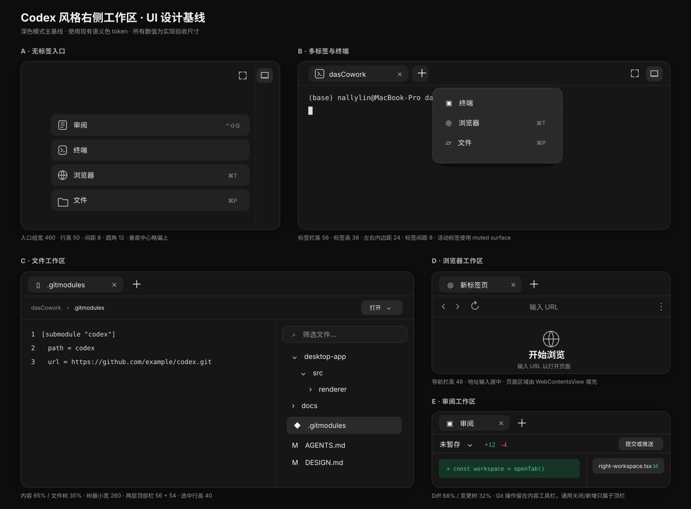

# Codex 风格右侧工作区实施计划

> 计划模式：Direct。本文只做设计与实施拆解，不修改产品代码。

## 1. 结论先行

推荐采用“统一工作区外壳 + 四类独立内容能力”的组合方案：

- 交互和信息架构对齐用户提供的 Codex 截图：右侧入口、可关闭多标签、`+` 新建菜单、收起/展开、最大化和可调宽度。
- “审阅”不重写。保留当前项目已经完成的 Git 仓库识别、变更来源、文件列表、Diff、暂存/撤销/提交等逻辑，只把现有固定侧栏拆成可嵌入的工作区内容。
- “终端”采用 OpenWork 与 Codex 参考项目都验证过的 `node-pty + xterm` 结构：主进程持有真实终端，renderer 只负责显示和输入。
- “浏览器”借鉴 OpenWork 的主进程 `WebContentsView` 方案。Codex 解包代码虽然使用了内部 `browser-*` 包和 webview 宿主，但这些私有包不可移植，而且 Electron 官方当前明确不推荐新项目使用 `<webview>`。
- “文件”借鉴 AionUi 的文件树、按项目保存标签、同文件去重、按类型预览和大文件降级，但不复制其依赖 `aioncore` HTTP/WS 后端，也不一次性引入完整 Office 预览技术栈。
- 工作区是 Electron 桌面能力，不经过 Codex app server；不修改 `codex/codex-rs/app-server/`。

建议实施顺序：**工作区外壳 → 迁移审阅 → 文件 → 终端 → 浏览器 → 集成与安全加固**。这样每一阶段都能独立交付，浏览器这一风险最高的能力最后接入。

## 2. 需求摘要

### 2.1 用户可见能力

1. 对话右侧提供“审阅、终端、浏览器、文件”工作区入口；无标签时显示四个入口卡片。
2. 打开任一能力后，顶部显示标签栏；`+` 菜单可继续打开其他类型标签。
3. 支持激活、关闭和新增标签；审阅是单例，终端/浏览器可多开，文件按文件路径去重。
4. 右侧面板支持拖拽调宽、收起、恢复和面板内最大化；布局变化不丢失当前标签状态。
5. 文件工作区左侧显示内容、右侧显示可搜索文件树；点击文件后按类型预览。
6. 浏览器提供地址栏、前进、后退、刷新、加载/错误状态和多标签独立历史。
7. 审阅工作区延续现有 Git 功能，并在统一工作区中对齐 Codex 的标签、文件选择和操作入口。

### 2.2 本期明确不做

- 不复刻 Codex 内部浏览器的 Chrome 数据导入、扩展、密码、下载管理或自动化控制能力。
- 不在首期实现 Word、Excel、PowerPoint、Notebook 的完整可编辑预览；只提供安全降级和“用系统应用打开”。
- 不让 renderer 直接读取文件、启动进程或获取 Electron/Node 权限。
- 不改变聊天模型调用、thread/turn、审批、sandbox 或 Codex app server 协议。
- 不把终端会话、浏览器 Cookie、完整浏览历史或文件内容存入对话记录。

## 3. 现状审计：审阅功能可以复用到什么程度

答案是：**可以复用绝大部分业务能力，但不能原样复用外层布局。**

- 当前 `GitRepositoryProvider → LocalGitReviewProvider → ChatThread` 已经挂到主对话页，见 `desktop-app/src/renderer/src/App.tsx:742-770`；对话底部已有打开入口，见 `desktop-app/src/renderer/src/App.tsx:1068`。
- `LocalGitReviewProvider` 已持有打开状态、审阅来源、最后一次 turn 和操作反馈，见 `desktop-app/src/renderer/src/components/local-git-review/LocalGitReviewProvider.tsx:64-92`。
- 当前 Provider 自己创建“聊天 + 右侧面板”的固定双栏容器，见 `desktop-app/src/renderer/src/components/local-git-review/LocalGitReviewProvider.tsx:179-191`。这一层应改为调用统一工作区命令，不再拥有侧栏布局。
- 当前面板宽度固定为 `min(46vw, 42rem)`，没有多标签、拖拽宽度或布局持久化，见 `desktop-app/src/renderer/src/components/local-git-review/LocalGitReviewPanel.tsx:438-444`。
- 已有未暂存、已暂存、commit、branch、last-turn 五类来源，见 `desktop-app/src/renderer/src/components/local-git-review/LocalGitReviewPanel.tsx:483-517`。
- 已有变更文件列表、二进制/冲突/大 Diff 降级和 `DiffViewer`，见 `desktop-app/src/renderer/src/components/local-git-review/LocalGitReviewPanel.tsx:697-752`。
- Git 能力已有完整的 shared schema、preload bridge 和 main IPC，见 `desktop-app/src/shared/localGitApi.ts:517-533`、`desktop-app/src/preload/index.ts:291-335`、`desktop-app/src/main/index.ts:555-573`。

复用边界：

| 层 | 决策 |
| --- | --- |
| Git 仓库识别、快照、Diff、操作、watch | 原样保留，避免第二套 Git 服务 |
| `LocalGitReviewProvider` 的来源和操作反馈 | 保留；打开/关闭动作接到工作区 store |
| `LocalGitReviewPanel` 内容 | 拆成 `LocalGitReviewContent`，去掉固定 `<aside>`、宽度和自有标题栏 |
| 文件树与 Diff 排列 | 按截图改成 Diff 在左、变更文件树在右；窄宽度时允许折叠文件树 |
| 现有测试 | 作为回归基线，迁移后只调整容器断言，不降低业务覆盖 |

其余三类能力当前都不是可复用的完整工作区：

- Browser 目前只校验 `http(s)` 后交给系统默认浏览器，见 `desktop-app/src/main/index.ts:287-289`；主窗口也会拒绝内部新窗口并外部打开 URL，见 `desktop-app/src/main/index.ts:450-465`。
- `DesktopCodexApi` 目前只有打开外部 URL、本地路径和上下文选择等通用方法，没有 browser/terminal/files 的有状态资源 API，见 `desktop-app/src/shared/codexIpcApi.ts:532-546`。
- 当前依赖已有 Zustand、Zod、diff/parse-diff、Radix/shadcn 和 Streamdown，但没有 `node-pty`、xterm、CodeMirror 或 Monaco，见 `desktop-app/package.json:36-43` 和 `:50-101`。
- 当前本地上下文选择器解决的是“把文件/目录加入对话上下文”，不是项目文件树与预览工作区，实施时不应把两种用户任务混成一个入口。

## 4. 参考实现与技术选型对比

### 4.1 Codex 解包参考项目

可确认的能力和依赖：

- 侧栏标签导出包含普通 Review、last-turn Review、branch Review、Browser、Sandbox、Timeline、MCP App 等内部类型，见 `reference-projects/codex-electron-26.707.72221-beautified/webview/assets/thread-side-panel-tabs-MgBvi70P.js:23-40`。本项目首期只暴露截图中明确的四类入口，内部模型要允许以后扩展类型。
- 主进程依赖包含 `node-pty`、`mime-types`、`electron-context-menu`、`better-sqlite3` 和三个内部 `browser-*` 包，见 `reference-projects/codex-electron-26.707.72221-beautified/package.json:68-99`。
- 主进程确实加载 `node-pty` 并使用 `xterm-256color`，见 `reference-projects/codex-electron-26.707.72221-beautified/.vite/build/main-CpD8a18d.js:63904` 和 `:64095`；renderer bundle 创建 xterm `Terminal` 与 `FitAddon`，见 `webview/assets/app-initial~app-main~quick-chat-window-page~chatgpt-conversation-page-CrA1-JEm.js:108552-108579`。
- 构建产物包含 artifact、PDF、DOCX、Notebook、编辑器 Diff 和 browser tab 模块，证明其文件能力不只是纯文本，但这些 bundle 不能作为稳定 API 直接复用。
- 浏览器依赖 `browser-api`、`browser-backend-common`、`browser-common` 等内部 workspace 包，见上述 `package.json:76-78`，不适合作为本项目依赖。

官方公开材料能确认 Codex app 支持在线程中审阅 agent 改动、评论 Diff、在编辑器打开，以及内置 worktree；但官方页面没有公开右侧工作区标签的详细组件/API 约定。因此，本计划用[OpenAI 官方产品说明](https://openai.com/index/introducing-the-codex-app/)确认产品级能力，用用户截图和本地解包代码确认具体交互，不把解包代码当作可依赖的公共接口。

### 4.2 OpenWork

优点：

- 标签 store 结构清楚，支持打开、关闭、选择、重排和外部状态同步，见 `reference-projects/openwork/apps/app/src/react-app/domains/session/panel/panel-tab-store.ts:8-53`。
- browser tab 状态通过 hook 与 Electron bridge 同步，见 `reference-projects/openwork/apps/app/src/react-app/domains/session/panel/use-side-panel-tabs.ts:8-119`。
- 内置浏览器使用主进程 `WebContentsView`，不是 `<webview>` 或已废弃的 `BrowserView`，见 `reference-projects/openwork/apps/desktop/electron/browser-panel.mjs:7` 和 `:474`。
- 终端使用 `@xterm/xterm`、`@xterm/addon-fit` 与 `node-pty`，见 `reference-projects/openwork/apps/app/src/react-app/domains/session/terminal/terminal-dock.tsx:3-53`、`reference-projects/openwork/apps/app/package.json:61-62`、`reference-projects/openwork/apps/desktop/package.json:36`。
- artifact 能把 URL、Markdown、表格、幻灯片、文档、图片、PDF、HTML、文本路由到不同预览，见 `reference-projects/openwork/apps/app/src/react-app/domains/session/artifacts/open-target.ts:4-93`。

不足：没有项目文件树，也没有完整 Git review；其 diff 主要是消息工具输出的文本展示。因此它最适合作为**终端、浏览器和通用 tab store**的参考。

### 4.3 AionUi

优点：

- `PreviewContext` 有文件标签去重、切换、关闭、按项目保存和恢复；文件树浏览可以替换当前未修改标签，避免每点一个文件就堆一个 tab，见 `reference-projects/AionUi/packages/desktop/src/renderer/pages/conversation/Preview/context/PreviewContext.tsx:37-80`、`:185-195`、`:215-280`。
- 标签栏处理横向溢出、未保存标识、关闭和面板收起，见 `reference-projects/AionUi/packages/desktop/src/renderer/pages/conversation/Preview/components/PreviewPanel/PreviewTabs.tsx:101-187`。
- 文件打开前读取 metadata，根据类型决定读取文本还是图片，并对大文本截断，见 `reference-projects/AionUi/packages/desktop/src/renderer/pages/conversation/Preview/hooks/useLocalFilePreview.ts:28-75`。
- Explorer 有文件/变更入口、搜索区、文件树、添加目录和外部打开，见 `reference-projects/AionUi/packages/desktop/src/renderer/pages/conversation/Explorer/ExplorerContainer.tsx:344-405`。
- 自研 `useResizableSplit` 已处理 px/ratio、LocalStorage、Pointer Capture 和 RAF 节流，可借鉴拖拽细节，见 `reference-projects/AionUi/packages/desktop/src/renderer/hooks/ui/useResizableSplit.tsx:25-89` 和 `:91-230`。
- 预览依赖涵盖 CodeMirror 6、Monaco、diff2html 和多种 Office 解析库，见 `reference-projects/AionUi/package.json:83-110`、`:123-145`。

不足：文件系统走 `/api/fs/*` HTTP/WS 后端，见 `reference-projects/AionUi/packages/desktop/src/common/adapter/ipcBridge.ts:607-649`，其 Explorer runtime 依赖 Aion 自己的后端协议，不能搬到本项目；“变更”区仍是占位；浏览器采用启用 `webviewTag` 的方案；依赖集合也远超首期需要。它最适合作为**文件树、标签去重、预览路由和大文件降级**的交互参考，而不是终端、Git 或浏览器安全架构参考。

### 4.4 最终选型矩阵

| 能力 | 采用方案 | 不采用方案 | 原因 |
| --- | --- | --- | --- |
| 工作区外壳/标签 | 本项目 Zustand + Codex 交互 + OpenWork store 思路 | 新增大型 docking 框架 | 当前只有单列右侧区域，docking 框架成本高且交互过度 |
| Git 审阅 | 复用本项目 `local-git-review` | OpenWork/AionUi review | 本项目业务能力与测试最完整 |
| 终端 | `node-pty` + `@xterm/xterm` + `@xterm/addon-fit` | textarea 模拟终端、模型命令工具输出 | 需要真实 TTY、尺寸、颜色和交互程序 |
| 浏览器 | 主进程 `WebContentsView` | Codex 私有 `browser-*`、`<webview>`、任意站点 iframe | 可移植、权限边界清楚；Electron 官方推荐避开 `<webview>` |
| 代码/文本预览 | CodeMirror 6 只读模式，按需加载语言 | Monaco 全量首装 | CodeMirror 更轻，足够完成搜索、行号、语法高亮 |
| Markdown | 复用现有 `streamdown` 渲染能力 | 再引入 markdown 渲染器 | 避免重复依赖和风格分叉 |
| 图片 | 项目范围内的受控本地媒体 URL/stream | renderer 直接 `file://`/任意路径读取 | 延续现有安全边界；当前已有 `localMediaProtocol` 测试基础 |
| PDF | Electron 内建 PDF 展示或受控本地 URL | 首期引入 PDF 编辑器 | 先满足查看，降低体积与复杂度 |
| Office | “暂不支持 + 系统应用打开” | 一次性复制 AionUi Office 栈 | 首期价值低、依赖和跨平台风险高 |

依赖动作清单：

| 类别 | 依赖 | 动作 |
| --- | --- | --- |
| 外壳/状态 | `zustand`、Radix/shadcn、Tailwind | 复用现有版本，不新增 docking/resizable 框架 |
| Review | `diff`、`parse-diff` | 复用现有版本和 `DiffViewer` |
| Terminal | `node-pty`、`@xterm/xterm`、`@xterm/addon-fit` | 新增；实施前完成许可证、Electron ABI、三平台打包验证 |
| Files | `@uiw/react-codemirror`、`@codemirror/language-data`、必要的 search/state/view 包 | 只在文件预览阶段新增；语言包懒加载，不引入 Monaco |
| Markdown | `streamdown` 与现有扩展 | 复用，不引入第二套 Markdown renderer |
| Browser | Electron `WebContentsView` | Electron 自带，无新增浏览器框架或 Codex 私有包 |

Electron 官方说明当前建议不要使用 `<webview>`，可考虑 `WebContentsView`；安全清单还要求远程内容禁用 Node、启用隔离/沙箱、限制导航/新窗口并验证 IPC sender。实现时以 [WebContentsView 文档](https://www.electronjs.org/docs/latest/api/web-contents-view)、[`<webview>` 警告](https://www.electronjs.org/docs/latest/api/webview-tag)和[安全清单](https://www.electronjs.org/docs/latest/tutorial/security)为准。

## 5. UI 视觉设计基线

本节是开发时的视觉约束，不是示意性建议。实现、代码审阅和截图验收都应以本节及设计板为准，避免各工作区由不同开发者自由发挥后产生四套风格。



设计板源文件：`docs/design/codex-right-workspace-ui-spec.svg`。

### 5.1 视觉证据优先级

出现理解冲突时按以下顺序裁决：

1. 用户提供的五张 Codex 客户端截图：决定整体布局、密度、层级和控件位置。
2. 本节和仓库 UI 设计板：把截图转成开发可执行的尺寸、状态和组件规则。
3. `DESIGN.md` 与 `desktop-app/src/renderer/src/assets/styles/globals.css:16-67`、`:80-147`：决定本项目语义色、字体和圆角，不另造一套主题。
4. Codex 解包项目：只用于补充截图未覆盖的交互，不复制混淆或不可移植的实现细节。

首个视觉基线是深色模式。浅色模式必须使用相同语义 token 正确渲染，但不能为了浅色模式改变结构尺寸。

### 5.2 整体构图

右侧工作区是对话页的一部分，不是浮层、Drawer 或独立窗口：

```text
┌──────────┬───────────────────────────────┬────────────────────────┐
│ 项目侧栏 │             对话区             │      右侧工作区         │
│          │                               │ ┌────────────────────┐ │
│          │                               │ │ tabs   +    控制区  │ │ 56
│          │                               │ ├────────────────────┤ │
│          │                               │ │ 类型工具栏（可选）   │ │ 48–54
│          │                               │ ├────────────────────┤ │
│          │                               │ │                    │ │
│          │                               │ │     活动标签内容     │ │
│          │                               │ │                    │ │
│          │                               │ └────────────────────┘ │
└──────────┴───────────────────────────────┴────────────────────────┘
                                               ↑ 左缘拖拽调宽
```

几何尺寸：

| 区域 | 尺寸/规则 | 目的 |
| --- | --- | --- |
| 工作区默认宽度 | 560px | 与参考图的阅读密度接近，可同时容纳内容和右树 |
| 最小/最大宽度 | 360px / `min(960px, 70vw)` | 保护聊天区，同时支持文件/Review 宽视图 |
| 左分隔线/拖拽命中区 | 1px 可见线；左右各 4px 命中 | 视觉轻，鼠标容易抓取 |
| 顶部标签栏 | 56px | 与参考客户端一致的桌面工具栏节奏 |
| 活动标签 | 高 38px；横向 padding 14px；圆角 12px | 深色 muted surface，不使用底部蓝线 |
| `+` 按钮 | 38×38px；圆角 12px | 与标签同高同层级 |
| 右上控制 | 32×32px；按钮间距 8px | 最大化、收起；hover 才出现轻背景 |
| 二级工具栏 | 48–54px | 文件 breadcrumb、浏览器导航、Review 操作 |
| 通用内容边距 | 16px；密集列表 8px | 保持 Codex 的紧凑桌面密度 |
| 分栏分隔线 | 1px `border` | 不使用阴影或粗色块分栏 |

工作区高度始终填满对话可用高度；不能做成只包住内容的卡片。面板外边不加大圆角，只有 tab、菜单、输入框和列表选中项使用圆角。

### 5.3 色彩、字体、图标和阴影

只使用现有语义 token：

| 用途 | Token/样式 |
| --- | --- |
| 工作区和内容背景 | `bg-background` |
| 活动标签、入口行、选中文件 | `bg-muted`；hover 使用 `bg-muted/70` |
| `+` 菜单 | `bg-popover/95 text-popover-foreground border-border shadow-lg backdrop-blur-sm` |
| 主文字 | `text-foreground` |
| 次文字/快捷键/占位 | `text-muted-foreground` |
| 分隔线 | `border-border/70`，深色下不高于 10% 白色感知强度 |
| Diff 新增/删除 | 延续现有 `DiffViewer` 的绿色/红色语义，不新建高饱和品牌色 |
| 焦点 | `ring-2 ring-ring/50`，不能只靠背景色 |

字体沿用 `globals.css:17-31`：普通界面使用系统 sans，默认 13–14px；tab 标题 14px/600；入口标题 16px/500；快捷键 12px；终端和代码使用现有 mono。行高采用 1.4–1.5，不使用超大标题。

图标统一用现有 Lucide 线性图标，16–18px、1.5–1.75px stroke。入口图标、tab 图标和 `+` 菜单图标必须是同一套图标，不混用彩色文件图标与轮廓图标；文件类型图标允许在文件树中使用语义色。

常驻 Shell 不使用投影。只有 `+` 菜单、右键菜单和临时 popover 使用现有 `shadow-lg`；不能给每个内部区域套卡片阴影。

### 5.4 空入口页

与附图 1 对齐：

- 四个入口垂直排列，顺序固定为审阅、终端、浏览器、文件。
- 入口组宽 460px，受面板宽度限制时使用 `calc(100% - 48px)`；每行高 50px、间距 8px、圆角 12px。
- 入口组中心位于内容区高度约 48%，视觉上略高于绝对居中。
- 左侧为 18px 图标，图标和标题间距 14px；右侧快捷键使用 12px muted 胶囊或纯文本。
- hover 只提高一层背景；active 轻微压暗；不移动、不放大、不出现彩色描边。
- 面板右上仍显示最大化和收起控制；没有 tab 时不显示空标签栏。

窄于 420px 时入口组左右 16px，快捷键可隐藏，但图标和文字不能被压缩。

### 5.5 通用标签栏与 `+` 菜单

与附图 2 对齐：

- 标签从左向右排列，内容为“类型图标 + 标题 + 关闭”；只活动标签有实色 muted 背景。
- tab 最大宽 240px、最小宽 116px；标题单行省略。终端标题默认项目名，浏览器使用页面标题，文件使用 basename，Review 固定“审阅”。
- 关闭按钮默认 muted，tab hover 或激活时达到完整可见度；点击关闭不能先切换 tab。
- `+` 紧跟最后一个 tab，不固定到最右；标签溢出时它跟随滚动区尾部，右上控制始终固定。
- `+` 菜单宽 300px，padding 8px，菜单项高 46px、圆角 10px；图标 18px，快捷键靠右。
- Review 已打开时菜单中不再提供第二个 Review；菜单只显示当前可用能力，不显示尚未实现的灰色入口。
- 顶栏下方是一条 1px 分隔线。不能使用浏览器式斜角 tab、底部彩色指示线或 VS Code 式紧密矩形 tab。

### 5.6 Terminal 视觉规格

- Terminal tab 打开后直接进入终端内容，不增加无意义的二级标题栏。
- xterm 内容距左/上各 16px；字体 13px，行高 1.35；背景与工作区一致，不使用纯黑色孤岛卡片。
- 光标、选区和 ANSI 色由 xterm theme 映射到当前主题；滚动条使用现有 6px 系统样式。
- 退出后在内容顶部显示紧凑状态条：“进程已退出 · 代码 N”，右侧为“重新启动”，不能弹 modal。
- 连接/启动中只显示单行 muted 状态和 spinner，不展示大面积骨架屏。

### 5.7 Files 视觉规格

与附图 3 对齐：

```text
┌──────────────────────────────────────────────────────────────┐
│ [文件图标  .gitmodules  ×] [+]                    [最大][收起] │ 56
├──────────────────────────────────────────────────────────────┤
│ dasCowork › .gitmodules                … [打开 ▾] [显示文件树] │ 54
├───────────────────────────────────────┬──────────────────────┤
│                                       │ [⌕ 筛选文件…        ] │
│  1  [submodule "codex"]              │ ▾ desktop-app         │
│  2    path = codex                    │   ▾ src               │
│  3    url = …                         │     ▸ renderer        │
│                                       │ ▸ docs                │
│           文件内容 65%                │ ◆ .gitmodules        │
│                                       │ M AGENTS.md           │
│                                       │ M DESIGN.md           │
└───────────────────────────────────────┴──────────────────────┘
                                             文件树 35%
```

- 内容区在左，文件树在右；默认比例 65/35。树最小 260px、建议最大 360px；内部拖拽不是首期要求。
- 文件二级工具栏左侧 breadcrumb，右侧依次为更多、打开方式、文件树显示/隐藏；控件高 34–36px。
- 文件树顶部搜索框高 38px、左右 12px；树行高 34px，选中行高 40px、圆角 9px。
- 展开箭头、文件图标、名称、Git 状态在一行；名称单行省略，状态固定在右侧，不因长文件名错位。
- 代码预览不再套卡片：铺满左区，行号栏宽 48px，内容 padding 12px 16px。
- 图片/PDF/不支持类型沿用同一个内容平面和二级工具栏；空态居中，不能为每种文件发明不同背景。
- 小于 720px 面板宽时，文件树改为右侧覆盖层或隐藏，由工具栏按钮打开；内容保持全宽。

### 5.8 Browser 视觉规格

与附图 4 对齐：

- 第一层仍是通用 tab bar；第二层导航栏高 48px。
- 导航栏从左到右：后退、前进、刷新/停止；中间是可伸缩地址输入；最右为更多菜单。
- 地址输入视觉上融入工具栏，默认无厚边框；聚焦时出现轻背景和 ring。输入字体 14px。
- 新标签空态位于可用页面区中央：36px 地球图标、20px/600“开始浏览”、14px muted 说明。
- 页面加载后，`WebContentsView` 从导航栏下缘开始铺满剩余区域，四周不留卡片边距。
- 附图中的 Chrome 导入横幅只有在真实导入能力完成后才出现；首期不显示空壳横幅，也不留下占位高度。
- 加载失败显示与空态同样的居中结构，包含简短原因和“重试”；证书/权限阻止使用顶部紧凑提示条。

### 5.9 Review 视觉规格

与附图 5 对齐，同时复用当前 Review 能力：

```text
┌──────────────────────────────────────────────────────────────┐
│ [审阅  ×] [+]                                    [最大][收起] │ 56
├──────────────────────────────────────────────────────────────┤
│ 未暂存⌄  +12 -4      …  [折叠] [搜索] [视图] [提交或推送 ▾] │ 54
├──────────────────────────────────────────┬───────────────────┤
│ 文件标题  +4 -1                          │ [⌕ 筛选文件…     ] │
│ ┌──────────────────────────────────────┐ │ ▾ desktop-app     │
│ │  1 + const workspace = openTab()     │ │   M App.tsx       │
│ │  2 - oldPanel                        │ │   M Provider.tsx  │
│ └──────────────────────────────────────┘ │                   │
│                 Diff 68%                │   变更树 32%       │
└──────────────────────────────────────────┴───────────────────┘
```

- Diff 在左，变更文件树在右，默认 68/32；这是对当前 `LocalGitReviewPanel.tsx:697-752` 左树右 Diff 的明确调整。
- Git 来源、增删统计和文件级操作位于二级工具栏，不在通用 tab 上堆状态。
- “提交或推送”是最右主操作，使用 outline/secondary 按钮，不使用高饱和主色；危险操作保留明确确认。
- Diff 文件标题行高 40px；正文延续现有统一/分栏 Diff 风格，新增/删除背景饱和度保持克制。
- 变更树复用 Files 树的搜索框、行高、选中背景和图标尺寸，不能出现第二套树视觉。
- 小于 760px 面板宽时先收起变更树，再把工具栏低频操作收进 `…`；主操作和来源选择始终可见。

### 5.10 动效、状态与层级

- tab/按钮 hover：120ms；菜单开关：140–180ms；面板收起/恢复：180–220ms。
- 拖拽调宽时不做宽度缓动；释放后才保存宽度，避免“黏手”。
- tab 切换不做整页淡入；只在首次加载重组件时使用 120ms opacity。
- loading 使用小 spinner + 一行文字；empty 使用图标、标题、说明，最多一个主动作；error 在原区域显示，不用全局 modal。
- popover/menu z-index 高于 React 内容，但激活 browser 原生 view 前必须关闭菜单；打开任何产品 overlay 时先隐藏或重新裁剪 `WebContentsView`，避免原生层遮挡。

### 5.11 禁止出现的视觉偏差

- 不使用 VS Code 的 Activity Bar、Explorer 外观或方形 tab；本功能是 Codex 风格工作区，不是 IDE 克隆。
- 不给每个区域套 `Card`、圆角和阴影；主结构依靠背景层级与 1px 分隔线。
- 不使用渐变、发光、玻璃大面积背景、彩色品牌主按钮或大标题。
- 不让 Terminal、Browser、Files、Review 各自实现一套 tab、空态、菜单、树或工具栏尺寸。
- 不用原始 hex 色直接实现产品组件；设计板中的 hex 只用于静态说明，实现必须映射语义 token。
- 不把不支持的能力做成可点击但不可用的灰色控件。

### 5.12 视觉验收与截图基线

实现阶段必须生成并保存以下截图，交付前用 `$visual-ralph` 逐张对比用户截图和本设计板：

| 编号 | 状态 | 建议窗口 |
| --- | --- | --- |
| RW-01 | 无标签入口，四类入口可见 | 1440×900，右栏 560px |
| RW-02 | Terminal 活动，`+` 菜单展开 | 1440×900，右栏 720px |
| RW-03 | Files 打开代码文件，右树展开 | 1600×1000，右栏 920px |
| RW-04 | Browser 新标签空态 | 1440×900，右栏 720px |
| RW-05 | Review 有多个变更文件 | 1600×1000，右栏 920px |
| RW-06 | Files/Review 窄栏，右树收起 | 1100×720，右栏 420px |

允许误差：固定高度/内边距/间距不超过 4px；字体不超过 1px；结构分栏比例不超过 3%；颜色必须使用指定 token。出现以下任一情况直接视为视觉验收失败：多一层卡片外壳、tab 结构不同、文件树在错误一侧、浏览器页面没有铺满、四类工具栏高度明显不一致、窄栏遮挡主内容。

## 6. 目标交互与状态模型

### 6.1 工作区状态

建立可区分的 tab 类型：

```ts
type RightWorkspaceTab =
  | { id: 'review'; type: 'review'; title: string; source?: LocalGitReviewSource }
  | { id: string; type: 'terminal'; title: string; terminalSessionId?: string }
  | { id: string; type: 'browser'; title: string; browserViewId?: string; url?: string }
  | { id: string; type: 'file'; title: string; relativePath?: string }
```

store 至少管理：

- `isOpen`、`isMaximized`、`panelWidth`
- `tabs`、`activeTabId`
- `openTab`、`openReview`、`closeTab`、`activateTab`、`reorderTabs`
- `collapse`、`restore`、`toggleMaximized`、`setPanelWidth`
- 以项目/对话作用域保存可恢复的轻量状态

持久化规则：

- 保存 tab 顺序、活动 tab、面板宽度、收起状态，以及 file tab 的相对路径。
- 审阅恢复到安全的默认来源；可保存最后选择来源，但需重新拉取快照。
- terminal 只恢复占位标签，不恢复旧进程或滚动内容；用户激活后创建新 PTY。
- browser 默认不自动恢复敏感页面；首期只恢复“新标签页”，后续再单独设计受控会话恢复。
- 严禁持久化终端输入、环境变量、浏览器 Cookie、页面正文或文件正文。

### 6.2 标签规则

- Review 单例：已存在时再次打开只激活并更新审阅来源；`+` 菜单中隐藏或禁用“审阅”。
- Terminal/Browser 可多开；新标签紧邻当前标签插入。
- File 以“项目根 + 规范化相对路径”去重；文件树点击默认复用当前 file tab，按修饰键或显式操作才新开。
- 关闭活动标签后优先激活左邻标签；关闭最后一个标签后保留面板并回到四能力入口页。
- 关闭 terminal tab 必须结束对应 PTY；关闭 browser tab 必须销毁对应 `WebContentsView`。
- 标签过多时横向滚动并显示左右渐隐，不压缩到不可读；提供“关闭其他/关闭右侧/全部关闭”作为第二阶段右键菜单。

### 6.3 布局规则

- 默认宽度建议 560px；最小 360px；最大为窗口内容宽度的 70%，同时保证聊天主区最小可用宽度。
- 拖拽条位于面板左缘；只在 pointer move 时更新视觉宽度，结束后再持久化，避免高频写存储。
- 最大化是“工作区占据主内容区域”，不是操作系统全屏；再次点击恢复之前宽度。
- 窄宽度下，Review/File 的右侧树可以折叠成抽屉；宽度足够时固定显示。
- 原生 browser view 的 bounds 必须跟随窗口移动、缩放、面板拖拽、tab 切换和最大化实时更新；非活动 view 必须隐藏。

## 7. 分层架构与拟新增文件

### 7.1 Shared：只放类型、Zod 校验和 channel 名

新增建议：

- `desktop-app/src/shared/rightWorkspaceApi.ts`
- `desktop-app/src/shared/terminalWorkspaceApi.ts`
- `desktop-app/src/shared/browserWorkspaceApi.ts`
- `desktop-app/src/shared/fileWorkspaceApi.ts`

职责：

- 每个 IPC 输入/输出都有 Zod schema；不接受任意绝对路径、任意 shell 参数或任意协议 URL。
- browser 只接受解析后允许的 `https:`，开发/本地工作流如确需 `http:` 要单独开明确规则。
- file API 只接受项目标识和相对路径；主进程重新解析，不信任 renderer 传来的根目录。
- terminal create 只接受已绑定项目身份、cols/rows 和有限的 shell profile；环境变量由主进程生成。

### 7.2 Main：资源所有权与安全边界

新增建议：

- `desktop-app/src/main/rightWorkspace/registerRightWorkspaceIpc.ts`
- `desktop-app/src/main/rightWorkspace/TerminalWorkspaceService.ts`
- `desktop-app/src/main/rightWorkspace/BrowserWorkspaceService.ts`
- `desktop-app/src/main/rightWorkspace/FileWorkspaceService.ts`
- 各服务对应 `.test.ts`

职责：

- `TerminalWorkspaceService`：按窗口/标签建立 PTY；处理 data、exit、write、resize、kill；选择平台默认 shell；cwd 必须为当前项目；限制并清理会话。
- `BrowserWorkspaceService`：创建/销毁/显隐 `WebContentsView`；导航、前进、后退、刷新；推送 title/favicon/loading/history 状态；窗口关闭时统一销毁。
- `FileWorkspaceService`：真实路径规范化、项目根约束、symlink 越界阻止、懒加载目录、搜索、metadata、文本/二进制判断、大小上限和受控媒体 URL。
- 将工作区 IPC 从 `desktop-app/src/main/index.ts` 抽到注册函数，避免继续扩大当前入口文件；由 `createWindow` 传入 owner window/webContents 和项目解析能力。

不得用 `exec('用户字符串')` 实现终端；PTY 必须通过明确 executable/args 启动。不得把 `WebContentsView.webContents` 暴露给 renderer。

### 7.3 Preload：最小白名单桥

修改 `desktop-app/src/preload/index.ts`：

- 暴露 `window.desktopCodexWorkspace.terminal/browser/files` 的最小方法和事件订阅。
- 每个 `onData/onState/onExit` 返回 unsubscribe；切 tab 和卸载时必须注销。
- 不暴露 `ipcRenderer`、绝对路径读取、原始 `webContentsId` 或任意 channel 调用。

当前 `DesktopCodexApi` 只有打开外部 URL、本地路径和上下文选择等能力，见 `desktop-app/src/shared/codexIpcApi.ts:532-546`；工作区 API 建议独立命名，不把三组有生命周期的资源接口塞入通用 API。

### 7.4 Renderer：统一外壳与内容组件

新增建议：

- `desktop-app/src/renderer/src/components/right-workspace/RightWorkspaceProvider.tsx`
- `desktop-app/src/renderer/src/components/right-workspace/rightWorkspaceStore.ts`
- `desktop-app/src/renderer/src/components/right-workspace/RightWorkspaceShell.tsx`
- `desktop-app/src/renderer/src/components/right-workspace/RightWorkspaceTabs.tsx`
- `desktop-app/src/renderer/src/components/right-workspace/WorkspaceLauncher.tsx`
- `desktop-app/src/renderer/src/components/right-workspace/WorkspaceResizeHandle.tsx`
- `desktop-app/src/renderer/src/components/right-workspace/review/ReviewWorkspace.tsx`
- `desktop-app/src/renderer/src/components/right-workspace/files/FileWorkspace.tsx`
- `desktop-app/src/renderer/src/components/right-workspace/files/FileTree.tsx`
- `desktop-app/src/renderer/src/components/right-workspace/files/FilePreview.tsx`
- `desktop-app/src/renderer/src/components/right-workspace/terminal/TerminalWorkspace.tsx`
- `desktop-app/src/renderer/src/components/right-workspace/browser/BrowserWorkspace.tsx`

修改：

- `desktop-app/src/renderer/src/App.tsx:742-770`：把统一工作区 Provider 放在仓库上下文内，让 Review 和 Files 共用当前项目身份。
- `desktop-app/src/renderer/src/components/local-git-review/LocalGitReviewProvider.tsx:179-191`：移除固定并排布局，转为给工作区提供 review 状态/动作。
- `desktop-app/src/renderer/src/components/local-git-review/LocalGitReviewPanel.tsx`：抽取无外壳内容组件，标题栏、宽度、关闭按钮由统一 Shell 管理。
- `desktop-app/src/renderer/src/components/local-git-review/ConversationChangesRow.tsx`：入口继续保留，但调用 `openReview(source)` 并激活 Review tab。
- `desktop-app/src/renderer/src/assets/styles/globals.css`：只增加工作区尺寸/过渡/原生 view 占位相关 token，不添加第二套颜色体系。

## 8. 分阶段实施步骤

### Phase 0：设计基线与契约

1. 以已更新的 `DESIGN.md` 和 `docs/design/codex-right-workspace-ui-spec.svg` 为设计合同；实现发现冲突时先更新设计合同，再改组件，不能在代码里静默偏离。
2. 把本计划中的 tab 生命周期、持久化规则、文件类型矩阵、browser 安全规则固化为 shared 类型和测试用例。
3. 在引入原生资源前先定义 owner：窗口关闭、项目切换、对话切换、tab 关闭、应用退出分别如何清理。

完成标志：只有纯状态的 store 和 schema 已有单测，尚未接入真实终端/浏览器也能演示标签行为。

### Phase 1：统一工作区外壳

1. 实现 `RightWorkspaceProvider/store`，支持打开、激活、关闭、重排、单例规则和按作用域持久化。
2. 实现入口页、tab bar、`+` 菜单、拖拽宽度、收起和最大化。
3. 在 `App.tsx` 将工作区作为 ChatThread 的同级右栏，保持聊天区和工作区都能正确收缩。
4. 添加键盘行为：Tab/方向键切换、Enter 打开、Escape 关闭菜单；快捷键与系统保留键冲突检查后再启用。
5. 给内容区提供统一的 loading、empty、error、unsupported 外壳。

完成标志：四类假内容标签都能多开/切换/关闭，重启后仅轻量布局恢复，最后一个标签关闭后回到入口页。

### Phase 2：迁移现有 Review

1. 把 `LocalGitReviewPanel` 拆为 `ReviewWorkspace` + 现有业务子组件，删除固定 `<aside>` 和自有宽度。
2. `ConversationChangesRow` 和其他 Review 入口统一调用 `openReview`；重复打开不会创建第二个 tab。
3. 保留所有来源、刷新、文件 diff、stage/unstage/revert、apply turn patch、branch/commit 等现有能力。
4. 将布局对齐截图：Diff 主区在左、变更文件树在右；窄宽度时文件树可收起。
5. 保持操作反馈层位于应用级 overlay，不被 browser 原生 view 遮挡；必要时激活 Review 时隐藏 browser view。

完成标志：现有 LocalGitReview 测试全部通过，新增测试证明 Review 单例、入口聚焦恢复和 tab 切换不丢选择状态。

### Phase 3：文件工作区

1. Main 实现项目根解析、目录懒加载、搜索、文件 metadata 和读取；拒绝绝对路径、`..`、symlink 越界、超限文本和未知二进制。
2. 文件树初次只读根目录，展开目录再加载；搜索结果展示相对路径并可定位/展开到节点，忽略 `.git`、依赖缓存和构建目录使用可配置默认规则。
3. Renderer 实现“内容左、文件树右”；点击文件默认复用当前 file tab，同文件已打开则激活。
4. 首期预览矩阵：
   - 代码/纯文本/JSON：CodeMirror 6 只读、行号、搜索、按扩展加载语言。
   - Markdown：复用现有 Streamdown，只允许安全资源解析。
   - 图片：使用受控本地媒体协议/一次性能力 URL，不返回任意 `file://`。
   - PDF：受控本地 URL + Electron PDF viewer；不可用时系统打开。
   - 二进制/超大/Office：metadata、明确原因和“在系统应用中打开”。
5. 外部文件变化只刷新当前可见文件；先采用 main watch + 去抖，失败时提供手动刷新，不采用 AionUi 每秒轮询所有标签的做法。

完成标志：可浏览大型仓库而不一次性扫描整棵树；路径越界测试无法读取项目外文件；五类预览/降级行为可自动验证。

### Phase 4：终端工作区

1. 增加并锁定 `node-pty`、`@xterm/xterm`、`@xterm/addon-fit` 版本；确认 electron-builder 对 macOS/Windows/Linux 原生模块的打包/重建策略。
2. Main 创建 PTY，cwd 使用当前项目，默认 shell 按平台解析；建立 `create/write/resize/kill` IPC 和 `data/exit` 事件。
3. Renderer 创建 xterm、加载 FitAddon、监听 ResizeObserver，尺寸变化时只发送有效 cols/rows。
4. 每个 terminal tab 对应一个 PTY；切换 tab 保持进程运行，关闭 tab/窗口/项目时可靠 kill。
5. 限制 renderer 缓冲和主进程事件洪泛；处理大输出、快速 resize、进程异常退出和输入法粘贴。

完成标志：交互式 shell、颜色、Ctrl+C、窗口 resize、多终端隔离和关闭清理通过跨平台测试；没有残留子进程。

### Phase 5：浏览器工作区

1. Main 为每个 browser tab 创建隔离的 `WebContentsView`，远程内容 `nodeIntegration: false`、`contextIsolation: true`、`sandbox: true`、`webSecurity: true`，不注入产品 preload。
2. 只允许明确协议；拒绝 `file:`、`javascript:`、`data:` 和自定义危险协议。为 session 注册 permission handler，默认拒绝摄像头、麦克风、通知、地理位置等权限。
3. 处理 `will-navigate`、redirect、`setWindowOpenHandler`、下载和证书错误；首期弹窗一律转为同类型新 tab 或拒绝，不创建任意 BrowserWindow。
4. Renderer 工具栏维护地址草稿与已提交 URL，支持 back/forward/reload/stop、loading、title、favicon 和错误页。
5. 用 ResizeObserver 把 browser 内容占位矩形转换为窗口坐标并发送给 main；tab 非活动、面板收起、最大化切换或窗口失焦不应残留遮挡层。
6. 首期使用独立的非默认 session partition；Cookie 生命周期和“导入 Chrome 数据”另立安全设计，不纳入本计划交付。

完成标志：多 browser tab 独立导航；切到 Review/File/Terminal 后原生 view 完全隐藏；关闭后 webContents 被销毁；恶意协议、弹窗和权限请求均被拒绝。

### Phase 6：集成、可访问性与收尾

1. 给所有按钮、tab、tree、toolbar 加语义、可见焦点和键盘操作；树节点不用纯颜色表达选择/状态。
2. 处理项目切换、对话切换、窗口缩放、应用退出、renderer reload、异常服务退出的恢复/清理。
3. 用统一错误文案替换底层实现术语；为无项目、项目丢失、权限不足、文件被删除、PTY 退出、页面加载失败提供明确下一步。
4. 性能检查：首屏不启动任何 PTY/browser；非活动重组件保持资源策略明确；语言包和预览器按需加载。
5. 更新开发文档，记录 IPC 契约、原生模块构建、browser 安全规则、支持的文件类型和扩展步骤。

## 9. 可测试验收标准

### 9.1 外壳与标签

- [ ] 无标签时显示审阅、终端、浏览器、文件四个入口；鼠标和键盘均可打开。
- [ ] `+` 菜单可创建四类 tab；Review 已存在时不会创建第二个 Review。
- [ ] Terminal/Browser 可各创建至少 3 个独立 tab；File 同一路径不会重复创建。
- [ ] 切换 tab 后，各 tab 的局部状态保持；关闭活动 tab 后激活预期邻居；关闭最后一个 tab 返回入口页。
- [ ] 面板可在 360px 到窗口 70% 范围拖拽；收起/恢复和最大化/恢复不丢 tab；重启只恢复允许的轻量状态。
- [ ] 标签溢出时可滚动，关闭按钮和活动标签仍可见；所有 tab 具有 `role=tab`、可读名称和选中状态。
- [ ] RW-01/RW-02 截图达到 UI 设计基线：56px 顶栏、38px tab、50px 入口行、8px 间距和 9–12px 局部圆角均在允许误差内。
- [ ] Shell 是平面全高区域；没有额外 Card 外壳、VS Code 式方形 tab、彩色 tab 下划线或四类内容各自的顶栏样式。

### 9.2 Review

- [ ] 对话 Changes 入口会打开/激活 Review tab，并带入 unstaged/staged/last-turn 等请求来源。
- [ ] 现有五类来源、文件选择、Diff 模式、刷新和 Git 操作保持可用。
- [ ] Diff 位于左侧，变更文件树位于右侧；面板窄时文件树可以收起且不会遮挡 Diff。
- [ ] 二进制、冲突、大 Diff 和空变更维持明确降级状态。
- [ ] 现有 `LocalGitReviewPanel.test.tsx`、`LocalGitReviewProvider.test.tsx`、`LocalGitService.test.ts` 和 `localGitIpc.test.ts` 全部通过。
- [ ] RW-05/RW-06 截图中 Diff/变更树为 68/32、树在右侧；窄栏只收起低优先级操作和树，不隐藏来源与主操作。

### 9.3 Files

- [ ] 目录按展开懒加载；大型仓库首次打开不会递归读取全树。
- [ ] 搜索可按名称/相对路径定位文件；点击文件更新左侧预览并保持右侧树选择。
- [ ] 文本/代码、Markdown、图片、PDF 可预览；Office、未知二进制和超大文件展示降级说明与系统打开入口。
- [ ] `../`、绝对路径、编码绕过和 symlink 越界均无法访问项目根外文件。
- [ ] 文件删除/修改能更新可见预览；错误不会关闭整个工作区或清空其他 tab。
- [ ] RW-03/RW-06 截图中内容/树为 65/35、树在右侧；窄栏树收起后内容无挤压或遮挡。

### 9.4 Terminal

- [ ] 每个 tab 对应唯一 PTY，cwd 为当前项目；输入、输出、颜色、Ctrl+C 和 resize 正常。
- [ ] 关闭 tab、切换项目、关闭窗口和退出应用都会结束所属 PTY；自动测试确认没有孤儿进程。
- [ ] 快速输出和连续 resize 不会冻结 renderer；终端退出会显示退出码和“重新启动”入口。
- [ ] renderer 无法指定任意可执行文件、任意绝对 cwd 或直接访问 Node API。
- [ ] Terminal 使用共享 tab bar 和铺满内容的 xterm；没有重复标题栏或独立黑色卡片，内边距和字体符合 UI 基线。

### 9.5 Browser

- [ ] 支持 URL 提交、前进、后退、刷新/停止、标题、favicon、loading 和错误状态。
- [ ] browser tab 间历史、页面和状态独立；关闭 tab 后对应 webContents 销毁。
- [ ] 切换到非 Browser tab、收起/最大化/调整面板后，原生 view 的可见性和 bounds 准确，不覆盖产品 UI。
- [ ] Node 集成关闭、隔离和沙箱开启；危险协议、未允许权限、任意弹窗和非预期下载被自动测试拒绝。
- [ ] 浏览器远程内容无法调用 preload API、读取本地文件或向产品 renderer 发送任意 IPC。
- [ ] RW-04 截图中导航栏为 48px、空态居中，页面加载后 `WebContentsView` 无卡片边距地铺满余下区域。

### 9.6 架构边界

- [ ] 所有新增桌面能力都经过 shared schema → preload 白名单 → main service；renderer 不直接使用 Node/Electron。
- [ ] `codex/codex-rs/app-server/` 无任何修改，聊天推理仍只经过现有 app-server 链路。
- [ ] Git review 不出现第二套 service/schema/IPC；新增 Shell 只编排已有能力。
- [ ] 项目凭据、provider headers、终端环境和浏览器会话数据不进入 renderer 持久化或聊天消息。

## 10. 验证计划

### 10.1 单元与组件测试

- `rightWorkspaceStore.test.ts`：单例/多例、关闭邻居、去重、重排、作用域切换、持久化过滤。
- `RightWorkspaceShell.test.tsx`：入口、`+` 菜单、ARIA、键盘、宽度、收起和最大化。
- Review 现有测试加容器迁移回归。
- `FileWorkspaceService.test.ts`：路径规范化、symlink、大小/二进制、目录分页、搜索和 media capability。
- `TerminalWorkspaceService.test.ts`：owner、create/write/resize/kill、退出和清理；PTY 本体用可注入 adapter 测试。
- `BrowserWorkspaceService.test.ts`：创建/销毁、bounds、导航协议、permission、window open 和事件映射；WebContentsView 用 adapter mock。
- preload/shared 测试：schema 拒绝非法输入，事件 unsubscribe 生效。

### 10.2 集成与 E2E

新增 `desktop-app/e2e/right-workspace.spec.ts`，至少覆盖：

1. 从空入口依次打开四类 tab。
2. 通过 Changes 入口复用 Review tab，并查看真实 Git diff。
3. 文件树打开代码/Markdown/图片/PDF/不支持文件。
4. 两个 terminal tab 独立运行命令并在关闭后退出。
5. 两个 browser tab 导航本地测试站点，验证 bounds、切换隐藏和弹窗拒绝。
6. 拖拽、收起、最大化、窗口 resize 和重启恢复。

每阶段运行最小相关测试，最终运行：

```bash
npm --prefix desktop-app run lint
npm --prefix desktop-app run typecheck
npm --prefix desktop-app test
npm --prefix desktop-app run test:e2e -- --reporter=line
```

涉及 `node-pty` 后，CI/打包还要分别验证 macOS、Windows、Linux 原生模块可加载；至少做一次 packaged app smoke test，不能只依赖 dev server。

## 11. 风险与缓解

| 风险 | 影响 | 缓解 |
| --- | --- | --- |
| `node-pty` 是原生模块 | Electron 升级或打包后加载失败 | 锁定版本、electron-rebuild/builder 配置、三平台 smoke test、服务启动时友好降级 |
| `WebContentsView` 是原生层，覆盖 React DOM | tab 切换或弹窗被遮挡 | 单一 bounds 协调器；非活动 view 强制隐藏；对 resize/maximize/overlay 做 E2E |
| 远程页面攻击面 | 本地能力或用户数据风险 | 独立 session、无 Node/preload、sandbox、权限默认拒绝、协议/导航/弹窗/下载拦截、IPC sender 校验 |
| 文件树扫描大型仓库 | 卡顿和内存增长 | 懒加载、忽略规则、结果上限、取消旧请求、虚拟滚动按实际规模再引入 |
| 文件预览依赖膨胀 | 安装包变大、首屏慢 | 首期只引入 CodeMirror 6；语言和预览器懒加载；Office 延后 |
| Review 迁移回归 | 已有 Git 操作失效 | 先锁现有测试，业务层不重写，只替换容器；逐项跑现有 service/IPC/component 回归 |
| tab 跨项目泄漏状态 | 显示错误仓库、路径或进程 | store 以项目身份分区；项目切换前清理原生资源；File API 每次重新验证项目根 |
| 工作区需求继续扩展 | Shell 被四类细节耦合 | tab 使用判别联合；内容以 registry/render adapter 接入，但首期不做插件化框架 |

## 12. 实施边界与最终交付物

实施完成后应交付：

- 统一右侧工作区与四类 tab。
- 复用后的 Review、真实 Terminal、受控 Browser、项目 Files/Preview。
- shared/preload/main/renderer 的类型化边界和清理机制。
- 更新后的 `DESIGN.md`、技术说明、依赖/打包说明。
- 单元、组件、IPC、服务和 E2E 测试，以及四类工作区的桌面/窄宽截图证据。

停止条件：所有验收项通过；四条最终验证命令通过；packaged app 能加载 PTY 和 Browser；没有修改 Codex app server；任何暂缓的 Office/Chrome 导入等能力都明确列为后续，而不是以半成品入口暴露。
