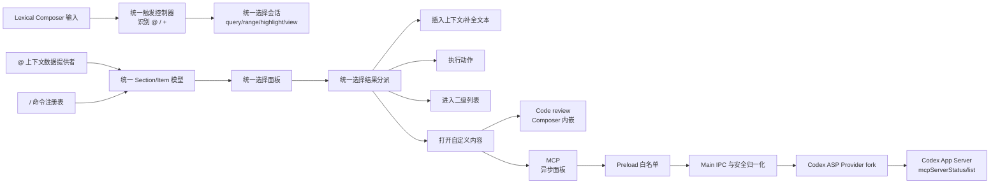

# Composer 命令协议与 `@`/`/` 统一选择面板开发计划

## 1. 结论与目标形态

本次改造采用已经确认的方向：

1. 继续使用 assistant-ui、Lexical 和当前 Composer 作为输入、附件、发送、格式化的基础；
2. 不再把 assistant-ui 的 `unstable_useSlashCommandAdapter` 当作命令能力的核心；
3. 以当前 `@` 弹窗的完整交互为视觉和体验基础，抽出项目自己的通用选择面板；
4. 建立项目自己的命令协议与内容承载层，使 `/` 可以表达普通动作、二级列表、查询补全、输入内容和自定义内容面板；
5. `@` 与 `/` 共用一套触发状态、键盘导航、面板外壳和选择结果分派，但继续使用不同的数据来源和选择行为；
6. 首批用 `/New chat`、`/Code review`、`/MCP` 验证动作、Composer 内嵌内容、异步面板三种场景；
7. 继续遵守现有 Electron 分层：Renderer 不直连 Node 或 App Server，MCP 数据必须经过 Provider fork、Main、Preload 的白名单接口；
8. 不修改 `codex/codex-rs/app-server`。

最终数据流：



## 2. 为什么不能只继续扩展 Slash Command Adapter

当前 `/` 方案只能覆盖“找到一条命令并执行一个回调”的简单场景：

- `desktop-app/src/renderer/src/App.tsx:289-359` 在应用层定义了很薄的 slash command 和 popover 数据；
- `desktop-app/src/renderer/src/App.tsx:2640-2685` 使用 assistant-ui 的 `Unstable_TriggerPopover`；
- `desktop-app/src/renderer/src/App.tsx:2780-2784` 调用 `unstable_useSlashCommandAdapter`；
- `desktop-app/node_modules/@assistant-ui/react/src/unstable/useSlashCommandAdapter.ts:11-83` 的命令类型只有基本文案和 `execute`，并且实现被标为不稳定能力；
- `desktop-app/node_modules/@assistant-ui/react/src/primitives/composer/trigger/TriggerPopover.tsx:119-129` 只允许一个全局 directive 或 action 行为；
- `desktop-app/node_modules/@assistant-ui/react/src/primitives/composer/trigger/triggerNavigationResource.ts` 只有单层 category 导航。

这不足以完整表达参考项目中的能力：

- 普通 action，例如 `/New chat`；
- 自定义 Content，例如 `/Code review`；
- 异步状态和重试，例如 `/MCP`；
- submenu 和 query-completion；
- 不同命令的空输入限制、可用条件和展示位置；
- 选择后是删除触发文本、插入内容、打开二级列表还是保留输入范围。

因此本计划保留 assistant-ui 的输入基座，但把“命令协议、选择会话、内容面板”放到项目自己可控的代码中。

## 3. 参考项目中需要借鉴的模型

参考项目是打包后美化的代码，局部变量名不能视为原始源码名称；本计划只借鉴其中可验证的结构和行为。

### 3.1 一个控制器处理多种触发词

参考项目统一识别 `/`、`@`、`$`，并用同一个状态机处理查询、选区、关闭和键盘事件：

- 触发识别和状态推进：
  `reference-projects/codex-electron-26.707.72221-beautified/webview/assets/app-initial~app-main~quick-chat-window-page~chatgpt-conversation-page-CrA1-JEm.js:137375-137616`
- 关闭状态：
  `...CrA1-JEm.js:137474-137485`
- Escape、Tab、Enter 和选择行为：
  `...CrA1-JEm.js:137358-137451`

本项目首期只处理已有的 `@`、`/`、`+`；协议保留扩展其他触发词的能力，但不实现 `$`。

### 3.2 选择结果是可区分的联合类型

参考项目不是把所有选择都压成一个 `execute()`：

- action：先清理触发文本，再执行异步动作；
- mention：插入结构化 mention；
- query-completion：替换当前查询；
- submenu：进入下一层结果。

证据位于 `...CrA1-JEm.js:137358-137372`。

本项目需要在此基础上增加明确的 `content` 结果，用来承载 Review 和 MCP，而不是让具体命令直接操纵整个 Composer。

### 3.3 命令描述与命令执行分离

参考项目的命令注册信息包含：

- `id`、标题、描述、分组；
- 搜索别名和可用触发词；
- `enabled`；
- `requiresEmptyComposer`；
- 展示方式；
- action 或 Content。

其注册、按 id 更新、卸载清理、可用过滤和排序位于：

- `reference-projects/codex-electron-26.707.72221-beautified/webview/assets/app-initial~app-main~quick-chat-window-page-z9fyaGCA.js:6836-7029`

搜索、输入限制、结果映射与 Content host 位于：

- `...z9fyaGCA.js:7708-8168`

本项目借鉴“描述、条件、展示、执行分离”的思想，但不复制参考项目 React hook 的 `dependencies` 字段；本项目由注册组件根据真实 React 输入重新生成描述对象。

### 3.4 同一个列表组件负责分组、加载、错误和空状态

参考项目的通用列表同时处理 section、当前高亮、选择、loading、error 和 empty：

- `...CrA1-JEm.js:120197-120345`

当前项目的 `@` 弹窗已经具备这些视觉能力，位于：

- `desktop-app/src/renderer/src/components/assistant-ui/composer-add-context-popover.tsx:25-294`

因此应从当前 `@` 组件抽出通用面板，而不是以较弱的 slash popover 为基础重做。

### 3.5 三个首批命令的参考行为

- New chat：action，要求空 Composer，选择后进入新会话：
  `reference-projects/codex-electron-26.707.72221-beautified/webview/assets/app-initial~app-main~page-DRgkI91I.js:42453-42499`
- Code review：根据 Git/宿主状态决定是否可用，要求空 Composer，提供 Content：
  `...page-DRgkI91I.js:42815-42905`
- MCP：不要求空 Composer，使用 bare Content，内容负责 loading/error：
  `...page-DRgkI91I.js:44477-44580`

## 4. 当前实现与目标的差距

| 能力 | 当前 `@` | 当前 `/` | 目标 |
| --- | --- | --- | --- |
| 触发识别 | 自定义 Lexical 插件，只识别 `@` 和 `+` | assistant-ui trigger adapter | 一个项目自有控制器识别 `@`、`/`、`+` |
| 状态 | query/range/highlight/open 较完整 | 依赖 assistant-ui 内部 resource | 一个选择会话拥有全部状态 |
| 面板 | 全宽、多 section、loading/error/retry/empty | `w-64` 的简单列表 | 以 `@` 为基础的通用面板 |
| 选择 | 插入 context directive | action/directive 二选一 | `insert/action/query-completion/submenu/content` |
| 内容承载 | 无 | 无 | 面板内容或 Composer 内嵌内容 |
| 注册与过滤 | 上下文 section 直接生成 | App.tsx 内静态数组 | 可更新、可卸载、按条件过滤的命令注册表 |
| 键盘 | `@` 插件自己处理 | assistant-ui 自己处理 | 单一键盘所有者，避免抢占 Enter/Escape |
| MCP | 无列表入口 | 无 | App Server 状态经安全 IPC 展示 |

当前关键证据：

- `desktop-app/src/renderer/src/composer/composerContextSuggestionController.tsx:37-190` 已有 `@/+` 的 store 和 provider；
- `desktop-app/src/renderer/src/composer/composerContextSuggestionController.tsx:196-419` 已有 Lexical 同步、键盘处理、`@` 匹配和精确范围替换；
- `desktop-app/src/renderer/src/composer/contextLexicalInput.tsx:59-160` 会先把按键交给 assistant-ui 插件注册表；
- `desktop-app/src/renderer/src/composer/contextLexicalInput.tsx:253-316` 同时挂载 assistant-ui directive 和当前 `@` 插件；
- `desktop-app/src/renderer/src/App.tsx:2938-2995` 生成 `@` sections 并挂载 provider；
- `desktop-app/src/renderer/src/App.tsx:3049-3276` 又挂载 assistant-ui slash trigger root 和 slash popover。

当前两套状态和键盘处理并存，是改造时最需要消除的重复控制点。

## 5. 范围

### 5.1 本次包含

- 项目自有的 Composer suggestion 类型、store、Lexical 插件和选择分派；
- 项目自有的命令描述、注册、搜索、条件过滤和内容承载协议；
- `@`、`/`、`+` 共用选择面板；
- 保留当前 `@` 全来源搜索、分组、文件选择、loading/error/retry/empty 行为；
- `/New chat` 调用现有新会话动作；
- `/Code review` 打开命令内嵌的 Code Review 内容，作为唯一的 Composer 审查入口；
- `/MCP` 通过 App Server `mcpServerStatus/list` 展示安全摘要；
- 移除旧的 Review 按钮，不再保留按钮与 slash command 两套入口；
- 完成单元、Renderer 集成和 E2E 回归；
- 功能等价后移除 `unstable_useSlashCommandAdapter` 和旧的 `ComposerTriggerPopover`。

### 5.2 本次不包含

- 不修改 `codex/codex-rs/app-server`；
- 不把参考项目的所有命令一次性复制进来；
- 不实现 `$` 触发词；
- 不让 Renderer 直接调用 JSON-RPC、Node API 或读取 MCP 配置文件；
- 不把 MCP 工具 schema、资源正文、provider headers、token 或完整 server 配置暴露给 Renderer；
- 不在命令注册表中加入任意 IPC 通道或任意网络请求能力；
- 不保留当前没有真实行为的 `/test`、`/clear` 占位命令；只有实际可执行或可展示内容的命令才能出现；
- 不改变发送消息、附件、审批、模型选择和 Codex App Server 推理链路。

## 6. 设计规格

### 6.1 通用选择会话

建议将
`desktop-app/src/renderer/src/composer/composerContextSuggestionController.tsx`
泛化为
`desktop-app/src/renderer/src/composer/composerSuggestionController.tsx`。

状态使用一个显式联合类型：

```ts
type ComposerSuggestionSession =
  | { open: false }
  | {
      open: true
      trigger: '@' | '/' | '+'
      source: 'typed-at' | 'typed-slash' | 'plus'
      query: string
      range: { start: number; end: number } | null
      highlightedId: string | null
      view:
        | { type: 'list' }
        | { type: 'submenu'; id: string; parentId: string }
        | { type: 'content'; id: string; placement: 'panel' | 'composer' }
    }
```

约束：

- 任意时刻只允许一个选择会话；
- 从 `@` 切到 `/` 时必须重建 query/range/highlight；
- 关闭后不保留可误用的 range；
- `+` 打开 context list，但没有可替换的文本 range；
- 高亮以 item id 为主，列表更新后若原 id 不存在才回落到第一项；
- list、submenu、content 由同一会话切换，不能各自再维护一份 open 状态；
- Escape 在 submenu 中先返回上一级，在 content 中关闭内容并恢复焦点，在根列表中关闭面板；
- Backspace 在空 submenu query 时返回上一级；
- 面板未打开时，Enter 必须继续执行原有发送行为。

### 6.2 通用显示模型

新建 `desktop-app/src/renderer/src/composer/composerSuggestionTypes.ts`：

```ts
type ComposerSuggestionItem = {
  id: string
  kind: 'context' | 'command' | 'completion' | 'submenu'
  label: string
  description?: string
  icon?: ReactNode
  searchTerms?: string[]
  disabled?: boolean
  selection: ComposerSuggestionSelection
}

type ComposerSuggestionSection = {
  id: string
  label?: string
  items: ComposerSuggestionItem[]
  loading?: boolean
  error?: string
  onRetry?: () => void
  placeholder?: string
  showTitle?: boolean
  preFiltered?: boolean
}

type ComposerSuggestionSelection =
  | { type: 'insert-context'; reference: ComposerContextReference }
  | { type: 'action'; run: () => void | Promise<void> }
  | { type: 'query-completion'; value: string }
  | { type: 'submenu'; submenuId: string }
  | {
      type: 'content'
      contentId: string
      placement: 'panel' | 'composer'
    }
```

`selection` 是核心协议，不能退化为一个无差别的 `onExecute`：

- `insert-context` 调用现有 context directive 插入逻辑；
- `action` 先删除本次 slash 的精确 range，再执行动作；
- `query-completion` 只替换 query 范围并保持会话；
- `submenu` 不改输入文本，只更换数据视图；
- `content` 清理触发文本并进入统一 Content host；
- 异步 action 失败时由命令提供用户可见错误，控制器必须进入稳定关闭状态，不能保留半开的选择会话。

### 6.3 命令协议与注册表

新建：

- `desktop-app/src/renderer/src/composer/commands/composerCommandTypes.ts`
- `desktop-app/src/renderer/src/composer/commands/composerCommandRegistry.tsx`
- `desktop-app/src/renderer/src/composer/commands/composerCommandSearch.ts`

建议协议：

```ts
type ComposerCommandContext = {
  draftText: string
  hasAttachments: boolean
  isRunning: boolean
  isEditing: boolean
  activeContentId: string | null
  hasProject: boolean
  hasGitReviewTarget: boolean
}

type ComposerCommandDescriptor = {
  id: string
  title: string
  description?: string
  group?: string
  searchAliases?: string[]
  triggers: Array<'/'>
  requiresEmptyComposer?: boolean
  enabled?: boolean
  selection: ComposerSuggestionSelection
}
```

注册表行为：

1. `register(command)` 返回带唯一 token 的更新/卸载句柄；
2. 同 id 注册使用“后注册值替换当前值”的确定规则；
3. 组件 props 变化时用自己的 token 更新同 id 命令，不重复追加；
4. 卸载只在 token 仍是当前 owner 时删除命令；旧 owner 的迟到清理不能删除新值，替换项卸载后也不自动恢复旧值；
5. 只返回 `enabled !== false` 且满足 `requiresEmptyComposer` 的命令；
6. 搜索匹配 title、description 和 `searchAliases`，匹配后按 group、title 和稳定注册顺序排序；
7. 不把 React hook 的依赖数组放进公开协议；由注册组件根据当前状态重新注册/更新描述；
8. 注册表只存在于 Renderer，不进入 IPC，也不接受来自远端的可执行 JavaScript。

### 6.4 统一触发插件

在 `desktop-app/src/renderer/src/composer/composerSuggestionController.tsx` 中整合当前插件：

- 从 `findTypedAtMatch` 泛化为对 `@` 和 `/` 分别匹配；
- 只在光标前、合法边界内创建触发会话；
- 输入法组合期间不执行 Enter/Tab 选择；
- 保存精确 plain-text range，选择时再次校验该 range 仍对应当前触发文本；
- 光标离开范围、文本被外部替换、触发符被删除或 Lexical selection 非 collapsed 时关闭；
- 合并 Up/Down/Enter/Tab/Escape/Backspace 的处理；
- 通过 `contextLexicalInput.tsx:59-160` 已有的键盘优先级规则验证只有该插件消费打开状态下的按键；
- 保留 `ComposerLexicalSyncPlugin` 和 `DirectivePlugin`，因为结构化 context directive 仍由 assistant-ui/Lexical 基础能力承载。

在新控制器完成后删除旧 slash adapter 的键盘注册，避免同一个 Enter/Escape 被两套插件处理。

### 6.5 通用选择面板与内容承载层

从
`desktop-app/src/renderer/src/components/assistant-ui/composer-add-context-popover.tsx:25-405`
抽出：

- `desktop-app/src/renderer/src/components/assistant-ui/composer-suggestion-panel.tsx`
- `desktop-app/src/renderer/src/components/assistant-ui/composer-command-content-host.tsx`

`ComposerSuggestionPanel` 负责：

- 与当前 `@` 相同的宽度、锚点、滚动和最大高度计算；
- section 标题和扁平结果两种模式；
- loading、error、retry、placeholder、empty；
- listbox/option 语义、当前高亮和鼠标 hover；
- panel list 和 submenu 共用相同布局；
- 面板打开后不强抢输入框焦点，键盘仍由 Composer 控制；
- 对当前 highlighted item 使用稳定的 `aria-activedescendant`；
- 内容变化时保持高亮 item 可见。

`ComposerCommandContentHost` 负责：

- `placement: 'panel'`：在同一个选择面板位置显示命令内容，适合 MCP；
- `placement: 'composer'`：替换 Composer 输入区，适合现有 Review mode；
- 向内容提供 `close()`、`back()`、`restoreFocus()` 和可选 `reportError()`；
- 关闭后恢复输入焦点；
- Content 不直接修改通用 store，只通过 host API 请求关闭或返回；
- 切换对话、切换项目、开始发送或 Composer 卸载时强制关闭过期 Content。

改造后的 `ComposerAddContextPopover` 只保留：

- `+` 按钮；
- 本地文件/照片 picker 的入口；
- 把当前 context sections 适配为 `ComposerSuggestionSection[]`。

“Files and folders”等上下文专属提示不能放进通用面板硬编码。

### 6.6 `@` 数据提供者

保留现有数据获取和搜索，不改其职责：

- `desktop-app/src/renderer/src/composer/useComposerContextCatalog.ts`
- `desktop-app/src/renderer/src/composer/useComposerContextSearch.ts`
- `desktop-app/src/renderer/src/App.tsx:2938-2992` 的 section 生成规则。

新增一个纯适配函数，例如
`desktop-app/src/renderer/src/composer/contextSuggestionProvider.ts`：

- 把 `ComposerContextMenuSection`/`Unstable_TriggerItem` 映射为项目自己的 section/item；
- `selection` 固定为 `insert-context` 或 picker action；
- 保留空 query 分组和非空 query 全局搜索；
- 保留本地/远程项目限制、重复项过滤、loading/error/retry；
- 保留 `+` 与键入 `@` 共享同一份结果；
- 不让 `@` provider 认识 slash command。

### 6.7 `/` 命令数据提供者

新增 `desktop-app/src/renderer/src/composer/commands/useComposerCommandSections.ts`：

- 从注册表读取当前可用命令；
- 根据当前 query 搜索；
- 把命令映射为通用 item；
- 空 query 按 group 分 section；
- 非空 query 可使用一个隐藏标题的 search-results section；
- 选择只返回命令自身声明的 `selection`；
- 不让 slash provider 读取 context catalog。

这实现“同一个面板，两份数据”：公共层不判断 `@` 还是 `/` 的业务内容，只根据当前 trigger 选择对应 provider 输出。

## 7. 分阶段实施步骤

### 阶段 0：锁定现有行为

修改测试，不改生产行为：

- `desktop-app/src/renderer/src/composer/composerContextSuggestionController.test.ts:13-172`
- `desktop-app/src/renderer/src/App.test.tsx:1141-1172`
- `desktop-app/src/renderer/src/App.test.tsx:1557-1759`
- `desktop-app/src/renderer/src/App.test.tsx:1934-2145`

补齐迁移前回归断言：

1. `@` 和 `+` 使用同一查询、高亮和选择状态；
2. 精确 range 替换、关闭后 query 清理、重复路径去重保持不变；
3. Enter 在面板关闭时仍发送消息；
4. `/review` 命令的可用条件、错误和提交行为保持可验证，旧 Review 按钮不再渲染；
5. 当前 context section 顺序、远程限制和全局搜索保持不变。

阶段验收：只增加测试时，现有测试全部通过。

### 阶段 1：建立通用类型、store 和选择分派

新增：

- `desktop-app/src/renderer/src/composer/composerSuggestionTypes.ts`
- `desktop-app/src/renderer/src/composer/composerSuggestionSelection.ts`
- `desktop-app/src/renderer/src/composer/composerSuggestionController.tsx`
- 对应测试文件。

从当前 controller 迁移 store、精确替换、去重和键盘导航；先让旧 `@` 通过适配器使用新 store，不立即删除旧文件。

阶段验收：

- 五种 selection 都有独立测试；
- action/content 清除的范围只包含当前触发文本；
- submenu 不改变 draft；
- query-completion 替换后仍能继续选择；
- 异步 action resolve/reject 均不会留下半开状态；
- 原 `@/+` 测试迁移后通过。

### 阶段 2：抽出通用面板

新增 `composer-suggestion-panel.tsx` 和测试，从当前
`composer-add-context-popover.tsx:174-405`
迁移列表渲染、滚动、状态和 fuzzy helper。

让 `ComposerAddContextPopover` 用新面板渲染，但仍只接 `@/+` 数据。

阶段验收：

- `@` 和 `+` 的截图/DOM 结构没有非预期变化；
- loading、error/retry、placeholder、empty、section title、无标题搜索结果均有组件测试；
- ArrowUp/ArrowDown/Enter/Tab/Escape 和鼠标选择一致；
- listbox 的 id、option id 和 active descendant 唯一且稳定。

### 阶段 3：建立命令注册表并接入 `/`

新增 `composer/commands/` 下的类型、注册表、搜索和 provider；在 `App.tsx` 注册首批命令描述。

修改：

- `desktop-app/src/renderer/src/composer/contextLexicalInput.tsx:253-316`，只挂载统一 suggestion 插件；
- `desktop-app/src/renderer/src/App.tsx:2780-2784`，停止调用 unstable adapter；
- `desktop-app/src/renderer/src/App.tsx:3049-3276`，用统一面板替代旧 slash trigger root/popover；
- 保留 assistant-ui directive formatter 和 context directive 插入链路。

阶段验收：

- 输入 `/` 使用与 `@` 相同的 panel 根组件和 CSS；
- `/` 与 `@` 之间切换时只存在一个面板和一个 active item；
- slash 搜索支持标题、描述、别名；
- `requiresEmptyComposer`、enabled、更新、卸载、同 id 替换均有测试；
- 页面上不再出现 assistant-ui 的 slash trigger root；
- `unstable_useSlashCommandAdapter` 的 mock 和生产引用都被删除。

### 阶段 4：实现 `/New chat`

复用现有新会话路径：

- `desktop-app/src/renderer/src/App.tsx:605-623` 的 `handleStartNewConversation`；
- `desktop-app/src/renderer/src/runtime/ConversationChatRegistry.ts:119-137` 的 start/prepare/activate 流程；
- `desktop-app/src/renderer/src/App.test.tsx:1829-1841` 的现有行为测试。

命令规格：

- `id: 'new-chat'`；
- title `New chat`，aliases 包含 `new`、`new chat`；
- `requiresEmptyComposer: true`；
- selection 为 action；
- 选择前删除 `/New chat` 的 range；
- action 调用同一个 `onNewChat`/`handleStartNewConversation`，不新建第二套跳转逻辑。

阶段验收：

- 空 Composer 输入 `/new` 可命中并创建/激活新会话；
- draft、附件、编辑态或运行态存在时不显示/不可执行；
- 不向模型发送 `/new` 文本；
- 新会话动作只调用一次。

### 阶段 5：实现 `/Code review` 内容

复用：

- `desktop-app/src/renderer/src/lib/codeReviewPrompt.ts` 的普通聊天 review prompt；
- `desktop-app/src/renderer/src/App.tsx` 中现有会话发送能力；
- `desktop-app/src/renderer/src/components/assistant-ui/composer-code-review-command-content.tsx` 的命令内容面板；
- `desktop-app/src/renderer/src/components/assistant-ui/composer-code-review-command-content.test.tsx`；
- `desktop-app/tests/e2e/composer-commands.e2e.ts`。

Code Review 不再保留独立 Review 按钮；`/review` 是唯一的 Composer 审查入口。命令规格：

- `id: 'code-review'`；
- title `Code review`，aliases 包含 `review`、`代码审查`；
- `requiresEmptyComposer: true`；
- 只有 Git review target 存在且当前未运行、未编辑、无附件时 enabled；
- selection 为 `{ type: 'content', contentId: 'code-review', placement: 'panel' }`；
- Content host 渲染 `ComposerCodeReviewCommandContent`；
- cancel 走统一 suggestion 关闭路径，submit/error 走命令内容面板自己的 pending 和错误状态。

阶段验收：

- `/review` 打开 `code-review` content id；
- 旧 Review 按钮不再渲染，避免同一能力出现两个入口；
- 选择命令不会把 `/review` 发送给模型；
- review prompt 通过普通聊天链路发送，且不携带 Composer 草稿或附件；
- 当前用户修改中的 `LocalBranchSwitcher.tsx` 和测试不被本计划改造覆盖或回退。

### 阶段 6：实现 `/MCP` 数据和内容

#### 6.1 Provider fork

在
`desktop-app/vendors/ai-sdk-provider-codex-asp/src/context-catalog-client.ts:112-193`
增加分页 `listMcpServerStatus()`：

- 调用 `mcpServerStatus/list`；
- 参数使用 `detail: 'toolsAndAuthOnly'`，只拉取界面需要的数据；
- 处理 `nextCursor`，并防止 cursor 不前进造成死循环；
- 将 App Server 原始结果立即归一化为安全摘要；
- 不修改 generated protocol 文件。

已有协议证据：

- `desktop-app/vendors/ai-sdk-provider-codex-asp/src/protocol/app-server-protocol/v2/ListMcpServerStatusParams.ts:6-19`
- `.../ListMcpServerStatusResponse.ts:4-11`
- `.../McpServerStatus.ts:4-10`
- `.../McpServerStatusDetail.ts:4`

安全摘要建议：

```ts
type CodexMcpServerSummary = {
  name: string
  connected: boolean
  authStatus: 'unsupported' | 'notLoggedIn' | 'bearerToken' | 'oAuth'
  toolCount: number
}
```

不要向 Desktop 导出 raw tool schema、resources、resource templates 或 server config。

#### 6.2 Shared/Main/Preload

新增 `desktop-app/src/shared/mcpServerStatus.ts`，定义 Zod schema、request/result 和 Renderer-safe DTO，并从 `codexIpcApi.ts` 导出。

把窄接口加入 `DesktopCodexApi`：

```ts
listMcpServers(input: { version: 1; threadId?: string }): Promise<McpServerListResult>
```

Main 增加独立的 `McpServerStatusService` 和固定 IPC handler：

- 复用 `desktop-app/src/main/index.ts:177-186` 已创建的 `composerContextClient`；
- 在 Main 再次用 shared schema 校验 provider 返回值；
- 注册固定通道 `codex:list-mcp-servers`；
- Preload 只暴露 `desktopApp.codex.listMcpServers()`；
- 不暴露通用 `request(method, params)`。

需要修改/新增：

- `desktop-app/src/shared/mcpServerStatus.ts`
- `desktop-app/src/shared/codexIpcApi.ts:4-5,530-543`
- `desktop-app/src/main/mcp/McpServerStatusService.ts`
- `desktop-app/src/main/mcp/mcpServerStatusIpc.ts`
- `desktop-app/src/main/index.ts:177-194,525-585`
- `desktop-app/src/preload/index.ts:63-86`
- 对应 shared、main IPC、service、preload 测试。

#### 6.3 Renderer Content

新增
`desktop-app/src/renderer/src/components/assistant-ui/composer-mcp-command-content.tsx`：

- Content 打开时加载；
- 显示 server name、连接状态、认证状态和工具数量；
- 显示 loading、error、retry、empty；
- 切换 thread 或关闭 Content 时忽略过期请求结果；
- `placement: 'panel'`，复用通用面板外壳；
- 本阶段只展示状态，不在 Renderer 直接执行 MCP 工具。

命令规格：

- `id: 'mcp'`；
- title `MCP`，aliases 包含 `mcp servers`；
- 不要求空 Composer，但运行态/编辑态是否可打开由统一命令上下文明确控制；
- selection 为 `{ type: 'content', contentId: 'mcp', placement: 'panel' }`。

阶段验收：

- `/mcp` 打开统一面板内的 MCP content；
- loading/error/retry/empty/ready 均有测试；
- 分页结果被完整合并且 cursor 异常被保护；
- Renderer 收不到 raw tools、resource 正文、配置或凭据；
- App Server 不支持该方法时显示稳定错误，不影响 Composer 继续输入和发送。

### 阶段 7：删除旧 slash 路径并收口

确认前三个命令和全部回归通过后：

- 删除 `App.tsx` 中旧 `slashCommands`、`noopSlashCommand`、图标映射和 `ComposerTriggerPopover`；
- 删除 `unstable_useSlashCommandAdapter` import、调用和测试 mock；
- 删除不再需要的 assistant-ui trigger root/category/item 挂载；
- 重命名或删除旧 `composerContextSuggestionController.tsx`，只保留统一 controller；
- 清理重复的 open/query/highlight/reviewModeOpen 状态；
- 确保 `composerLexicalSyncPlugin.tsx:31-149` 仍能拿到 context directive formatters；如果原 trigger root 曾隐式提供 formatter，则通过现有 `formatters` prop 明确传入，不能损坏消息序列化；
- 不卸载 assistant-ui 本身，也不删除 `DirectivePlugin`。

阶段验收：

- `rg "unstable_useSlashCommandAdapter|Unstable_TriggerPopover|noopSlashCommand" desktop-app/src/renderer/src` 无生产引用；
- `@` 插入的 directive 发送后仍能被 provider 编码；
- `/` action/content 不产生 directive chip；
- 页面上任何时刻最多一个 suggestion panel 和一个 content host；
- 没有无行为占位命令。

## 8. 测试计划

### 8.1 Store、触发和选择单元测试

新增或迁移测试覆盖：

- `@`、`/` 的合法边界和非法边界；
- `+` 打开无 range 会话；
- 输入法组合状态；
- collapsed/non-collapsed selection；
- 光标移出、删除触发符、外部文本替换、关闭后过期 range；
- Up/Down 循环、Tab/Enter 选择、Escape/back 行为；
- 列表异步更新后的 highlighted id 保持/回落；
- 五种 selection 的文本和状态副作用；
- action/content 异步成功与失败；
- 同一时刻只有一个 session。

建议文件：

- `desktop-app/src/renderer/src/composer/composerSuggestionController.test.tsx`
- `desktop-app/src/renderer/src/composer/composerSuggestionSelection.test.ts`

### 8.2 命令注册表测试

覆盖：

- register/update/unregister；
- 同 id 替换、owner token 与卸载规则；
- enabled 与 `requiresEmptyComposer`；
- title/description/alias 搜索；
- group/title/稳定顺序；
- command context 变化后结果刷新；
- 禁用命令无法通过旧高亮 id 被执行；
- registry 不接受远端函数或 IPC method。

### 8.3 通用面板组件测试

覆盖：

- section、扁平结果；
- loading/error/retry/placeholder/empty；
- 鼠标 hover/click 与键盘高亮一致；
- ARIA listbox/option/active descendant；
- submenu/back；
- panel content 与 composer content；
- 打开、关闭、切换对话后的焦点恢复。

### 8.4 Renderer 集成测试

扩展 `desktop-app/src/renderer/src/App.test.tsx`：

1. 输入 `@` 和 `/` 后都只渲染同一个测试标识，例如 `data-testid="composer-suggestion-panel"`；
2. `@` 选择后插入 context directive；
3. `/new` 选择后调用现有新会话动作且不插入 chip；
4. `/review` 打开 Code Review 命令内容面板，且旧 Review 按钮不再渲染；
5. `/mcp` 显示 loading/error/retry/ready；
6. draft/附件/运行态变化时命令正确出现或消失；
7. 从 `@` 快速改成 `/` 不显示旧异步结果；
8. 面板关闭后 Enter 发送，面板打开时 Enter 只选择；
9. context 的 section 顺序、remote restriction、全局搜索继续通过。

### 8.5 Provider、Main、Preload 测试

- Provider client 请求 method、detail、pagination、cursor guard、安全归一化；
- shared schema 拒绝多余的 raw tool/config 字段或在严格 parse 后丢弃；
- Main handler 校验输入，service 只返回安全 DTO；
- Preload 测试确认只有固定 `codex:list-mcp-servers` 通道；
- App Server 错误转换为用户可显示错误，不泄露环境变量或启动参数。

参考现有测试模式：

- `desktop-app/src/main/composerContext/composerContextIpc.test.ts:8-29`
- `desktop-app/src/preload/composerContextBridge.test.ts:5-35`
- `desktop-app/src/main/composerContext/ComposerContextCatalogService.test.ts:85-320`

### 8.6 E2E

扩展：

- `desktop-app/tests/e2e/chat.e2e.ts:242-313`：键入 `@`、统一面板、选择上下文、chip 和发送；
- `desktop-app/tests/e2e/composer-commands.e2e.ts`：从 `/review` 打开 Code Review 命令内容面板，选择命令不会发送 slash 文本；
- 新增统一命令场景：
  - `/new` 进入空会话且不会发送 slash 文本；
  - `/mcp` 在 App Server mock 返回 server status 时展示摘要；
  - ArrowDown/Enter/Escape 和鼠标路径；
  - 快速切换 `@`/`/` 不出现双弹窗或旧结果。

## 9. 可执行验收标准

以下全部满足才算完成：

1. 输入 `@`、`/`、点击 `+` 使用同一个通用 panel 组件；
2. Renderer DOM 中任意时刻最多一个 suggestion panel；
3. 只有一个 Lexical suggestion 插件拥有 Up/Down/Enter/Tab/Escape 处理权；
4. `@` 当前 catalog/search、section、选择插入、远程限制和 retry 行为无回归；
5. `/` 搜索支持 title、description 和 alias；
6. 命令注册表支持 id 更新、卸载、enabled 和空 Composer 限制；
7. selection 协议的 insert/action/query-completion/submenu/content 五种分支都有单测；
8. `/New chat` 复用现有会话创建路径，不向模型发送 slash 文本；
9. `/Code review` 是唯一 Composer 审查入口，旧 Review 按钮不再渲染；
10. `/MCP` 有 loading、error、retry、empty、ready 状态；
11. MCP 只经 Provider fork -> Main -> Preload -> Renderer，Renderer 不直连 App Server；
12. MCP Renderer DTO 不包含 tool schema、resource 正文、server config、headers 或 token；
13. `codex/codex-rs/app-server` 没有改动；
14. `unstable_useSlashCommandAdapter`、旧 slash popover 和 no-op commands 无生产引用；
15. 面板关闭后原有 Enter 发送、附件、编辑、审批、模型选择无回归；
16. lint、typecheck、unit、provider 和目标 E2E 全部通过；
17. 用户现有的 `LocalBranchSwitcher.tsx` 及其测试改动没有被覆盖或回退。

## 10. 验证命令

按由小到大的顺序执行：

```bash
npm --prefix desktop-app/vendors/ai-sdk-provider-codex-asp run lint
npm --prefix desktop-app/vendors/ai-sdk-provider-codex-asp run typecheck
npm --prefix desktop-app/vendors/ai-sdk-provider-codex-asp run test

npm --prefix desktop-app run typecheck
npm --prefix desktop-app run lint
npm --prefix desktop-app test

npm --prefix desktop-app run test:e2e -- --reporter=line
```

完成后检查边界：

```bash
git diff --name-only -- codex/codex-rs/app-server
rg "unstable_useSlashCommandAdapter|Unstable_TriggerPopover|noopSlashCommand" desktop-app/src/renderer/src
rg "mcpServerStatus/list" desktop-app/src/renderer desktop-app/src/preload desktop-app/src/main desktop-app/vendors/ai-sdk-provider-codex-asp/src
```

预期：

- 第一条没有输出；
- 第二条没有生产代码输出；
- 第三条的 JSON-RPC method 只出现在 Provider fork，Preload/Main 只出现固定桌面 IPC 名称。

## 11. 风险与缓解措施

### 风险 1：两套键盘处理同时存在

症状：Enter 同时选择命令并发送消息，Escape 关闭后又重开。

缓解：阶段 3 把统一插件设为唯一 owner；迁移期用测试证明旧 slash adapter 不再注册键盘处理，然后才删除旧代码。

### 风险 2：删除 trigger root 后 context directive 格式化失效

症状：`@` chip 在 UI 正常，但发送时变成错误文本。

缓解：在阶段 7 专门验证 `composerLexicalSyncPlugin.tsx:31-149` 的 formatter 来源，并给 context directive 的 composer -> message 序列化增加集成测试。

### 风险 3：统一面板变成业务大组件

症状：通用组件开始知道 Files、Review、MCP 等具体业务。

缓解：panel 只接收 section/item/content host API；文案、数据加载、可用条件和选择类型都在 provider/command/content 内。

### 风险 4：命令打开内容后状态互相污染

症状：切换会话后 Review/MCP 仍显示旧数据，或旧异步请求覆盖新结果。

缓解：content 纳入统一 session；对 conversation/thread/project 变化强制关闭；异步内容使用 request generation 或 AbortController 忽略过期结果。

### 风险 5：MCP 数据泄露

症状：Renderer 收到完整工具 schema、资源正文或凭据相关配置。

缓解：Provider 立即映射安全摘要、Main 再做 shared schema parse、Preload 只暴露固定方法，并用反向断言检查敏感字段不存在。

### 风险 6：Review 当前改动发生冲突

当前 worktree 中：

- `desktop-app/src/renderer/src/components/local-git-review/LocalBranchSwitcher.tsx`
- `desktop-app/src/renderer/src/components/local-git-review/LocalBranchSwitcher.test.tsx`

已有用户改动。执行本计划时不回退这些文件；Review 命令优先改 `App.tsx`、Content host 和 `ComposerCodeReviewCommandContent` 的调用边界。确需接触上述文件时，先基于当前内容做最小合并。

### 风险 7：一次性大替换难以定位回归

缓解：严格按“锁测试 -> 新 store -> 新 panel -> 接 `/` -> 三个命令 -> 删除旧路径”的顺序，每阶段保持可运行，不在统一控制器和 MCP IPC 尚未验证时提前删除旧实现。

## 12. 交付拆分建议

建议拆成 5 个可独立审查的提交：

1. `test(composer): lock current context and review behavior`
2. `refactor(composer): add unified suggestion session and panel`
3. `feat(composer): add project-owned command registry and slash trigger`
4. `feat(composer): add new chat and review command content`
5. `feat(mcp): expose safe server summaries and add MCP command`

最后一个清理提交也可以单独保留：

6. `refactor(composer): remove unstable slash adapter path`

每个提交都必须通过对应的目标测试，最终再运行完整验证命令。
