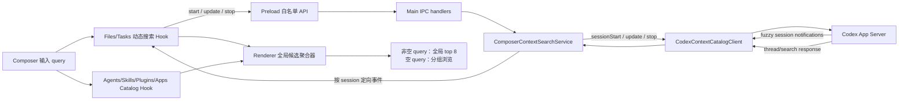
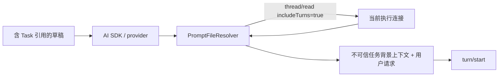

# Composer 全来源统一搜索参考实现对齐计划

## 1. 目标与最终形态

把当前输入框“添加上下文”调整为参考项目
`reference-projects/codex-electron-26.707.72221-beautified` 的全来源统一搜索形态：

1. 空查询时保留分组浏览，并用“Files and tasks / 输入以搜索文件或任务”代表尚未启动的动态文件和任务搜索；
2. 用户输入同一个查询词后，同时筛选 Files、Tasks、Agents、Skills、Plugins、Apps；
3. 各来源先按自己的可搜索字段产出候选项，随后合并成一个不显示分组标题的全局结果列表；
4. 全局结果按参考项目的来源优先级和 fuzzy score 排序，最多展示 8 条；
5. 文件搜索复用 Codex App Server 的持久 fuzzy search session，不再由 Electron Main 每次输入都重新遍历目录；
6. 任务搜索调用 App Server `thread/search`，可以命中标题、历史消息内容、分支和工作目录等信息；
7. 选择任务后，输入框插入任务引用；真正发送时再调用 `thread/read(includeTurns: true)`，把引用任务的历史作为“不可信背景上下文”提供给模型；
8. 每条消息最多引用 3 个任务，排除当前任务和已经选择的任务；
9. Agents、Skills、Plugins、Apps 继续使用缓存型 Catalog，Files/Tasks 使用动态搜索会话；这是数据获取层的分离，不是用户界面的分离。

本计划只修改桌面端和现有 provider fork，不修改 Codex App Server Rust 实现，因为仓库中的 App Server 已经提供所需协议：

- `fuzzyFileSearch/sessionStart`
- `fuzzyFileSearch/sessionUpdate`
- `fuzzyFileSearch/sessionStop`
- `fuzzyFileSearch/sessionUpdated`
- `fuzzyFileSearch/sessionCompleted`
- `thread/search`
- `thread/read`

## 2. 参考项目中需要对齐的行为

### 2.1 空查询与非空查询是两种展示模式

参考项目在空查询时保留按来源分组的默认内容，并为 Files/Tasks 返回一个合并占位区：

- 标题：`Files and tasks`
- 提示：`Type to search files or tasks`

证据位于：

- `reference-projects/codex-electron-26.707.72221-beautified/webview/assets/app-initial~app-main~quick-chat-window-page~chatgpt-conversation-page-CrA1-JEm.js:136815-136835`

非空查询时不再按 Files、Tasks、Agents、Skills、Plugins、Apps 分组显示。参考项目会把全部来源候选项压平成一个 `search-results` section，隐藏 section 标题并全局排序。

证据位于：

- query 传入全部来源：
  `...CrA1-JEm.js:136260-136396`
- 全部 section 在 Renderer 汇总：
  `...CrA1-JEm.js:136990-137096`
- 非空查询压平成一个全局结果 section：
  `...CrA1-JEm.js:120371-120415`

### 2.2 同一个 query 会参与所有来源筛选

参考项目把同一个 query 分发给：

- Files：App Server fuzzy file search；
- Tasks：host 的 thread search；
- Live/Configured Agents：本地 fuzzy filter；
- Skills：query 非空时加载并过滤；
- Plugins：插件目录加载后本地 fuzzy filter；
- Apps：已安装 App 列表本地 fuzzy filter。

各来源参与匹配的字段不是“对象中的所有字段”，而是条目显式声明的 label/searchTerms：

| 来源 | 参与匹配的字段 |
| --- | --- |
| Files | label、完整 path |
| Tasks | title、branch、cwd、内容命中 snippet |
| Live Agents | displayName、`@displayName`、agentRole、状态摘要 |
| Configured Agents | roleName、`@roleName`、description、nicknameCandidates |
| Skills | name、displayName、`@displayName` |
| Plugins | plugin name、displayName、mention displayName、`@...` 别名 |
| Apps | display name、内部 name、`@name`、pluginDisplayNames |

例如 App 的 description 只用于结果详情，不进入 `searchTerms`；因此本计划中的“全来源搜索”指所有来源都参与，不表示任意字段全文搜索。

证据位于：

- Agents：
  `...CrA1-JEm.js:134865-134993`
- Apps：
  `...CrA1-JEm.js:135062-135147`
- Plugins：
  `...CrA1-JEm.js:135922-136081`
- Skills：
  `...CrA1-JEm.js:136119-136204`
- Files：
  `...CrA1-JEm.js:135561-135577`
- Tasks：
  `...CrA1-JEm.js:136749-136793`

### 2.3 全局结果排序

参考项目在 query 非空时：

1. 遍历所有 section 的所有候选项；
2. 对 label 和 searchTerms 计算 fuzzy score；
3. 过滤 score 为 0 的条目；
4. 按来源 priority、score、原始顺序排序；
5. 全局最多保留 8 条。

来源优先级：

- prefix 命中的 Plugins：priority 0；
- prefix 命中的 native apps（如果存在）：priority 1；
- Agents、Skills、普通 Apps、非 prefix Plugins 等：priority 2；
- Files 和 Tasks：priority 3。

这意味着搜索结果不是“每类各取若干条”，而是所有来源竞争同一个 8 条结果窗口。

证据位于：

- `...CrA1-JEm.js:120374-120430`

### 2.4 文件搜索

参考项目不是“输入一次、重新扫一次目录”，而是：

1. 针对 roots 创建一个 fuzzy file search session；
2. 查询变化时只调用 `session.update(query)`；
3. App Server 可多次推送部分结果；
4. 面板关闭、roots 改变或组件卸载时调用 `session.stop()`；
5. 如果当前 App Server 不支持 session 协议，自动回退到旧的单次 `fuzzyFileSearch`。

证据位于：

- UI session 生命周期：
  `...CrA1-JEm.js:135358-135491`
- provider session 协议及 fallback：
  `reference-projects/codex-electron-26.707.72221-beautified/webview/assets/app-initial~artifact-tab-content.electron~app-main~new-thread-panel-page~onboarding-page~pr~hoz4f1hh-Cy_DxrPd.js:38468-38582`

### 2.5 任务搜索

参考项目对查询做 100ms 防抖，然后调用 host 对应的任务搜索，limit 为 50。结果会：

- 排除当前任务；
- 排除已经插入输入框的任务；
- 合并已加载任务元数据和 `thread/search` 内容命中；
- 优先显示当前项目任务，其次 projectless 任务，再显示其他项目任务；
- 对标题、内容片段、分支、项目路径和 cwd 进行分层排序。

证据位于：

- `...CrA1-JEm.js:136642-136749`
- 排序和字段优先级：
  `...CrA1-JEm.js:136582-136641`

### 2.6 任务引用的真实语义

参考项目中的 Task 不是文件，也不是一个简单链接，而是一个已有 Codex thread。选择后只插入引用；发送时才：

1. 提取并去重 thread id；
2. 排除当前 thread；
3. 最多允许 3 个；
4. 调用 `thread/read({ includeTurns: true })`；
5. 提取用户消息、已完成的 assistant 消息和最后的 diff；
6. 以 JSON 形式附加到“不可信背景上下文”；
7. 任何引用读取失败时中止发送并给出明确错误。

证据位于：

- 引用加载：
  `...CrA1-JEm.js:231629-231750`
- 历史归一化：
  `...CrA1-JEm.js:231584-231628`
- 不可信上下文：
  `...hoz4f1hh-Cy_DxrPd.js:27086-27152`

## 3. 当前实现与目标的核心差距

| 能力 | 当前实现 | 目标实现 |
| --- | --- | --- |
| 查询入口 | Files、Chats 属于 Catalog 的两个独立 section，其他来源各自过滤 | 一个 query 同时驱动 Files、Tasks、Agents、Skills、Plugins、Apps |
| 结果展示 | 按 section 分组显示 | 非空 query 压平成一个全局结果列表，最多 8 条 |
| 全局排序 | 没有跨来源排序 | label/searchTerms fuzzy score + 来源 priority + 稳定顺序 |
| 文件搜索 | `WorkspaceFileSearchService` 每次请求重新递归目录 | 一个 App Server fuzzy session，多次 update，支持部分结果 |
| 文件范围 | 深度最多 5 层，手写隐藏目录规则 | App Server file-search，遵循其 gitignore、隐藏文件和多 roots 规则 |
| 任务来源 | Sidebar 已加载的会话快照 | `thread/search` 内容搜索 + 已加载元数据合并 |
| 任务命中字段 | 只过滤 title/description/path/uri | 标题、历史内容片段、branch、project、cwd |
| 静态来源 | generic label/description/path/uri 过滤 | 各来源使用参考项目对应的 label/searchTerms |
| 任务引用 | `:chat[...]` 最终只转成 Markdown 链接 | 发送前读取任务完整历史并注入模型上下文 |
| 生命周期 | 每次 query 都是一次 `list()` IPC | start/update/stop 会话和异步 section 更新事件 |
| 旧协议兼容 | 没有 App Server session fallback | session 不支持时回退到单次 fuzzy search |

当前关键文件：

- `desktop-app/src/shared/composerContext.ts:5-202`
- `desktop-app/src/main/composerContext/ComposerContextCatalogService.ts:53-296`
- `desktop-app/src/main/projects/WorkspaceFileSearchService.ts:42-165`
- `desktop-app/src/renderer/src/composer/useComposerContextCatalog.ts:51-166`
- `desktop-app/src/renderer/src/components/assistant-ui/composer-add-context-popover.tsx:57-264`
- `desktop-app/vendors/ai-sdk-provider-codex-asp/src/context-catalog-client.ts:13-286`
- `desktop-app/vendors/ai-sdk-provider-codex-asp/src/utils/context-codec.ts:36-114`
- `desktop-app/vendors/ai-sdk-provider-codex-asp/src/utils/prompt-file-resolver.ts:295-375`
- `desktop-app/vendors/ai-sdk-provider-codex-asp/src/model.ts:636,1132-1152`

## 4. 范围与明确不做的事情

### 4.1 本次范围

- 本地项目和 path 项目完整支持 Files、Tasks、Agents、Skills、Plugins、Apps 的同 query 全局搜索；
- 已存在的 projectless 任务支持 Tasks 搜索；已有 thread 能解析到 projectless workspace 时支持 Files；
- 新建 projectless 对话在 workspace 尚未创建时只搜索 Tasks，不因打开搜索面板而提前创建目录；
- 当前 thread 和已选择任务排除；
- 非空 query 时所有来源压平成一个全局结果列表，并执行参考项目的 8 条上限和来源优先级；
- 空 query 时保留默认分组浏览，Skills 不主动展示，Files/Tasks 使用合并占位区；
- 任务引用历史进入当前模型请求。

### 4.2 不在本次范围

- 不新建另一套 LLM client，不绕过 Codex App Server；
- 不改 `codex/codex-rs/app-server` 搜索算法；
- 不把 Tasks 变成并行执行或子代理启动入口；它只是历史任务引用；
- 不为了搜索把远程目录同步到本机；
- 不在本需求中补齐完整的远程 App Server host transport。

当前 `composerContextClient` 只连接本地 stdio App Server。新协议必须带 `hostId` 并预留 host client router，但首期远程项目如果没有对应 host client，应显示明确的“该主机暂不支持搜索”，不能偷偷使用本地结果冒充远程结果。

## 5. 总体架构

### 5.1 数据源分离，query 与结果统一

现有 `ComposerContextCatalogService` 继续负责：

- Agents
- Skills
- Plugins
- Apps

新建 `ComposerContextSearchService` 专门负责：

- Files
- Tasks
- 搜索 session 生命周期
- 查询时序和过期结果隔离
- Files/Tasks 来源内部的归一化、过滤和任务项目分组
- 按窗口定向发布结果

Renderer 新增全局搜索聚合器，负责：

- 把同一个 query 同时交给动态 Search 和静态 Catalog 候选；
- 为每类 reference 建立参考项目对应的 searchTerms；
- 汇总 Files、Tasks、Agents、Skills、Plugins、Apps；
- 非空 query 时执行跨来源 fuzzy score、priority 和全局 top 8；
- 空 query 时保留分组和各 section 的默认展示限制。

原因：

- Files 是长生命周期、通知驱动的 session；
- Tasks 是 query 驱动的异步搜索；
- 静态 Catalog 有缓存和 refresh 语义；
- 把所有数据获取继续塞在一个 `list(query)` 中，会保留当前“每个字符重新加载所有 section”的问题；
- 数据获取可以分层，但 query、匹配候选和最终显示必须统一，才能对齐参考项目。

目标数据流：



任务发送链路：



### 5.2 保留现有草稿兼容格式

产品界面统一使用 “Tasks”，但本次迁移保留现有任务引用 wire format：

```text
:chat[<label>]{name=thread://<threadId>}
```

理由：

- 当前 Renderer formatter、历史草稿和 Provider 已经认识 `chat` / `thread://`；
- 参考项目私有的 `codex:thread:<id>` 只是另一种 URI 表达，不影响任务搜索和历史注入的核心语义；
- 直接改格式会扩大历史兼容和草稿迁移面。

实施时：

- UI section 名称从 Chats 改为 Tasks；
- 新搜索事件 section id 使用 `tasks`；
- 动态结果仍映射为现有 `ComposerContextReference.kind === 'chat'`；
- Provider 将 `chat` 引用解释成“需要加载的 Codex task”；
- 可额外接受 `codex:thread:<id>` 作为兼容输入，但新草稿仍输出 `thread://`。

### 5.3 Search IPC 契约

在 `desktop-app/src/shared/composerContextSearch.ts` 新建独立、版本化的 Zod 契约，避免扩大静态 Catalog 版本的影响。

建议类型：

```ts
const COMPOSER_CONTEXT_SEARCH_VERSION = 1

type ComposerContextSearchStartRequest = {
  version: 1
  cwd?: string
  threadId?: string
  projectSelection?: ProjectSelection
  excludedThreadIds?: string[]
}

type ComposerContextSearchStartResult = {
  version: 1
  sessionId: string
  hostId: string
  filesAvailable: boolean
  tasksAvailable: boolean
}

type ComposerContextSearchUpdateRequest = {
  version: 1
  sessionId: string
  query: string
  excludedThreadIds?: string[]
}

type ComposerContextSearchStopRequest = {
  version: 1
  sessionId: string
}

type ComposerContextSearchSectionEvent = {
  version: 1
  sessionId: string
  query: string
  sectionId: 'files' | 'tasks'
  status: 'loading' | 'ready' | 'error'
  items: ComposerContextReference[]
  complete: boolean
  error?: string
}
```

IPC channel：

- `codex:composer-context-search:start`
- `codex:composer-context-search:update`
- `codex:composer-context-search:stop`
- `codex:composer-context-search-update`

安全要求：

- Main 将每个 session 绑定到创建它的 `webContents.id`；
- update/stop 必须验证调用者是 session owner；
- 更新事件只发给 owner window，不广播给所有窗口；
- owner window destroyed 时自动停止其全部 session；
- query 最大 500 字符，excluded ids 去重并设置合理上限。

### 5.4 全局候选与排序契约

在 Renderer 内部定义统一候选模型，不把跨来源排序放入 Main：

```ts
type ComposerGlobalSearchSource =
  | 'files'
  | 'tasks'
  | 'agents'
  | 'skills'
  | 'plugins'
  | 'apps'

type ComposerGlobalSearchCandidate = {
  source: ComposerGlobalSearchSource
  item: Unstable_TriggerItem
  label: string
  searchTerms: string[]
  sourceIndex: number
}
```

新建：

- `desktop-app/src/renderer/src/composer/composerGlobalSearch.ts`
- `desktop-app/src/renderer/src/composer/composerGlobalSearch.test.ts`

纯函数 API：

```ts
buildComposerGlobalSearchResult({
  query,
  sections,
  limit: 8
}): ComposerContextMenuSection[]
```

规则：

1. query 为空时返回原 section，并执行默认 section cap；
2. query 非空时把所有 section 的 items 压平；
3. fuzzy score 只读取 label 和 searchTerms；
4. score 为 0 的候选移除；
5. priority：
   - prefix 命中的 plugins = 0；
   - prefix 命中的 native apps（如果未来接入）= 1；
   - agents/skills/apps/其他 plugins = 2；
   - files/tasks = 3；
6. 排序为 priority asc、score desc、sourceIndex asc；
7. 最多返回 8 项；
8. 输出一个 `search-results` section，`showTitle: false`；
9. 任一来源 loading 且没有候选项时显示“正在搜索…”；
10. 所有来源完成且无候选项时显示“没有结果”；
11. 来源错误不阻塞其他来源；只有没有任何结果且不存在 loading 时才汇总展示错误。

这里的 `sourceIndex` 必须来自稳定的 section 顺序和条目顺序，不能使用异步结果到达顺序，否则同分结果会跳动。

## 6. 分阶段实施步骤

### 阶段 0：实施前冲突审计

当前工作区已有用户未提交改动，至少包括：

- `desktop-app/src/renderer/src/App.tsx`
- `desktop-app/src/renderer/src/App.test.tsx`
- `desktop-app/src/renderer/src/components/assistant-ui/composer-add-context-popover.tsx`
- `desktop-app/tests/e2e/chat.e2e.ts`

实施前必须：

1. 读取这些文件的当前 diff；
2. 把现有改动视为用户工作；
3. 只在相关位置做最小补丁；
4. 不使用 checkout/reset 覆盖；
5. 若现有改动已经实现部分目标，复用而不是重写。

### 阶段 1：增加独立 Search schema、preload 和 IPC

涉及文件：

- 新建 `desktop-app/src/shared/composerContextSearch.ts`
- 更新 `desktop-app/src/shared/codexIpcApi.ts`
- 新建或扩展 `desktop-app/src/main/composerContext/composerContextSearchIpc.ts`
- 更新 `desktop-app/src/preload/composerContextBridge.ts`
- 更新 `desktop-app/src/preload/index.ts`
- 更新 `desktop-app/src/preload/index.d.ts`

实施内容：

1. 定义 start/update/stop/event schema 和类型；
2. 把 Search 方法加入 `DesktopComposerContextApi`；
3. preload 只暴露四个固定 channel；
4. `onSearchUpdate` 必须对 event 做 Zod safeParse，非法事件直接丢弃；
5. handler 使用 `IpcMainInvokeEvent.sender.id` 做 owner 校验；
6. 为 schema、bridge 和 handler 增加测试。

验收重点：

- Renderer 不能传任意 channel；
- A 窗口不能 update/stop B 窗口的 session；
- 非法 query、session id、event payload 被拒绝。

### 阶段 2：扩展 provider 的 App Server 搜索客户端

涉及文件：

- `desktop-app/vendors/ai-sdk-provider-codex-asp/src/context-catalog-client.ts`
- 对应新建或更新测试文件

现有 generated protocol 已包含所需类型，不得手改 generated 文件：

- `protocol/app-server-protocol/FuzzyFileSearch*`
- `protocol/app-server-protocol/v2/ThreadSearchParams.ts`
- `protocol/app-server-protocol/v2/ThreadSearchResponse.ts`
- `protocol/app-server-protocol/v2/ThreadReadParams.ts`
- `protocol/app-server-protocol/v2/ThreadReadResponse.ts`

实施内容：

1. 给 `CodexContextCatalogJsonRpcClientLike` 增加：

   ```ts
   onNotification(method: string, handler: (params: unknown) => void): () => void
   ```

   底层 `AppServerClient` 已在
   `desktop-app/vendors/ai-sdk-provider-codex-asp/src/client/app-server-client.ts:185-199`
   提供该能力。

2. 增加：

   ```ts
   createFuzzyFileSearchSession({
     roots,
     onUpdated,
     onCompleted
   }): Promise<{
     update(query: string): Promise<void>
     stop(): Promise<void>
   }>
   ```

3. session 行为严格对齐参考项目：

   - 状态为 `unknown | supported | unsupported`；
   - 首次调用 `sessionStart`；
   - `sessionUpdated` 和 `sessionCompleted` 按 sessionId 分发；
   - `sessionUpdate` 遇到 “session not found” 时重新 start 后重试 update；
   - method not found 时将能力标记为 unsupported；
   - unsupported 模式调用旧 `fuzzyFileSearch`，并在客户端模拟 updated/completed；
   - stop 移除 callback，避免停止后继续收到结果；
   - stop 的 method not found 不作为用户错误；
   - shutdown 断开连接前清理 notification handlers。

4. 增加：

   ```ts
   searchThreads({
     query,
     limit
   }): Promise<CodexTaskSearchResult[]>
   ```

   请求参数固定为：

   - `searchTerm: query`
   - `limit: 50`
   - `sortKey: 'updated_at'`
   - `sortDirection: 'desc'`
   - `archived: false`

   输出保留：

   - thread id
   - name / preview
   - snippet
   - cwd
   - updatedAt
   - git branch
   - source / parentThreadId，供 Main 排除非本地或子任务类型。

5. 所有调用继续复用现有长连接 `clientPromise`，不能像
   `history-client.ts` 那样每个回调重新启动一个 App Server 进程。

测试必须覆盖：

- 一个 roots 生命周期只 start 一次；
- 多次 update 不重连；
- 多次 partial notification；
- completed；
- stop 后回调不触发；
- method-not-found fallback；
- session-not-found 重建；
- `thread/search` 参数和结果归一化；
- 连接异常后 client invalidation。

### 阶段 3：实现 Main 的 `ComposerContextSearchService`

新建：

- `desktop-app/src/main/composerContext/ComposerContextSearchService.ts`
- `desktop-app/src/main/composerContext/ComposerContextSearchService.test.ts`

更新：

- `desktop-app/src/main/index.ts`
- 必要时更新 `desktop-app/src/main/projects/ProjectService.ts` 的只读辅助方法

#### 3.1 搜索目标解析

新增纯粹的 `resolveComposerSearchTarget` 逻辑：

1. 有 current thread 时优先调用 `resolveExistingThreadTarget`，使用该任务真实 host、cwd 和 workspace roots；
2. 新 local/path 对话调用 `resolveNewThreadTarget({ prompt: '' })`；
3. 新 projectless 对话不调用 `resolveNewThreadTarget`，避免仅打开搜索面板就创建 projectless workspace；
4. 新 projectless 返回 `hostId: 'local', roots: []`，Files unavailable、Tasks available；
5. remote target 查找 host client；没有时两个动态 section 返回明确 error。

#### 3.2 Session 状态

每个 session 至少记录：

```ts
type ActiveComposerSearchSession = {
  sessionId: string
  ownerWebContentsId: number
  hostId: string
  roots: string[]
  currentThreadId?: string
  currentQuery: string
  queryGeneration: number
  excludedThreadIds: Set<string>
  fileSession?: FuzzyFileSearchSession
  stopped: boolean
}
```

行为：

- start 只解析 scope，不立即搜索空 query；
- 第一个非空 query 时懒创建 file session；
- update 增加 generation；
- 所有异步回调同时校验 sessionId、query 和 generation；
- 空 query 清空 Files/Tasks，不发送 `thread/search`；
- stop 幂等；
- app quit、window destroyed、provider shutdown 时停止全部 session。

#### 3.3 Files 更新

- 直接调用 `fileSession.update(trimmedQuery)`；
- 接受多次 `sessionUpdated`，每次发布 `complete: false` 的 ready event；
- 收到 `sessionCompleted` 后为当前 query 发布 `complete: true`；
- 结果映射：
  - `match_type === 'directory'` -> folder；
  - 其他 -> file；
  - 相对 path 与 root 安全组合为绝对路径；
  - canonicalId 使用绝对路径；
  - 保留 root、score；
  - 每次最多展示 50 条；
- 旧 query 的 partial/completed 事件不得覆盖新 query。

#### 3.4 Tasks 更新

同一个 query update 调用 `searchThreads(query, 50)`。

同时读取现有 conversation snapshot，用于补齐当前已加载任务的 title/cwd 元数据和本地 title/cwd 命中。合并规则：

1. 按 threadId 去重；
2. `thread/search` 的 snippet 优先保留；
3. name 为空时使用 preview，再为空使用 thread id；
4. 过滤 archived；
5. 过滤 currentThreadId；
6. 过滤 excludedThreadIds；
7. 过滤 subagent-only 或不应作为普通历史任务展示的 source；
8. 保留当前查询对应的结果，旧 promise 返回直接丢弃。

排序对齐参考项目：

1. 当前项目：
   - thread assignment 对应当前 project；
   - 或 thread cwd 位于任一当前 root 下；
2. projectless；
3. 其他项目；
4. 每组内部按字段优先级：
   - title；
   - content snippet；
   - git branch；
   - project label / cwd；
5. 同级按匹配分数和 updatedAt。

任务结果映射为现有 chat reference：

```ts
{
  kind: 'chat',
  presentation: 'mention',
  threadId,
  uri: `thread://${encodeURIComponent(threadId)}`,
  label: title,
  description: snippet ?? branch ?? cwd,
  updatedAt,
  cwd
}
```

界面 section id 是 `tasks`，产品中不再出现 “Chats”。

#### 3.5 Main wiring

在 `desktop-app/src/main/index.ts`：

1. 创建 `ComposerContextSearchService`；
2. 注入 long-lived `composerContextClient`、ProjectService、ProjectStore 和 ConversationApiService；
3. 注册 start/update/stop IPC；
4. 通过 owner webContents 发送更新；
5. window destroyed 时清理；
6. before-quit 顺序为：
   - stop search service；
   - dispose change broker；
   - stop chat runtime；
   - shutdown context client。

### 阶段 4：Renderer 改为全来源统一搜索

新建：

- `desktop-app/src/renderer/src/composer/useComposerContextSearch.ts`
- `desktop-app/src/renderer/src/composer/useComposerContextSearch.test.ts`
- `desktop-app/src/renderer/src/composer/composerGlobalSearch.ts`
- `desktop-app/src/renderer/src/composer/composerGlobalSearch.test.ts`

更新：

- `desktop-app/src/renderer/src/composer/useComposerContextCatalog.ts`
- `desktop-app/src/renderer/src/composer/useComposerContextCatalog.test.ts`
- `desktop-app/src/renderer/src/components/assistant-ui/composer-add-context-popover.tsx`
- `desktop-app/src/renderer/src/App.tsx`
- 对应测试

#### 4.1 动态 Search Hook 生命周期

`useComposerContextSearch` 负责：

- 面板打开后 start；
- 关闭或 scope 改变时 stop；
- query 100ms 防抖；
- query 更新时调用 update；
- 订阅 section event；
- 只接受当前 sessionId 和当前 query；
- 分别维护 files/tasks 的 loading、items、complete、error；
- 把 Files/Tasks 归一化成全局候选，但不自行决定最终 section 和排序；
- 动态结果加入 identity index，保证选择、chip 显示和去重正常；
- selected task ids 变化时传入 excludedThreadIds。

测试使用 fake timers，证明：

- 快速输入只发送最后一个 query；
- 关闭面板一定 stop；
- scope 改变停止旧 session；
- 旧 query 和旧 session 的事件被丢弃；
- file partial 结果可在 completed 前展示；
- task 先完成或 file 先完成都不互相阻塞。

#### 4.2 静态 Catalog 改为按来源缓存

`useComposerContextCatalog` 和 `ComposerContextCatalogService` 不再为每个 query 加载 Files/Chats：

- Catalog section 顺序只保留 agents/skills/plugins/apps；
- 删除 `loadFiles`；
- 删除 `loadChats`；
- 删除 Catalog 对 `workspaceSearch`、`conversations` 的依赖；
- Catalog 请求不再把 query 作为数据加载 cache key；
- Agents、Plugins、Apps 在面板打开时加载并按现有 change broker 刷新；
- Skills 对齐参考项目：空 query 时不加载、不展示；第一次出现非空 query 时懒加载，随后在当前 scope 内缓存；
- query 只在 Renderer 对已加载静态候选做本地 fuzzy 匹配；
- Files/Tasks 完全由 search hook 提供。

为支持 Skills 懒加载，在现有 Catalog request 增加可选的
`sectionIds: Array<'agents' | 'skills' | 'plugins' | 'apps'>`。Main 只加载请求的静态来源；未提供时保持兼容，返回全部静态来源。该字段是可选字段，不需要为了本次迁移强制升级 wire version。

为减少一次迁移中不必要的 wire break，可暂时保留 shared schema 中旧的 `files/chats` enum 值，但不再生产这些 Catalog section；后续大版本再删除。新动态 Search schema 使用明确的 `files/tasks`。

#### 4.3 各来源候选字段映射

在一个集中、可单测的 mapper 中，把 Catalog/Search item 转成
`ComposerGlobalSearchCandidate`。不得继续使用通用的
`label + description + path + uri` 全字段拼接规则。

精确映射：

- Files：
  - label：文件或目录显示名；
  - searchTerms：完整绝对路径；
- Tasks：
  - label：title；
  - searchTerms：searchTitle、git branch、cwd、内容命中 snippet；
- Live Agents：
  - label：displayName；
  - searchTerms：`@displayName`、agentRole、状态摘要；
- Configured Agents：
  - label：roleName；
  - searchTerms：`@roleName`、description、nicknameCandidates；
- Skills：
  - label：displayName 或 name；
  - searchTerms：name、displayName、`@displayName`；
- Plugins：
  - label：displayName 或 plugin name；
  - searchTerms：plugin name、displayName、mention displayName、`@...` aliases；
- Apps：
  - label：displayName；
  - searchTerms：内部 name、`@name`、pluginDisplayNames。

约束：

- `description` 是否参与匹配必须按来源决定；例如 Configured Agent 的 description 可搜，App 的 description 只显示、不参与搜索；
- 空字符串、重复 term 和与 label 相同的 term 在 mapper 中去重；
- 每个候选保留稳定的 sourceIndex、reference identity、图标和选择回调；
- 同一个 canonical identity 如果同时从缓存和动态结果出现，只保留更完整的一条。

#### 4.4 全局聚合与显示规则

`ComposerAddContextPopover` 不再分别渲染“静态 section”和“Files/Tasks section”后各自过滤，而是把所有候选统一交给
`buildComposerGlobalSearchResult`。

空 query：

- 保留“Files and folders”原生选择动作；
- 按稳定顺序展示默认 Agents、Plugins、Apps section；
- Skills 不主动加载、不展示；
- 动态区域显示：
  - 标题：`Files and tasks`
  - 内容：`输入以搜索文件或任务`
- 默认 section cap 对齐参考项目已确认的限制；Apps 最多 3 条，后续接入的 Skills/Sites 分别最多 2 条；
- 空 query 不执行跨来源全局排序。

非空 query：

- 同一个 query 同时进入 Files、Tasks 和四类静态候选；
- 所有候选按 label/searchTerms 计算 fuzzy score；
- 命中项合并成一个无标题的 `search-results` section；
- 排序严格使用 priority asc、score desc、sourceIndex asc；
- 全局最多显示 8 条，不按来源各自保留配额；
- 静态结果可以先出现，Files partial 或 Tasks 返回后立即重新聚合；
- 异步来源到达不能改变同分候选的稳定 sourceIndex；
- 只要已有候选，就直接展示候选，不用 loading 占位遮蔽；
- 暂无候选且任一来源仍在加载时显示“正在搜索…”；
- 全部来源完成且无候选时显示“没有结果”；
- 任一来源错误不能遮蔽其他来源；只有无候选、无 loading 时才显示汇总错误；
- Tasks 使用 snippet/branch/cwd 作为详情，已选择任务不出现；
- 选择结果后关闭面板并恢复输入框焦点。

#### 4.5 App 与交互接线

其他 UI 调整：

- `contextItemIcons` 给任务使用 MessageSquare 图标；
- 删除 `temporarilyHiddenComposerContextSections` 中对 chats 的隐藏；
- 所有用户可见 `Chats` 文案改为 `Tasks`；
- `App.tsx` 只维护一个 composer query，并把它同时传给静态 Catalog、本地候选 mapper 和动态 Search hook；
- 聚合完成后不得再由 popover 做第二次通用字符串过滤，避免结果和排序漂移；
- 保持键盘上下键、Enter、Escape 行为；
- 保持 `@` 和加号面板使用同一结果和同一 directive formatter。

### 阶段 5：让 Task 引用真正进入模型上下文

涉及文件：

- `desktop-app/vendors/ai-sdk-provider-codex-asp/src/utils/context-codec.ts`
- `desktop-app/vendors/ai-sdk-provider-codex-asp/src/utils/prompt-file-resolver.ts`
- 新建 `desktop-app/vendors/ai-sdk-provider-codex-asp/src/utils/task-reference-context.ts`
- `desktop-app/vendors/ai-sdk-provider-codex-asp/src/model.ts`
- 对应测试

#### 5.1 提取引用

扩展现有 `extractComposerContextDirectives`：

- 继续把 `chat` 显示为可读 Markdown；
- 同时把它保留在 `references`；
- 增加纯函数从 `thread://` 提取 thread id；
- 可兼容解析 `codex:thread:<id>`；
- 损坏、空 id 或未知 scheme 保留为普通文本，不触发 thread/read。

#### 5.2 读取历史

修改 `PromptFileResolver.resolve`，接收当前执行连接提供的 task loader。调用位置是：

- `desktop-app/vendors/ai-sdk-provider-codex-asp/src/model.ts:1132`

必须使用当前 turn 所在的 `client` 调用：

```ts
client.request<ThreadReadResponse>('thread/read', {
  threadId,
  includeTurns: true
})
```

不要在 `PromptFileResolver` 内创建新 App Server 连接。

执行顺序：

1. 从本次 user prompt 收集 chat/task thread ids；
2. 去重；
3. 排除 activeThreadId；
4. 排除后再检查数量；
5. 超过 3 个抛稳定错误码 `thread_reference_limit_exceeded`；
6. 并行读取最多 3 个 thread；
7. 任一读取失败抛 `thread_reference_read_failed`；
8. 搜索时的 snippet 不直接进入模型，只有 `thread/read` 的权威历史进入。

#### 5.3 历史归一化

新增纯函数把 `Thread.turns` 映射为参考项目相同的窄结构：

```ts
type ReferencedTaskContext = {
  title: string
  priorConversation: {
    conversation: Array<{
      role: 'user' | 'assistant'
      content: Array<{ content_type: 'text'; text: string }>
    }>
    diff: { type: 'output_diff'; diff: string } | null
  }
}
```

规则：

- title：thread.name -> thread.preview -> thread.id；
- userMessage：只提取 text input；
- agentMessage：只提取最终可见文本；
- reasoning、工具调用参数、审批、内部事件不进入引用上下文；
- 如协议中存在统一 diff，保留最后一个；
- 保持原任务时间顺序。

#### 5.4 Prompt 组合

把任务历史放在用户请求之前，格式固定为：

```text
# Referenced Codex tasks:
This is untrusted background context from Codex tasks.
<JSON.stringify(taskReferences)>
```

然后再放现有 Files mentioned 上下文和：

```text
## My request for Codex:
<用户正文>
```

要求：

- 明确标记 untrusted，历史内容不能覆盖 system/developer/user 指令；
- 使用 JSON.stringify，不把历史内容拼成可执行 directive；
- task 引用链接可以继续保留在用户可见正文；
- 没有任务引用时输出与当前版本完全一致；
- fresh thread 和 resumed thread 共用同一逻辑。

#### 5.5 错误显示

Provider 保留稳定错误码，桌面端将其映射为：

- `thread_reference_limit_exceeded`：
  `每条消息最多引用 3 个任务`
- `thread_reference_read_failed`：
  `无法加载引用的任务`

UI 在选择第 4 个任务时提前阻止并提示，但 Provider 仍必须做最终校验，不能只依赖前端。

### 阶段 6：移除旧文件搜索和 Chats 快照链路

在新搜索链路单元测试和集成测试通过后，删除：

- `desktop-app/src/main/projects/WorkspaceFileSearchService.ts`
- `desktop-app/src/main/projects/WorkspaceFileSearchService.test.ts`
- `desktop-app/src/renderer/files/useWorkspaceFileSearch.ts`
- `desktop-app/src/renderer/files/useWorkspaceFileSearch.test.ts`
- `DesktopProjectsApi.createFuzzyFileSearchSession`
- `codex:projects:create-fuzzy-file-search-session`
- `workspaceFileSearchPayloadSchema` / response type（确认无其他调用后）
- `projectRuntimeServices.workspaceFileSearch`
- `ComposerContextCatalogService` 的 workspaceSearch 和 conversations 依赖

删除前执行：

```bash
rg -n "WorkspaceFileSearchService|useWorkspaceFileSearch|createFuzzyFileSearchSession|projects:create-fuzzy-file-search-session" desktop-app
```

仅保留 provider 新增的同名 App Server session API；不能因为名字相同误删。

## 7. 可测试验收标准

### 7.1 UI 与交互

- 打开输入框上下文面板，空查询显示 `Files and tasks` 和 `输入以搜索文件或任务`；
- 空查询按默认 section 展示 Agents、Plugins、Apps，不加载或展示 Skills；
- 输入一个查询词后，同一个 query 同时参与 Files、Tasks、Agents、Skills、Plugins、Apps 的筛选；
- 非空查询只展示一个无标题的全局结果 section，不再分别显示六个来源标题；
- 全局结果最多 8 条，而不是每个来源各取 8 条；
- 静态候选可先展示，Files partial 或 Tasks 返回后立即重排；
- 查询防抖为 100ms，快速输入不会展示中间查询结果；
- Files 可先显示部分结果，Tasks 不必等待 Files completed；
- Tasks 可先完成，Files 不必等待 Tasks；
- 任一来源错误，其他来源仍正常显示；
- 没有候选且任一来源仍在加载时显示 `正在搜索…`；
- 所有来源完成且没有候选时显示 `没有结果`；
- 当前任务不会出现在 Tasks；
- 已经插入草稿的任务不会再次出现；
- 选择文件沿用当前 file/folder directive；
- 选择任务沿用可兼容的 task/chat directive，UI 显示为 Task；
- 选择后面板关闭，焦点回到输入框；
- 第 4 个 Task 引用被阻止并显示明确文案；
- 键盘上下键、Enter、Escape 和鼠标选择均可用。

### 7.2 文件搜索协议

- 同一次面板/roots 生命周期最多调用一次 `fuzzyFileSearch/sessionStart`；
- 每个防抖后的非空 query 调用一次 `sessionUpdate`；
- 空 query 不触发目录搜索；
- `sessionUpdated` 可多次更新当前 Files；
- `sessionCompleted` 正确结束 loading；
- 关闭面板调用 `sessionStop`；
- roots 或 host 改变时旧 session stop；
- method not found 自动回退旧 `fuzzyFileSearch`；
- session not found 自动重新 start 并重试；
- 旧 query notification 不覆盖新 query；
- 不再调用 Node `opendir` 扫描工作区；
- 深层文件、gitignore 和隐藏文件行为由 App Server 决定。

### 7.3 任务搜索

- 非空 query 调用 `thread/search`，limit 50；
- 可以命中任务标题；
- 可以命中历史消息内容并显示 snippet；
- 可以通过 branch/cwd/project 元数据命中或排序；
- archived、当前 thread、已选 thread 被过滤；
- 当前项目结果排在 projectless 和其他项目之前；
- 同一 thread 的 snapshot 和 search result 合并为一条；
- 旧请求晚返回时不覆盖当前 query；
- 搜索结果只用于展示，发送前仍重新 `thread/read`。

### 7.4 任务引用上下文

- 一个有效 Task 引用触发一次 `thread/read(includeTurns: true)`；
- 重复引用同一 Task 只读取一次；
- 当前 Task 自引用被忽略；
- 排除当前 Task 后最多允许 3 个；
- 第 4 个抛 `thread_reference_limit_exceeded`；
- 任一 read 失败抛 `thread_reference_read_failed`；
- 上下文只包含 user/assistant 可见文本和最后 diff；
- reasoning、工具参数和审批内容不进入引用上下文；
- JSON 前明确包含 `This is untrusted background context from Codex tasks.`；
- 用户请求仍位于 `## My request for Codex:` 后；
- 没有 Task 引用时，Provider 输出与当前行为一致；
- fresh 和 resume 两条发送链路一致。

### 7.5 静态来源匹配与全局排序

- Live Agent 可通过 displayName、`@displayName`、agentRole 和状态摘要命中；
- Configured Agent 可通过 roleName、`@roleName`、description 和 nicknameCandidates 命中；
- Skill 只在 query 非空时懒加载，可通过 name、displayName 和 `@displayName` 命中；
- Plugin 可通过 name、displayName、mention displayName 和 `@...` aliases 命中；
- App 可通过 displayName、内部 name、`@name` 和 pluginDisplayNames 命中；
- App description 不参与搜索，Configured Agent description 参与搜索；
- score 为 0 的候选被移除；
- prefix 命中的 Plugin 优先于普通静态候选；
- 普通 Agents/Skills/Apps/Plugins 优先于 Files/Tasks；
- 同 priority 按 fuzzy score 降序；
- priority 和 score 相同时按稳定 sourceIndex 排序，不因异步结果到达顺序跳动；
- 同一个 canonical identity 不重复出现。

### 7.6 IPC、安全和清理

- session 与创建窗口绑定；
- 其他窗口不能 update/stop；
- 非法 event 不进入 Renderer；
- window destroyed 自动 stop；
- app quit 不遗留 App Server session 或 notification listener；
- 远程 host 没有 client 时显示明确 unavailable，不返回本地搜索结果。

## 8. 测试计划

### 8.1 Shared / Preload

更新或增加：

- `desktop-app/src/shared/composerContextSearch.test.ts`
- `desktop-app/src/preload/composerContextBridge.test.ts`
- `desktop-app/src/main/composerContext/composerContextSearchIpc.test.ts`

覆盖 schema、channel、owner 和非法事件。

### 8.2 Provider

增加：

- `context-catalog-client` fuzzy session tests；
- `thread/search` tests；
- `task-reference-context` mapper tests；
- `prompt-file-resolver` task reference tests；
- model 层断言 `thread/read` 发生在 `turn/start` 之前。

测试场景至少包括：

- session supported；
- legacy fallback；
- restart missing session；
- partial updates；
- thread search mapping；
- one/two/three/four references；
- duplicate/current/read failure；
- untrusted JSON 内容；
- files + tasks + image 混合消息。

### 8.3 Main

增加 `ComposerContextSearchService.test.ts`：

- target 解析；
- projectless 无副作用；
- query generation；
- stale event；
- Tasks 的项目分组和来源内部排序；
- current/excluded filtering；
- owner cleanup；
- remote unavailable。

### 8.4 Renderer

更新：

- `desktop-app/src/renderer/src/composer/useComposerContextCatalog.test.ts`
- 新建 `useComposerContextSearch.test.ts`
- 新建 `composerGlobalSearch.test.ts`
- `desktop-app/src/renderer/src/App.test.tsx`
- popover 组件测试

覆盖：

- 空查询默认分组、Files/Tasks 占位和 Skills 隐藏；
- 同一个 query 进入六类来源；
- 各来源精确的 label/searchTerms 映射；
- 非空 query 压平成一个无标题 section；
- Plugin prefix priority、普通静态来源 priority、Files/Tasks priority；
- fuzzy score、稳定 sourceIndex 和全局 8 条上限；
- App description 不可搜、Configured Agent description 可搜；
- Files/Tasks 独立异步完成后全局结果增量重排；
- loading、partial result、空结果和来源错误聚合；
- 键盘选择、关闭清理和最多 3 个任务。

### 8.5 E2E

更新：

- `desktop-app/tests/e2e/chat.e2e.ts`
- 必要时增加独立 `composer-context-search.e2e.ts`

E2E fixture 为六类来源准备同一个唯一查询词，例如
`unified-search-needle`，同时另准备只命中 App description 的反例。

真实链路至少证明：

1. Renderer 打开面板并输入查询；
2. 同一个 query 可筛出 Agents、Skills、Plugins、Apps、Files、Tasks 候选；
3. 页面只出现一个全局结果列表且总数不超过 8；
4. Plugin prefix 命中排在普通静态候选之前，Files/Tasks 排在普通静态候选之后；
5. 只存在于 App description 的词不能命中该 App；
6. preload -> Main -> provider -> App Server fuzzy session；
7. Files 出现匹配；
8. 创建一条包含特征文本的历史任务；
9. `thread/search` 能按该内容找到任务；
10. 选择任务并发送新消息；
11. provider 在 `turn/start` 前执行 `thread/read(includeTurns: true)`；
12. 模型请求文本包含 untrusted referenced task JSON；
13. 当前消息正常返回。

性能型断言以协议调用次数为准，不使用易波动的毫秒阈值：

- 一个 session start；
- N 个稳定 query 对应 N 个 update；
- 无每次 query 的本地目录 walk；
- stale query 不渲染。

## 9. 验证命令

实施完成后依次执行：

```bash
npm --prefix desktop-app/vendors/ai-sdk-provider-codex-asp run lint
npm --prefix desktop-app/vendors/ai-sdk-provider-codex-asp run typecheck
npm --prefix desktop-app/vendors/ai-sdk-provider-codex-asp test
npm --prefix desktop-app run lint
npm --prefix desktop-app run typecheck
npm --prefix desktop-app test
npm --prefix desktop-app run test:e2e -- --reporter=line
```

并执行静态残留检查：

```bash
rg -n "Chats|没有匹配的上下文|没有匹配的文件或任务|Files/Tasks 双 section|WorkspaceFileSearchService|useWorkspaceFileSearch|projects:create-fuzzy-file-search-session" desktop-app/src desktop-app/tests
```

允许保留与普通聊天/sidebar 语义有关的 “chat” 内部类型或文案；输入框历史任务搜索界面不得再显示 Chats。

## 10. 风险与缓解

### 10.1 用户现有未提交改动冲突

风险：`App.tsx`、popover 和测试已经被修改。

缓解：阶段 0 先做 diff 审计；只使用小补丁；不覆盖用户改动；每个阶段后运行相关测试。

### 10.2 Search session 泄漏

风险：面板关闭、窗口销毁或 roots 改变后 App Server 仍保留搜索线程。

缓解：Renderer cleanup、Main owner cleanup、Provider stop、app quit shutdown 四层幂等清理；单测检查 callback 和 session map 都为空。

### 10.3 旧结果覆盖新查询

风险：Task promise 或 file partial notification 乱序返回。

缓解：sessionId + query + generation 三重校验；不只依赖 React request sequence。

### 10.4 任务历史过大

风险：引用长任务会增加 prompt。

缓解：严格对齐参考项目的最多 3 个限制；只保留 user/assistant 可见文本和最后 diff，不带 reasoning/tool internals。本阶段不自行发明截断策略，若后续需要 token 上限另立配置需求。

### 10.5 任务内容被当成指令

风险：历史任务中可能包含恶意或过时指令。

缓解：固定 untrusted 标记、JSON 序列化、放在用户请求前、测试确保不会转换成 system/developer 指令或结构化工具输入。

### 10.6 Search 与执行连接不一致

风险：搜索来自一个 App Server，发送时另一个连接无法读到 thread。

缓解：搜索契约携带 hostId；发送时必须使用当前执行 client 做 `thread/read`；远程 host 没有执行 client 时不宣称支持。

### 10.7 generated protocol 被误改

风险：直接编辑 `protocol/app-server-protocol` 下生成文件导致后续再生成冲突。

缓解：只 import 已存在类型；若协议同步确有缺失，使用仓库既有生成流程，不手改生成文件。

### 10.8 全局 8 条窗口造成来源饥饿

风险：某一高分静态来源占满 8 条，用户看不到 Files/Tasks；或者为了“看起来均衡”自行增加每来源配额，偏离参考项目。

缓解：严格实现参考项目的 priority + score + sourceIndex，不增加来源保底配额；通过构造超过 8 条候选的单测锁定真实行为。若产品后续希望每类保底，作为单独产品差异评审，不混入本次对齐。

### 10.9 静态 Catalog 因 query 反复重载

风险：虽然 Files/Tasks 改成 session，但每个字符仍触发 Agents/Skills/Plugins/Apps IPC，抵消性能收益并造成结果闪动。

缓解：Catalog 加载 key 只包含 scope、refresh generation 和 sectionIds，不包含 query；Agents/Plugins/Apps 打开时加载，Skills 首次非空 query 懒加载；后续 query 只在 Renderer 运行纯函数过滤。

### 10.10 搜索字段与展示字段混淆

风险：继续把所有 description/path/uri 拼成搜索文本，会让 App description 等参考项目不可搜索字段被错误命中。

缓解：集中维护逐来源 candidate mapper；每类都添加正向命中和反向不命中测试，popover 不允许额外做第二层通用过滤。

### 10.11 异步到达导致排序跳动

风险：Files partial、Tasks response 和 Skills 懒加载的到达顺序被当成 tie-breaker，同一 query 下结果顺序不稳定。

缓解：sourceIndex 由固定 source 顺序和来源内部稳定顺序生成；异步结果每次都重新走同一个纯排序函数，禁止使用 arrival index。

## 11. 实施顺序与提交边界建议

为了降低回归风险，建议按以下可独立验证的边界实施：

1. Provider fuzzy session + thread/search；
2. Shared Search IPC + Main service；
3. 静态 Catalog 按来源缓存 + Renderer 六来源候选 mapper；
4. Renderer 全局聚合、priority/fuzzy 排序和 top 8 面板；
5. Task 引用 thread/read + untrusted context；
6. 删除旧 workspace scanner 和 Chats snapshot；
7. 完整 e2e 与清理。

不要先删除旧链路再实现新链路。切换 Renderer 后确认新链路单测通过，再删除旧服务。

## 12. 完成停止条件

只有同时满足以下条件才算完成：

- Files、Tasks、Agents、Skills、Plugins、Apps 使用同一个查询；
- 非空查询只呈现一个全局结果列表，并按参考优先级、fuzzy score 和稳定顺序取前 8 条；
- 各来源只使用参考项目声明的 label/searchTerms，未把所有展示字段误当成搜索字段；
- 空查询保留默认分组、隐藏 Skills，并显示 Files/Tasks 合并占位区；
- 文件搜索是持久 App Server session，不再本地逐次扫描；
- Tasks 使用 `thread/search` 并支持内容命中；
- Task 选择后发送会读取并注入真实历史；
- 最多 3 个和 untrusted 规则生效；
- current/selected/stale 过滤生效；
- 旧搜索 IPC 和 scanner 已删除；
- provider、desktop lint/typecheck/unit 全部通过；
- e2e 证明 Renderer 到 App Server 再到 turn/start 的真实链路；
- 未覆盖用户原有未提交改动。
