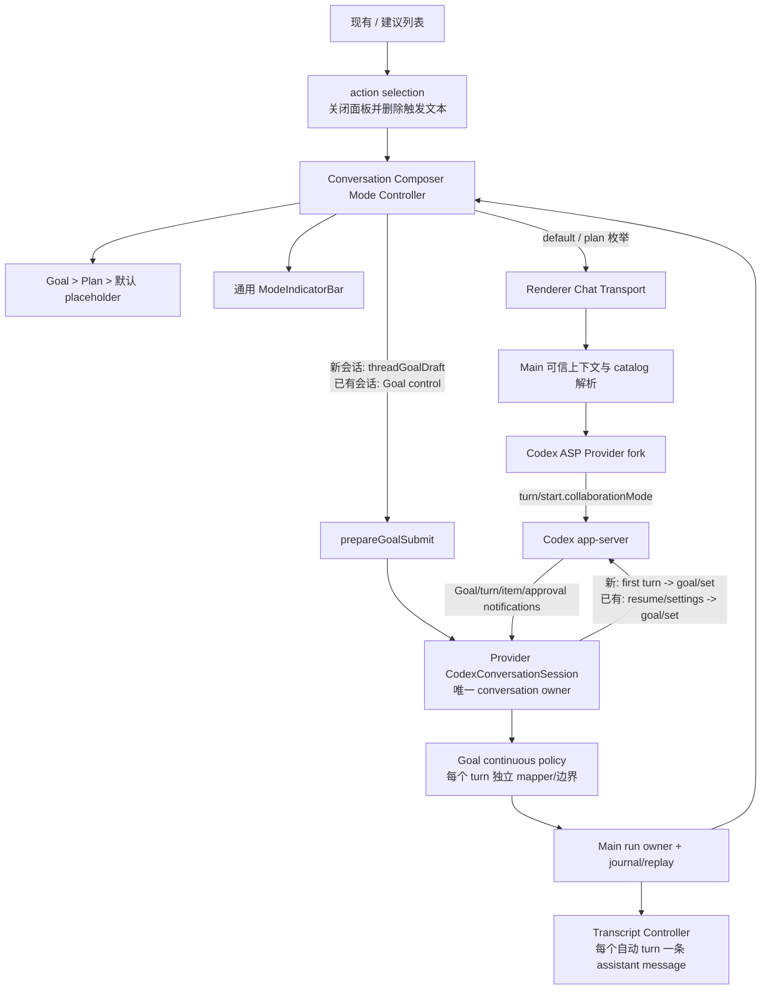

# `/Goal`、`/Plan` Composer 参考实现复刻计划

## 1. 结论

本次应采用“**共用命令入口与展示外壳，不强行共用业务协议**”的设计：

- `/Goal`、`/Plan` 都注册到现有项目自有的 `/` 命令系统，不新增第二套 slash 解析器。当前命令注册入口位于 `desktop-app/src/renderer/src/App.tsx:3112-3143`，动作型命令的选择流程已经能够关闭建议面板、精确删除 `/...` 触发文本并执行回调，见 `desktop-app/src/renderer/src/composer/composerSuggestionSelection.ts:59-64`。
- 抽出一个通用、无业务状态的 `ComposerModeIndicator`/`ComposerModeIndicatorBar`，统一负责图标、文案、Tooltip、hover/focus 时切换为关闭图标、点击退出等视觉行为；Goal 与 Plan 各自提供状态和退出动作。
- Plan 是一次及后续 turn 的 **Collaboration Mode**。Renderer 只传可信枚举 `default | plan`，Main 根据 `collaborationMode/list` 返回的 preset 和当前模型构造完整模式，Provider fork 再把它写入 `turn/start.collaborationMode`。禁止用追加提示词模拟 Plan。
- Goal 是 app-server 的**持久化线程目标**，但提交编排按参考项目区分两条路径：新 conversation 让首次普通 submit 继续，用 Goal first-turn prompt 创建 conversation/turn，拿到 owner/thread 后再 `thread/goal/set`；已有 conversation 则不创建额外 user turn，先 ensure/resume owner、应用 thread settings，再 set Goal 并继续自动推进。
- Goal 自动推进是**一个 conversation owner 内含多个 turn** 的长生命周期任务。参考项目用通用 conversation owner 管理普通 turn、Goal、steer 和 approval；当前仓库应在 Provider 内抽出通用 `CodexConversationSession`，让现有单-turn `doStream` 与 Goal continuous policy 共用连接、packet mapper 和审批基础设施，而不是另建 Goal 专用协议栈。
- Goal 编辑态与已保存 Goal 分开：`goalEditorActive` 只是输入框当前用途；`threadGoal` 才是 app-server 持久化资源。Plan 选择态也与 Goal 资源分开，避免把两个完全不同的生命周期压成一个字符串。
- 不修改 `codex/codex-rs/app-server`。协议支持仅在 `desktop-app/vendors/ai-sdk-provider-codex-asp/`、Desktop Main/Preload/Shared 和 Renderer 中接入。

参考项目本身也只部分通用化：footer 容器会同时组装 Plan/Goal 指示器，但两者的关闭动作分别实现，见 `/Users/nallylin/Documents/code/dasCowork/reference-projects/codex-electron-26.707.72221-beautified/webview/assets/app-initial~app-main~page-DRgkI91I.js:41305-41507`。因此本计划复用“显示能力”，不建立一个可以任意执行协议命令的过度通用 Mode 框架。

### 1.1 参考一致性与有意偏差

- **按参考实现**：新 Goal 走 first-turn submit 后 set；已有 Goal 走 ensure/resume owner -> settings -> set -> maybe continue；`/Goal`、`/Plan` 复用现有 slash action；Goal/Plan footer 和 placeholder 按参考交互。
- **当前架构适配**：参考项目的 host conversation owner 映射为 Provider-owned `CodexConversationSession`，Main 只持有安全 run owner/journal，不复制 app-server JSON-RPC。
- **有意安全偏差**：参考项目触发 Goal clear 后立即切 Plan；本仓库等待 clear 成功（活动 turn 则进入明确的 drain/interrupt 状态）再激活 Plan，避免 Goal/Plan 双状态。文档和测试必须把它标成偏差，不能引用成参考原样行为。

## 2. 目标体验

### 2.1 `/Goal`

1. 用户在 Composer 输入 `/`，在现有命令列表中看到“目标 / 设置要持续追求的目标”。参考命令定义位于 `/Users/nallylin/Documents/code/dasCowork/reference-projects/codex-electron-26.707.72221-beautified/webview/assets/app-initial~app-main~page-DRgkI91I.js:43806-43912`。
2. 选择后：
   - 当前 `/...` 文本消失，建议面板关闭；
   - 若 Plan 正在启用，先切回 Default；
   - 输入框 placeholder 变为“描述你的目标，定义可衡量的成果，以获得最佳效果”，参考 `/Users/nallylin/Documents/code/dasCowork/reference-projects/codex-electron-26.707.72221-beautified/webview/assets/app-initial~app-main~page-DRgkI91I.js:42202-42223` 与中文资源 `/Users/nallylin/Documents/code/dasCowork/reference-projects/codex-electron-26.707.72221-beautified/webview/assets/zh-CN-t8Aas5q1.js:3135`；
   - 输入框下方出现“目标”按钮。
3. “目标”按钮默认显示 Goal 图标；hover 或键盘 focus 时切换为 `X`，文字保持不变。参考样式是 `group-hover:hidden` / `group-hover:block`，见 `/Users/nallylin/Documents/code/dasCowork/reference-projects/codex-electron-26.707.72221-beautified/webview/assets/app-initial~app-main~page-DRgkI91I.js:41391-41412`。
4. 未保存时点击“目标”仅退出 Goal 编辑态，保留用户已经输入的普通草稿；已保存时点击则调用 `thread/goal/clear`，成功后移除按钮，失败时保留状态并显示错误。
5. 提交非空目标时先走 `prepareGoalSubmit`：新 conversation 返回 `continue + threadGoalDraft`，把 objective 转成 Goal first-turn prompt 后走一次正常首次 conversation/turn 创建，owner/thread ready 后再 set Goal；已有 conversation 返回 `handled`，不创建额外 user turn，直接在当前/恢复后的 owner 上 set Goal。参考调用见 `/Users/nallylin/Documents/code/dasCowork/reference-projects/codex-electron-26.707.72221-beautified/webview/assets/app-initial~app-main~page-DRgkI91I.js:65887-65938`、`:67196-67300`。
6. 已有目标时提交新目标，需要“替换当前目标吗？”确认；成功后清空输入框并保留已保存 Goal 指示器。参考中文文案见 `/Users/nallylin/Documents/code/dasCowork/reference-projects/codex-electron-26.707.72221-beautified/webview/assets/zh-CN-t8Aas5q1.js:3307-3310`。

### 2.2 `/Plan`

1. 用户通过现有 `/` 菜单选择“计划模式 / 开启计划模式”。参考命令定义位于 `/Users/nallylin/Documents/code/dasCowork/reference-projects/codex-electron-26.707.72221-beautified/webview/assets/app-initial~app-main~page-DRgkI91I.js:45117-45239`。
2. 选择后关闭 slash 面板并移除触发文本，placeholder 变为“描述你的任务以生成计划…”，footer 出现“计划”按钮。
3. hover/focus 时 Plan 图标切换为 `X`，见 `/Users/nallylin/Documents/code/dasCowork/reference-projects/codex-electron-26.707.72221-beautified/webview/assets/app-initial~app-main~page-DRgkI91I.js:41464-41483`；点击后切回 Default 模式，保留输入文本和附件。
4. Plan 模式下提交普通消息，Main/Provider 必须发出完整 `turn/start.collaborationMode`；app-server 明确规定该字段优先于 model、effort 和 developer instructions，协议定义位于 `codex/codex-rs/app-server-protocol/src/protocol/v2/turn.rs:145-152`。
5. 用户关闭 Plan 后，下一次提交必须显式发送 Default collaboration mode，不能简单省略字段，否则线程可能沿用上一次 Plan 设置。

### 2.3 模式互斥

- 进入 Goal 编辑态：先退出 Plan，再进入 Goal。
- 进入 Plan：先退出未保存 Goal 编辑态；若线程已有持久化 Goal，则调用 clear，清除成功后才进入 Plan，失败则保持原状态并提示错误。参考项目实际是触发 clear 后同步 `setSelectedMode('plan')`，见 `/Users/nallylin/Documents/code/dasCowork/reference-projects/codex-electron-26.707.72221-beautified/webview/assets/app-initial~app-main~page-DRgkI91I.js:45136-45147`、`:66233-66244`；本计划的等待语义是有意安全偏差。
- 该互斥只影响 Goal 编辑态/持久化 Goal 与 Plan；不影响 Composer 普通草稿、附件、选中模型和项目上下文。

## 3. 范围

### 3.1 本次包含

- `/Goal`、`/Plan` 注册到当前 slash command registry；
- Goal/Plan 动态标题、描述、可用状态和 action 选择；
- 参考图中的 footer 指示器、hover/focus 关闭图标和动态 placeholder；
- 每个 conversation 独立的 Goal 编辑态、Plan/Default 选择态和已保存 Goal 快照；
- Plan preset 列表、可信模式解析、`turn/start.collaborationMode` 透传、Default 退出语义；
- Goal 的文本 objective 新建、替换、读取、清除、重开恢复和目标通知；
- 新会话通过参考 first-turn submit 完成 thread materialization，并在 owner/thread ready 后设置 Goal；
- Goal 自动推进期间由通用 Provider conversation session 复用连接、MessagePort run ownership、事件 journal/replay、turn/item/approval/abort 基础设施，并增加多 turn 分帧和 transcript 落盘语义；
- 普通提交、排队 follow-up、steer、retry 对 mode snapshot 的一致处理；
- Provider、Main、Preload、Renderer 单测及真实链路 E2E；
- 更新桌面协议文档和 conversation gap checklist。

### 3.2 本次不包含

- 不修改任何 `codex/codex-rs/app-server` 源码；
- 不实现参考项目的 `@Goal` / `@Plan` 入口，当前项目只接现有 `/`；
- 不实现手写 `/goal 目标内容` 前缀兼容、`/goooal` 彩蛋或文本协议；选择菜单已经负责进入 Goal 编辑态；
- 不实现 Goal 专用图片/粘贴文本附件 materialization、token budget 编辑器、暂停/恢复按钮和完整 Goal 详情卡；但协议层保留完整 status/budget 字段，避免以后迁移；
- 不实现 Plan 完成后的“开始实施”CTA、全局 Plan 快捷键或 Review 模式；这些可在本次通用展示能力上继续扩展；
- 不改变当前模型目录、审批、sandbox、MCP 或 custom provider 的来源与安全边界；
- 不允许 Renderer 提交任意 `developerInstructions`、完整 `CollaborationMode` 或任意 thread id。

## 4. 当前实现与差距

| 能力 | 当前实现 | 本次需要补齐 |
| --- | --- | --- |
| Slash command | `ComposerCommandDescriptor` 已有 id/title/description/triggers/enabled/selection，见 `desktop-app/src/renderer/src/composer/commands/composerCommandTypes.ts:13-36` | 新增 Goal/Plan action descriptors，不另建 slash 系统 |
| 选择后关闭 | action 已在关闭 session 后删除范围并执行，见 `composerSuggestionSelection.ts:59-64` | 直接复用，新增 mode action 测试 |
| Composer footer | 左侧目前只有 Add Context、Model Selector 等，见 `desktop-app/src/renderer/src/App.tsx:3356-3411` | 插入通用 ModeIndicatorBar 与 divider |
| Placeholder | 当前固定为“输入消息（@ 提及工具，/ 输入命令）”，见 `App.tsx:3350-3355` | 由 Goal > Plan > default 的明确优先级计算 |
| Conversation UI state | `ConversationChatEntry` 只保存 model、draft、attachments 等，见 `runtime/ConversationChatRegistry.ts:33-51` | 增加 composer mode、threadGoal、加载/错误状态 |
| 草稿持久化 | `ConversationDraftStore` v2 只保存 text/attachments，且支持 local id 迁移到 thread id，见 `runtime/ConversationDraftStore.ts:1-25`、`:70-82` | 升级记录结构并迁移 mode intent，已保存 Goal 不写 localStorage |
| Chat request | body 目前有 system/project/thread/retry/followUp 并允许 unknown catchall，见 `shared/codexIpcApi.ts:147-175` | 新增严格的 mode 枚举、new-conversation `threadGoalDraft` 与 existing-conversation Goal control request，禁止 raw collaboration object |
| Main -> Provider | `codexCallOptionsInput` 当前只透传 model、resume、callbacks、cwd 等，见 `main/codexChatRuntimeService.ts:2276-2326` | 解析 mode catalog，加入 collaborationMode/Goal control |
| Provider turn/start | 当前构造 turnStartParams 时没有 collaborationMode，见 `vendors/ai-sdk-provider-codex-asp/src/model.ts:1544-1570` | 加入调用级 collaborationMode 并验证 JSON-RPC |
| Provider history/control | `CodexHistoryClient` 只有 list/read/rename/archive/fork，普通 `model.ts` 每次 `doStream` 自建 client 并在首个 finish 关闭 | 增加 collaboration/Goal read API，并抽出通用 `CodexConversationSession`；普通单 turn 与 Goal continuous policy 共用 owner，而不是新增 Goal-only client |
| Chat stream/transcript | `CodexChatStreamEvent` 只有一个 session 终端事件，`ConversationTranscriptController.startRequest()` 只建立一个 `ActiveTurnLedger`；Provider `model.ts` 遇到 mapper 的第一个 `finish` 会关闭连接 | Goal session 沿用 run envelope/journal，但把 `turn-started`/chunk/`turn-completed` 作为可重复分帧；每个 turn 新建/封存独立 assistant ledger，`turn/completed` 对 session 非终态 |
| Conversation open | `ConversationApiService.openConversation` 只返回 thread/messages/project/cwd，见 `main/conversations/ConversationApiService.ts:191-211` | Goal capability 可用时旁路读取 Goal；Goal 读取失败不能阻断原有 conversation open；mode intent 由 Renderer draft store 恢复，不伪称来自 thread/read |

## 5. 设计方案

### 5.1 数据流



### 5.2 通用部分：只抽展示模型

新增一个小型展示模型，而不是建立可执行任意 IPC 的“万能模式注册表”：“模式定义”只描述 Renderer 可以安全渲染的内容。

建议类型：

```ts
type ComposerModePresentation = {
  id: 'goal' | 'plan'
  label: string
  tooltip: string
  dismissLabel: string
  Icon: LucideIcon
  onDismiss: () => void | Promise<void>
  busy?: boolean
}
```

组件职责：

- `ComposerModeIndicator`：一个可聚焦 button；默认图标与 X 图标通过 `group-hover` 和 `group-focus-visible` 切换；保留文字；暴露稳定 `data-slot`；busy 时防止重复点击。
- `ComposerModeIndicatorBar`：接收 presentation 数组，负责 divider、间距和顺序，不读取 Goal/Plan store，不发 IPC。
- `resolveComposerPlaceholder`：纯函数，优先级固定为 Goal 编辑态、Plan、默认文案。

这样未来 Review 或其他输入意图只需要再提供 presentation，但 Goal/Plan 的协议、确认弹窗和生命周期仍在各自 controller 内。参考实现的 footer host 也允许同时组合多个 indicator，见 `/Users/nallylin/Documents/code/dasCowork/reference-projects/codex-electron-26.707.72221-beautified/webview/assets/app-initial~app-main~page-DRgkI91I.js:41321-41355`。

### 5.3 Conversation 状态模型

在 `ConversationChatEntry` 中新增：

- `composerModeKind: 'default' | 'plan'`：下一次普通提交使用的协作模式；
- `goalEditorActive: boolean`：当前 Composer 是否把文本解释为 Goal objective；
- `threadGoal: ThreadGoalSummary | null | undefined`：`undefined` 表示尚未加载，`null` 表示已确认无 Goal；
- `goalOperation: 'idle' | 'loading' | 'setting' | 'clearing'` 和错误信息；
- `modeCatalogStatus`：Plan preset 是否可用及原因；另设 `goalCapabilityStatus` 表达 `loading | available | unsupported | error`，不能用 `threadGoal === null` 代替能力状态。

持久化规则：

- draft text、attachments、`composerModeKind` 写入升级后的 `ConversationDraftStore`，并沿用 local id -> thread id 迁移；`goalEditorActive` 只属于当前 Renderer 会话，不持久化。否则应用重启后会把一个普通草稿静默解释为 Goal objective；参考实现也只把 pending Goal 放在 Composer 状态中，用户需求没有要求重启后保持未提交的 Goal 意图；
- `threadGoal` 永远从 app-server `thread/goal/get`/notifications 恢复，不写 localStorage，避免本地假 Goal；
- 新会话绑定真实 thread id 时，mode/draft 原子迁移，避免按钮突然消失；
- 排队 follow-up 在入队时捕获 mode kind，不在真正执行时读取一个已经变化的全局值；
- conversation 切换时只读当前 entry，禁止 Goal/Plan 状态跨任务泄漏。
- mode source of truth 明确分层：未提交/新会话由 Renderer draft intent 决定；当前 live run 以 `thread/settings/updated` 回执校正；打开已存在 thread 时先恢复该 conversation 的本地 mode intent，没有记录则为 Default。`thread/read` 的 `Thread` 结构不包含 collaboration mode，因此 Main 不得伪造所谓“server mode snapshot”。下一次普通提交仍显式发送 Renderer intent，使 app-server 状态收敛。

### 5.4 Plan 协议模型

app-server 的 `collaborationMode/list` 返回 mask，而 `turn/start` 需要完整 `CollaborationMode`。协议列表位于 `codex/codex-rs/app-server-protocol/src/protocol/v2/collaboration_mode.rs:9-45`，完整结构位于 `codex/codex-rs/protocol/src/config_types.rs:637-643`、`:710-716`。

Main 的解析步骤：

1. Provider catalog client 调 `collaborationMode/list`，只保留 `mode === 'default' | 'plan'`；Plan preset 不存在时命令 disabled 并显示原因。
2. Renderer 只提交 `composerModeKind`，不能提交 settings。
3. Main 用当前选中 model、preset 的 optional model/reasoning effort 生成：
   - `mode`：选中的 kind；
   - `settings.model`：preset model 或当前选中 model；
   - `settings.reasoning_effort`：preset 明确值，否则当前调用值或 `null`；
   - `settings.developer_instructions: null`，让 app-server 使用对应 built-in instructions。app-server 正是这样补全内置指令，见 `codex/codex-rs/app-server/src/request_processors/turn_processor.rs:336-350`。
4. `CodexCallOptions` 新增 typed `collaborationMode`，`model.ts` 原样放到 `turnStartParams`。
5. Plan/Default 两种状态都显式发送；mode 字段的模型/effort 与当前 ModelSelector 同步更新。
6. Provider 把完整 `thread/settings/updated` 映射为 Main-only typed callback；Main 只投影出 renderer-safe 的 `modeKind`/必要状态再通知 Renderer，不透传完整 ThreadSettings。Renderer 用该 sanitized 回执校正本地 mode snapshot。协议形态见 `app-server-protocol/src/protocol/v2/thread.rs:292-298`。

### 5.5 Goal 控制模型

Goal 不能仅在 `CodexHistoryClient.setGoal()` 中“发完请求即断开”。参考项目由 host conversation owner 先创建/恢复 conversation，再设置 Goal 并继续；当前仓库应把这一原则映射成 Provider-owned 通用 `CodexConversationSession`，而不是 Goal-only client：

- `CodexConversationSession` 独占一个 active thread 的 `AppServerClient`、approval dispatcher、dynamic tools、turn lifecycle normalizer 和 transport termination；提供 `singleTurn` 与 `goalContinuous` 两种 session policy。现有 `model.ts#doStream` 逐步改为使用 `singleTurn` wrapper，Goal 复用同一基础设施，避免两套 packet pump。
- **新 conversation（参考路径）**：Renderer 的 `prepareGoalSubmit` 返回 typed `threadGoalDraft: { objective }` 并继续首次 submit；可见 transcript 仍只有一条 objective user item。Main 校验 draft objective 与本次最新 user text 一致后，把 validated draft 交给 Provider；Provider 用它生成参考等价的 Goal first-turn prompt，替换本次实际 turn input，而不是再追加一条 message，并在正常 `thread/start(ephemeral:false) -> turn/start` 参数中带上本次 model/permission/collaboration settings。thread/turn owner ready 后在同一 session 发送 `thread/goal/set(status:'active')`；set 不追加第二条 transcript item，然后切换为 `goalContinuous` 等待首次 turn 和后续自动 turn。thread/turn 创建失败时清理尚未提交的 draft/materialized 临时资源；首轮提交已创建但 set 失败时保留 objective、owner 与部分失败状态，不能伪装成已保存 Goal。
- **已有 conversation（参考路径）**：先 `ensure/resume conversation owner`，再在同一 session 应用当前 model、cwd、permission、collaboration settings，然后 `thread/goal/set`，最后触发/等待 Goal continuation；不得先用无 owner 的短连接 set 后再 resume。若 owner 已存在则直接复用，不二次 resume；这也是活动 Goal 替换 objective 的路径。参考顺序见 `/Users/nallylin/Documents/code/dasCowork/reference-projects/codex-electron-26.707.72221-beautified/webview/assets/app-initial~app-main~page-DRgkI91I.js:98172-98196`。
- Clear 优先路由到该 conversation owner；没有 live owner 时才使用短连接 `thread/goal/clear`。Get 使用短连接 `thread/goal/get`，供打开 conversation 时恢复。
- 能力探测通过 `experimentalFeature/list` 读取稳定 key `goals`（已有 thread 传 `threadId`，让项目级 config 生效）。未绑定 thread 时只能得到进程级粗略能力；实际 `thread/goal/set` 仍是权威结果。feature disabled、method unsupported、暂时读取失败和“无 Goal”必须分别表达，Goal hydration 失败不得阻断普通 conversation open。
- `goalContinuous` 复用现有 item/tool/approval 映射，但不沿用“mapper 产生第一个 `finish` 就关闭 owner”的 single-turn 终止语义。每个 `turn/started` 建立 per-turn mapper/ledger；`turn/completed` 只封存当前 assistant message，Goal 仍 active 时继续等待下一 turn。
- session 结束采用“目标状态 + in-flight turn”双条件：Goal 进入 complete/paused/blocked/usageLimited/budgetLimited 后，等待当前 turn canonical completion；clear 停止未来续跑并让当前 turn 排空，除非用户显式 interrupt；transport error 走现有 reconcile/recovery。
- 普通 follow-up、queue/steer、Goal replace/clear 与自动 turn 都路由同一个 conversation owner。只拒绝重复并发 mutation，不允许另一个 provider session 抢占同一 thread。
- 新线程必须 materialized/non-ephemeral；app-server 明确拒绝 ephemeral Goal，并依赖 SQLite，见 `app-server/src/request_processors/thread_goal_processor.rs:219-247`。

Goal shared type 保留 `objective/status/tokenBudget/tokensUsed/timeUsedSeconds/createdAt/updatedAt`。当前 UI 只展示“目标”及操作错误，但不丢弃未来状态详情需要的数据。协议字段见 `app-server-protocol/src/protocol/v2/thread.rs:721-749`。

### 5.6 安全边界

- `CodexChatRequestBody` 的 Plan mode 与新会话 `threadGoalDraft: { objective: string }` 改为明确 schema；Main 校验 trimmed objective 与最新 user text 一致，Provider 只接收 validated draft，不接收 Renderer 预构造 prompt。已有 conversation 的 set/clear 使用独立 typed control payload。不要依赖当前 `.catchall(z.unknown())` 接受任意对象，现状见 `shared/codexIpcApi.ts:166-175`。
- `ElectronIpcChatTransport.createTrustedContext()` 继续覆盖 conversation/project/thread identity，见 `renderer/src/lib/ElectronIpcChatTransport.ts:275-289`；新增 mode 只允许枚举，Goal 操作由当前 active conversation 解析 thread id。
- Renderer 永远拿不到 provider API key、headers、完整 model provider config 或内置 developer instructions。
- Main 只负责身份、生命周期和安全编排；JSON-RPC method/params/notification 映射全部留在 provider fork，符合仓库分层规则。

## 6. 实施步骤

### 步骤 1：锁定协议类型与生成流程

涉及文件：

- `desktop-app/vendors/ai-sdk-provider-codex-asp/package.json:20-31`
- `desktop-app/vendors/ai-sdk-provider-codex-asp/src/protocol/types.ts:1-10`
- `desktop-app/vendors/ai-sdk-provider-codex-asp/src/provider-settings.ts:159-242`

工作：

1. 用当前项目匹配的 app-server 执行 provider 的 `codex:generate-types`，确认生成物包含 CollaborationMode、ThreadGoal、ThreadSettings、对应 params/response/notifications；生成目录继续保持 gitignored，不手改生成文件。
2. 在手写 `protocol/types.ts` 中只增加稳定别名/导出；在 `provider-settings.ts` 增加 `CodexCollaborationModeKind`、完整 collaboration mode、Goal event/callback 等公开类型。
3. 写 packet-level fixtures，先锁定 `collaborationMode/list`、`turn/start.collaborationMode`、`thread/goal/set|get|clear` 的真实 JSON 形态。注意外层 v2 params 是 camelCase，但 `CollaborationMode.settings` 来自 `codex_protocol::config_types::Settings`，生成类型中的字段是 `reasoning_effort` / `developer_instructions`，不能凭外层命名规则改成 camelCase。
4. 当前 worktree 的 `codex` submodule 未 materialize。`codex:generate-types` 实际执行的是 `codex app-server generate-ts --experimental`，因此实施前必须初始化匹配 SHA 的 submodule 并构建/调用匹配的 `codex` CLI，或明确提供同版本 `codex` CLI；`CODEX_APP_SERVER_BIN` 只控制运行时 app-server 启动，不能满足类型生成命令。不得因此复制或修改 app-server 源码。

完成标准：provider typecheck 能在全新生成的 protocol types 上通过，且没有手写重复的 app-server schema。

### 步骤 2：实现 Provider 的 Plan catalog 与 turn/start 透传

涉及文件：

- `desktop-app/vendors/ai-sdk-provider-codex-asp/src/history-client.ts:15-25,78-189`
- `desktop-app/vendors/ai-sdk-provider-codex-asp/src/provider-settings.ts:159-242`
- `desktop-app/vendors/ai-sdk-provider-codex-asp/src/model.ts:1544-1577`
- `desktop-app/vendors/ai-sdk-provider-codex-asp/src/protocol/event-mapper.ts`
- `desktop-app/vendors/ai-sdk-provider-codex-asp/src/index.ts`
- 对应 `tests/history-client.test.ts`、`tests/model.test.ts`、event mapper tests

工作：

1. 给 history/catalog client 增加 `listCollaborationModes()`；实验 API 继续使用现有 initialize capability。
2. 给 `CodexCallOptions` 增加完整 `collaborationMode`。
3. 在 `turnStartParams` 中透传该字段，不改变 thread/start、cwd、workspace roots、approval、custom provider config 的既有优先级。
4. 映射 `thread/settings/updated` 为 callback，供 Main 校准已生效模式。
5. 单测覆盖 Plan、Default、无模式、resume/retry、custom provider 五组包；断言没有把 Plan instructions 拼进普通 user/system message。

完成标准：Provider 抓到的 `turn/start` 包与 app-server 类型一致，Plan 和 Default 都可显式发送，原有 provider tests 全部通过。

### 步骤 3：实现 Provider 通用 Conversation Session 与 Goal continuous policy

涉及文件：

- 复用/重构 `desktop-app/vendors/ai-sdk-provider-codex-asp/src/model.ts`、`src/thread-client.ts:46-129`
- 新增 `src/conversation-session.ts` 与 `tests/conversation-session.test.ts`
- `src/protocol/event-mapper.ts`
- `src/provider-settings.ts`
- `src/index.ts`

工作：

1. 抽出 thread/history/turn/goal 共用的 transport、`AppServerClient`、approval dispatcher、dynamic tools、lifecycle normalizer 与终止清理，保持 stdio/websocket、debug packets、experimentalApi 行为一致；同一 conversation/thread 只有一个长生命周期 session owner。
2. `CodexConversationSession` 提供两种 policy：普通 `doStream()` 使用 `singleTurn`，Goal 使用 `goalContinuous`。两者共享连接、packet mapper、approval 与清理，不另建 Goal-only 协议栈。
3. 实现 `listExperimentalFeatures()`、`getGoal`、`clearGoal` 的无 owner 短连接路径；`goals` disabled/unsupported/temporary-error 使用结构化 capability 结果，不用错误字符串驱动 Renderer 状态。有 live owner 时，set/clear/get 必须路由到原 session。
4. 新 conversation 复刻参考时序：用 Goal 首轮 prompt 和正常首轮 settings 执行唯一一次 `thread/start -> turn/start`，在同一 session 获得 thread owner 后执行 `thread/goal/set(active)` 并切换到 `goalContinuous`；set 本身不得新增第二条 user message 或第二个 turn。禁止 ephemeral。
5. 已有 conversation 复刻参考时序：先确保/恢复 owner，再应用 thread settings，然后 `thread/goal/set(active)` 并触发 continuation；当前 live owner 替换 Goal 时只在原 session set，不二次 resume、不启动第二个 app-server 连接。
6. 每个 `turn/started` 创建独立 per-turn mapper，在 `turn/completed` 输出 turn boundary 而非关闭 Goal session；新增 Goal updated/cleared 和 thread settings callbacks。不要在 session policy 中重新解释 tool/approval packet。
7. 明确首 turn 成功但 Goal set 失败、Goal terminal、clear-drain、interrupt、transport error 的结束与重试语义，并保证 disconnect 只执行一次；当前 turn 未 canonical completed 前不得因先到达的 terminal Goal notification 丢尾包。
8. 测试新 conversation 的 `thread/start -> turn/start(携带正常首轮 settings) -> goal/set`、已有 conversation 的 `resume -> settings -> goal/set -> continue`、live replacement 不二次 resume、首轮已创建但 set 失败、至少两个连续自动 turn、per-turn mapper reset、clear-drain、abort、错误清理和 approval 回调。

完成标准：mock app-server 证明新 Goal 只有参考实现要求的一次首 turn，已有 conversation 设置 Goal 不新增 user turn，set 不制造重复 transcript；两个以上自动 Goal turn 都能返回且第一个 `turn/completed` 不会断开 session；普通聊天与 Goal 共用同一套 session 基础设施。

### 步骤 4：建立 Shared/Main/Preload 的可信 Mode 与 Goal API

涉及文件：

- `desktop-app/src/shared/codexIpcApi.ts:147-175,385-428,573-588`
- `desktop-app/src/main/conversations/AppServerThreadClient.ts:42-60,83-149`
- `desktop-app/src/main/conversations/ConversationApiService.ts:16-37,191-212`
- `desktop-app/src/main/codexChatRuntimeService.ts:481-817,2200-2327`
- `desktop-app/src/main/index.ts:829-884`
- `desktop-app/src/preload/chatStreamBridge.ts`
- `desktop-app/src/preload/index.ts:240-268`
- 这些文件现有 test suites

工作：

1. Shared 新增严格类型：`ComposerModeKind`、`ThreadGoalSummary`、mode/Goal capability state、Goal set/clear request、Goal session kind、Goal events 与 sanitized `mode-applied` event；不要把 provider 的完整 `ThreadSettings` 放入 shared/renderer。objective 先 trim，再按 Unicode character count 校验非空且最多 4,000 字符，与 `codex_protocol::protocol::MAX_THREAD_GOAL_OBJECTIVE_CHARS` 一致；不要用 UTF-16 `.length` 误拒绝 emoji。现有 run descriptor/envelope 增加可判别的 `runKind: 'chat' | 'goal'`，防止 reload attach 时用普通单-turn controller 接管 Goal session。
2. 扩展 `DesktopConversationsApi.openConversation()` 的结果，返回判别联合 `threadGoalResult: { status: 'loaded'; goal: ... } | { status: 'unsupported' | 'error'; message: string }`；Goal capability/list/get 采用旁路 `allSettled` 语义，读取失败与“无 Goal”分开，且不得让 thread/messages 的原有打开流程失败。不要从 Main 返回不存在的 mode snapshot；Renderer 自己从 draft store 恢复 mode intent。
3. Main 懒加载/缓存 collaboration mode catalog 与 `goals` feature 状态；已有 thread 的 feature query 带 `threadId`。按选中 model 生成完整 Plan/Default mode。Renderer 传 raw object 时 schema 必须拒绝。
4. 普通消息、queue、steer、regenerate/retry 在开始时捕获 mode snapshot，并传到 `codexCallOptionsInput()`；终端重试保持原 turn mode，除非用户明确重新提交。
5. 新 conversation 的 Goal 通过普通首轮 submit 启动，并携带严格类型的 `threadGoalDraft`；Main 仍复用现有 stream ownership、conversation binding、project assignment、approval broker、abort、run journal/replay 和 MessagePort envelope，首轮 `thread/start` 后走与普通 `onThreadStarted` 相同的 sidebar/project 持久化回调。已有 conversation 的 Goal set/replace/clear 使用独立 typed control payload，但路由到同一 owner。Goal `turn-completed` 只记 turn boundary，session terminal 才写 run terminal。
6. Main 为每个 conversation/thread 维护唯一 run owner。活动 owner 上的 Goal replace、clear、ordinary queue/steer/idle submit 全部路由到同一 provider session；并发重复 mutation 去重或拒绝，但合法替换不能因“已有 live run”被拒绝。进入 Plan 时先 clear Goal，并等 clear-drain 或明确 interrupt 完成后再切换。
7. Preload 只暴露 typed 方法，所有 payload 在 Main 再次 Zod 校验。

完成标准：Main integration tests 能证明 Renderer 不能伪造 thread/model instructions；新 Goal 首 turn 会绑定 conversation/thread/project，已有 Goal set 不产生额外 user turn；Plan request 到 Provider 的模式与 catalog 一致；Goal hydration 失败不影响消息打开；同一 thread 不会出现两个 owner/provider session。

### 步骤 5：扩展每会话 Composer 状态与持久化

涉及文件：

- `desktop-app/src/renderer/src/runtime/ConversationDraftStore.ts:1-104`
- `desktop-app/src/renderer/src/runtime/ConversationChatRegistry.ts:33-51,478-536`
- `desktop-app/src/renderer/src/hooks/useCodexIpcAssistantRuntime.ts:28-56,189-217`
- 对应 store/registry/runtime tests

工作：

1. 把 draft storage 升级到下一版本，只给每个 draft 增加 `composerModeKind`，对 v1/v2 做无损迁移；`goalEditorActive` 仅保存在 `ConversationChatEntry` 内存态，刷新后回到普通输入，避免把遗留草稿静默提交为 Goal。
2. 扩展 `ConversationChatEntry` 与公开 setter：选择 mode、进入/退出 Goal、设置 Goal snapshot/operation/error。
3. local conversation 绑定 thread 时，把 draft 和 mode 同时迁移；Goal snapshot 以 server response 为准。
4. 打开已有 conversation 时独立加载 Goal；`loaded(null)`、`unsupported`、`error` 分开处理，且 Goal 加载错误不覆盖正常 transcript。普通/Goal stream 收到 Goal/settings event 时实时更新 entry。
5. conversation 切换、archive、new chat、terminal retry、恢复失败场景分别定义清理/保留规则。

完成标准：两个会话各自选择 Goal/Plan 后来回切换，文本、附件、mode 和 Goal 都不串；刷新后 Plan draft mode 恢复、未提交 Goal editor 回到普通输入、已保存 Goal 由 server 恢复。

### 步骤 6：把 `/Goal`、`/Plan` 接入现有命令 registry

涉及文件：

- `desktop-app/src/renderer/src/App.tsx:3089-3143`
- `desktop-app/src/renderer/src/composer/commands/composerCommandTypes.ts:13-36`
- `desktop-app/src/renderer/src/composer/commands/composerCommandRegistry.tsx:107-118`
- `desktop-app/src/renderer/src/composer/commands/useComposerCommandSections.ts:31-76`
- `desktop-app/src/renderer/src/composer/composerSuggestionSelection.ts:37-124`
- 现有 registry/search/selection tests

工作：

1. 注册 `goal` 与 `plan-mode`，均使用 `selection.type: 'action'`，`requiresEmptyComposer:false`，允许用户在已有文字时切换输入意图。
2. Goal title/description 固定为“目标 / 设置要持续追求的目标”；Plan description 根据当前状态显示“开启计划模式”或“关闭计划模式”。
3. enabled 条件包含：非 follow-up 编辑、对应 capability 可用、Goal clear/set 或 Plan catalog 不在 pending。不能笼统使用“非正在运行”：活动 Goal session 正是 replace/clear/steer 必须路由到现有 owner 的场景；只有当前 run kind 与动作冲突且无法安全路由时才 disabled，并显示具体原因。
4. Goal action 先退出 Plan，再打开 Goal editor；Plan action 先清理 Goal 状态并等待 clear-drain，再设为 Plan。参考 beautified 代码中 clear 回调与 `setSelectedMode('plan')` 没有明确 await；这里采用串行成功后切换是为避免双状态的有意安全偏差，需要在测试/文档中注明而非宣称逐行复刻。
5. 不新增 content panel：选择模式后用户应回到输入框，footer 持续表示状态；现有 action dispatcher 已提供正确的关闭/删除顺序。
6. 添加中文/英文 search aliases，并保持大小写不敏感。

完成标准：键盘 Enter 和鼠标选择 `/Goal`、`/Plan` 都只删除准确的 slash range，不破坏前后文本，不打开第二个浮层。

### 步骤 7：实现通用 footer 指示器与 placeholder

涉及文件：

- 新增 `desktop-app/src/renderer/src/components/assistant-ui/composer-mode-indicator.tsx`
- 新增对应 component test
- `desktop-app/src/renderer/src/App.tsx:3310-3411`
- 必要时新增 `renderer/src/composer/modes/composerModePresentation.ts`

工作：

1. 实现通用 presentation、indicator 和 bar；在 Add Context 后、ModelSelector 前插入 divider + active indicators，窄宽度时不把发送按钮挤出 Composer。
2. Goal 使用目标图标，Plan 使用灯泡/计划图标；默认图标 `group-hover:hidden group-focus-visible:hidden`，X 图标反向显示。
3. button 提供 `aria-label`、Tooltip、disabled/busy 和 `data-slot`；触摸设备即使没有 hover 仍可直接点击退出。
4. 动态 placeholder 用纯函数计算，Goal 优先于 Plan；模式退出立即恢复默认 placeholder。
5. Goal set/clear pending 时阻止重复操作但保留按钮，失败时让用户可重试。

完成标准：外观与两张附图的核心行为一致，鼠标、键盘和触摸都能退出；文字/附件不因退出模式被清空。

### 步骤 8：拦截 Goal 提交并完成替换/清除流程

涉及文件：

- `desktop-app/src/renderer/src/App.tsx` Composer submit/button/keyboard 区域，当前输入与 footer 位于 `3310-3481`
- `desktop-app/src/renderer/src/runtime/ConversationTranscriptController.ts:489-526`
- `desktop-app/src/renderer/src/lib/ElectronIpcChatTransport.ts:82-170,275-340`
- 新增 Goal replacement dialog/component test

工作：

1. 在普通 assistant-ui submit 进入 transcript 前执行 `prepareGoalSubmit`。空 objective 直接退出 Goal 编辑态且不发 IPC；非空 objective 根据 conversation 是否已绑定 thread 分流。
2. 新 conversation 返回 `continue`：保留正常 assistant-ui submit/transcript 路径，附带严格类型的 `threadGoalDraft`。UI 只插入一条 objective user item；Main 校验 body objective 与该 item 一致，Provider 将实际 turn input 替换为参考等价的 Goal 首轮 prompt，不能追加第二条 message。已有 conversation 返回 `handled`：通过 typed control method 在现有 owner 上 set Goal，不新增 user message。
3. 已有不同 Goal 时显示替换确认；取消保持编辑态和草稿，确认后发送 set。
4. 新 Goal 首 turn 返回 thread id 后绑定当前 local conversation，沿用 draft/mode migration 和 sidebar refresh；Provider 在同一 session 完成 `thread/goal/set`，不得为了保存 Goal 再提交一次 turn。
5. 仅在首轮提交被接受且 `thread/goal/set` 成功后清空 Composer、退出编辑态并保留 server Goal indicator；首轮创建失败或 set 失败时保留可恢复的 objective、模式和附件，显示可读错误；若 owner 已创建则只在同一 owner 上重试 set，不能重复首 turn 或虚假显示“已保存”。
6. footer Goal click：pending editor 仅退出；saved Goal 调 clear；Plan click始终只切 Default。
7. 扩展 `ConversationTranscriptController` 的 Goal continuous 支持：新 conversation 复用普通首 turn ledger，已有 conversation 的 control set 不创建 user message；后续每个 `turn-started` 新建该 turn 的 `ActiveTurnLedger`，流式更新只写当前 ledger，matching `turn-completed` 把 assistant message 封存进 `baseMessages` 并等待下一 turn。禁止仅通过 `observeChunk()` 改写同一个 ledger 的 turn id。
8. renderer reload/切换回来时按 `runKind:'goal'` attach 现有 Main run，replay journal 后恢复当前 in-flight ledger；用 app-server `turnId`（必要时连同 source item id）作为 transcript 去重键，避免 point-in-time `thread/read` 已包含某个完成 turn 后 journal 又重放一次。journal overflow 走现有 transcript/history resync 后再 attach。
9. running Goal 的 cancel/interrupt 继续走现有 conversation interruption，并把 server 返回状态映射到 Goal snapshot；单纯 clear 只停止未来续跑，当前 turn 默认排空，不能伪造成已经 interrupted。

完成标准：新 conversation 的 Goal objective 仅出现在一次预期的首 turn 表示中，已有 conversation 设置 Goal 不新增 user message，set 不制造重复 transcript；连续两个自动 turn 会形成两条独立 assistant transcript message；reload replay 不重不漏；成功、取消、首轮创建后 set 失败、替换失败、clear 失败均不会丢草稿或产生重复请求。

### 步骤 9：文档、回归与真实链路 E2E

涉及文件：

- `docs/ai-sdk-provider-codex-asp-api.md`
- `docs/codex-app-server-official-notes.md:180-223`
- `docs/codex-electron-conversation-gap-checklist.md:269-278`
- `desktop-app/tests/e2e/composer-commands.e2e.ts`
- provider/main/renderer tests

工作：

1. 文档写清 mode enum -> Main resolution -> provider `turn/start`、Goal control session 和不修改 app-server 的边界。
2. checklist 只在真实 E2E 通过后标记 `/Goal`、`/Plan` 和参数透传完成；“Plan 完成后实施 CTA”仍保留为独立差距。
3. E2E 使用真实 Renderer -> IPC -> Main -> Provider -> app-server -> mock custom model provider 链路抓包，不只断言按钮出现；测试配置显式覆盖 `goals` enabled 与 disabled 两种情况，不能用跳过 app-server 的假 IPC 代替协议验证。
4. 跑完整质量门禁并记录任何环境限制。

完成标准：下列验收矩阵全部通过，lint/typecheck/unit/E2E 无新增失败。

## 7. 验收标准

### 7.1 Slash 与 UI

1. 空或非空 Composer 输入 `/` 都能检索 Goal/Plan；选择后 suggestion 关闭且只移除本次 slash range。
2. 选择 Goal 后出现“目标”按钮和 Goal placeholder；选择 Plan 后出现“计划”按钮和 Plan placeholder。
3. 两个按钮默认显示各自图标，hover 与 `focus-visible` 显示 X；`aria-label` 分别为清除目标/关闭计划模式。
4. 点击 Plan 按钮后 1 个 render cycle 内恢复 Default placeholder，文本和附件保持。
5. 点击未保存 Goal 按钮只退出模式；点击已保存 Goal 按钮只在 `thread/goal/clear` 成功后移除。
6. Goal/Plan 在不同 conversation 中独立，切换任务 20 次也不会互相污染。

### 7.2 Plan 协议

7. Plan 提交抓到的 JSON-RPC `turn/start` 含 `collaborationMode.mode === 'plan'`；`settings.model` 为当前选择，`settings.reasoning_effort` 符合 preset，`settings.developer_instructions` 明确为 `null`（这两个 nested key 是 snake_case）。
8. 关闭 Plan 后下一次 `turn/start` 显式包含 Default collaboration mode，不沿用旧 Plan。
9. Renderer 尝试发送任意 model/developerInstructions/raw collaboration object 时，Main schema 拒绝或忽略，并使用可信 catalog 重新构造。
10. queue/steer 在入队时保存 mode；入队后切换模式不会改变已经排队请求的 mode。
11. regenerate/terminal retry 保持原 turn mode，且不破坏现有 cwd/workspace roots/approval/custom provider 配置。

### 7.3 Goal 协议与生命周期

12. 新 conversation 提交 Goal 时，严格类型的 `threadGoalDraft` 进入正常首轮链路；本次 model/permission/collaboration settings 随首轮创建参数发送，顺序为 `thread/start(ephemeral:false) -> turn/start(Goal 首轮 prompt) -> thread/goal/set(active)`。只形成一次首轮 user/Goal transcript，set 不产生第二个 turn 或重复消息；返回 thread id 后 sidebar/project assignment 可见。
13. 未加载的已有 conversation 提交 Goal 时，顺序为确保/恢复 owner -> 应用 thread settings -> `thread/goal/set(active)` -> continuation；不得在 resume 前短连接 set，也不得新增 user turn。已经由 live owner 持有时只在原 session set，不二次 resume、不启动第二个 app-server session。
14. mock app-server 连续发出至少两个自动 Goal turn 时，第一个 `turn/completed` 不结束 session；两个 turn 的 item/chunk/approval 各自形成独立 assistant transcript message，mapper/usage/tool state 不串线。
15. renderer reload 后按 Goal run kind attach/replay，以 app-server turn/source item identity 去重；即使 `thread/read` 与 journal 覆盖同一完成 turn 也不重复，当前 turn 不丢增量；journal overflow 先 history resync 再恢复。
16. 打开已有 Goal thread 会在 capability 可用时调用 `thread/goal/get` 并恢复 objective/status；无 Goal 明确返回 `loaded(null)`；feature disabled 与读取 error 可区分，均不阻断 transcript 打开。
17. `experimentalFeature/list` 返回 `goals:false` 或 method unsupported 时 `/Goal` disabled 并显示原因；Plan 与普通聊天仍可使用。
18. 替换已有 Goal 必须先确认；取消不发 set，确认只发一次；活动 Goal 的替换路由到原 run owner。
19. clear 成功后 Goal 消失、未来不再自动续跑；若当时有 turn，等待 canonical completion 后再关 session。clear 失败时 Goal 与草稿均保留；interrupt 才把当前 turn 标为 interrupted。
20. Goal 进入 complete/paused/blocked/usageLimited/budgetLimited 或 abort 时 live session 正确收尾，无悬空 app-server 子进程、重复 session terminal 或未释放 approval。
21. Goal objective trim 后按 Unicode 字符计数：空值与 4,001 字符在 Main 拒绝、4,000 字符通过；新 conversation 的 objective 只进入预期的 Goal 首轮 prompt/对应 transcript，已有 conversation set 不新增 user message；两条路径都不得把 objective 当成 system prompt、直接 OpenAI-compatible 请求或重复 transcript 发送。

### 7.4 回归与边界

22. `/New chat`、`/Code review`、`/MCP`、`@` 提及、附件、发送、queue/steer、审批、模型选择继续通过现有 tests；活动 Goal 下 follow-up/steer 仍由同一 owner 处理。
23. Renderer 仍不能直接访问 Node/Electron/app-server；新增 API 都经 preload 白名单和 Main Zod 校验。
24. `git diff -- codex/codex-rs/app-server` 为空；仅 protocol type generation 消费官方定义。
25. Provider lint/typecheck/tests、Desktop lint/typecheck/tests 和 composer E2E 全部通过。

## 8. 测试与验证命令

按风险从小到大执行：

```bash
npm --prefix desktop-app/vendors/ai-sdk-provider-codex-asp run lint
npm --prefix desktop-app/vendors/ai-sdk-provider-codex-asp run typecheck
npm --prefix desktop-app/vendors/ai-sdk-provider-codex-asp test

npm --prefix desktop-app run lint
npm --prefix desktop-app run typecheck
npm --prefix desktop-app test

npm --prefix desktop-app run test:e2e -- --reporter=line
```

重点新增测试文件/场景：

- Provider：collaboration catalog、真实 nested settings 命名、turn packet、goals capability、通用 conversation session、`singleTurn`/`goalContinuous` policy、新 Goal 首 turn 后 set、已有 conversation resume/settings/set、两个以上自动 turn、per-turn mapper reset、goal/settings notifications、clear-drain/disconnect/abort；
- Main：schema trust boundary、objective trim/空值/4,000 与 4,001 Unicode 字符边界、mode resolution、新 Goal 首 turn binding、首 turn 后 set 失败恢复、live replacement、普通 submit 与 Goal 共用 owner、single-owner race、非阻塞 open hydration、run kind/replay；
- Renderer：draft migration、未提交 Goal editor 不跨重启、conversation isolation、slash action、placeholder、indicator hover/focus/click、replace dialog、multi-turn transcript sealing、reload replay 去重；
- E2E：真实 `/Plan` turn packet、退出 Default packet、Goal capability enabled/disabled、新 conversation Goal 恰好一次首 turn、已有 conversation Goal set 不新增 user turn、两个自动 turn、Goal clear/reopen 恢复。

## 9. 风险与缓解

| 风险 | 后果 | 缓解 |
| --- | --- | --- |
| 把 Goal 做成短连接 CRUD | Goal 能保存但不能自动推进，通知和审批丢失 | Provider 的通用 `CodexConversationSession` 持有长连接；无 owner 时才用短连接做 capability/get/clear |
| 为 Goal 新建第二套 client/pump | 普通聊天与 Goal 的连接、审批、工具和清理逐渐分叉，同一 thread 可能双 owner | 共用 `CodexConversationSession` 基础设施，仅以 `singleTurn` / `goalContinuous` policy 区分生命周期 |
| 直接沿用普通 single-turn 终止规则 | 第一个自动 turn 的 `finish` 关闭连接，后续 Goal turn 丢失；多个 turn 混成一条 assistant message | `goalContinuous` 使用 per-turn mapper/ledger；turn finish 非 session terminal；至少双 turn + reload replay 测试 |
| 关闭 Plan 时省略 collaborationMode | app-server 沿用上一轮 Plan | Plan/Default 都显式构造并发送，E2E 抓包验证 |
| Renderer 传完整 mode | 可注入 developer instructions 或伪造模型 | 只接受 enum；Main 从 catalog 与选中模型重建 |
| 新 Goal 首 turn 没走既有绑定 | sidebar、项目归属、草稿迁移不一致 | 复用正常 submit 与 `onThreadStarted` 持久化路径，加入 integration test |
| 首轮提交已创建但 `thread/goal/set` 失败 | 用户看到一条已执行消息却误以为 Goal 已保存，重试可能重复首 turn | 以“首轮创建 + set”作为一个 UI operation；保留 draft 与 owner，显示部分失败并只重试 set，测试无重复 transcript |
| Goal/Plan 切换异步竞态 | Goal 未清完就进入 Plan，出现双状态 | 串行状态机；clear 成功后才 activate Plan；按钮 pending 去重 |
| mode 存在全局 React state | 切换 conversation 后状态串线 | 状态归属 `ConversationChatEntry`，以 local/thread identity 迁移 |
| protocol generated types 漂移 | 本机可编译、CI 不可编译 | 用匹配版本的 `codex` CLI 执行 generation；不要误用 `CODEX_APP_SERVER_BIN` 代替 generator；packet fixtures 锁协议；不手改生成目录 |
| Goal 自动续跑没有明确 finish | 子进程或 stream 泄漏 | 以 Goal terminal status、abort、clear-drain、interrupt 和 connection error 作为显式终止条件，并等待 in-flight turn canonical completion |
| Goal capability 关闭或 hydration 失败 | 打开普通 conversation 也失败，或把 disabled 误显示成“无目标” | `experimentalFeature/list` 判定；Goal 旁路 all-settled hydration；unsupported/error/null 使用判别状态 |
| 持久化未提交的 Goal editor | 重启后普通草稿被静默当作 Goal 提交 | 只持久化 Plan mode intent；`goalEditorActive` 保持会话内状态 |
| 本次范围被 Goal 全量 UI 拉大 | 附件、budget、暂停/恢复拖延核心交付 | 本次只做文本 Goal + 状态快照 + clear；高级 Goal 控件单独排期 |

## 10. 实施顺序与停止条件

依赖顺序必须是：

1. 协议生成与 packet fixtures；
2. Provider Plan catalog/turn packet 与通用 `CodexConversationSession`（`singleTurn` / `goalContinuous` 两种 policy；两条实现 lane 可并行，但共享 protocol/transport helper 由单一 owner 修改）；
3. Shared 的 run kind/Goal event 合约，再做 Main/Preload 安全编排与 single-owner 路由；
4. Renderer 的 per-conversation state 与 Goal multi-turn transcript controller；
5. slash 注册与通用 footer UI；
6. Goal submit/replace/clear/reload attach；
7. capability disabled、双自动 turn、clear-drain、回归 E2E 与文档。

不能先做一个只会变 placeholder 的“假模式”：只有 Provider packet 和 Goal lifecycle 已经可验证，Renderer 才接最终入口。

以下条件全部满足才算完成：

- 25 条验收标准全部有自动化证据或明确的环境验证记录；
- app-server 源码零修改；
- Plan/Default 抓包正确；
- 新 conversation 的 Goal 恰好产生一次预期首 turn，已有 conversation 设置 Goal 不新增 user turn，set 不产生重复 transcript，并且 Goal 能恢复/清除；
- 当前 slash、聊天、审批、follow-up 和 custom provider E2E 无回归；
- `.omx/plans/` 之外的源代码只在后续实施阶段修改，本计划阶段不实现。
