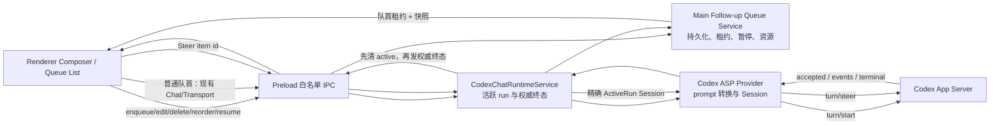

# P0-01 运行中追问队列与 Steer 开发计划

日期：2026-07-18  
模式：`$plan` direct  
状态：P0-01 与截图 UI 对齐修订均已实施并验收（2026-07-18）
目标清单：`docs/codex-electron-conversation-gap-checklist.md` 的 P0-01  
行为参考：`reference-projects/codex-electron-26.707.72221-beautified`

> 最终交互合同以第 15 节的截图 UI 修订为准；前文关于 Composer 常驻 Queue/Steer
> 切换控件的内容仅保留为原始审计背景。

## 1. 结论

P0-01 当前 7 条清单抓住了用户可见功能，但遗漏了决定可靠性的内部契约。若直接按原清单开发，最容易出现以下问题：

- 消息看似入队，刷新或重启后丢失。
- 同一条消息因多窗口、重试或终态竞态被发送两次。
- 用户点击中断后，下一条队列消息又自动启动。
- Steer 失败后消息既不在当前任务中，也不在队列中。
- 图片或本地文件在排队期间失效，发送时才发现上下文不完整。
- 当前 turn 已结束但 renderer 还拿着旧 `turnId`，Steer 错发或静默降级成新 turn。
- main 已向 renderer 发出“已结束”，但活跃运行记录尚未清理，紧接着发送队首时被判定为重复运行。

因此，本计划把参考项目的实现拆成三层：

1. **main 是队列唯一事实来源**：持久化、排序、暂停、失败、发送租约和恢复都由 main 管理。
2. **provider 是 Steer 协议唯一实现者**：直接调用 app-server `turn/steer`，复用现有 prompt/附件转换，不在 main 重写协议。
3. **renderer 负责交互与展示**：运行中继续编辑、Queue/Steer 切换、列表操作、乐观展示和无障碍反馈。

严禁修改 `codex/codex-rs/app-server/`，也不允许绕过 app-server 新建模型请求链路。

## 2. 成功标准

用户在 Agent 运行中提交追问时：

- 默认按用户保存的模式进入 Queue 或 Steer；首次默认 Queue。
- Queue 消息被持久保存，切换会话、刷新 renderer、重启桌面端后仍在。
- Steer 只有在 app-server 接受 `turn/steer` 后才从队列移除；未接受则回到队首。
- 每个会话同一时刻最多只有一个正在启动或运行的正常 turn。
- 用户主动中断后，队列进入“因中断暂停”，不会自动续跑；用户点击恢复后才继续。
- 发送失败时只阻塞当前队首，不会越过失败项发送后面的消息。
- 文本、图片、文件、文件夹、任务引用及 `@` 上下文在入队时被冻结，发送时重新校验。
- Queue/Steer、编辑、删除、排序、立即发送、失败重试、恢复均可通过鼠标和键盘完成。
- 同一消息在 main、provider、app-server 和会话记录中使用稳定的 `clientUserMessageId`，可去重和追踪。

## 3. 当前实现与参考项目对照

| 主题 | 当前项目 | 参考项目 | 本计划结论 |
| --- | --- | --- | --- |
| 运行中输入 | `desktop-app/src/renderer/src/App.tsx:2148` 附近运行时只提供停止操作。 | 运行中且输入为空时显示 Stop；有内容时显示 Queue 或 Steer。 | 保留输入框；主按钮按内容和模式切换。 |
| 同会话并发 | `desktop-app/src/main/codexChatRuntimeService.ts:479` 附近直接拒绝第二个活跃 run。 | 每会话队列、队首发送锁、跨窗口单写者。 | 拒绝规则保留为最后防线，前面增加 main 队列与发送租约。 |
| 队列持久化 | `ConversationDraftStore` 只保存一个草稿，且附件只覆盖 file/folder。 | `queued-follow-ups` 按会话持久化，并处理加载前更新与并发合并。 | 新建 main 队列存储；不能复用 DraftStore 作为队列事实来源。 |
| 队列调度 | 当前没有。 | 后台协调器只处理队首；成功接收后移除；失败暂停。 | main 发租约，renderer 通过现有 Chat/Transport 启动正常 turn。 |
| Steer | provider `CodexSession.injectMessage()` 会走 `turn/start`，不等价于参考行为。 | 直接 `turn/steer`，携带 `expectedTurnId` 和 `clientUserMessageId`。 | 新增明确的 `steerPrompt()`；P0-01 不使用 `injectMessage()` 代替 Steer。 |
| 中断 | preload 目前会先在 renderer 本地结束，再等待 main；main 的活跃记录在终态事件之后才清理。 | 中断后队列暂停；未接受 Steer 恢复到队首。 | main 终态成为唯一权威，先清运行状态再发终态事件。 |
| 附件 | 普通发送时由 attachment adapter 完成 File → data URL 等转换。 | 队列项包含完整上下文，并在删除/编辑/成功后清理资源。 | 入队时完成附件快照，二进制资源由 main 管理，避免 localStorage 大对象。 |
| assistant-ui | 内置 queue 是内存态；其 steer 会取消当前 run，且当前 `useAISDKRuntime` 没有接入外部 queue adapter。 | 自有持久队列与直接 `turn/steer`。 | 队列状态不交给 assistant-ui 内置 queue；继续复用 Composer primitives 和附件生命周期。 |

关键现状证据：

- `desktop-app/src/renderer/src/runtime/ConversationChatRegistry.ts` 已按会话维护 Chat 实例，适合承载各会话的发送协调，但当前只有单草稿状态。
- `desktop-app/src/renderer/src/lib/ElectronIpcChatTransport.ts` 是 renderer 到 main 的唯一聊天流入口，应继续复用。
- `desktop-app/src/preload/chatStreamBridge.ts` 当前在 abort 时过早向 renderer 宣告结束，需要改为等待 main 权威终态。
- `desktop-app/src/main/codexChatRuntimeService.ts:433-449` 当前先发送 finish/error/aborted，再在 `finally` 清理活跃 run，存在“终态后立即发送队首仍被拒绝”的竞态。
- `desktop-app/vendors/ai-sdk-provider-codex-asp/src/model.ts` 已创建 `CodexSession`，并持有同一轮使用的 `PromptFileResolver`。
- `desktop-app/vendors/ai-sdk-provider-codex-asp/src/protocol/app-server-protocol/v2/TurnSteerParams.ts` 已有 `expectedTurnId` 与 `clientUserMessageId`，无需改 app-server。
- `docs/codex-app-server-official-notes.md:353-364` 已说明 `turn/steer` 追加到当前活跃 turn，不创建新的 `turn/started`。

## 4. P0-01 清单遗漏审计

### 4.1 必须补进 P0-01 的内容

#### A. Steer 的准确语义

- 必须明确使用 `turn/steer`，不能用 `turn/start`、中断后重发或 provider `injectMessage()` 模拟。
- Steer 必须携带当前活跃 `turnId` 作为 `expectedTurnId`。
- 必须区分“已请求”“app-server 已接受”“未接受并回队”。
- turn 恰好结束或 `expectedTurnId` 不匹配时，只允许在确认仍是同一活跃逻辑运行后重试一次；否则回队，不得静默改成新 turn。
- review/compact 等 app-server 不允许 Steer 的运行形态，需要明确降级为 Queue，并给出用户提示。

#### B. 持久化与唯一发送权

- 队列必须按会话持久化，覆盖 renderer 刷新、应用重启和 local conversation id 绑定 thread id 的迁移。
- main 必须是队列唯一写入者；多个 renderer/window 只能通过 IPC 请求变更。
- 正常 turn 启动必须领取一次性租约，防止双窗口、重复点击或恢复流程重复发送。
- 队列项只有在 provider 确认 app-server 已接收对应 turn/steer 后才能删除。
- 进程崩溃后遇到不确定的 `sending` 项，必须暂停为“恢复状态不确定”，不能自动重发。

#### C. 完整状态机

原清单只有“排队”和“暂停”的概念，还需明确：

- `queued`：等待发送。
- `steering`：正在提交 `turn/steer`，尚未确认。
- `sending`：正在启动新 turn，尚未确认。
- `paused-interrupted`：用户主动中断后暂停。
- `paused-failed`：发送或附件校验失败，阻塞队首。
- `paused-recovery-uncertain`：应用异常退出后无法确认是否已被 app-server 接收。

失败必须按队首阻塞，禁止后续消息越过失败项。

#### D. 中断与终态时序

- 用户主动中断与自然完成必须是不同原因。
- 自然完成后可以自动处理队首；主动中断后不允许自动处理。
- main 必须先清理活跃运行与租约，再向 renderer 发 finish/error/aborted。
- preload 不得自行提前关闭流并伪造 renderer 终态。
- 重复 finish/error/aborted 事件必须幂等，不能触发两次队列调度。

#### E. 快照与资源生命周期

- 入队的是不可变消息快照，不是继续引用当前 Composer 状态。
- 快照至少包含文本、图片、文件、文件夹、任务引用、`@` 指令、会话/项目身份和发送所需的可信上下文。
- 本地文件在每次发送或重试前重新检查存在性和目标环境兼容性。
- 图片等二进制资源不能无限量写进 localStorage；应由 main 写入应用数据目录并保存相对句柄。
- 删除、成功发送、永久清理会话时释放队列资源；编辑时先转移资源所有权，不能误删。
- 必须定义数量和容量上限，并在入队前给出可理解的错误。

建议首版限制：

- 每会话最多 20 条队列消息。
- 每条队列消息持久附件最多 10 MiB。
- 全部未发送队列资源最多 50 MiB。

这些数字应做成命名常量并通过测试锁定，后续可再配置化。

#### F. 模式、顺序与快捷操作

- Queue/Steer 默认模式需要持久保存，首次默认 Queue。
- 反向快捷键只对本次提交生效，不修改保存的默认模式。
- 选择 Steer 时，若队列已存在旧消息，必须先处理原队首，不能让新消息插队。
- 运行中且输入为空时主按钮是 Stop；输入有内容时主按钮是 Queue/Steer。
- 输入有内容时仍要有可发现的中断方式，例如 Escape 和按钮菜单中的 Stop。
- 队列因中断暂停时，再提交新消息应弹出“清空旧队列”或“发送新消息并恢复旧队列”的明确选择。

#### G. 会话记录与乐观展示

- Steer 不会产生新的 `turn/started`，renderer 需要单独展示“正在提交的用户追问”。
- 乐观消息使用队列项的稳定 id，收到 app-server 历史或实时 user message 后按 id 合并，不能显示两份。
- Steer 未被接受时移除乐观记录，并把原项恢复到队首。
- 切换会话、重新加载历史后仍要能对齐队列项与消息记录。

#### H. 审批、提问和运行中特殊状态

- 当前 turn 正等待命令审批、文件审批、MCP 审批或结构化提问时，队列仍可编辑，但是否允许 Steer 必须由当前 session 能力判断。
- 审批中的 Steer 若 app-server 拒绝，应回队并说明原因。
- 队列调度不能绕过尚未完成的审批，也不能把审批失败误判为队列发送失败。

#### I. 会话生命周期

- local id 绑定 thread id 时迁移队列键，不能复制成两份。
- 切换会话不影响后台队列；返回时恢复正确列表和暂停原因。
- 归档保留队列并停止自动发送；恢复归档后仍可继续。
- 永久删除会话时删除队列与附件资源。
- 会话 handoff/fork 若后续引入，必须显式决定是否迁移队列；P0-01 默认不迁移。

#### J. 无障碍与可观察性

- 排序除拖拽外必须有键盘“上移/下移”操作。
- 每个操作有 `aria-label`；状态变化通过 `aria-live` 提示。
- 编辑、删除、重试后焦点落点稳定。
- main 日志记录会话 id、队列项 id、状态迁移和失败分类，但不得记录消息正文、附件内容、密钥或 provider 配置。

### 4.2 与其他 P0 条目的依赖

- P0-01 可以独立交付“队列持久化与安全恢复”。
- 正在运行的 turn 在应用崩溃后能否继续观察，属于 P0-02“活跃任务重连”。
- 在 P0-02 完成前，P0-01 遇到崩溃时的 `sending/steering` 项必须进入 `paused-recovery-uncertain`，由用户决定重试或删除，不能承诺无缝续跑。
- 从历史消息分叉时是否继承队列属于 P0-03；P0-01 默认不继承，避免把追问发到错误分支。

### 4.3 建议替换进原清单的验收项

原 7 条建议扩充为：

- [ ] Agent 运行中仍可输入；空输入显示 Stop，有内容显示 Queue/Steer。
- [ ] Queue/Steer 默认模式可持久保存，反向快捷键只影响本次提交。
- [ ] Queue 支持编辑、删除、键盘/拖拽排序、立即发送、失败重试。
- [ ] Steer 直接使用 app-server `turn/steer`，携带 `expectedTurnId` 和稳定消息 id。
- [ ] 未被 app-server 接受的 Steer 必须恢复到队首，不能丢失或静默变成新 turn。
- [ ] main 按会话持久化队列并提供唯一发送租约，刷新、重启和多窗口下不丢、不重发。
- [ ] 自然完成后自动处理队首；用户中断后队列暂停，显式恢复后才继续。
- [ ] 失败项阻塞队首；后续项不得越过；崩溃后的不确定项不得自动重发。
- [ ] 队列保存不可变的文本、图片、文件、文件夹、任务引用和 `@` 上下文快照。
- [ ] 附件在发送时重新校验，并在成功、删除和会话清理时释放持久资源。
- [ ] main 在发出终态事件前完成 active-run 清理；终态和队列调度均幂等。
- [ ] Steer 的乐观消息与实时/历史消息按稳定 id 合并，切换会话后不重复。
- [ ] 审批、结构化提问、归档、local id → thread id 迁移均有明确队列行为。
- [ ] 所有队列操作支持键盘与屏幕阅读器反馈。
- [ ] 单元与端到端测试覆盖 Queue、Steer、竞态、中断、恢复、失败、附件失效、刷新、重启、会话切换和重复事件。

## 5. 范围与非目标

### 本次范围

- 现有桌面聊天链路中可启动 app-server turn 的会话。
- 本地和远程执行目标继续遵守现有能力限制；不支持的本地附件在入队或发送前明确拒绝。
- 单窗口真实交互，以及两个 IPC 客户端竞争同一队列的服务层测试。
- Queue/Steer 行为、持久化、恢复、附件资源、失败处理和无障碍。

### 非目标

- 不修改 app-server。
- 不绕过 app-server 直接调用模型。
- 不实现 P0-02 的活跃流重连。
- 不让 fork/side task 自动继承队列。
- 不引入新的拖拽依赖。参考项目使用的拖拽库未出现在当前依赖中，首版用现有 UI 基础和原生 pointer/keyboard 排序完成。
- 不复制 beautified 发布包的模块结构或源码，只复现行为和交互契约。

## 6. 目标架构



### 6.1 职责边界

#### Renderer

- 读取 Composer 状态并生成一次性、可序列化的用户消息快照。
- 运行中展示 Queue/Steer 发送按钮和队列列表。
- 通过 preload 请求队列变更，不直接写 localStorage 队列。
- 对普通队首复用 `ConversationChatRegistry`、AI SDK Chat 和 `ElectronIpcChatTransport`。
- 展示 Steer 乐观消息，并根据 main/provider 结果合并或撤销。

#### Preload

- 只暴露经过 shared schema 校验的 follow-up API 和事件订阅。
- abort 只发送请求，等待 main 的权威终态；不提前伪造 aborted。
- 在 renderer 销毁时释放订阅，但不删除队列。

#### Main

- 持久化队列、附件资源、模式偏好和暂停原因。
- 负责队列项状态机、原子写入、local id → thread id 迁移和资源清理。
- 发放一次性发送租约，并校验普通 turn 的 `followUpItemId/leaseToken`。
- 关联当前会话的精确 provider session，执行 Steer。
- 在通知 renderer 终态前清理 active run 和租约。
- 发出队列快照/增量事件，多个窗口看到一致状态。

#### Provider fork

- 在同一 `CodexSession` 上提供真正的 `steerPrompt()`。
- 复用该 session 的 `PromptFileResolver` 把 AI SDK prompt 转成 app-server `UserInput[]`。
- 发送 `turn/steer`，传递 `threadId`、`expectedTurnId`、`clientUserMessageId`。
- 提供每次调用的 session-created 回调，避免 provider pool 中会话关联错误。
- 不在 Steer 失败时自动降级到 `turn/start`。

### 6.2 数据模型

在 `desktop-app/src/shared/` 定义并由 Zod 校验：

```ts
type FollowUpMode = "queue" | "steer";

type FollowUpStatus =
  | "queued"
  | "steering"
  | "sending"
  | "paused-interrupted"
  | "paused-failed"
  | "paused-recovery-uncertain";

type QueuedFollowUpItem = {
  id: string; // 同时作为 clientUserMessageId
  conversationKey: string;
  createdAt: string;
  updatedAt: string;
  message: QueuedUserMessageSnapshot;
  status: FollowUpStatus;
  pause?: {
    kind:
      | "interrupted"
      | "send-failed"
      | "steer-rejected"
      | "turn-race"
      | "attachment-unavailable"
      | "recovery-uncertain";
    userMessage: string;
  };
  lease?: {
    token: string;
    operation: "turn-start" | "turn-steer";
    claimedAt: string;
  };
};
```

`QueuedUserMessageSnapshot` 使用当前 `CodexChatRequest` 已接受的单条 user message 形状作为基础，但只保留发送所需字段：

- 稳定 message id。
- 文本 part。
- 已完成的图片/文件/文件夹描述符。
- task、skill、agent、plugin、app、tool 等 `@` 上下文 part。
- 经过 main 可信解析的 project/conversation 身份与执行目标。
- 入队时冻结的 cwd/workspace roots 或可重新解析这些值的可信 project id。

不得保存：

- provider API key、完整 provider 配置和 headers。
- renderer 可伪造的 sandbox/approval 越权值。
- 不受容量限制的 data URL。

发送时仍使用当前会话受信任的模型、service tier、approval 和 sandbox 配置；不要把这些运行策略冻结在队列消息里。

### 6.3 队列状态转换

| 当前状态 | 事件 | 下一状态 | 处理 |
| --- | --- | --- | --- |
| `queued` | 正常 turn 可发送并领取租约 | `sending` | 只允许队首领取。 |
| `queued` | 当前 turn 可 Steer 并领取租约 | `steering` | 只允许队首；新输入不能越过旧队首。 |
| `sending` | provider session 创建且 app-server 接受 turn | 删除 | 保留同 id 用户消息到 transcript。 |
| `steering` | app-server 接受 `turn/steer` | 删除 | 乐观消息转为 accepted。 |
| `sending/steering` | 可确定未被接受 | `paused-failed` 或 `queued` | Steer race 回队；普通启动失败暂停。 |
| `sending/steering` | 进程异常，无法确定是否接受 | `paused-recovery-uncertain` | 禁止自动重发。 |
| 任意未发送状态 | 用户 interrupt | `paused-interrupted` | 全队列停止自动调度。 |
| `paused-interrupted` | Resume | `queued` | 只清中断原因，不清失败原因。 |
| `paused-failed` | Retry | `queued` | 重新校验附件后再领取新租约。 |
| 任意未发送状态 | Delete | 删除 | 清理持久资源。 |
| 任意未发送状态 | Edit | 编辑保留位 | 恢复 Composer；重新提交回原相邻位置。 |

## 7. 分阶段实施

## 阶段 0：锁定行为、协议与回归基线

目标：先把现有行为和关键竞态写成失败测试，避免边改边猜。

改动：

- 更新 `docs/codex-electron-conversation-gap-checklist.md` 的 P0-01 验收项，采用第 4.3 节的扩充版。
- 在 provider API 文档中记录 Queue 与 Steer 的区别：
  - Queue 最终走现有 `turn/start`。
  - Steer 只走 `turn/steer`。
  - `injectMessage()` 不属于 P0-01 Steer 实现。
- 为 main 添加现状回归测试：
  - finish 事件回调中立即启动下一 turn，当前实现会因 active run 尚未清理而失败。
  - abort 后 preload 不得比 main 更早结束流。
  - 同会话两个发送请求仍只能有一个通过。
- 为 provider 添加预期测试：
  - Steer 请求包含当前 `expectedTurnId` 和稳定 `clientUserMessageId`。
  - Steer 不产生 `turn/start`。
  - provider pool 中回调关联到发起请求的 session。

主要文件：

- `docs/codex-electron-conversation-gap-checklist.md`
- `docs/ai-sdk-provider-codex-asp-api.md`
- `desktop-app/src/main/codexChatRuntimeService.test.ts`
- `desktop-app/src/preload/chatStreamBridge.test.ts`
- `desktop-app/vendors/ai-sdk-provider-codex-asp/src/provider.test.ts`
- `desktop-app/vendors/ai-sdk-provider-codex-asp/src/model.stream.test.ts`

完成条件：

- 关键竞态被测试复现。
- 计划中的 Queue/Steer 协议边界进入项目文档。
- 无生产代码行为变更。

## 阶段 1：建立 shared IPC 契约与 main 持久队列

目标：先有可靠队列事实来源，再接 UI。

新增建议：

- `desktop-app/src/shared/codexFollowUpApi.ts`
- `desktop-app/src/main/followUps/ConversationFollowUpQueueStore.ts`
- `desktop-app/src/main/followUps/ConversationFollowUpQueueService.ts`
- 对应测试文件。

shared API 至少包含：

- `getState(conversationKey)`
- `enqueue(conversationKey, snapshot, preferredMode)`
- `edit(itemId, replacementSnapshot)`
- `delete(itemId)`
- `reorder(itemId, beforeId | afterId)`
- `requestSendNow(itemId)`
- `retry(itemId)`
- `resume(conversationKey)`
- `clear(conversationKey)`
- `setDefaultMode(mode)`
- `subscribe(listener)`

实现要求：

- 参考现有 `ProjectStore` 的临时文件 + rename 原子写入方式，在 Electron `userData` 下保存版本化 JSON。
- 所有写操作经 main 串行队列执行；renderer 不持有写锁。
- 每次写入后广播版本号递增的队列状态，renderer 丢事件时可全量重取。
- 以稳定 conversation key 存储，并提供 local id → thread id 原子迁移；目标键已有内容时按 item id 去重并保留稳定顺序。
- 启动加载时：
  - `queued` 保持 queued。
  - `paused-*` 保持原原因。
  - 遗留 `sending/steering` 改为 `paused-recovery-uncertain`。
- 归档会话停止自动调度但保留数据；永久删除才清资源。
- main 输出脱敏状态日志，只记录 id 和状态。

完成条件：

- 重启服务后队列顺序、暂停原因和默认模式保持。
- 两个模拟 IPC 客户端同时修改同一会话，最终只有一个一致版本。
- local id 迁移后不存在两份队列。
- 不确定发送项不会自动重试。

## 阶段 2：持久附件与不可变消息快照

目标：保证入队时看到的内容就是之后发送的内容。

改动：

- 在 renderer 新增 `queuedFollowUpSnapshot.ts`，复用当前 Composer、`ConversationDraftBridge`、`imageAttachmentAdapter` 和上下文指令格式化逻辑，生成单条稳定 user message。
- main 新增 follow-up asset store：
  - 资源目录建议为 `userData/follow-ups/assets/<itemId>/`。
  - 队列 JSON 只保存相对句柄、媒体类型、原始显示名、大小和校验信息。
  - 所有路径在 main 重新解析和校验，renderer 不能传任意持久目录。
- 普通文件/文件夹引用保留受信任的项目相对信息；发送与重试前继续执行 `localAttachmentValidation`。
- 图片 File/data URL 在入队时完成并持久化；不能等到数分钟后的真正发送才读取已失效的浏览器 File。
- 入队采用两阶段提交：
  1. 写附件到临时项目录。
  2. 原子写队列记录并改名为正式目录。
  3. 任一步失败都回滚临时资源，Composer 内容不清空。
- 只有 main 返回 enqueue 成功后才清空 Composer。
- 编辑操作先标记资源由“队列项”转为“编辑草稿”；取消编辑时恢复原项及原位置；重新提交成功后才清旧资源。

主要文件：

- `desktop-app/src/renderer/src/composer/imageAttachmentAdapter.ts`
- `desktop-app/src/renderer/src/runtime/ConversationDraftStore.ts`
- 新增 `desktop-app/src/renderer/src/runtime/queuedFollowUpSnapshot.ts`
- `desktop-app/src/main/composerContext/localAttachmentValidation.ts`
- 新增 `desktop-app/src/main/followUps/FollowUpAssetStore.ts`

完成条件：

- 文本、图片、文件、文件夹、任务与 `@` 上下文 round-trip 后等价。
- 入队失败不会清 Composer。
- 删除、成功、编辑取消和会话永久删除没有遗留资源。
- 容量与数量上限在写入前生效并有用户可理解错误。

## 阶段 3：provider 实现真正的 Steer

目标：在现有 app-server session 上追加用户输入，不创建新 turn。

改动：

- 在 `desktop-app/vendors/ai-sdk-provider-codex-asp/src/session.ts` 新增：

```ts
steerPrompt(
  prompt: LanguageModelV3Prompt,
  options: { clientUserMessageId: string },
): Promise<SteerResult>
```

- `CodexSession` 保存创建它的 `PromptFileResolver` 或只暴露受控转换方法，确保 Steer 与该 turn 的普通 prompt 使用同一转换规则。
- `steerPrompt()`：
  - 检查 session 仍 active。
  - 读取最新 `session.turnId`。
  - 将 prompt 转为 `UserInput[]`。
  - 发送 `turn/steer`，传 `threadId`、`expectedTurnId`、`clientUserMessageId`。
  - 返回 accepted turn id 或可分类错误。
- 在 `provider-settings.ts` / call options 增加每次调用的 `onSessionCreated`，provider-level callback 仅保留为兼容 fallback。
- `model.ts` 创建 session 时优先调用本次请求回调，让 main 把 session 精确挂到对应 `ActiveConversationRun`；不能依赖“最近创建的 session”。
- 保留现有 `injectMessage()` API 兼容性，但 P0-01 不调用它。
- 错误分类至少包含：
  - session inactive
  - expected turn mismatch
  - unsupported active turn kind
  - app-server rejected
  - attachment resolution failed

测试：

- text、image/file directive 的 Steer prompt 映射与普通 turn 一致。
- 请求方法严格为 `turn/steer`。
- `expectedTurnId` 使用发出请求瞬间的最新值。
- turn id 更新竞态按规则重试一次。
- app-server 拒绝时不调用 `turn/start`。
- session cleanup 后 Steer 明确失败。

完成条件：

- provider 单测能证明 Steer 不会创建新 turn。
- main 能拿到每个 active run 的精确 session。
- 所有 Steer 失败都可回队，不会吞消息。

## 阶段 4：修正权威终态与发送租约

目标：消除“刚结束就发送下一条仍被判重”的竞态，并保证 exactly-once 启动。

改动：

- 扩展 `ActiveConversationRun`：
  - `session`
  - `followUpItemId`
  - `leaseToken`
  - `clientUserMessageId`
  - `terminalDelivered`
- 重构 `codexChatRuntimeService.ts` 的终态顺序：
  1. 捕获 provider 终态。
  2. 提交或回滚队列租约。
  3. 清理 active run 的所有 conversation/thread alias。
  4. 更新队列暂停/可调度状态。
  5. 最后向 renderer 发 finish/error/aborted。
- 同一个 run 的重复终态只执行一次。
- 扩展聊天开始请求，允许可选的 `followUpClaim`：
  - main 校验 item 是队首。
  - lease token、conversation key、message id 全部匹配。
  - 当前会话无 active run。
  - 快照再次通过 schema 与附件校验。
- 正常 turn：
  - 领取租约时状态变 `sending`。
  - provider session 创建并确认 turn 已启动后，队列项才删除。
  - 启动前失败则 `paused-failed`；启动后 turn 自身失败不把同一项重新入队。
- Steer：
  - main 从 active run 取 session。
  - 只处理队首已领取的 `steering` 项。
  - 接受后删除；明确未接受则恢复队首或暂停。
- 用户 interrupt：
  - 标记该会话 queue paused-interrupted。
  - 调用现有 app-server interrupt。
  - 终态到达后不自动 claim 下一项。
- 修改 preload abort：
  - 发出 abort 请求后进入 `stopping`。
  - 等 main 的 aborted/finish/error。
  - 超时只显示“停止状态未知”，不自行把服务端任务标记完成。

主要文件：

- `desktop-app/src/shared/codexIpcApi.ts`
- `desktop-app/src/main/codexChatRuntimeService.ts`
- `desktop-app/src/main/codexAspProvider.ts`
- `desktop-app/src/preload/chatStreamBridge.ts`
- `desktop-app/src/renderer/src/lib/ElectronIpcChatTransport.ts`

完成条件：

- finish 回调触发下一条时不再命中 duplicate-run 拒绝。
- 两个客户端拿不到同一队首的有效租约。
- 重复终态、迟到终态和 stale lease 均幂等。
- interrupt 后不会自动启动队首。

## 阶段 5：renderer 队列协调器与会话隔离

目标：通过现有 AI SDK Chat 链路发送普通队列项，并支持后台会话。

改动：

- 在 `ConversationChatRegistry` 增加每会话 follow-up 只读状态和调度入口，但不复制 main 队列数据作为第二事实来源。
- 新增 `ConversationFollowUpCoordinator`：
  - 订阅 main 队列版本。
  - 对自然结束且未暂停的会话请求队首租约。
  - 找到或创建对应 registry Chat 实例。
  - 用队列 item id 作为用户 message id 调用现有 Chat send。
  - 通过 `ElectronIpcChatTransport` 附带 `followUpClaim`。
- 队列处理不依赖当前可见会话；切换到其他会话时，原会话仍按其状态继续。
- 同一 registry entry 内增加发送 mutex，避免用户普通发送、自动队首和重试同时进入。
- local id 绑定 thread id 时：
  - 先由 main 迁移队列。
  - registry 只更新映射，不复制队列。
- registry destroy 不删除队列。是否中断活跃任务保持 P0-02 现状边界，但必须把未确认租约转为安全暂停。

普通队首发送的 transcript 规则：

- Chat 消息 id 等于队列 item id。
- app-server 接受前可显示“正在发送”。
- 启动前失败时，不保留一条看似已经发送成功的普通用户消息；队列行成为失败事实来源。
- 历史重新加载时按 message id 去重。

完成条件：

- 会话 A 运行时切到 B，A 自然完成后仍能发送自己的队首，不串到 B。
- A 和 B 可并行运行，但各自内部严格串行。
- 相同 item id 不会在 transcript 中出现两份。

## 阶段 6：实现参考交互

目标：实现参考项目的运行中 Composer 和队列列表体验。

建议新增：

- `desktop-app/src/renderer/src/components/queued-follow-ups/QueuedFollowUpList.tsx`
- `QueuedFollowUpRow.tsx`
- `QueuedFollowUpPausedBanner.tsx`
- `QueuedFollowUpSubmitDialog.tsx`
- `useConversationFollowUps.ts`

Composer 行为：

- 非运行中：保持现有发送逻辑。
- 运行中 + 无内容：主按钮显示 Stop。
- 运行中 + 有内容：
  - 默认模式 Queue：按钮显示 Queue。
  - 默认模式 Steer：按钮显示 Steer。
  - tooltip 同时说明反向快捷键。
- Escape 始终可请求中断；菜单中保留可发现的 Stop。
- 模式切换是持久偏好；反向快捷键不改变偏好。
- 当已有队列而用户选择 Steer，新输入先入队到尾部，再从原队首开始 Steer，禁止插队。

队列列表：

- 位于 Composer 上方，最大高度约 30dvh，超出滚动。
- 每行显示文本摘要与图片、文件、文件夹、任务和其他 `@` 上下文摘要。
- 支持：
  - 拖拽排序，6px 后开始拖动，避免误触。
  - 键盘上移/下移。
  - Edit。
  - Delete。
  - Send now / Steer now。
  - Retry。
- 失败行显示可理解原因，并阻塞后续行。
- 中断暂停时显示“队列因中断暂停”与 Resume。
- 中断暂停期间提交新消息时弹窗：
  - Clear queue：清旧队列并发送新消息。
  - Send message and resume：新消息按选定模式提交，并恢复旧队列。
  - Cancel：不改任何内容。

编辑：

- 进入编辑时记录原前后相邻 item id。
- 从队列移除显示项但保留编辑保留位和资源所有权。
- Composer 恢复完整文本与附件。
- 重新提交时尽量插回原相对位置；相邻项已被删除时采用仍存在的一侧；都不存在时放回队尾。
- 取消编辑恢复原项。

Steer 乐观展示：

- 在当前 assistant turn 下展示带稳定 id 的 pending user follow-up。
- app-server 接受后标记 accepted。
- 实时/历史 user message 到达后合并并移除 overlay。
- Steer 失败时移除 overlay，并把原项恢复到队首。

无障碍：

- 列表状态变化使用 `aria-live="polite"`。
- 删除、编辑、重试、上移、下移都有明确 label。
- 拖动结束、失败、恢复和发送接受都有读屏提示。
- 删除后焦点移到下一项；无下一项则前一项；列表为空则回 Composer。

assistant-ui 策略：

- 继续复用 `ComposerPrimitive`、附件 adapter 和现有 runtime。
- 不使用 assistant-ui 内置 `createMessageQueue` 作为状态来源：它是内存态且 steer 语义是取消当前 run。
- 当前 `useAISDKRuntime` 未转发 external queue adapter，不能把计划建立在未接通的 API 上。
- P0-01 用本地 Codex-specific 队列组件承载参考交互，但不改 `node_modules`。

完成条件：

- 用户可完整执行 Queue、Steer、编辑、删除、排序、Send now、Retry、Resume。
- 鼠标和键盘均可完成核心流程。
- 运行中输入不再被 Stop 按钮替代。

## 阶段 7：恢复、清理与端到端验证

目标：覆盖正常路径之外最容易丢消息的情况。

实现与测试：

- renderer reload：
  - 队列重新加载。
  - 编辑中的未提交内容按草稿规则恢复；原队列保留位不丢。
- app restart：
  - queued/paused 保持。
  - sending/steering → paused-recovery-uncertain。
- 会话切换：
  - 每会话列表、模式、暂停和失败状态不串。
- local id 绑定：
  - 队列、资源和 transcript id 只迁移一次。
- 归档/恢复：
  - 归档停止自动发送。
  - 恢复后可 Resume。
- 文件变化：
  - 文件删除、改名、权限变化时发送前失败，并保留可编辑队列项。
- 容量边界：
  - 第 21 条、单项超过限制、总量超过限制均被明确拒绝。
- 审批：
  - 活跃审批时入队不影响审批。
  - interrupt 审批中的 turn 后队列暂停。
  - app-server 不接受 Steer 时回队。
- 竞态：
  - 自然 finish 与用户 Steer 同时发生。
  - interrupt 与 finish 同时发生。
  - 双窗口同时 Send now。
  - 重复终态。
  - stale turn id。
  - app-server 接受后 renderer 断开。

完成条件：

- 全部高风险场景有自动化测试。
- 任何无法确认是否发送成功的场景都以“暂停待用户决定”收敛，不自动重发。

## 8. 测试矩阵

| 场景 | Provider | Main | Preload/Transport | Renderer | E2E |
| --- | --- | --- | --- | --- | --- |
| Queue 后自然发送 |  | 租约与接受 | 事件顺序 | 列表移除/消息出现 | 是 |
| 直接 Steer | `turn/steer` 参数 | session 关联 | steer IPC | optimistic 合并 | 是 |
| Steer/finish 竞态 | turn id mismatch | 回队/重试一次 |  | overlay 撤销 | 是 |
| 用户中断 | interrupt | paused-interrupted | 等权威终态 | Resume banner | 是 |
| 普通发送失败 | 失败分类 | paused-failed | error | Retry/Edit/Delete | 是 |
| app 重启 |  | recovery-uncertain |  | 恢复列表 | 服务层 + smoke |
| 切换会话 |  | 会话隔离 | 流路由 | registry 隔离 | 是 |
| 双窗口竞争 |  | 单租约 | 两客户端 | 版本同步 | 服务层 |
| 图片/文件/@ | prompt 等价 | 资源与校验 | schema | 摘要/编辑恢复 | 是 |
| 归档/恢复 |  | 停调度/保留 |  | 状态提示 | 服务层 |
| 重复终态 |  | 幂等 | 单终态 | 不重复调度 | 单元 |
| 键盘与读屏 |  |  |  | 焦点/aria | 组件测试 |

建议扩展现有测试：

- `desktop-app/src/main/codexChatRuntimeService.test.ts`
- `desktop-app/src/preload/chatStreamBridge.test.ts`
- `desktop-app/src/shared/codexIpcApi.test.ts`
- `desktop-app/src/renderer/src/runtime/ConversationChatRegistry.test.ts`
- `desktop-app/src/renderer/src/lib/ElectronIpcChatTransport.test.ts`
- `desktop-app/src/renderer/src/App.test.tsx`
- `desktop-app/src/renderer/src/runtime/ConversationDraftStore.test.ts`
- `desktop-app/vendors/ai-sdk-provider-codex-asp/src/provider.test.ts`
- `desktop-app/vendors/ai-sdk-provider-codex-asp/src/model.stream.test.ts`

新增测试：

- `ConversationFollowUpQueueStore.test.ts`
- `ConversationFollowUpQueueService.test.ts`
- `FollowUpAssetStore.test.ts`
- `queuedFollowUpSnapshot.test.ts`
- `QueuedFollowUpList.test.tsx`
- Playwright `follow-up-queue-steer.spec.ts`

## 9. 分批提交建议

为降低跨层大改的回滚成本，建议按以下顺序形成独立提交：

1. `test: lock P0-01 terminal and steer contracts`
2. `feat: add durable follow-up queue contracts and store`
3. `feat: persist queued follow-up attachments`
4. `feat(provider): add exact turn steer session API`
5. `fix: make chat terminal settlement authoritative`
6. `feat: coordinate queued turns across conversations`
7. `feat: add running composer queue and steer interactions`
8. `test: cover P0-01 recovery and concurrency`
9. `docs: update P0-01 acceptance checklist`

## 10. 实施结果

P0-01 已按本计划落地，且保持既有架构边界：没有修改
`codex/codex-rs/app-server/`，Queue 的正常发送继续复用 renderer → IPC → main →
provider → app-server 的现有链路，Steer 由 provider 直接调用 `turn/steer`。

主要结果：

- main 新增版本化持久队列、原子 JSON 写入、单写者串行化、发送租约、崩溃恢复、
  local id → thread id 迁移、归档暂停和脱敏状态日志。
- main 新增持久附件资源管理，包含相对路径校验、哈希校验、10 MiB 单项限制、
  50 MiB 总量限制、事务目录和启动时孤儿资源回收。
- provider 新增精确 session `steerPrompt()`、`expectedTurnId`、稳定
  `clientUserMessageId`、错误分类和 per-call session 回调。
- main/preload 终态改为权威顺序：先结算租约与中断暂停，再清理 active run，最后向
  renderer 发送 `finish/error/aborted`。
- renderer 新增后台队列协调器、运行中 Queue/Steer Composer、暂停选择对话框、队列
  编辑/删除/排序/立即发送/重试/恢复，以及键盘和读屏反馈。
- Queue 和 Steer 的 Electron 端到端用例均经过真实
  renderer → IPC → main → provider → app-server → mock provider 链路；Steer 用例同时
  断言没有创建第二个模型响应。

验证结果：

- provider：20 个测试文件、187 个测试通过；lint、typecheck 通过。
- desktop：81 个测试文件、753 个测试通过；typecheck、生产构建通过。
- P0-01 Electron E2E：截图驱动修订后的三条流程曾完整通过；最终本机复跑受 Codex
  AppKit 限制，在 Electron 启动阶段终止，未进入产品断言。
- 全仓 desktop lint：0 error；仍有仓库原有的格式 warning，不影响本次变更文件，
  本次变更文件单独 lint 为 0 warning。

每批都应保持可编译；阶段 1-5 可先由 feature flag 隐藏 UI，阶段 6 再开启入口。

## 11. 风险与缓解

- **风险：main 队列和 AI SDK Chat 各有一份消息状态。**  
  缓解：队列 item id 直接作为 Chat user message id；main 只在 app-server 接受前持有“未发送事实”，接受后 transcript 成为事实，所有视图按 id 去重。

- **风险：现有 provider pool 导致 Steer 关联到错误 session。**  
  缓解：增加 per-call `onSessionCreated`，把 session 绑定到确切 `ActiveConversationRun`，禁止使用全局“最后一个 session”。

- **风险：renderer 关闭时普通队列无法自行启动。**  
  缓解：队列仍由 main 持久化；有 renderer coordinator 时继续发送，无 renderer 时保持 queued。后台无 renderer 的持续执行属于 P0-02，不在 P0-01 伪造新推理客户端。

- **风险：附件体积导致存储膨胀。**  
  缓解：main 资源目录、命名容量上限、原子提交、启动垃圾回收、删除/成功清理。

- **风险：用户中断与自然完成同时发生。**  
  缓解：interrupt intent 先落 main 状态；即使随后收到 finish，也按 paused-interrupted 处理，不自动续队。

- **风险：Steer 被 app-server 接受但确认事件丢失。**  
  缓解：稳定 `clientUserMessageId`；若无法从 session/history 确认，进入 recovery-uncertain，不自动重复 Steer。

- **风险：参考交互的拖拽库未安装。**  
  缓解：不新增依赖，使用原生 pointer 排序与键盘上下移动；保持 6px 启动阈值和垂直列表体验。

- **风险：P0-01 与 P0-02 重连边界混淆。**  
  缓解：P0-01 只承诺队列数据可靠；活跃流断线后以安全暂停收敛，等待 P0-02 再实现无缝继续。

## 12. 验证命令

按“最小目标测试 → 分层全量 → E2E”的顺序执行。

Provider：

```bash
npm --prefix desktop-app/vendors/ai-sdk-provider-codex-asp run lint
npm --prefix desktop-app/vendors/ai-sdk-provider-codex-asp run typecheck
npm --prefix desktop-app/vendors/ai-sdk-provider-codex-asp run test
```

Desktop 定向测试：

```bash
npm --prefix desktop-app test -- codexChatRuntimeService.test.ts chatStreamBridge.test.ts codexIpcApi.test.ts
npm --prefix desktop-app test -- ConversationFollowUpQueueStore.test.ts ConversationFollowUpQueueService.test.ts FollowUpAssetStore.test.ts
npm --prefix desktop-app test -- ConversationChatRegistry.test.ts ElectronIpcChatTransport.test.ts queuedFollowUpSnapshot.test.ts App.test.tsx
```

Desktop 全量：

```bash
npm --prefix desktop-app run typecheck
npm --prefix desktop-app run lint
npm --prefix desktop-app test
```

真实链路：

```bash
npm --prefix desktop-app run test:e2e -- --reporter=line
```

E2E 必须走真实路径：

`Renderer → Preload IPC → Main → Provider fork → Codex app-server → custom provider → MessagePort → Renderer`

禁止用 renderer mock 作为 P0-01 最终验收证据。

## 13. 最终验收清单

- [x] P0-01 原清单已补齐第 4.3 节的可靠性验收项。
- [x] 运行中可继续输入，空内容 Stop、有内容 Queue/Steer。
- [x] 默认模式持久化，反向快捷键单次生效。
- [x] 队列刷新、重启、切换会话后不丢。
- [x] 同会话最多一个有效发送租约。
- [x] 普通队首只在 app-server 接受后移除。
- [x] Steer 严格走 `turn/steer`，未接受则恢复队首。
- [x] 用户中断后不自动续队，Resume 后才继续。
- [x] 失败项阻塞队首，后续项不越过。
- [x] 文本、图片、文件、文件夹、任务和 `@` 上下文保持。
- [x] 附件失效、超限和资源清理有明确行为。
- [x] main 在发 renderer 终态前清理 active run。
- [x] 重复终态、stale lease 和 stale turn id 幂等。
- [x] Steer 乐观消息与实时/历史消息不重复。
- [x] 编辑、删除、拖拽、键盘排序、Send now、Retry、Resume 可用。
- [x] 审批、归档、local id 迁移和异常恢复有测试。
- [x] provider lint/typecheck/test 通过。
- [x] desktop typecheck/lint/test 通过。
- [x] 真实 E2E 覆盖 Queue、Steer、中断、失败、会话切换和附件。
- [x] `codex/codex-rs/app-server/` 无改动。

## 14. 停止条件

只有同时满足以下条件，P0-01 才可标记完成：

1. 用户可见交互达到参考项目的核心 Queue/Steer 体验。
2. main/provider 能证明同会话串行、消息不丢、不重复。
3. Steer 使用 app-server 原生 `turn/steer`，不存在模拟或静默降级。
4. 中断、失败、刷新、重启和竞态都收敛到明确、可恢复状态。
5. 全量分层测试与真实聊天链路 E2E 通过。
6. 未修改 app-server，未暴露敏感配置，未新增独立模型调用路径。

## 15. 截图驱动的 UI 对齐修订（2026-07-18）

本节是已实施 P0-01 的增量修订，优先于第 6 阶段中与本节冲突的 Composer
切换按钮、独立卡片和弹窗编辑描述。底层持久队列、附件资源、发送租约及原生
`turn/steer` 链路继续复用，不重新实现。

截图来源：

- 图 1：`/Users/nallylin/Desktop/截屏2026-07-18 16.59.36.png`
- 图 2：`/Users/nallylin/Desktop/截屏2026-07-18 17.00.14.png`

### 15.1 本次目标

任务运行时，用户正常提交的后续消息进入紧贴 Composer 上方的排队区：

1. 单条和多条排队消息都位于同一个顶部托盘中，与 Composer 形成连续的圆角整体。
2. 每行左侧是拖拽柄和排队图标，中间是一行消息摘要，右侧固定显示“引导”、删除和
   更多菜单。
3. 多条消息可用拖拽排序；键盘用户仍可通过更多菜单上移、下移。
4. 删除只删除当前排队项。
5. “编辑消息”把完整消息退回 Composer，聚焦输入框，不再打开独立编辑弹窗。
6. “关闭排队”只把以后运行中的默认提交行为改为 Steer，不清空已有排队项；关闭后
   菜单文案变为“开启排队”。
7. 点击任意正常排队项的“引导”，直接把被点击项通过现有 app-server
   `turn/steer` 发送到当前运行；成功后只移除该项，其余项保持相对顺序。
8. Composer 不再常驻显示 Queue/Steer 二选一控件；保留单次反向快捷操作，避免用户
   被永久锁在某一种默认行为中。

### 15.2 已有能力与真实缺口

| 主题 | 当前事实 | 本次结论 |
| --- | --- | --- |
| 托盘位置 | 列表已经与 Composer 放在同一个纵向 stack 中（`desktop-app/src/renderer/src/App.tsx:822-873`）。 | 不搬动数据层，只重构外壳、间距、圆角、边框和层级。 |
| 行样式 | 当前每项是独立圆角卡片，并显示模式、状态和大量行内按钮（`desktop-app/src/renderer/src/components/queued-follow-ups/QueuedFollowUpRow.tsx:59-137`）。 | 改为共享容器内的扁平单行；正常状态隐藏冗余元数据，只在失败时显示补充信息。 |
| 排序 | 已有 main 持久排序和 renderer 原生拖拽（`ConversationFollowUpQueueService.ts:195-216`；`QueuedFollowUpList.tsx:173-201`）。 | 保留无新依赖方案，把拖动激活区收窄到左侧拖拽柄，并保留键盘等价操作。 |
| 编辑 | 当前弹窗只改文字，附件留在队列中（`desktop-app/src/renderer/src/App.tsx:699-772`）。 | 删除弹窗，新增安全的“开始编辑 → Composer 完整恢复 → 提交或取消”状态。 |
| 立即发送 | `requestSendNow()` 只把项目移到队首（`ConversationFollowUpQueueService.ts:219-236`）；运行中协调器会继续等待 `preferredMode !== 'steer'` 的队首（`useConversationFollowUpCoordinator.ts:79-85`）。 | 现有 Send now 不是用户所说的“引导”，必须新增明确的按项 Steer 操作。 |
| Steer 协议 | main 已通过发送租约调用 provider 的原生 `turn/steer`，并处理 turn race 与不确定结果（`desktop-app/src/main/followUps/steerQueuedFollowUp.ts:12-70`）。 | 复用协议链路，只扩展“可领取被点击项”，不修改 provider 和 app-server。 |
| 模式偏好 | 默认模式已经在 main 顶层持久化（`ConversationFollowUpQueueService.ts:293-303`；`ConversationFollowUpQueueStore.ts:20-25`）。 | “关闭排队”调用 `setDefaultMode('steer')`，绝不能调用 `clear()`。 |
| Composer 模式控件 | 运行中常驻 `FollowUpModeToggle`（`desktop-app/src/renderer/src/App.tsx:2332-2338`）。 | 从 Composer 删除常驻控件；默认模式由行菜单和单次反向快捷操作管理。 |
| 编辑附件恢复 | main 已能把持久附件还原为 data/file URL（`ConversationFollowUpQueueService.ts:406-428`），renderer 已有图片和本地路径附件构造器（`imageAttachmentAdapter.ts:40-88`）。 | 新增任意可编辑项的只读 materialize/编辑保留接口，复用现有附件构造器。 |

参考项目证据：

- 参考列表是最大 `30dvh` 的统一滚动托盘，并使用可排序容器：
  `reference-projects/codex-electron-26.707.72221-beautified/webview/assets/queued-message-list-D_Xh6IzQ.js:143-290`。
- 行内固定动作是“引导”、删除、更多菜单；更多菜单包含编辑和开关排队：
  `queued-message-list-D_Xh6IzQ.js:479-530`、`:539-570`、`:576-675`。
- 拖拽只从左侧手柄激活：
  `queued-message-list-D_Xh6IzQ.js:323-393`。
- 编辑会移除显示项、记录前后邻居并把完整内容恢复进 Composer：
  `app-initial~app-main~page-DRgkI91I.js:60465-60535`。
- “引导”按消息 id 查找并直接提交被点击项，成功后只移除该项：
  `app-initial~app-main~page-DRgkI91I.js:60294-60323`。
- “关闭排队”把全局 `followUpQueueMode` 从 Queue 切到 Steer，而不是清空列表：
  `app-initial~app-main~page-DRgkI91I.js:66519-66527`。

### 15.3 交互合同

#### A. 正常提交和关闭排队

- 初次默认值仍是 Queue。
- 任务运行中，默认值为 Queue 时，发送按钮使用参考图中的普通发送外观；提交后立即清空
  Composer，并在顶部托盘追加一行。
- 默认值为 Steer 时，运行中提交仍沿用已有“入队后由协调器 Steer”的可靠路径，
  不能绕过 main 直接调用 provider。
- “关闭排队”只执行 `setDefaultMode('steer')`，现有队列顺序、状态和附件不变。
- 默认值为 Steer 时，同一菜单显示“开启排队”，执行 `setDefaultMode('queue')`。
- 保留 Shift 单次反向提交：默认 Queue 时临时 Steer，默认 Steer 时临时 Queue；该操作
  不写默认偏好。常驻 `FollowUpModeToggle.tsx` 移除引用后删除。

#### B. 删除

- 只有 `queued`、`editing` 或暂停项可删除；`sending/steering` 确认期间禁用。
- 删除成功后清理该项持久附件，焦点移到下一行、上一行或 Composer。
- 删除不改变默认 Queue/Steer 偏好，也不影响其他行。

#### C. 排序

- 只有左侧拖拽柄可开始拖动，整行不再是拖动热区。
- 放下后调用现有 main `reorder()`，以 main 广播回来的顺序为最终结果。
- 更多菜单提供“上移”“下移”，作为键盘等价操作；首项/末项对应动作禁用。
- `sending/steering/editing` 项不可排序。
- 修正当前暂停队首保护：暂停队首必须保持第一位；后半段可排序，但任何操作都不能把
  暂停队首移走或把其他项移到它前面
  （当前检查只拦截后一种情况，见 `ConversationFollowUpQueueService.ts:714-721`）。

#### D. 编辑退回 Composer

- Composer 为空时，点击“编辑消息”直接开始；已有草稿时先显示“替换当前草稿”的
  明确确认，取消则队列和 Composer 都不变化。
- main 新增 `beginEdit(conversationKey, itemId)`：
  - 在单写者串行区内确认项目可编辑。
  - 将项目置为持久 `editing` 状态，使协调器不会自动发送。
  - 项目仍留在原位置并保留附件所有权，renderer 列表暂时隐藏该行。
  - 返回 materialized 文本、图片、文件/文件夹和稳定 item id。
- renderer 先完整恢复 Composer，再聚焦输入框；任一步失败都调用 `cancelEdit()`，
  原项恢复到原位置，不能先删除后恢复造成消息丢失。
- 编辑后提交调用 `commitEdit()` 更新同一 item id，并在原位置恢复 `queued` 或
  `paused-interrupted`，不能生成第二条队列项。
- 用户取消、切换到其他编辑项或明确清空编辑时调用 `cancelEdit()`，原项重新显示。
- renderer 刷新或应用重启后，`editing` 项不能自动发送；再次打开会话时恢复编辑提示，
  用户可以继续恢复到 Composer 或取消编辑。
- `ConversationDraftStore` 目前只持久化文本和 file/folder
  （`desktop-app/src/renderer/src/runtime/ConversationDraftStore.ts:4-18`），因此不能用
  普通草稿代替 main 的编辑保留位，否则图片编辑在崩溃时会丢失。

#### E. 点击“引导”

- “引导”针对被点击 id，而不是隐式队首；允许用户明确选择第二、第三条消息。
- main 新增 `claimItemForSteer(conversationKey, itemId)`：
  - 在单写者串行区内确认当前会话仍有可 Steer 的活动运行。
  - 确认全队列没有其他 `sending/steering` 租约。
  - 只给被点击的 `queued` 项签发 `turn-steer` 租约，不永久改变其他项顺序。
- `materializeClaimMessage()`、`commitClaim()` 和 `failClaim()` 从“只能处理队首”扩展为
  “按 item id + lease token 处理已领取项”；正常自动 Queue 仍严格使用 `claimHead()`。
- Steer 成功后删除被点击项，其余项保持相对顺序；明确失败时该项在原位置回到 queued
  或 paused；结果不确定时仍进入 `paused-recovery-uncertain`，绝不自动重复发送。
- 只有用户点击“引导”这一显式动作可以越过前面的普通排队项；后台自动调度仍严格 FIFO。
- `claimHead()` 同时增加“全队列无其他 delivery in flight”的保护。协调器遇到这种
  短暂竞争错误时应等待下一次状态广播重试，不能把队首永久记为失败。
- 点击和当前 turn 自然结束发生竞态时，如果 app-server 不再接受 Steer，消息保留在
  原位置等待正常 Queue；禁止静默创建第二个 turn 来冒充 Steer。

#### F. 行状态与无障碍

- 正常行只显示单行摘要；附件/上下文只在摘要为空或 tooltip 中补充。
- `paused-failed` 行把“引导”替换为“重试”，并展示可理解的失败原因。
- 拖动、删除、编辑、引导、重试和模式切换继续通过 `aria-live="polite"` 宣告。
- 所有图标按钮有明确中文 `aria-label`；更多菜单支持 Escape 关闭和焦点回到触发器。

### 15.4 实施步骤

#### 步骤 1：先锁定新合同

更新以下测试，先让新期望失败：

- `desktop-app/src/main/followUps/ConversationFollowUpQueueService.test.ts`
- `desktop-app/src/shared/codexFollowUpApi.test.ts`
- `desktop-app/src/renderer/src/components/queued-follow-ups/QueuedFollowUpList.test.tsx`
- `desktop-app/src/renderer/src/hooks/useConversationFollowUps.test.tsx`
- `desktop-app/src/renderer/src/App.test.tsx`

必须先覆盖：非队首按项 Steer、Steer 失败原位恢复、编辑保留位、草稿冲突、暂停队首不可
下移、关闭排队不清空、拖拽与键盘排序等价。

#### 步骤 2：扩展 shared / main / preload 合同

- 在 `desktop-app/src/shared/codexFollowUpApi.ts` 增加：
  - `editing` 状态及版本迁移所需 schema。
  - `beginEdit`、`commitEdit`、`cancelEdit` payload/response。
  - `steerItem` 的明确按项 API。
- 在 `ConversationFollowUpQueueStore.ts` 增加旧版本到新版本的显式迁移；不能直接提高
  `FOLLOW_UP_QUEUE_STATE_VERSION` 后让现有队列文件解析失败。
- 在 `ConversationFollowUpQueueService.ts` 实现编辑保留、按项 Steer 租约和暂停队首
  排序修复。
- 在 `desktop-app/src/main/index.ts:480-544` 和
  `desktop-app/src/preload/index.ts:144-189` 增加经过 Zod 校验的 IPC，不把资源目录路径
  暴露给 renderer。
- 调整 `steerQueuedFollowUp.ts` 只负责消费“按项 Steer claim”；provider 的
  `steerConversation()` 和 app-server 不改。

#### 步骤 3：接入 Composer 编辑和行级 Steer

- 在 `useConversationFollowUps.ts` 把 `sendNow` 替换为语义明确的 `steerItem`，并暴露
  `beginEdit/commitEdit/cancelEdit`。
- 在 `App.tsx` 删除 `editingFollowUp` Dialog，增加编辑会话状态：
  - 通过 `aui.composer().setText()` 恢复文字。
  - 通过 `createLocalImageAttachment()` 和 `createLocalPathAttachment()` 恢复附件。
  - 提交时识别 editing item，更新原项而不是调用普通 enqueue。
- 抽取纯函数或小 helper（建议
  `desktop-app/src/renderer/src/runtime/restoreQueuedFollowUpToComposer.ts`），让附件映射
  和失败回滚可单测，避免继续膨胀 `App.tsx`。

#### 步骤 4：对齐截图结构和视觉

- `App.tsx:830-872` 保留 stack 位置，给 Queue 托盘和 Composer 增加共享容器状态：
  无队列时 Composer 保持原圆角；有队列时托盘负责上圆角，Composer 与托盘交界处压缩
  间距并共享边框视觉。
- `QueuedFollowUpList.tsx` 改为统一 `ol` 容器、最大 `30dvh`、超出滚动和行间分隔线。
- `QueuedFollowUpRow.tsx` 改为：
  - 左：拖拽柄 + 排队图标。
  - 中：`line-clamp-1` 消息摘要。
  - 右：“引导”文字按钮 + 删除图标 + 更多图标。
  - 更多菜单：编辑消息、开启/关闭排队、上移、下移。
- 使用仓库已经安装的 `radix-ui`（`desktop-app/package.json:83`）新增标准
  `components/ui/dropdown-menu.tsx`；不新增依赖。
- 移除 Composer 中 `FollowUpModeToggle` 的渲染、测试和导出。

#### 步骤 5：端到端与视觉回归

扩展 `desktop-app/tests/e2e/follow-up-queue-steer.e2e.ts:13-122`：

1. 活动 turn 中连续提交两条 Queue，断言两个共享托盘行出现且顺序正确。
2. 拖动第二条到第一条前，刷新 renderer 后顺序仍保持。
3. 编辑一条带文字和附件的消息，断言行隐藏、Composer 完整恢复、重新提交后只存在同一
   item id。
4. 删除一条只移除目标行。
5. 点击第二条“引导”，断言日志出现一次 `turn/steer`、被点击行消失、第一条仍在，
   custom provider 仍只有一个活动响应。
6. 点击“关闭排队”，断言已有行不变，下一条运行中提交走 Steer；切回“开启排队”后
   新提交重新入队。

组件测试补充截图结构断言；E2E 录制单条和多条队列截图，与用户提供的两张参考图进行
人工/快照复核。不要用 renderer mock 代替最终 Steer 链路。

### 15.5 可验证验收标准

- [x] 运行中提交一条 Queue 后，`queued-follow-up-list` 紧贴 Composer 上方，二者之间
  没有独立卡片间距。
- [x] 两条以上消息显示在同一容器中，以分隔线区分，每行保持单行摘要。
- [x] 行内只常驻“引导”、删除和更多；编辑、模式开关、上下移动位于更多菜单。
- [x] Composer 中不存在可见的 Queue/Steer radio/toggle。
- [x] 删除第二条只删除第二条，附件资源被清理，第一条与第三条顺序不变。
- [x] 鼠标拖拽柄排序和菜单上下移动产生相同的 main 持久顺序；刷新后顺序不回退。
- [x] 暂停队首无法被拖动或下移，后续项不能移到它前面。
- [x] Composer 为空时编辑一条消息，文字、图片、文件/文件夹完整恢复并自动聚焦。
- [x] Composer 非空时编辑先确认；取消确认不改变草稿和队列。
- [x] 编辑提交更新原 item id 和原位置；取消编辑恢复原行；刷新/重启期间不会自动发送
  editing 项。
- [x] “关闭排队”不删除现有项，只把全局默认值改成 Steer；菜单可再次“开启排队”。
- [x] 点击任意非队首正常项“引导”会调用一次原生 `turn/steer`；成功只移除目标项，
  其他项相对顺序不变。
- [x] Steer 与自然结束竞态失败时目标项仍在原位置；结果不确定时进入安全暂停，不产生
  第二个模型响应。
- [x] Queue/Steer 单次反向快捷操作仍可用，且不修改默认偏好。
- [x] 鼠标、键盘和读屏均可完成删除、编辑、排序、引导和模式切换。
- [x] 没有修改 `codex/codex-rs/app-server/`，没有新建独立模型调用链路。

### 15.6 风险与缓解

- **风险：编辑时覆盖 Composer 已有草稿。**
  缓解：非空 Composer 必须明确确认；确认前不领取编辑项。
- **风险：先删队列再恢复附件导致崩溃丢消息。**
  缓解：main 持久 `editing` 保留位持有原消息和资源，提交或取消后才结束编辑状态。
- **风险：任意项 Steer 与后台队首调度同时领取。**
  缓解：main 单写者 + 全队列唯一 delivery lease；协调器把冲突视为短暂等待。
- **风险：任意项 Steer 破坏 FIFO。**
  缓解：只有用户显式点击“引导”可以选择非队首；自动 Queue 始终只领取队首。
- **风险：原生拖拽在 Electron 中误触或键盘不可用。**
  缓解：拖动监听只绑定手柄；菜单提供上移/下移；保留读屏公告。
- **风险：状态版本升级使既有未发送队列无法加载。**
  缓解：先写 v1 → v2 迁移测试，再改变版本常量；迁移失败时保留原文件并进入可诊断状态。

### 15.7 验证命令

```bash
npm --prefix desktop-app test -- ConversationFollowUpQueueService.test.ts codexFollowUpApi.test.ts
npm --prefix desktop-app test -- QueuedFollowUpList.test.tsx useConversationFollowUps.test.tsx App.test.tsx
npm --prefix desktop-app run typecheck
npm --prefix desktop-app run lint
npm --prefix desktop-app test
npm --prefix desktop-app run test:e2e -- follow-up-queue-steer.e2e.ts --reporter=line
```

本次修订只有在第 15.5 节全部通过、两张单/多队列截图复核完成，且真实 E2E 证明
“引导”仍走现有 renderer → preload → main → provider → app-server `turn/steer` 链路后，
才可标记完成。

### 15.8 实施结果与验证证据

- UI 已改为紧贴 Composer 的统一排队托盘；行内固定“引导”、删除和更多菜单，常驻
  Queue/Steer 切换控件已删除。
- 编辑使用 main 持久 `editing` 保留位；文字、图片、文件和文件夹回填 Composer，提交
  保持原 item id 与位置，取消或失败恢复原项。
- 本地选图使用 main picker 签发的一次性 capability token，并绑定文件身份；持久化先
  批量预检单项/总容量与全部文件身份，再原子消费整批 token，最后使用同一文件句柄
  复制；renderer 不能伪造或在选择后替换任意本地图片路径，失败也不会泄漏句柄或部分
  消费多图授权。
- 任意正常排队项可按 id 领取唯一 Steer 租约；普通 queued 前序允许显式越过，但失败、
  中断或恢复不确定项仍构成屏障。成功只移除目标项，失败原位恢复且可按项重试，后台
  自动调度仍严格 FIFO。
- local conversation 绑定真实 thread id 后，协调器立即切换到迁移后的队列键继续调度，
  避免刷新或首轮结束后剩余队列停滞。
- Electron E2E 三条流程通过：运行中刷新后的多项恢复与持久顺序、非队首原生
  `turn/steer` 恰好一次、真实图片编辑/删除、关闭并重新开启排队。
- 单项与多项托盘的实际渲染结构已按用户提供的两张参考截图复核。
- 最终验证：desktop 81 个测试文件、760 条测试通过；provider 20 个测试文件、187 条
  测试通过；desktop/provider lint、typecheck 与 Electron 生产构建均通过。desktop
  lint 为 0 error，并保留 `model-selector.tsx` 中 221 条既有 Prettier warning。
- 独立最终复审结论为 `APPROVED`，无剩余 blocker。
- `git diff --check` 通过；`codex/codex-rs/app-server/` 与依赖清单无改动。
