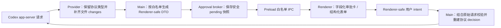

# P0-06 审批与结构化提问补全开发计划

> 计划模式：`$plan` direct mode  
> 目标条目：`docs/codex-electron-conversation-gap-checklist.md:204-224`  
> 参考实现：`reference-projects/codex-electron-26.707.72221-beautified/`  
> UI 参考：用户提供的图 1（默认态）和图 2（授权范围菜单展开态）  
> 计划状态：已实施并验证  
> 最后更新：2026-07-26

## 一、目标结果

P0-06 完成后，桌面端对所有需要用户确认的请求都应做到：

1. 用户看到的是可理解、可核对的内容，不再是原始 JSON。
2. 文件修改请求展示文件路径、增删行统计和可展开 diff，默认态和授权菜单对齐参考截图。
3. 网络请求明确展示目标域名、协议、原因和授权范围。
4. 界面只显示 app-server 当前请求真正支持的授权动作；主进程把用户选择准确转换回协议决策。
5. 结构化提问支持单选、自由文本、秘密输入、多问题表单，以及 MCP 表单中的多选、数字和布尔字段。
6. 选项值和多选数组原样返回，不把数组压成一个字符串。
7. Renderer 永远收不到完整协议参数、凭据、provider headers、provider 配置或其他未进入安全白名单的数据。
8. 刷新后仍能恢复未完成请求；主 Agent、子 Agent、MCP、网络、秘密输入场景都有自动化测试证据。

原始验收项来自 `docs/codex-electron-conversation-gap-checklist.md:206-213`。当前清单已注明只有单次、会话和 MCP 持久审批基本存在，结构化选项和多选仍会丢失，见 `docs/codex-electron-conversation-gap-checklist.md:215-220`。

## 二、范围和硬边界

### 2.1 本计划包含

- 命令执行审批。
- 文件修改审批。
- 命令触发的网络访问审批。
- `item/tool/requestUserInput` 结构化提问。
- `mcpServer/elicitation/request` 的 typed form、URL 和安全降级。
- 主 Agent、子 Agent、后台会话和刷新恢复时的请求展示。
- Provider fork、Main、Shared/Preload、Renderer 和测试矩阵的配套改动。

### 2.2 本计划不包含

- 不修改 `codex/codex-rs/app-server/`；这是仓库硬边界，见 `docs/codex-electron-conversation-gap-checklist.md:18-28`。
- 不绕过 app-server 直接调用模型或新建独立 LLM client。
- 不让 Renderer 自己解释完整 app-server 参数，也不让 Renderer 回传原始 policy 对象。
- 不为协议没有提供的操作伪造“永久允许”。界面只展示当前请求能安全映射的真实决策。
- 不把 beautified 参考项目源码直接复制进本项目；只复用其行为、信息层级和交互规则。
- 不新增 UI 或表单依赖，优先复用现有 Radix 下拉菜单、Tooltip、DiffViewer 和表单控件。

### 2.3 与 P0-02 的依赖

P0-02 已把 pending 审批/提问恢复标记为与 P0-06 共同完成，见 `.omx/plans/p0-02-active-task-reconnect-and-local-recovery.md:79`，并要求 P0-02 直接复用 P0-06 的组件而不是另建一套交互，见 `.omx/plans/p0-02-active-task-reconnect-and-local-recovery.md:373-390`。

因此本计划必须保留并加强：

- `listPendingApprovals()` 的安全快照恢复。
- settled 请求去重和关闭。
- 多个会话、多个请求同时 pending 时的独立状态。
- P0-02 恢复流程可以直接消费的稳定 Renderer DTO。

## 三、现状证据与参考结论

### 3.1 当前实现的主要缺口

| 缺口                                             | 当前证据                                                                                                                    | 计划结论                                                                 |
| ------------------------------------------------ | --------------------------------------------------------------------------------------------------------------------------- | ------------------------------------------------------------------------ |
| 原始参数直接进入 Renderer                        | `desktop-app/src/shared/codexIpcApi.ts:305-329` 的请求包含 `params: unknown`                                                | 改为按 kind 区分的安全 DTO，删除 Renderer 对 raw params 的依赖           |
| Main broker 保存并广播 raw params                | `desktop-app/src/main/codexApprovalBroker.ts:52-82`                                                                         | broker 只保存安全请求；原始请求只留在等待协议响应的闭包内                |
| UI 对大多数请求只做 JSON 格式化                  | `desktop-app/src/renderer/src/components/assistant-ui/server-request-panel.tsx:96-159`                                      | 为命令、网络、文件分别建立字段化视图                                     |
| 工具提问只支持单个文本框                         | `desktop-app/src/renderer/src/components/assistant-ui/server-request-panel.tsx:161-223`                                     | 按 questions 数组渲染，保留 options、isOther、isSecret                   |
| 问题解析丢弃 options 和多选信息                  | `desktop-app/src/renderer/src/components/assistant-ui/server-request-panel.tsx:318-336`                                     | Shared/Main 完成严格归一化，Renderer 不再从 unknown 自行猜结构           |
| file approval 参数本身没有 changes/diff          | `desktop-app/vendors/ai-sdk-provider-codex-asp/src/protocol/app-server-protocol/v2/FileChangeRequestApprovalParams.ts:5-18` | Provider 在本地把 item 通知中的 changes 合并到审批回调，不改生成协议文件 |
| 已有 pending 恢复与上下文路由                    | `desktop-app/src/renderer/src/hooks/useCodexIpcAssistantRuntime.ts:106-137`、`:211-264`                                     | 保持现有恢复行为，只替换请求 DTO 和响应 intent                           |
| 当前协议映射只覆盖粗粒度 approve/session/decline | `desktop-app/src/main/codexChatRuntimeService.ts:1921-1983`                                                                 | 增加“相似命令”和“网络规则”intent 的 Main 侧安全映射                      |

### 3.2 参考项目中应吸收的行为

参考项目只作为行为证据：

- 选项选择状态与自由文本分开保存，提交时再组合，见 `reference-projects/codex-electron-26.707.72221-beautified/webview/assets/app-initial~app-main~page-DRgkI91I.js:53688-53727`。
- 单选与多选分别使用 radio/checkbox 语义，见同文件 `:53768-53866`。
- 自由文本单独保留，见同文件 `:53869-53889`。
- 网络审批从 `networkApprovalContext` 读取 host/protocol，并展示可读目标，见同文件 `:59450-59488`。
- 主 Agent 与子 Agent 使用不同提示语，但都保留同一请求语义，见同文件 `:59523-59563`。
- 允许一次、当前会话、网络规则、相似命令等选择在回复前转换为明确协议决策，见同文件 `:59707-59777`、`:60102-60129`。
- 文件“允许所有修改”带风险说明，作用域限定为当前会话，见同文件 `:59828-59854`。
- 相似命令展示被允许的命令前缀说明，见同文件 `:59855-59889`。
- 文件审批使用专门的文件详情视图，命令审批使用可折叠等宽文本视图，见同文件 `:59902-59910`、`:59990-60074`。

### 3.3 参考截图形成的 UI 规则

文件修改审批卡需保留以下视觉层级：

- 深色大圆角容器、轻边框和阴影。
- 顶部为铅笔图标和“编辑文件”身份标签。
- 主标题为“是否允许 ChatGPT 编辑以下文件？”；子 Agent 时替换为对应执行者名称。
- 每个文件一行：目录前缀弱化、文件名强调、右侧固定 `+新增/-删除` 统计。
- 右下角为“拒绝”和一个白色主操作胶囊；主操作默认“允许一次”，同一胶囊内带下拉箭头。
- 下拉菜单在按钮上方或由 Radix 自动避让，包含“允许一次”和“允许所有修改”。
- “允许所有修改”带信息图标和 Tooltip，明确“当前会话内后续文件修改不再询问”。
- 长路径不能覆盖 diff 统计；窄窗口优先省略目录并保留文件名。
- 菜单支持点击外部关闭、方向键、Enter 和 Escape。

不要求硬编码截图像素；验收以当前设计 token 下的信息层级、布局、交互和视觉接近度为准。

## 四、目标架构



### 4.1 最重要的安全不变量

1. `params: unknown` 不再跨 Main -> Preload -> Renderer 边界。
2. Main 只发界面需要的白名单字段；未知字段默认丢弃。
3. 原始 `proposedExecpolicyAmendment`、`proposedNetworkPolicyAmendments` 等对象不由 Renderer 回传。
4. Renderer 只提交稳定的用户 intent，例如：
   - `approve-once`
   - `approve-session`
   - `approve-similar-command`
   - `apply-network-rule`
   - `approve-mcp-session`
   - `approve-mcp-always`
   - `decline`
   - `submit-tool-answers`
   - `submit-mcp-form`
5. Main 使用原始协议请求验证 intent 是否可用，再构造 app-server 需要的精确 decision。伪造、过期或不支持的 intent 必须拒绝。
6. 秘密答案只存在于当前 Renderer 组件状态和一次 IPC response 中，不进入 pending 快照、日志、诊断、localStorage 或错误文案。

### 4.2 Renderer-safe 请求模型

在 `desktop-app/src/shared/codexApprovalApi.ts` 新增并由 `codexIpcApi.ts` 引用的 discriminated union，至少包含：

- 通用字段：`id`、`kind`、`createdAt`、`context`、`sourceLabel?`、`availableActions`。
- `command`：
  - `commandText`
  - `cwd?`
  - `reason?`
  - `networkTarget?`
  - `requestedScopes?`
- `file-change`：
  - `reason?`
  - `files: Array<{ path, kind, patch?, additions, deletions }>`
- `tool-user-input`：
  - `questions: Array<{ id, header, prompt, isOther, isSecret, options }>`
  - option 使用 `{ value, label, description? }`；当前协议只有 label/description 时，`value = label`
  - `autoResolutionMs?`
- `mcp-elicitation`：
  - `serverName`
  - `message`
  - `mode`
  - typed form 时为安全字段数组
  - URL 模式时只包含通过 `http/https` 校验的 URL

`context` 继续保留 thread/turn/host/cwd 等路由信息，但不承载凭据和 provider 配置。

### 4.3 文件 diff 的数据来源

`FileChangeRequestApprovalParams` 没有 diff，而 file item 的 `changes` 才有 path/kind/diff。Provider fork 已能订阅所有通知，见 `desktop-app/vendors/ai-sdk-provider-codex-asp/src/client/app-server-client.ts:249-256`。

计划在 `ApprovalsDispatcher` 内增加短生命周期缓存：

- 监听 `item/started`，保存 fileChange item 的 `changes`。
- 监听 `item/fileChange/patchUpdated`，更新同一 item 的 changes。
- `item/fileChange/requestApproval` 到来时，用 `threadId + turnId + itemId` 合并 changes 到 provider 自己定义的 enriched callback type。
- `item/completed`、请求结束、dispatcher detach 时清理缓存。
- 生成的 `src/protocol/app-server-protocol/**` 文件保持只读。
- 缓存 miss 时界面明确显示“暂未收到可展示的 diff”，并只保留安全操作；正常事件顺序必须通过测试保证文件列表和 diff 可见。

### 4.4 不同提问协议的职责

- `item/tool/requestUserInput`
  - 支持单选、自由文本、secret 和多问题。
  - 选择结果始终是 `answers: string[]`。
  - 当前协议没有独立 option value 时，使用 option label 作为 wire value，不再二次本地化后回传。
- MCP typed `mode: "form"`
  - 根据 `McpElicitationSchema` 支持 string、number/integer、boolean、单选 enum 和 array 多选 enum。
  - 其协议能力由 `desktop-app/vendors/ai-sdk-provider-codex-asp/src/protocol/app-server-protocol/v2/McpElicitationSchema.ts:7-13` 及相关 primitive schema 定义。
  - 多选必须返回数组；数字和布尔保持原类型。
- MCP `mode: "url"`
  - 显示 server、message 和安全 URL，复用现有外链白名单打开能力。
  - 非 `http/https` URL 不可点击，并给出可理解的拒绝/不支持状态。
- MCP `mode: "openai/form"`
  - `requestedSchema` 是任意 JSON，见 `McpServerElicitationRequestParams.ts:7-16`。
  - P0-06 不直接把任意 JSON 发给 Renderer。仅当 Main 能转换成同一安全字段 DTO 时渲染；否则 fail closed，展示“不支持的表单格式”，只允许拒绝。

## 五、可测试验收标准

### AC-01：命令审批可读

- 命令卡显示一段可复制的等宽命令文本、cwd 和审批原因，不出现 `Parameters` 原始 JSON 区块。
- 长命令默认收起，用户可展开/收起；换行命令保持换行，不用简单空格拼接破坏语义。
- Renderer 收到的数据中不存在完整 raw params。

### AC-02：文件列表与 diff

- 正常 fileChange 审批至少显示 1 个文件行、路径、变更类型、准确的新增/删除行数。
- 点击文件行可展开 `DiffViewer`；多个文件可独立展开。
- add/delete/update 三类都能生成可读 diff。
- 长路径省略目录而保留文件名，统计固定在右侧，不互相覆盖。
- 如果确实缺少 diff，显示明确降级文案，不能回退成 JSON。

### AC-03：文件审批 UI 对齐截图

- 默认态包含“编辑文件”、主问题、文件行、“拒绝”、“允许一次”和下拉箭头。
- 下拉菜单包含“允许一次”和“允许所有修改”；只有协议允许 session scope 时才展示后者。
- Tooltip 准确说明“允许所有修改”只作用于当前会话。
- 菜单可通过鼠标、方向键、Enter、Escape 操作；外部点击关闭。
- 360px 级窄容器不横向溢出，按钮可换行但仍保持可点击面积。

### AC-04：网络审批信息完整

- 网络卡显示 `protocol://host`、请求原因、当前目标范围和可用规则范围。
- 目标链接只允许 `http/https`，由 Main/现有外链安全逻辑校验。
- 若请求提供 network policy amendment，菜单显示其 host/action 的人类可读说明。
- Renderer 不能修改或注入任意 host/action；只提交 `apply-network-rule` intent。

### AC-05：授权范围映射准确

- `approve-once` -> `accept`。
- `approve-session` -> `acceptForSession`。
- `approve-similar-command` 只在原请求有合法 exec policy amendment 时出现，并由 Main 构造 `{ acceptWithExecpolicyAmendment: ... }`。
- `apply-network-rule` 只在原请求有合法 network amendment 时出现，并由 Main 构造 `{ applyNetworkPolicyAmendment: ... }`。
- MCP session/always 保持当前 `_meta.persist` 行为。
- 过期 request ID、重复提交、伪造 intent 和请求不支持的 intent 都不会执行。

### AC-06：Tool User Input 保真

- 一次请求可同时展示 1 至 3 个问题。
- 有 options 的普通问题使用单选控件；`isOther` 同时提供自由文本。
- 无 options 的问题使用自由文本；`isSecret` 使用密码输入并有无障碍 label。
- 提交结果以 question id 为 key，每个回答保持 `string[]`。
- 选择项使用协议 option label/value，不把描述文本当作 value。
- 未回答 required 问题时禁止提交；拒绝/取消不会发送部分答案。

### AC-07：MCP typed form 保真

- string、integer/number、boolean、单选 enum、多选 enum 可在同一个多问题表单中提交。
- 多选 enum 返回 `string[]`，number 返回 number，boolean 返回 boolean，不统一转成字符串。
- required、默认值、min/max、minLength/maxLength 在 Renderer 和 Main 两侧都验证。
- 不受支持的 `openai/form` schema 不进入 Renderer 原始展示，且不能被接受。

### AC-08：秘密输入不泄漏

- 密码输入 DOM 为 `type="password"`，未提交内容不会出现在 pending snapshot。
- Main/Renderer 的错误、debug 日志、测试快照和 serialized approval request 都不包含秘密答案。
- 请求 settled、取消、切换或组件卸载后，表单状态被清空。

### AC-09：主 Agent、子 Agent和后台会话

- 主 Agent 请求显示当前会话名称。
- 子 Agent 请求保留它自己的 thread/turn/item 上下文，并显示可识别的来源；无法取得名称时使用“子 Agent”安全回退。
- 非当前会话的审批不会串到当前会话，也不会因 UI filter 被永久丢弃。
- 同时出现两个不同会话请求时，各自 busy/error/answer 状态互不影响。

### AC-10：刷新恢复与终态

- 刷新后通过 `listPendingApprovals()` 恢复同一安全 DTO。
- settled 通知只移除对应请求；重复通知不会报错。
- run stop、失败、崩溃、超时继续沿用现有 broker 清理语义。
- 恢复的 secret 请求只有问题元数据，不恢复用户未提交的秘密内容。

### AC-11：Renderer 安全边界

- 对四类请求做序列化断言：IPC payload 中不包含 `apiKey`、`Authorization`、provider headers、完整 provider config、未知 `_meta` 或测试注入的 secret sentinel。
- Preload 仍只暴露 `listPendingApprovals`、`respondApproval` 和 approval events；Renderer 不新增 Node/Electron 直连。
- Main 对 Renderer response 做 Zod 校验和原请求二次校验。

### AC-12：自动化覆盖

- Provider unit：文件 changes 合并、缓存生命周期、全部协议 decision。
- Main unit：安全 DTO、敏感字段剔除、intent -> decision、恢复/settle。
- Renderer unit：命令、文件、网络、结构化问答、MCP、secret、键盘操作和窄屏。
- Integration/mock E2E：主 Agent 命令、子 Agent、文件 diff、网络规则、MCP 多选和秘密输入。
- 现有 D12-D18 approval retry/stop/crash 测试继续通过。

## 六、实施步骤

### Step 1：先锁定现有行为和安全契约

**目的：** 在改请求模型前，保护现有 pending、超时、终态清理和 IPC 白名单行为。

**涉及文件：**

- `desktop-app/src/main/codexApprovalBroker.test.ts:1`
- `desktop-app/src/main/approvals/ApprovalCoordinator.test.ts:1`
- `desktop-app/src/renderer/src/hooks/useCodexIpcAssistantRuntime.test.ts:1`
- `desktop-app/src/renderer/src/components/assistant-ui/server-request-panel.test.tsx:1`
- `desktop-app/src/App.test.tsx:4674-4743`

**工作项：**

1. 为现有四类请求补最小回归 fixture，记录 request/reply/pending/settled 行为。
2. 增加同时 pending 两个请求、重复 settled、刷新补拉快照的测试。
3. 增加 sentinel 敏感字段测试，先证明当前 raw params 会穿透，再让后续安全 DTO 修复该测试。
4. 保持现有 D15 终态拒绝测试语义，见 `desktop-app/src/main/codexChatRuntimeService.test.ts:4148`。

**完成判据：** 测试能在旧实现上暴露 raw params 和结构化字段丢失，在既有可靠性行为上保持绿色。

### Step 2：Provider 补齐文件审批的 changes

**目的：** 在不改 app-server 和生成协议文件的前提下，为 file approval 提供 UI 所需的文件列表和 diff。

**涉及文件：**

- `desktop-app/vendors/ai-sdk-provider-codex-asp/src/approvals.ts:1-124`
- `desktop-app/vendors/ai-sdk-provider-codex-asp/src/client/app-server-client.ts:249-256`
- `desktop-app/vendors/ai-sdk-provider-codex-asp/src/protocol/app-server-protocol/v2/ThreadItem.ts:29-59`（只读证据）
- `desktop-app/vendors/ai-sdk-provider-codex-asp/src/protocol/app-server-protocol/v2/FileUpdateChange.ts:1`（只读证据）
- `desktop-app/vendors/ai-sdk-provider-codex-asp/tests/approvals.test.ts:8-173`

**工作项：**

1. 把 `CodexFileChangeApprovalRequest` 从协议 type alias 改成 provider 自己的 enriched type：保留原参数并增加只读 `changes`。
2. `ApprovalsDispatcher.attach()` 在注册 approval request 之前注册 item 通知监听。
3. 按 `threadId/turnId/itemId` 缓存 file item changes，接收 patchUpdated 时覆盖更新。
4. file approval handler 调用时合并缓存快照；完成、取消、detach 时清理。
5. 补齐事件顺序、patchUpdated、多个 item 隔离、cache miss 和 detach 清理测试。
6. 不改 `src/protocol/app-server-protocol/**` 任何生成文件。

**完成判据：** Provider unit 中 file approval callback 能拿到 path/kind/diff，且不存在跨 turn 泄漏或遗留缓存。

### Step 3：建立 Renderer-safe Shared DTO

**目的：** 从类型和运行时 schema 两层移除 `params: unknown`。

**涉及文件：**

- `[新增] desktop-app/src/shared/codexApprovalApi.ts`
- `desktop-app/src/shared/codexIpcApi.ts:305-420`
- `desktop-app/src/shared/codexIpcApi.test.ts` 或现有 shared schema 测试文件
- `desktop-app/src/preload/index.ts:38-72`

**工作项：**

1. 定义按 kind 区分的 safe request union、available action union 和 safe response intent union。
2. 为 MCP 表单内容定义允许的 primitive：`string | number | boolean | string[]`，不接受任意对象嵌套。
3. 为所有 union 建立 Zod schema，并让 TypeScript 类型由 schema 对齐。
4. `CodexApprovalRequest` 不再包含 raw `params`。
5. `CodexApprovalResponse` 不再使用含糊的 approve/session 字符串组合，而是明确 intent。
6. Preload API 名称和白名单边界保持不变，只更新类型。
7. 添加 unknown 字段剔除、非法 action、非法 URL、非法 MCP value 和敏感 sentinel 测试。

**完成判据：** Renderer 编译期和运行时都无法读取 raw params；所有 IPC payload 可被 schema 严格验证。

### Step 4：Main 负责安全归一化与决策重建

**目的：** Main 成为协议参数与 UI 模型之间唯一的安全适配层。

**涉及文件：**

- `[新增] desktop-app/src/main/approvals/rendererApprovalAdapter.ts`
- `desktop-app/src/main/approvals/ApprovalCoordinator.ts:21-80`
- `desktop-app/src/main/codexApprovalBroker.ts:21-116`
- `desktop-app/src/main/codexChatRuntimeService.ts:1921-1983`
- `desktop-app/src/main/codexChatRuntimeService.ts:2386`
- `desktop-app/src/main/index.ts:432-484`
- 配套 `*.test.ts`

**工作项：**

1. 在 runtime 的四类 handler 中，用原始请求生成 safe DTO 后再调用 broker。
2. broker pending map 只保存 safe DTO；ApprovalCoordinator 只处理 safe context。
3. command normalizer：
   - 保留可读 command、cwd、reason。
   - 提取安全的 host/protocol、额外权限摘要和可用动作。
   - 不传完整 policy amendment；只传人类可读 scope 摘要。
4. file normalizer：
   - 将 provider enriched changes 转为 path/kind/patch/stats。
   - 统计逻辑与 DiffViewer 解析结果保持一致。
5. tool input normalizer：
   - 保留 id/header/question/options/isOther/isSecret。
   - option value 使用协议 label，description 仅用于说明。
6. MCP normalizer：
   - 将 typed schema 转为扁平安全字段 DTO。
   - `openai/form` 只有在严格支持的 subset 内才转换。
   - URL 仅允许 http/https。
7. 用户 intent 返回后，结合闭包内原始请求重建协议 decision；每个动作先检查其先决字段。
8. 处理过期、重复、伪造和与 kind 不匹配的 response。
9. 任何异常都只输出 request id/kind/context，不序列化 raw params 或用户 secret。

**完成判据：** Main unit 对每种输入都证明“安全展示字段正确、协议回复正确、敏感字段不存在”。

### Step 5：拆分并重做审批卡和结构化表单

**目的：** 让 UI 对齐参考截图和参考项目的信息层级，同时避免继续扩大单一组件。

**涉及文件：**

- `desktop-app/src/renderer/src/components/assistant-ui/server-request-panel.tsx:17-336`
- `[新增] desktop-app/src/renderer/src/components/assistant-ui/approval-request-card.tsx`
- `[新增] desktop-app/src/renderer/src/components/assistant-ui/structured-request-form.tsx`
- `[新增] desktop-app/src/renderer/src/components/assistant-ui/file-change-approval.tsx`
- `desktop-app/src/renderer/src/components/assistant-ui/tool-fallback.tsx:306-404`
- `desktop-app/src/renderer/src/components/assistant-ui/diff-viewer.tsx:82-109`
- `desktop-app/src/renderer/src/components/ui/dropdown-menu.tsx:5-75`
- `desktop-app/src/renderer/src/components/ui/tooltip.tsx:2-55`
- `desktop-app/src/renderer/src/components/ui/file-path.tsx:3-28`

**工作项：**

1. `server-request-panel.tsx` 只保留请求列表、来源标题、busy/error 和 kind dispatch。
2. `approval-request-card.tsx` 负责命令和网络：
   - 等宽命令预览。
   - 长文本折叠。
   - 网络目标、原因、scope 摘要。
3. `file-change-approval.tsx` 负责截图对应布局：
   - 路径前缀弱化、basename 强调。
   - diff stats 固定右对齐。
   - 文件行展开 DiffViewer。
   - 拒绝 + 白色主操作胶囊 + DropdownMenu。
   - session action Tooltip。
4. 把 `tool-fallback.tsx` 中通用的 file patch 归一化和 file diff viewer 抽成可复用 helper/component，工具结果和审批共用，不复制实现。
5. `structured-request-form.tsx`：
   - Tool User Input 使用 radio、文本、password 和多问题布局。
   - MCP typed form 使用 radio、checkbox、文本、数字、布尔控件。
   - required、默认值和校验错误就地显示。
6. 响应过程中仅当前卡进入 busy；其它 pending 卡可继续操作。
7. 所有控件补 accessible name、role、aria-checked、错误关联和键盘行为。
8. 删除 `formatUnknown()` 和 Renderer 侧 `readToolUserInputQuestions(params: unknown)`。

**完成判据：** 组件测试覆盖两张参考截图的默认/展开状态和所有表单类型，界面不再出现 raw JSON 参数区块。

### Step 6：接回会话路由、子 Agent 与恢复链路

**目的：** 保证新 DTO 不破坏现有多会话与 pending 恢复。

**涉及文件：**

- `desktop-app/src/renderer/src/hooks/useCodexIpcAssistantRuntime.ts:72-137`
- `desktop-app/src/renderer/src/hooks/useCodexIpcAssistantRuntime.ts:211-264`
- `desktop-app/src/App.tsx:588-618`
- `desktop-app/src/main/codexApprovalBroker.ts:52-116`
- `desktop-app/src/main/approvals/ApprovalCoordinator.ts:30-80`

**工作项：**

1. hook 中 request map 改用 safe union，保留 snapshot replay 和 settled 去重。
2. active request 与后台 request 的 attention indicator 继续按 threadId 路由。
3. 使用现有会话目录/标题解析来源；child thread 能命中时显示子 Agent 名称，不能命中时显示“子 Agent”+短 thread id。
4. `App.tsx` 继续只在当前会话把请求作为 blocking 状态；后台请求只提示，不阻断错误会话。
5. 重新加载时恢复表单问题和选项，但不恢复任何未提交本地答案。
6. 验证 P0-02 可以复用同一个 pending snapshot 和 UI 组件。

**完成判据：** 主/子/后台会话的请求不会串线；刷新恢复后仍能正确提交或拒绝。

### Step 7：补齐分层自动化测试

**Provider unit：**

- `desktop-app/vendors/ai-sdk-provider-codex-asp/tests/approvals.test.ts`
  - command network context。
  - file item/started + requestApproval 合并。
  - patchUpdated 覆盖。
  - tool options/secret/multi-question 原样透传。
  - MCP typed form。
  - exact decisions。

**Main unit/integration：**

- `desktop-app/src/main/codexChatRuntimeService.test.ts`
- `desktop-app/src/main/codexApprovalBroker.test.ts`
- `[新增] desktop-app/src/main/approvals/rendererApprovalAdapter.test.ts`
  - safe DTO 快照。
  - 敏感字段 sentinel。
  - action gating。
  - intent -> exact protocol decision。
  - MCP 多选/数字/布尔保真。
  - secret 无日志。
  - main/sub-agent context。

**Renderer unit：**

- `desktop-app/src/renderer/src/components/assistant-ui/server-request-panel.test.tsx`
- 新组件对应测试。
- `desktop-app/src/renderer/src/hooks/useCodexIpcAssistantRuntime.test.ts`
- `desktop-app/src/App.test.tsx`
  - 文件默认态/菜单展开态。
  - 长路径和多文件。
  - 命令折叠。
  - 网络 scope。
  - tool 单选/Other/secret/多问题。
  - MCP 多选表单。
  - 键盘与无障碍。
  - concurrent pending。
  - snapshot replay。

**Mock E2E：**

- `desktop-app/tests/e2e/approvals.e2e.ts`
- `desktop-app/tests/e2e/support/mockBackend.ts`
  - 主 Agent 命令允许/拒绝。
  - 文件修改显示实际 path/diff/stats，并测试允许一次/当前会话。
  - 网络显示 host/reason，并验证网络规则 decision。
  - secret 输入不出现在可见文本、trace 和 pending snapshot。
  - 子 Agent approval 按 child thread 路由。
  - MCP 多选返回数组。
  - 现有 reload/stop/crash/retry 流程保持。

**测试矩阵：**

- `docs/test-plan.md`
- `desktop-app/tests/test-plan-coverage.json`
  - 该矩阵只接受固定的 A-G、M、R 场景主键，因此将 P0-06 可靠性证据映射到既有 D12-D18 和 M11；不新增 CI 不识别的 ID。
  - 只有在测试文件、完整 test name 和断言都存在后才标记 covered。
  - P0 不得 deferred，遵守 `docs/test-plan.md:21` 的机器矩阵规则。

**完成判据：** AC-01 至 AC-12 均能对应到至少一个自动化测试名称。

### Step 8：文档、清单和最终回归

**涉及文件：**

- `docs/ai-sdk-provider-codex-asp-api.md:741-780`
- `docs/codex-app-server-official-notes.md:515-548`
- `docs/codex-electron-conversation-gap-checklist.md:204-224`

**工作项：**

1. 更新 provider 审批 callback 文档，记录 enriched file request 和 decision object 的准确形状。
2. 更新桌面审批安全边界：Renderer-safe DTO、Main 决策重建、秘密输入生命周期。
3. 记录 MCP typed form 支持范围和 `openai/form` 安全降级。
4. 所有 AC 和自动化测试通过后，才把 P0-06 清单项和状态改为完成，并附文件/测试证据。
5. 若某个协议分支仍不支持，清单保持部分实现并写出明确 blocker，不能用 UI 占位代替完成。

## 七、建议的提交顺序

1. **Provider file approval enrichment**
   - changes 缓存、enriched callback、provider tests。
2. **Safe approval IPC contract**
   - Shared DTO、Main adapter、intent mapping、安全测试。
3. **Reference-aligned approval UI**
   - 命令/网络/文件卡、结构化表单、组件测试。
4. **Recovery, E2E and documentation**
   - 多会话/子 Agent/刷新恢复、mock E2E、测试矩阵和清单。

每个提交都应独立通过自己的 targeted tests，避免 UI 与协议大改无法定位回归。

## 八、风险与缓解

| 风险                                   | 影响                       | 缓解                                                                                   |
| -------------------------------------- | -------------------------- | -------------------------------------------------------------------------------------- |
| file approval 到达时缓存尚无 changes   | 无法展示文件列表/diff      | 先注册通知监听；测试真实事件顺序和 patchUpdated；cache miss 显式降级且不展示宽范围授权 |
| Renderer intent 与原协议可用决策不一致 | 可能执行过宽授权           | Main 保存原始请求闭包并二次校验；UI action 从原始请求能力派生                          |
| “当前会话”“相似命令”“永久允许”标签混淆 | 用户误判授权范围           | 每个 action 带 scope 文案和 Tooltip；协议不支持时不展示                                |
| secret 被日志、错误或恢复状态捕获      | 高安全风险                 | safe DTO 不含答案；日志只记 id/kind；secret sentinel 测试覆盖序列化和 E2E              |
| arbitrary `openai/form` schema 穿透    | Renderer 接触未知/敏感数据 | 只支持严格 subset；不能转换则 fail closed，不展示原 JSON                               |
| 新组件与 tool fallback 复制 diff 逻辑  | 统计不一致、维护成本增加   | 抽取现有 patch normalizer/diff component，审批与 tool result 共用                      |
| 子 Agent 请求缺少友好名称              | 用户不知道请求来源         | 优先复用现有会话/agent registry；无映射时使用明确安全回退，不丢请求                    |
| 更新 DTO 破坏 pending recovery         | 刷新后审批丢失             | Step 1 先锁定 snapshot/settled 行为；Step 6 专门回归 P0-02 复用                        |
| 大范围改动使回归定位困难               | 难以审查和回滚             | 按 Provider -> Safe contract -> UI -> E2E 分提交，先基础协议再视觉                     |

## 九、验证命令

按改动层从小到大执行，任何一步失败都先修复再继续：

```bash
npm --prefix desktop-app/vendors/ai-sdk-provider-codex-asp test -- approvals.test.ts
npm --prefix desktop-app/vendors/ai-sdk-provider-codex-asp run lint
npm --prefix desktop-app/vendors/ai-sdk-provider-codex-asp run typecheck

npm --prefix desktop-app test -- codexApprovalBroker
npm --prefix desktop-app test -- rendererApprovalAdapter
npm --prefix desktop-app test -- server-request-panel
npm --prefix desktop-app test -- useCodexIpcAssistantRuntime
npm --prefix desktop-app run lint
npm --prefix desktop-app run typecheck
npm --prefix desktop-app test

npm --prefix desktop-app run test:e2e -- approvals.e2e.ts --reporter=line
npm --prefix desktop-app run test:e2e -- --reporter=line
```

如项目脚本不支持把测试文件名直接附在 `npm test --` 后，实施时先查看 `package.json` 的实际 test script，再用对应 Vitest/Playwright 过滤参数；不要为了运行单测改测试脚本。

## 十、完成定义

只有同时满足以下条件，P0-06 才可标记完成：

- AC-01 至 AC-12 全部有自动化证据。
- Provider lint、typecheck、tests 全绿。
- Desktop lint、typecheck、tests 全绿。
- approvals mock E2E 和完整 E2E 全绿。
- 两张参考截图对应的文件审批默认态和菜单展开态通过人工截图核对。
- Renderer IPC 安全测试证明 raw params、凭据、provider 配置和 secret 不会泄漏。
- P0-02 pending 恢复没有回归。
- `docs/test-plan.md`、机器矩阵、provider/API 文档和 P0-06 checklist 已同步更新。
- `codex/codex-rs/app-server/` 没有任何改动。

## 十一、实施结果（2026-07-26）

- Provider 在接到文件审批前缓存同一 `threadId/turnId/itemId` 的 file-change 内容，并在 item/turn 完成或 transport 释放时清理；审批回调因而可得到文件列表与 diff。
- Main/Shared 只把白名单 DTO 发送给 Renderer。命令的相似操作和网络规则由 Main 持有原始候选 decision 并按 request ID 精确还原；MCP typed form 保留数组、数字和布尔值。
- Renderer 已采用参考项目的深色圆角审批卡信息层级：文件审批含“编辑文件”、文件行、增删统计、`拒绝`、`允许一次` 和带“允许所有修改”的菜单；命令、网络、tool user input、MCP form/URL 均有专用面板，不再展示原始 JSON。
- 已通过 provider 单测、Desktop 聚焦单测、类型检查、生产构建、D12-D18 审批 Mock E2E，以及文件 diff、网络、秘密输入、MCP typed form 的 P0-06 专项协议 Mock E2E；详情见 `docs/test-plan.md` 的 P0-06 证据段。
