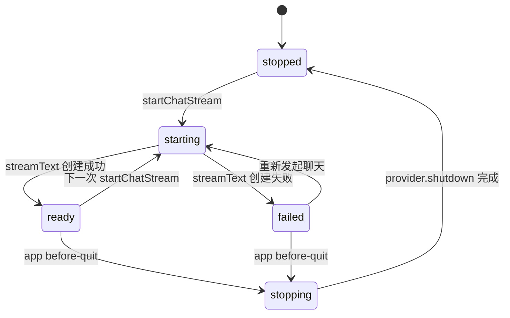
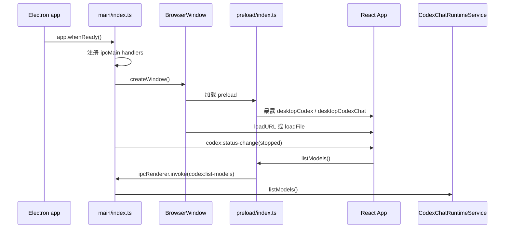
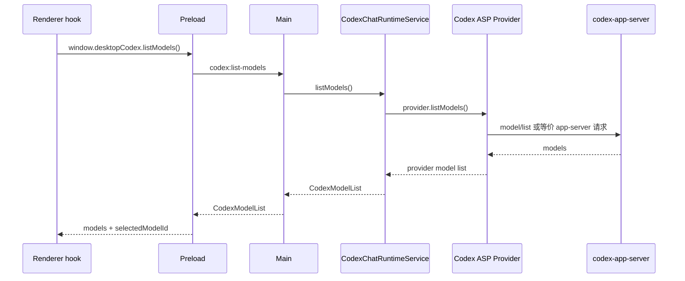
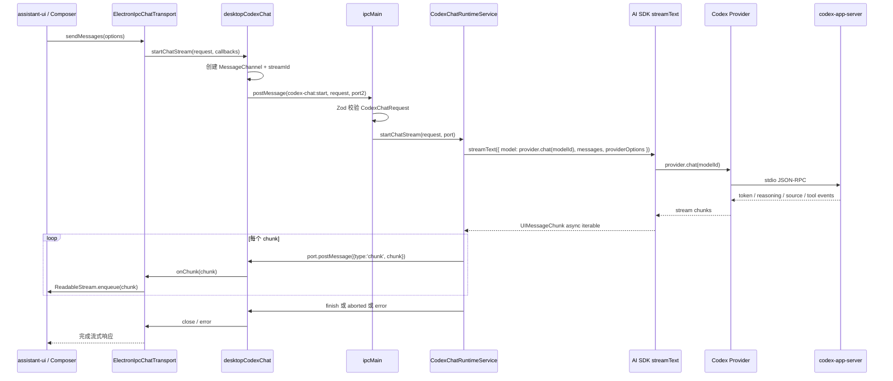
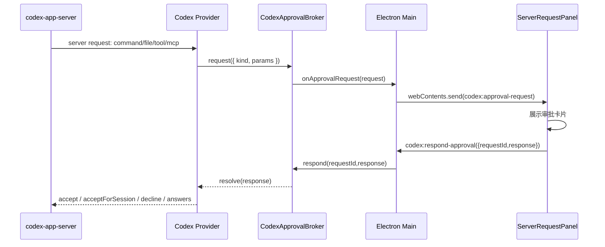
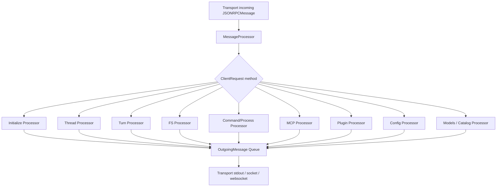
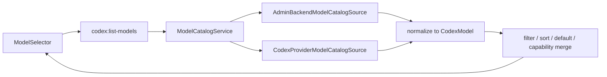

# dasCowork 架构说明

> 基于 `dasCowork.zip` 的静态代码分析生成。分析范围覆盖 `desktop-app` 与 `codex` 两个主要工程。未实际启动应用、执行端到端对话或完成跨平台打包验证。

## 1. 总览

`dasCowork` 当前由两个顶层工程组成：

| 顶层目录 | 定位 | 主要职责 |
| --- | --- | --- |
| `desktop-app/` | Electron + React 桌面端 | 提供聊天 UI、模型选择、审批交互、Electron 主进程、Preload 安全桥、对 Codex app-server 的本地启动与流式调用。 |
| `codex/` | Rust Codex 工作区 + CLI/SDK/文档 | 提供 `codex-app-server`、核心代理能力、模型管理、会话线程、文件/命令/MCP/插件/沙箱等底层能力。 |

整体架构可以理解为：

1. **Renderer 层**负责交互界面，使用 `assistant-ui`、AI SDK React runtime 和自定义 `ElectronIpcChatTransport`。
2. **Preload 层**通过 `contextBridge` 暴露有限 API，隔离 Renderer 与 Electron 主进程能力。
3. **Electron Main 层**负责窗口、菜单、外链、安全校验、IPC 注册，以及 `CodexChatRuntimeService` 生命周期。
4. **Codex Runtime 层**通过 `@janole/ai-sdk-provider-codex-asp` 启动并复用本地 `codex-app-server` 进程。
5. **Rust app-server 层**通过 `stdio://` 传输 JSON-RPC 风格消息，向桌面端提供模型列表、线程、Turn、审批、工具调用等能力。

## 2. 项目目录结构

```text
dasCowork/
├── desktop-app/
│   ├── src/
│   │   ├── main/                 # Electron 主进程
│   │   ├── preload/              # contextBridge 与 IPC bridge
│   │   ├── renderer/             # React / assistant-ui 前端
│   │   └── shared/               # 主进程、preload、renderer 共享类型与 Zod schema
│   ├── scripts/                  # 构建 codex-app-server 等脚本
│   ├── resources/                # Electron 资源
│   ├── electron-builder.yml      # 桌面端打包配置
│   ├── electron.vite.config.ts   # Electron Vite 配置
│   └── package.json
│
└── codex/
    ├── codex-cli/                # npm CLI 包入口
    ├── codex-rs/                 # Rust workspace
    │   ├── app-server/           # codex-app-server 二进制与服务实现
    │   ├── app-server-protocol/  # app-server 协议类型
    │   ├── app-server-transport/ # stdio / unix / websocket transport
    │   ├── core/                 # Codex 核心代理能力
    │   ├── model-provider/       # 模型 provider 抽象
    │   ├── models-manager/       # 模型列表与模型管理
    │   ├── thread-store/         # 会话线程存储
    │   ├── tui/                  # 终端 UI
    │   ├── cli/                  # Rust CLI
    │   └── ...                   # MCP、插件、文件系统、沙箱、工具等模块
    ├── sdk/
    ├── docs/
    └── tools/
```

## 3. 技术栈

### 3.1 桌面端

| 类别 | 使用技术 | 说明 |
| --- | --- | --- |
| 桌面壳 | Electron `^39.2.6` | 主进程创建窗口、管理 IPC、打开外链、控制应用生命周期。 |
| 构建 | electron-vite、Vite、TypeScript | `main`、`preload`、`renderer` 分别构建。 |
| 前端 | React `^19.2.1` | 渲染聊天界面与辅助 UI。 |
| 聊天运行时 | AI SDK `^6.0.213`、`@ai-sdk/react`、`@assistant-ui/react-ai-sdk` | 将 UI 消息、流式 chunk 与 assistant-ui runtime 打通。 |
| UI | `@assistant-ui/react`、Lexical、Streamdown、Tailwind CSS 4、Radix、lucide-react | 对话线程、输入框、模型选择、Markdown/代码/数学/mermaid/CJK 渲染。 |
| Codex Provider | `@janole/ai-sdk-provider-codex-asp` | AI SDK provider，内部连接 `codex-app-server`。 |
| 校验 | Zod 4 | IPC 入参和共享数据结构校验。 |
| 测试 | Vitest + jsdom | 覆盖主进程服务、IPC transport、窗口配置、主题、UI 等。 |

### 3.2 Codex Rust 工作区

| 类别 | 代表模块 | 说明 |
| --- | --- | --- |
| app-server | `codex-rs/app-server` | `codex-app-server` 二进制；处理客户端请求、管理线程、Turn、审批、工具与通知。 |
| 协议 | `app-server-protocol` | 定义 Client Request、Server Request、Notification、JSON-RPC message 类型。 |
| 传输 | `app-server-transport` | 支持 `stdio://`、`unix://`、`ws://IP:PORT`、`off`。桌面端当前使用 `stdio://`。 |
| 核心代理 | `core`、`protocol`、`core-api` | Codex 核心对话、执行、计划、推理、工具协议。 |
| 模型 | `model-provider`、`models-manager`、`model-provider-info` | 模型提供方、模型列表、模型能力与模型管理。 |
| 工具与系统能力 | `tools`、`file-system`、`file-watcher`、`exec-server`、`mcp-server`、`sandboxing` | 文件读写、命令执行、MCP、插件、沙箱等。 |
| 状态 | `state`、`thread-store`、`config`、`login` | 本地状态、会话存储、配置、登录认证。 |

## 4. 逻辑架构图

```mermaid
flowchart LR
  U[用户] --> R[Renderer\nReact / assistant-ui]
  R -->|window.desktopCodex\nwindow.desktopCodexChat| P[Preload\ncontextBridge]
  P -->|ipcRenderer.invoke\nipcRenderer.postMessage + MessagePort| M[Electron Main]
  M --> W[BrowserWindow / Menu / shell]
  M --> RTS[CodexChatRuntimeService]
  RTS --> AB[CodexApprovalBroker]
  RTS --> ASP[@janole/ai-sdk-provider-codex-asp]
  ASP -->|stdio JSON-RPC| AS[codex-app-server\nRust binary]
  AS --> PROTO[app-server-protocol]
  AS --> CORE[codex-core]
  AS --> MP[model-provider / models-manager]
  AS --> TOOLS[tools / fs / mcp / plugins / sandbox]
  AS --> STATE[thread-store / state / config]
  AB -->|approval request| M
  M -->|webContents.send| R
  R -->|respondApproval| P
  P -->|ipcRenderer.invoke| M
  M --> AB
```

## 5. 桌面端分层说明

### 5.1 Renderer：React 聊天界面

关键文件：

| 文件 | 职责 |
| --- | --- |
| `desktop-app/src/renderer/src/App.tsx` | 应用主界面；组合 sidebar、header、chat thread、composer、模型选择器和审批面板。 |
| `desktop-app/src/renderer/src/hooks/useCodexIpcAssistantRuntime.ts` | 连接桌面 IPC API、获取模型列表、监听审批请求、创建 AI SDK runtime。 |
| `desktop-app/src/renderer/src/lib/ElectronIpcChatTransport.ts` | 实现 AI SDK `ChatTransport<UIMessage>`，把聊天请求转为 preload 暴露的流式 IPC 调用。 |
| `desktop-app/src/renderer/src/components/assistant-ui/model-selector.tsx` | 模型选择 UI。 |
| `desktop-app/src/renderer/src/components/assistant-ui/server-request-panel.tsx` | 命令、文件变更、工具输入、MCP elicitation 等审批请求 UI。 |
| `desktop-app/src/renderer/src/lib/systemTheme.ts` | 监听系统主题并设置 UI 状态。 |

Renderer 不直接使用 Node/Electron 能力，而是通过 `window.desktopCodex` 与 `window.desktopCodexChat` 访问受控能力。

### 5.2 Preload：安全桥与流式通道

关键文件：`desktop-app/src/preload/index.ts`

Preload 暴露两个 API：

```ts
window.desktopCodex
window.desktopCodexChat
```

`desktopCodex` 使用 `ipcRenderer.invoke` 对应一次性请求：

| API | Main IPC Channel | 说明 |
| --- | --- | --- |
| `getStatus()` | `codex:get-status` | 获取 Codex runtime 状态。 |
| `listModels()` | `codex:list-models` | 获取模型列表与当前选中模型。 |
| `setSelectedModel(modelId)` | `codex:set-selected-model` | 设置当前模型。 |
| `respondApproval(requestId, response)` | `codex:respond-approval` | 回复审批请求。 |
| `openExternalHttpUrl(url)` | `codex:open-external-http-url` | 打开外部 HTTP/HTTPS 链接。 |
| `onStatusChange(callback)` | `codex:status-change` | 订阅 runtime 状态变更。 |
| `onApprovalRequest(callback)` | `codex:approval-request` | 订阅 app-server 发来的用户审批请求。 |

`desktopCodexChat` 使用 `MessageChannel` 承载流式消息：

1. Renderer 调用 `startChatStream(request, callbacks)`。
2. Preload 创建 `MessageChannel`，将 `port2` 通过 `ipcRenderer.postMessage('codex-chat:start', request, [port2])` 发送给 Main。
3. Main 将 chunk、finish、aborted、error 等事件写入 port。
4. Renderer 侧 `ElectronIpcChatTransport` 将这些事件转换为 `ReadableStream<UIMessageChunk>`。
5. 中止时，Renderer/AI SDK 的 `AbortSignal` 会调用 `abortChatStream(streamId)`，Preload 通过 port 发送 `{ type: 'abort' }`。

### 5.3 Shared：IPC 契约

关键文件：`desktop-app/src/shared/codexIpcApi.ts`

该文件定义跨进程共享类型与 Zod schema：

| 类型 | 说明 |
| --- | --- |
| `CodexStatus` | Runtime 状态：`stopped`、`starting`、`ready`、`stopping`、`failed`。 |
| `CodexModel` / `CodexModelList` | 模型列表、默认模型、模型输入模态、不可用原因。 |
| `CodexChatRequest` | UI chat 请求，包含 chatId、trigger、messages、modelId、metadata、body。 |
| `CodexChatStreamEvent` | Main 到 Renderer 的流式事件：`chunk`、`finish`、`aborted`、`error`。 |
| `CodexApprovalRequest` | app-server 需要用户确认的请求：命令、文件变更、工具输入、MCP elicitation。 |
| `CodexApprovalResponse` | 用户回复：一次性通过、会话内通过、长期通过、拒绝、回答表单。 |

安全点：

- IPC 入参在 Main 层使用 Zod schema 校验。
- 外链只允许 `http:` 与 `https:`。
- Renderer 不能任意调用 Node API，只能访问 preload 暴露的白名单能力。

### 5.4 Electron Main：窗口、IPC 与 Runtime 管理

关键文件：

| 文件 | 职责 |
| --- | --- |
| `desktop-app/src/main/index.ts` | 应用入口；注册 IPC handler；创建窗口；转发状态与审批事件；退出时停止 runtime。 |
| `desktop-app/src/main/windowOptions.ts` | BrowserWindow 配置；macOS 透明/vibrancy；Linux icon；preload 注入。 |
| `desktop-app/src/main/contextMenu.ts` | 窗口上下文菜单。 |
| `desktop-app/src/main/codexChatRuntimeService.ts` | Codex provider、模型列表、流式聊天、审批处理、状态机。 |
| `desktop-app/src/main/codexAspProvider.ts` | 构造 `@janole/ai-sdk-provider-codex-asp` 配置。 |
| `desktop-app/src/main/codexAppServerLaunch.ts` | 解析 `codex-app-server` 启动方式。 |
| `desktop-app/src/main/codexApprovalBroker.ts` | 管理待审批请求、超时、响应和 shutdown reject。 |

Main 进程中的 `codexRuntime` 是单例：

```ts
const codexRuntime = new CodexChatRuntimeService()
```

主进程负责把 Renderer 请求转换为 runtime 调用，也负责把 runtime 的状态或审批请求广播到所有窗口。

## 6. Codex Runtime 层

### 6.1 启动策略

关键文件：`desktop-app/src/main/codexAppServerLaunch.ts`

`codex-app-server` 有三种解析优先级：

| 优先级 | 场景 | 启动方式 |
| --- | --- | --- |
| 1 | 设置了 `CODEX_APP_SERVER_BIN` | 直接执行该二进制，并附加 `--listen stdio://`。 |
| 2 | Electron packaged 应用 | 从 `process.resourcesPath/codex-app-server/` 或 `.../codex-app-server/bin/` 查找 `codex-app-server` / `codex-app-server.exe`。 |
| 3 | 开发模式 | 执行 `cargo run --quiet -p codex-app-server --bin codex-app-server -- --listen stdio://`，cwd 默认为 `codex/codex-rs`。 |

开发模式下可以用 `CODEX_RUST_WORKSPACE_ROOT` 覆盖 Rust workspace 路径。

### 6.2 Provider 配置

关键文件：`desktop-app/src/main/codexAspProvider.ts`

当前桌面端通过 `createCodexAppServer` 创建 provider，核心配置如下：

| 配置项 | 当前值 / 行为 | 说明 |
| --- | --- | --- |
| `clientInfo.name` | `dascowork_desktop` | app-server 识别客户端。 |
| `clientInfo.title` | `dasCowork Desktop` | 用户可读客户端名。 |
| `experimentalApi` | `true` | 使用 Codex app-server experimental API。 |
| `transport.type` | `stdio` | 本地子进程标准输入输出通信。 |
| `defaultThreadSettings.cwd` | Electron `app.getAppPath()` 或注入 cwd | 线程工作目录。 |
| `approvalPolicy` | `on-request` | 需要用户审批时回调到桌面 UI。 |
| `approvalsReviewer` | `user` | 审批者为用户。 |
| `sandbox` | `workspace-write` | 默认沙箱策略。 |
| `defaultTurnSettings.summary` | `auto` | Turn 自动摘要。 |
| `persistent.scope` | `provider` | provider 级持久连接池。 |
| `persistent.poolSize` | `1` | 单连接池。 |
| `persistent.idleTimeoutMs` | `300000` | 空闲 5 分钟关闭。 |
| `toolTimeoutMs` | `120000` | 工具超时 2 分钟。 |
| `interruptTimeoutMs` | `10000` | 中断超时 10 秒。 |

### 6.3 Runtime 状态机

`CodexChatRuntimeService` 暴露的状态：



说明：

- 当前实现里，runtime 不是应用启动时立即启动，而是在 `listModels()` 或 `startChatStream()` 触发 provider 交互时由 provider 内部拉起或复用 app-server。
- `startChatStream()` 会先把状态设为 `starting`，成功获得 stream 后设为 `ready`。
- 发生错误时状态设为 `failed`，并保存 `lastError`。
- 退出应用时 `before-quit` 调用 `stop()`，停止 provider 并拒绝所有待审批请求。

## 7. 核心业务流程

### 7.1 应用启动流程



### 7.2 模型列表流程



`listModels()` 的桌面映射逻辑：

- `id` 使用 provider 返回的 `model.id`。
- `displayName` 优先使用 `model.displayName`，其次 `model.model`，最后 `model.id`。
- `isDefault` 转为布尔值。
- 若没有显式选中模型，则选择默认模型；没有默认模型时选择第一项。
- 如果 provider 抛错，返回空列表并设置 `unavailableReason`，Renderer 会显示一个 disabled 模型选项。

### 7.3 聊天流式流程



### 7.4 用户审批流程



审批种类：

| kind | 来源 | UI 行为 |
| --- | --- | --- |
| `command` | 命令执行审批 | 支持通过一次、会话通过、长期通过、拒绝。 |
| `file-change` | 文件变更审批 | 支持通过一次、会话通过、长期通过、拒绝。 |
| `tool-user-input` | 工具需要用户输入 | UI 收集答案并返回 `answer`。 |
| `mcp-elicitation` | MCP elicitation | 支持一次、会话、长期、拒绝；会映射到 `_meta.persist`。 |

`CodexApprovalBroker` 还负责：

- 为每个请求生成唯一 ID。
- 缓存 pending resolver。
- 默认 5 分钟超时，超时返回 decline。
- runtime 停止时拒绝所有待审批请求。

## 8. Rust `codex-app-server` 架构

### 8.1 入口与启动参数

关键文件：`codex/codex-rs/app-server/src/main.rs`

`codex-app-server` 是 Rust 二进制，支持的主要参数包括：

- `--listen`：监听传输地址，默认 `stdio://`。
- `--session-source`：会话来源，默认 `vscode`；桌面端 provider 会带自己的 clientInfo。
- auth 相关参数。
- config overrides 与 strict config。
- 测试 hook 与 remote control 配置。

桌面端当前通过：

```bash
codex-app-server --listen stdio://
```

或开发模式：

```bash
cargo run --quiet -p codex-app-server --bin codex-app-server -- --listen stdio://
```

### 8.2 Transport 层

关键文件：`codex/codex-rs/app-server-transport/src/transport/mod.rs`

`AppServerTransport` 支持：

| Transport | 说明 | 桌面端是否使用 |
| --- | --- | --- |
| `Stdio` | 通过 stdin/stdout 逐行传输 JSON 消息。 | 是 |
| `UnixSocket` | Unix domain socket。 | 否 |
| `WebSocket` | `ws://IP:PORT`。 | 否 |
| `Off` | 关闭监听。 | 否 |

`stdio` 实现会：

1. 创建连接 ID。
2. 启动 stdin reader，逐行读取 JSON message。
3. 启动 stdout writer，将 outgoing message 序列化为 JSON 并换行输出。
4. 通过 bounded channel 将 incoming/outgoing message 与 app-server 核心处理循环连接。

### 8.3 协议层

关键文件：

- `codex/codex-rs/app-server-protocol/src/rpc.rs`
- `codex/codex-rs/app-server-protocol/src/protocol/common.rs`

协议使用 JSON-RPC 风格消息，但代码注释说明它不严格要求 `jsonrpc: "2.0"` 字段。消息类型包括：

| 类型 | 说明 |
| --- | --- |
| `JSONRPCRequest` | 客户端请求，有 `id`，需要响应。 |
| `JSONRPCNotification` | 通知，无需响应。 |
| `JSONRPCResponse` | 正常响应。 |
| `JSONRPCError` | 错误响应。 |

`ClientRequest` 覆盖大量能力，例如：

- 初始化：`initialize`
- 线程生命周期：`thread/start`、`thread/resume`、`thread/fork`、`thread/archive`、`thread/delete`、`thread/list`、`thread/read`
- Turn：`turn/start`、`turn/steer`、`turn/interrupt`
- 模型：`model/list`、provider capability
- 文件系统：`fs/readFile`、`fs/writeFile`、`fs/watch`、metadata
- MCP / plugin / skills / config / account / command / process / remoteControl

`ServerRequest` 则包含需要宿主应用或用户响应的请求，例如命令审批、文件变更审批、工具输入、MCP elicitation、权限审批、动态工具调用、token refresh、当前时间等。

`Notification` 覆盖线程状态、Turn 开始/完成、diff、计划、消息增量、命令输出、server request resolved、MCP 状态、账户更新、文件系统变化、推理增量、模型 reroute、警告等。

### 8.4 Message Processor

关键文件：`codex/codex-rs/app-server/src/message_processor.rs`

`MessageProcessor` 是 app-server 的请求分发中心，内部组合了多个 processor：

| Processor | 职责 |
| --- | --- |
| `InitializeRequestProcessor` | 初始化客户端连接。 |
| `ThreadRequestProcessor` / lifecycle / summary / goal | 线程创建、恢复、读取、删除、摘要、目标管理。 |
| `TurnRequestProcessor` | 处理对话 turn、steer、中断。 |
| `FsRequestProcessor` | 文件读写、watch、metadata。 |
| `CommandExecRequestProcessor` / `ProcessExecRequestProcessor` | 命令和进程执行。 |
| `McpRequestProcessor` | MCP 服务与工具相关请求。 |
| `PluginRequestProcessor` | 插件相关请求。 |
| `ConfigRequestProcessor` | 配置读写与警告。 |
| `AccountRequestProcessor` | 账户与认证状态。 |
| `CatalogRequestProcessor` / marketplace | catalog 与 marketplace。 |
| `GitRequestProcessor` | Git 相关能力。 |
| `SearchRequestProcessor` | 搜索相关能力。 |
| `WindowsSandboxRequestProcessor` | Windows 沙箱能力。 |

高层流程：



## 9. 构建与打包

### 9.1 桌面端脚本

`desktop-app/package.json` 关键脚本：

| 脚本 | 作用 |
| --- | --- |
| `dev` | 启动 electron-vite 开发模式。 |
| `build` | 先执行 Node/Web TypeScript typecheck，再执行 electron-vite build。 |
| `build:codex-app-server` | 编译 Rust `codex-app-server`，复制到 `.bundle-resources/codex-app-server`。 |
| `build:unpack` | 构建桌面端、构建 app-server，并以目录形式打包。 |
| `build:win` / `build:mac` / `build:linux` | 构建桌面端、构建 app-server，并生成对应平台安装包。 |

### 9.2 app-server 打包脚本

关键文件：`desktop-app/scripts/build-codex-app-server.mjs`

流程：

1. 定位 `codex/codex-rs`。
2. 读取可选环境变量：
   - `CARGO_BUILD_TARGET`
   - `CARGO_PROFILE`，默认 `release`
3. 执行：

```bash
cargo build --package codex-app-server --bin codex-app-server --profile <profile>
```

4. 将产物复制到：

```text
desktop-app/.bundle-resources/codex-app-server/codex-app-server[.exe]
```

### 9.3 Electron Builder 配置

关键文件：`desktop-app/electron-builder.yml`

重要配置：

- `extraResources` 将 `.bundle-resources/codex-app-server` 打入安装包资源目录。
- `asarUnpack` 包含 `resources/**`。
- Windows 目标：NSIS。
- macOS 目标：DMG，`notarize: false`。
- Linux 目标：AppImage、snap、deb。

当前仍存在模板化信息：

- `appId: com.electron.app`
- `productName: desktop-app`
- `author: example.com`
- `homepage: https://electron-vite.org`
- publish URL 为 `https://example.com/auto-updates`

这些在正式发布前需要替换为 dasCowork 的真实产品标识。

## 10. 安全边界

### 10.1 已有安全设计

| 设计 | 位置 | 说明 |
| --- | --- | --- |
| Preload 白名单 API | `src/preload/index.ts` | Renderer 只能调用显式暴露的桌面能力。 |
| IPC 入参校验 | `src/shared/codexIpcApi.ts` + `src/main/index.ts` | 使用 Zod 校验 chat、审批、模型、外链 payload。 |
| 外链协议限制 | `isExternalHttpUrl()` | 仅允许 `http:` 与 `https:`。 |
| `setWindowOpenHandler` | `main/index.ts` | 所有新窗口请求都被 deny；HTTP(S) 交给系统浏览器。 |
| CSP | `renderer/index.html` | 限制默认资源来源为 self，图片/字体允许 data。 |
| 用户审批 | `CodexApprovalBroker` + UI | 命令执行、文件变更、工具输入、MCP elicitation 需要用户确认。 |
| 沙箱策略 | provider settings | 默认 `workspace-write`。 |

### 10.2 需要关注的风险点

| 风险点 | 当前情况 | 建议 |
| --- | --- | --- |
| `BrowserWindow.webPreferences.sandbox` | 当前显式为 `false`。 | 评估是否可以启用 sandbox；至少显式设置 `contextIsolation: true`、`nodeIntegration: false` 来避免依赖 Electron 默认值。 |
| Packaged app-server 缺失 | packaged 模式下找不到 binary 会直接 throw。 | 将启动失败降级为 `unavailableReason`，并在 UI 给出修复指引。 |
| `approvalForSession` 与 `alwaysApprove` 映射 | command/file 当前都映射到 `acceptForSession`。 | 若底层支持长期持久化，应区分 session 与 always。 |
| Renderer 审批队列 | `ServerRequestPanel` 目前只展示队列首个请求。 | 增加队列视图、批量拒绝、超时提示。 |
| 选中模型持久化 | 当前仅在内存中保存。 | 保存到本地配置或 app-server thread/user settings。 |
| Stream reconnect | `reconnectToStream()` 返回 `null`。 | 如果需要窗口刷新后恢复流，应设计 stream/session resume。 |
| CSP `style-src 'unsafe-inline'` | Tailwind/运行时样式需要。 | 后续可评估 nonce/hash 或构建期提取策略。 |
| 产品标识 | 多处仍是 Electron 模板值。 | 发布前替换 appId、productName、author、homepage、update URL。 |

## 11. 模型列表架构与后续接入点

当前模型列表来源是：

```text
Renderer -> Preload -> Main -> CodexChatRuntimeService -> provider.listModels() -> codex-app-server
```

桌面端只暴露了统一的 `CodexModelList` 给 UI，因此后续接入 `admin-backend` 的模型目录接口时，不需要改动 UI 的主体结构；推荐在 Main/Runtime 层引入模型目录 source 抽象。

### 11.1 推荐抽象

```ts
export interface ModelCatalogSource {
  listModels(): Promise<CodexModelList>
}
```

可实现两个 source：

| Source | 说明 |
| --- | --- |
| `CodexProviderModelCatalogSource` | 当前 provider.listModels() 方案。 |
| `AdminBackendModelCatalogSource` | 调用 admin-backend 模型目录接口，并映射到 `CodexModelList`。 |

### 11.2 推荐聚合策略

如果需要同时支持 Codex provider 和 admin-backend：



建议规则：

1. **单一 UI 契约**：Renderer 始终消费 `CodexModelList`，不关心来源。
2. **来源可配置**：通过环境变量、配置文件或登录租户配置决定优先来源。
3. **失败可降级**：admin-backend 不可用时 fallback 到 provider.listModels()；两者都失败才返回 `unavailableReason`。
4. **能力字段规范化**：将 provider-specific 字段统一映射为 `inputModalities`、`description`、`isDefault` 等。
5. **权限过滤前置**：admin-backend 若有组织/租户/用户权限，应在服务端完成过滤，桌面端只展示可用模型。
6. **选择持久化**：`selectedModelId` 应落盘，并在模型列表变化后校验该模型是否仍可用。

## 12. 测试覆盖情况

桌面端已有较多单元测试，主要覆盖：

| 测试文件 | 覆盖点 |
| --- | --- |
| `codexAppServerLaunch.test.ts` | env override、packaged binary、Windows exe、dev cargo run。 |
| `codexApprovalBroker.test.ts` | 审批请求发布、响应、未知 ID、shutdown reject、超时 decline。 |
| `codexAspProvider.test.ts` | provider settings、stdio transport、clientInfo、thread settings、persistent pool。 |
| `codexChatRuntimeService.test.ts` | stream chunk、错误、审批广播。 |
| `ElectronIpcChatTransport.test.ts` | Renderer transport 与 bridge 对接、中止。 |
| `windowOptions.test.ts` | BrowserWindow 配置。 |
| `contextMenu.test.ts` | 上下文菜单。 |
| `codexIpcApi.test.ts` | IPC schema 与 URL 校验。 |
| `systemTheme.test.ts` | 系统主题监听。 |
| `App.test.tsx` | React UI 入口。 |

建议补充：

- Main IPC handler 集成测试。
- Packaged app-server 缺失时的 UI 降级测试。
- 模型目录 fallback/merge 策略测试。
- 审批队列多请求顺序与超时展示测试。
- app-server stdio 端到端 smoke test。

## 13. 主要问题与改进建议

### 13.1 发布前必须处理

1. 替换 Electron 模板元信息：`appId`、`productName`、`author`、`homepage`、update URL。
2. 明确 macOS notarization 与签名策略。
3. 明确 `codex-app-server` 的跨平台构建矩阵和产物校验。
4. 对 packaged binary 缺失、权限不足、cargo 不存在等情况做可恢复错误处理。
5. 明确数据目录、线程存储目录、日志目录和敏感信息存储策略。

### 13.2 架构层优化

1. 将模型列表从 `CodexChatRuntimeService` 中拆出为 `ModelCatalogService`，为 admin-backend 接入预留稳定扩展点。
2. 将 runtime 状态与模型目录状态拆开，避免模型获取失败影响聊天 runtime 的状态判断。
3. 将 `selectedModelId` 持久化，并支持组织级默认模型。
4. 为 `startChatStream()` 增加并发策略：允许多会话并行、或明确单会话互斥。
5. 抽象审批策略，将 UI response 到 provider response 的映射集中配置。
6. 增加观测性：app-server 启动日志、stderr 捕获、transport 连接状态、模型列表加载耗时、turn 耗时、工具耗时。

### 13.3 UI/体验优化

1. 审批面板支持多请求队列、倒计时、详情展开和风险提示。
2. 模型选择器展示模型来源、能力标签、上下文长度、是否受组织策略限制。
3. Runtime 状态在 Header 中可见：启动中、已连接、失败、重试。
4. 失败时提供可操作建议，例如配置 `CODEX_APP_SERVER_BIN` 或重新构建 app-server。
5. slash commands 当前是 no-op，可接入实际 prompt/action 模板。

### 13.4 代码一致性小问题

| 问题 | 说明 | 建议 |
| --- | --- | --- |
| `components.json` CSS 路径 | 配置为 `src/renderer/src/assets/globals.css`，实际入口导入 `src/renderer/src/assets/styles/globals.css`。 | 更新 shadcn 配置，避免后续生成组件时路径错乱。 |
| `renderer/index.html` 标题 | 当前 `<title>Electron</title>`。 | 改为 `dasCowork`。 |
| `electronApp.setAppUserModelId` | 当前为 `com.electron`。 | 与正式 `appId` 保持一致。 |
| `fullscreen: true` | 主窗口默认全屏。 | 确认是否为产品期望；多数桌面 app 更适合记忆窗口大小。 |

## 14. 推荐演进路线

### 阶段 1：稳定桌面端基础

- 完成产品元信息替换。
- 增加 packaged binary 错误降级。
- 显式设置 Electron 安全参数。
- 完善 runtime 状态展示。
- 补齐 app-server 启动/连接 smoke test。

### 阶段 2：模型目录服务化

- 新增 `ModelCatalogService`。
- 将当前 provider 模型列表封装为 source。
- 接入 admin-backend source。
- 支持 fallback、排序、默认模型、权限过滤、持久化选择。

### 阶段 3：多 provider 与组织策略

- 在模型元数据中加入 provider、capability、policy、source 字段。
- 支持不同模型走不同 provider 或不同 app-server 配置。
- 支持组织级模型开关、灰度和降级。
- 增加模型目录缓存与刷新策略。

### 阶段 4：生产级可观测与安全

- 增加 app-server 生命周期日志与 crash restart 策略。
- 增加用户审批审计日志。
- 梳理 Codex 本地文件/命令权限边界。
- 引入错误上报与诊断包导出。
- 完成签名、notarization、自动更新和发布流水线。

## 15. 快速定位表

| 想改的能力 | 优先看这些文件 |
| --- | --- |
| 模型列表 | `src/main/codexChatRuntimeService.ts`、`src/main/codexAspProvider.ts`、`src/shared/codexIpcApi.ts`、`src/renderer/src/hooks/useCodexIpcAssistantRuntime.ts` |
| 聊天流式 | `src/renderer/src/lib/ElectronIpcChatTransport.ts`、`src/preload/index.ts`、`src/main/index.ts`、`src/main/codexChatRuntimeService.ts` |
| 用户审批 | `src/main/codexApprovalBroker.ts`、`src/main/codexChatRuntimeService.ts`、`src/renderer/src/components/assistant-ui/server-request-panel.tsx` |
| app-server 启动 | `src/main/codexAppServerLaunch.ts`、`scripts/build-codex-app-server.mjs`、`electron-builder.yml` |
| UI 主框架 | `src/renderer/src/App.tsx`、`src/renderer/src/components/assistant-ui/*` |
| Electron 安全 | `src/main/windowOptions.ts`、`src/preload/index.ts`、`src/shared/codexIpcApi.ts`、`src/renderer/index.html` |
| Rust 协议 | `codex-rs/app-server-protocol/src/protocol/common.rs`、`codex-rs/app-server-protocol/src/rpc.rs` |
| Rust transport | `codex-rs/app-server-transport/src/transport/*` |
| Rust 请求分发 | `codex-rs/app-server/src/message_processor.rs`、`codex-rs/app-server/src/request_processors/*` |

## 16. 总结

`dasCowork` 目前已经具备较清晰的桌面端分层：Renderer 负责 UI，Preload 负责安全桥，Main 负责 IPC 与 runtime 生命周期，Codex Runtime 通过 AI SDK provider 接入本地 Rust app-server。这个设计的优点是 UI 与 Codex 核心能力解耦，桌面端可以通过稳定的 IPC 契约消费模型、聊天流和审批请求。

当前架构最值得优先增强的是三件事：

1. **生产化 Electron 打包与安全配置**：替换模板元信息、完善签名/发布、显式加固 BrowserWindow。
2. **模型目录服务化**：为 admin-backend 模型列表接口接入建立 `ModelCatalogService`，避免模型来源逻辑散落在 runtime 中。
3. **运行时可观测与错误降级**：让 app-server 启动失败、模型不可用、审批超时、流式中断都能在 UI 中被清晰感知和恢复。
