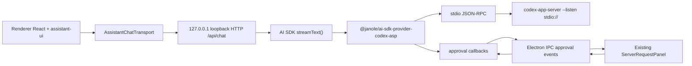

# Codex ASP Desktop Integration Implementation Plan

> **For agentic workers:** REQUIRED SUB-SKILL: Use superpowers:subagent-driven-development (recommended) or superpowers:executing-plans to implement this plan task-by-task. Steps use checkbox (`- [ ]`) syntax for tracking.

**Goal:** Replace the custom/legacy `dasclaw-app-server` protocol path in `desktop-app` with the upstream Codex App Server Protocol through `@janole/ai-sdk-provider-codex-asp`, while keeping the existing Electron desktop UI and approval panel.

**Architecture:** Electron main owns all privileged work: it starts `codex-app-server` through the janole AI SDK provider, exposes a local loopback HTTP chat endpoint for assistant-ui, and bridges Codex approval/user-input requests to the renderer over IPC. The renderer uses `@assistant-ui/react-ai-sdk` and `AssistantChatTransport` instead of the current hand-written `useExternalStoreRuntime` plus `turn/start` tracker. The old `dasclaw-app-server` JSON-RPC manager is removed after the new route has tests and a working smoke path.

**Tech Stack:** Electron, React, TypeScript, assistant-ui, `@assistant-ui/react-ai-sdk`, Vercel AI SDK v6, `@janole/ai-sdk-provider-codex-asp`, Codex Rust `codex-app-server`, Vitest.

---

## Target Architecture



### Key Decisions

- Use `@janole/ai-sdk-provider-codex-asp`, pinned to the AI SDK v6 line, because the provider natively handles Codex App Server Protocol initialization, streaming, persistent transports, approval requests, dynamic tools, and generated protocol types.
- Use a main-process loopback HTTP endpoint instead of streaming chat chunks through Electron IPC. `AssistantChatTransport` already speaks HTTP UI-message streams, while IPC remains a good fit for small control events such as approval requests, model lists, status, and endpoint discovery.
- Spawn `codex-app-server` directly with `--listen stdio://`. Janole's `transport.stdio.command` and `transport.stdio.args` support this, so the desktop app does not need to shell through `codex app-server` unless a packaged build intentionally bundles the full `codex` CLI.
- Keep the current approval panel UX, but adapt it from raw JSON-RPC server requests to janole approval callbacks.
- Keep `desktop-app/src/main/appServerRpc.ts` and `desktop-app/src/main/appServerManager.ts` only until the replacement path is passing tests. Delete them in the cleanup task.

## File Structure

### New Files

- `/Users/nallylin/Documents/code/dasCowork/desktop-app/src/shared/codexAspApi.ts`
  - Renderer-safe shared types for Codex ASP status, model summaries, approval request/response payloads, and preload API shape.
- `/Users/nallylin/Documents/code/dasCowork/desktop-app/src/main/codexAspLaunch.ts`
  - Resolves the `codex-app-server` command for dev, packaged, and environment override modes.
- `/Users/nallylin/Documents/code/dasCowork/desktop-app/src/main/codexAspApprovals.ts`
  - Converts janole approval callbacks into awaitable renderer approval prompts.
- `/Users/nallylin/Documents/code/dasCowork/desktop-app/src/main/codexAspProvider.ts`
  - Creates the janole provider with transport, client metadata, default Codex settings, and approval callbacks.
- `/Users/nallylin/Documents/code/dasCowork/desktop-app/src/main/codexAspHttpServer.ts`
  - Starts/stops the local HTTP server and implements `/api/chat`, `/api/models`, `/api/status`.
- `/Users/nallylin/Documents/code/dasCowork/desktop-app/src/renderer/src/hooks/useCodexAspAssistantRuntime.ts`
  - Replaces `useDasclawAssistantRuntime` with `useChatRuntime` and `AssistantChatTransport`.

### Modified Files

- `/Users/nallylin/Documents/code/dasCowork/desktop-app/package.json`
  - Add AI SDK v6 and janole dependencies; rename build script.
- `/Users/nallylin/Documents/code/dasCowork/desktop-app/electron-builder.yml`
  - Bundle `codex-app-server` instead of `dasclaw-app-server`.
- `/Users/nallylin/Documents/code/dasCowork/desktop-app/scripts/build-dasclaw-app-server.mjs`
  - Rename to `build-codex-app-server.mjs` and build `codex-app-server`.
- `/Users/nallylin/Documents/code/dasCowork/desktop-app/src/main/index.ts`
  - Replace `AppServerManager` IPC with `CodexAspDesktopService`.
- `/Users/nallylin/Documents/code/dasCowork/desktop-app/src/preload/index.ts`
  - Expose `window.desktopCodex` instead of `window.desktopAppServer`.
- `/Users/nallylin/Documents/code/dasCowork/desktop-app/src/preload/index.d.ts`
  - Update global typings.
- `/Users/nallylin/Documents/code/dasCowork/desktop-app/src/renderer/src/App.tsx`
  - Use `useCodexAspAssistantRuntime`; keep `ServerRequestPanel` and `ModelSelector`.

### Deleted Files After Migration

- `/Users/nallylin/Documents/code/dasCowork/desktop-app/src/main/appServerRpc.ts`
- `/Users/nallylin/Documents/code/dasCowork/desktop-app/src/main/appServerManager.ts`
- `/Users/nallylin/Documents/code/dasCowork/desktop-app/src/main/appServerRpc.test.ts`
- `/Users/nallylin/Documents/code/dasCowork/desktop-app/src/main/appServerManager.test.ts`
- `/Users/nallylin/Documents/code/dasCowork/desktop-app/src/renderer/src/hooks/useDasclawAssistantRuntime.ts`
- `/Users/nallylin/Documents/code/dasCowork/desktop-app/src/renderer/src/lib/appServerTurnTracker.ts`

## Dependency Plan

Use the AI SDK v6 dist-tags because `@janole/ai-sdk-provider-codex-asp@0.4.15` has peer dependency `ai: ^6.0.0`.

```bash
cd /Users/nallylin/Documents/code/dasCowork/desktop-app
npm install ai@6.0.213 @ai-sdk/react@3.0.215 @assistant-ui/react-ai-sdk@1.3.38 @janole/ai-sdk-provider-codex-asp@0.4.15 zod@^4.1.8
```

Expected:

```text
added ... packages
found 0 vulnerabilities
```

If npm reports peer conflicts around `@assistant-ui/core` or `@assistant-ui/store`, keep the existing `overrides` first and inspect the installed tree with:

```bash
npm ls ai @ai-sdk/react @assistant-ui/react-ai-sdk @janole/ai-sdk-provider-codex-asp
```

Expected shape:

```text
desktop-app@1.0.0
├── @assistant-ui/react-ai-sdk@1.3.38
├── @ai-sdk/react@3.0.215
├── @janole/ai-sdk-provider-codex-asp@0.4.15
└── ai@6.0.213
```

---

### Task 1: Codex App Server Launch Resolution

**Files:**
- Create: `/Users/nallylin/Documents/code/dasCowork/desktop-app/src/main/codexAspLaunch.ts`
- Create: `/Users/nallylin/Documents/code/dasCowork/desktop-app/src/main/codexAspLaunch.test.ts`

- [ ] **Step 1: Write the failing launch resolver tests**

Create `/Users/nallylin/Documents/code/dasCowork/desktop-app/src/main/codexAspLaunch.test.ts`:

```ts
import { mkdtempSync, mkdirSync, rmSync, writeFileSync } from 'node:fs'
import { tmpdir } from 'node:os'
import { join, resolve } from 'node:path'
import { afterEach, describe, expect, it } from 'vitest'

import {
  resolveBundledCodexAppServerBinary,
  resolveCodexAppServerLaunchOptions
} from './codexAspLaunch'

const tempDirs: string[] = []

afterEach(() => {
  for (const dir of tempDirs.splice(0)) {
    rmSync(dir, { recursive: true, force: true })
  }
})

function tempResourcesDir(): string {
  const dir = mkdtempSync(join(tmpdir(), 'codex-asp-resources-'))
  tempDirs.push(dir)
  return dir
}

function createBundledBinary(resourcesPath: string, platform: NodeJS.Platform): string {
  const bundleDir = join(resourcesPath, 'codex-app-server')
  const binaryName = platform === 'win32' ? 'codex-app-server.exe' : 'codex-app-server'
  mkdirSync(bundleDir, { recursive: true })
  const binary = join(bundleDir, binaryName)
  writeFileSync(binary, 'binary')
  return binary
}

describe('codex app-server launch resolution', () => {
  it('uses CODEX_APP_SERVER_BIN when set', () => {
    expect(
      resolveCodexAppServerLaunchOptions({
        env: { CODEX_APP_SERVER_BIN: '/opt/codex-app-server' },
        isPackaged: true,
        resourcesPath: '/missing'
      })
    ).toEqual({
      command: '/opt/codex-app-server',
      args: ['--listen', 'stdio://'],
      displayBinary: '/opt/codex-app-server --listen stdio://',
      env: { CODEX_APP_SERVER_BIN: '/opt/codex-app-server' }
    })
  })

  it('uses the packaged codex-app-server binary', () => {
    const resourcesPath = tempResourcesDir()
    const binary = createBundledBinary(resourcesPath, 'darwin')

    expect(resolveBundledCodexAppServerBinary(resourcesPath, 'darwin')).toBe(binary)
    expect(
      resolveCodexAppServerLaunchOptions({
        env: {},
        isPackaged: true,
        platform: 'darwin',
        resourcesPath
      })
    ).toEqual({
      command: binary,
      args: ['--listen', 'stdio://'],
      displayBinary: `${binary} --listen stdio://`,
      env: {}
    })
  })

  it('uses cargo from the codex Rust workspace in development', () => {
    expect(
      resolveCodexAppServerLaunchOptions({
        env: {},
        isPackaged: false,
        mainDir: resolve('/repo/desktop-app/out/main')
      })
    ).toEqual({
      command: 'cargo',
      args: [
        'run',
        '--quiet',
        '-p',
        'codex-app-server',
        '--bin',
        'codex-app-server',
        '--',
        '--listen',
        'stdio://'
      ],
      cwd: resolve('/repo/codex/codex-rs'),
      displayBinary:
        'cargo run --quiet -p codex-app-server --bin codex-app-server -- --listen stdio://',
      env: {}
    })
  })
})
```

- [ ] **Step 2: Run the failing test**

Run:

```bash
cd /Users/nallylin/Documents/code/dasCowork/desktop-app
npm test -- src/main/codexAspLaunch.test.ts
```

Expected:

```text
FAIL  src/main/codexAspLaunch.test.ts
Cannot find module './codexAspLaunch'
```

- [ ] **Step 3: Implement the launch resolver**

Create `/Users/nallylin/Documents/code/dasCowork/desktop-app/src/main/codexAspLaunch.ts`:

```ts
import { existsSync } from 'node:fs'
import { join, resolve } from 'node:path'

export type CodexAppServerLaunchOptions = {
  command: string
  args: string[]
  cwd?: string
  displayBinary: string
  env?: NodeJS.ProcessEnv
}

export type CodexAppServerLaunchOptionsInput = {
  env?: NodeJS.ProcessEnv
  isPackaged?: boolean
  mainDir?: string
  platform?: NodeJS.Platform
  resourcesPath?: string
}

const BUNDLED_APP_SERVER_DIR = 'codex-app-server'
const CODEX_APP_SERVER_ARGS = ['--listen', 'stdio://']
const CARGO_CODEX_APP_SERVER_ARGS = [
  'run',
  '--quiet',
  '-p',
  'codex-app-server',
  '--bin',
  'codex-app-server',
  '--',
  ...CODEX_APP_SERVER_ARGS
]

export function resolveBundledCodexAppServerBinary(
  resourcesPath: string,
  platform: NodeJS.Platform = process.platform
): string | null {
  const binaryName = platform === 'win32' ? 'codex-app-server.exe' : 'codex-app-server'
  const candidates = [
    join(resourcesPath, BUNDLED_APP_SERVER_DIR, binaryName),
    join(resourcesPath, BUNDLED_APP_SERVER_DIR, 'bin', binaryName)
  ]

  return candidates.find((candidate) => existsSync(candidate)) ?? null
}

export function resolveCodexAppServerLaunchOptions(
  options: CodexAppServerLaunchOptionsInput = {}
): CodexAppServerLaunchOptions {
  const env = options.env ?? process.env
  const explicitBinary = env.CODEX_APP_SERVER_BIN
  if (explicitBinary) {
    return {
      command: explicitBinary,
      args: [...CODEX_APP_SERVER_ARGS],
      displayBinary: `${explicitBinary} ${CODEX_APP_SERVER_ARGS.join(' ')}`,
      env
    }
  }

  const platform = options.platform ?? process.platform
  if (options.isPackaged) {
    const resourcesPath = options.resourcesPath ?? process.resourcesPath
    const bundledBinary = resolveBundledCodexAppServerBinary(resourcesPath, platform)
    if (!bundledBinary) {
      throw new Error(
        `Packaged codex-app-server binary was not found under ${join(
          resourcesPath,
          BUNDLED_APP_SERVER_DIR
        )}; set CODEX_APP_SERVER_BIN to override`
      )
    }

    return {
      command: bundledBinary,
      args: [...CODEX_APP_SERVER_ARGS],
      displayBinary: `${bundledBinary} ${CODEX_APP_SERVER_ARGS.join(' ')}`,
      env
    }
  }

  return {
    command: 'cargo',
    args: [...CARGO_CODEX_APP_SERVER_ARGS],
    cwd: resolveCodexRustWorkspaceRoot(options.mainDir ?? __dirname, env),
    displayBinary: `cargo ${CARGO_CODEX_APP_SERVER_ARGS.join(' ')}`,
    env
  }
}

function resolveCodexRustWorkspaceRoot(mainDir: string, env: NodeJS.ProcessEnv): string {
  return env.CODEX_RUST_WORKSPACE_ROOT ?? resolve(mainDir, '..', '..', '..', 'codex', 'codex-rs')
}
```

- [ ] **Step 4: Run the launch resolver test**

Run:

```bash
cd /Users/nallylin/Documents/code/dasCowork/desktop-app
npm test -- src/main/codexAspLaunch.test.ts
```

Expected:

```text
PASS  src/main/codexAspLaunch.test.ts
```

- [ ] **Step 5: Commit**

```bash
cd /Users/nallylin/Documents/code/dasCowork
git add desktop-app/src/main/codexAspLaunch.ts desktop-app/src/main/codexAspLaunch.test.ts
git commit -m "feat: resolve codex app-server launch command"
```

---

### Task 2: Shared Codex ASP API Types

**Files:**
- Create: `/Users/nallylin/Documents/code/dasCowork/desktop-app/src/shared/codexAspApi.ts`
- Modify: `/Users/nallylin/Documents/code/dasCowork/desktop-app/src/preload/index.d.ts`

- [ ] **Step 1: Create the shared API type file**

Create `/Users/nallylin/Documents/code/dasCowork/desktop-app/src/shared/codexAspApi.ts`:

```ts
export type CodexAspRunState = 'stopped' | 'starting' | 'ready' | 'stopping' | 'failed'

export type CodexAspStatus = {
  state: CodexAspRunState
  endpoint?: string
  binary: string
  startedAt?: string
  lastError?: string
}

export type CodexAspModel = {
  id: string
  displayName: string
  description?: string
  inputModalities: string[]
  isDefault: boolean
}

export type CodexAspModelList = {
  models: CodexAspModel[]
  selectedModelId?: string
  unavailableReason?: string
}

export type CodexAspApprovalRequestKind =
  | 'command'
  | 'file-change'
  | 'tool-user-input'
  | 'mcp-elicitation'

export type CodexAspApprovalRequest = {
  id: string
  kind: CodexAspApprovalRequestKind
  params: unknown
  createdAt: string
}

export type CodexAspApprovalResponse =
  | { action: 'approve' }
  | { action: 'approveForSession' }
  | { action: 'alwaysApprove' }
  | { action: 'decline'; reason?: string }
  | { action: 'answer'; answers: Record<string, string[]> }

export type DesktopCodexApi = {
  getStatus(): Promise<CodexAspStatus>
  getChatEndpoint(): Promise<string>
  listModels(): Promise<CodexAspModelList>
  setSelectedModel(modelId: string): Promise<{ selectedModelId: string }>
  respondApproval(requestId: string, response: CodexAspApprovalResponse): Promise<void>
  openExternalHttpUrl(url: string): Promise<void>
  onStatusChange(callback: (status: CodexAspStatus) => void): () => void
  onApprovalRequest(callback: (request: CodexAspApprovalRequest) => void): () => void
}
```

- [ ] **Step 2: Update preload global typings**

Modify `/Users/nallylin/Documents/code/dasCowork/desktop-app/src/preload/index.d.ts` so it imports and exposes the new bridge:

```ts
import type { ElectronAPI } from '@electron-toolkit/preload'
import type { DesktopCodexApi } from '../shared/codexAspApi'

declare global {
  interface Window {
    electron: ElectronAPI
    desktopCodex: DesktopCodexApi
  }
}
```

- [ ] **Step 3: Run shared typecheck**

Run:

```bash
cd /Users/nallylin/Documents/code/dasCowork/desktop-app
npm run typecheck
```

Expected before subsequent implementation tasks:

```text
error TS2339: Property 'desktopAppServer' does not exist on type 'Window & typeof globalThis'.
```

This failure is expected because renderer code still references the old bridge.

- [ ] **Step 4: Commit**

```bash
cd /Users/nallylin/Documents/code/dasCowork
git add desktop-app/src/shared/codexAspApi.ts desktop-app/src/preload/index.d.ts
git commit -m "feat: define codex desktop bridge types"
```

---

### Task 3: Approval Broker

**Files:**
- Create: `/Users/nallylin/Documents/code/dasCowork/desktop-app/src/main/codexAspApprovals.ts`
- Create: `/Users/nallylin/Documents/code/dasCowork/desktop-app/src/main/codexAspApprovals.test.ts`

- [ ] **Step 1: Write the failing approval broker tests**

Create `/Users/nallylin/Documents/code/dasCowork/desktop-app/src/main/codexAspApprovals.test.ts`:

```ts
import { describe, expect, it, vi } from 'vitest'

import { CodexAspApprovalBroker } from './codexAspApprovals'

describe('CodexAspApprovalBroker', () => {
  it('publishes approval requests and resolves them by id', async () => {
    const broker = new CodexAspApprovalBroker()
    const listener = vi.fn()
    broker.onRequest(listener)

    const pending = broker.request({
      kind: 'command',
      params: { command: 'echo hello' }
    })

    expect(listener).toHaveBeenCalledTimes(1)
    const request = listener.mock.calls[0][0]
    expect(request.kind).toBe('command')
    expect(request.params).toEqual({ command: 'echo hello' })

    broker.respond(request.id, { action: 'approve' })
    await expect(pending).resolves.toEqual({ action: 'approve' })
  })

  it('rejects unknown approval response ids', () => {
    const broker = new CodexAspApprovalBroker()

    expect(() => broker.respond('missing', { action: 'decline', reason: 'missing' })).toThrow(
      'Unknown approval request: missing'
    )
  })

  it('fail-closes all pending approvals on shutdown', async () => {
    const broker = new CodexAspApprovalBroker()
    const pending = broker.request({
      kind: 'file-change',
      params: { reason: 'edit file' }
    })

    broker.rejectAll(new Error('app is stopping'))

    await expect(pending).rejects.toThrow('app is stopping')
  })
})
```

- [ ] **Step 2: Run the failing approval broker tests**

Run:

```bash
cd /Users/nallylin/Documents/code/dasCowork/desktop-app
npm test -- src/main/codexAspApprovals.test.ts
```

Expected:

```text
FAIL  src/main/codexAspApprovals.test.ts
Cannot find module './codexAspApprovals'
```

- [ ] **Step 3: Implement the approval broker**

Create `/Users/nallylin/Documents/code/dasCowork/desktop-app/src/main/codexAspApprovals.ts`:

```ts
import type {
  CodexAspApprovalRequest,
  CodexAspApprovalRequestKind,
  CodexAspApprovalResponse
} from '../shared/codexAspApi'

type PendingApproval = {
  resolve: (response: CodexAspApprovalResponse) => void
  reject: (error: Error) => void
}

export type CodexAspApprovalRequestInput = {
  kind: CodexAspApprovalRequestKind
  params: unknown
}

export class CodexAspApprovalBroker {
  private readonly pending = new Map<string, PendingApproval>()
  private readonly listeners = new Set<(request: CodexAspApprovalRequest) => void>()

  onRequest(listener: (request: CodexAspApprovalRequest) => void): () => void {
    this.listeners.add(listener)
    return () => this.listeners.delete(listener)
  }

  request(input: CodexAspApprovalRequestInput): Promise<CodexAspApprovalResponse> {
    const approvalRequest: CodexAspApprovalRequest = {
      id: crypto.randomUUID(),
      kind: input.kind,
      params: input.params,
      createdAt: new Date().toISOString()
    }

    const promise = new Promise<CodexAspApprovalResponse>((resolve, reject) => {
      this.pending.set(approvalRequest.id, { resolve, reject })
    })

    for (const listener of this.listeners) {
      listener(approvalRequest)
    }

    return promise
  }

  respond(requestId: string, response: CodexAspApprovalResponse): void {
    const pending = this.pending.get(requestId)
    if (!pending) {
      throw new Error(`Unknown approval request: ${requestId}`)
    }

    this.pending.delete(requestId)
    pending.resolve(response)
  }

  rejectAll(error: Error): void {
    for (const [requestId, pending] of this.pending) {
      this.pending.delete(requestId)
      pending.reject(error)
    }
  }
}
```

- [ ] **Step 4: Run the approval broker tests**

Run:

```bash
cd /Users/nallylin/Documents/code/dasCowork/desktop-app
npm test -- src/main/codexAspApprovals.test.ts
```

Expected:

```text
PASS  src/main/codexAspApprovals.test.ts
```

- [ ] **Step 5: Commit**

```bash
cd /Users/nallylin/Documents/code/dasCowork
git add desktop-app/src/main/codexAspApprovals.ts desktop-app/src/main/codexAspApprovals.test.ts
git commit -m "feat: bridge codex approval prompts"
```

---

### Task 4: Janole Provider Factory

**Files:**
- Create: `/Users/nallylin/Documents/code/dasCowork/desktop-app/src/main/codexAspProvider.ts`
- Create: `/Users/nallylin/Documents/code/dasCowork/desktop-app/src/main/codexAspProvider.test.ts`

- [ ] **Step 1: Write the failing provider factory tests**

Create `/Users/nallylin/Documents/code/dasCowork/desktop-app/src/main/codexAspProvider.test.ts`:

```ts
import { describe, expect, it } from 'vitest'

import { createCodexAspProviderSettings } from './codexAspProvider'

describe('createCodexAspProviderSettings', () => {
  it('creates janole provider settings for direct codex-app-server stdio', () => {
    const settings = createCodexAspProviderSettings({
      launch: {
        command: '/bin/codex-app-server',
        args: ['--listen', 'stdio://'],
        displayBinary: '/bin/codex-app-server --listen stdio://',
        env: { CODEX_HOME: '/tmp/codex-home' }
      },
      cwd: '/repo',
      defaultModel: 'gpt-5.5-codex',
      onCommandApproval: async () => 'approve',
      onFileChangeApproval: async () => 'accept',
      onToolUserInput: async () => ({ answers: {} }),
      onElicitation: async () => ({ action: 'accept' })
    })

    expect(settings).toMatchObject({
      defaultModel: 'gpt-5.5-codex',
      clientInfo: {
        name: 'dascowork_desktop',
        title: 'dasCowork Desktop'
      },
      transport: {
        type: 'stdio',
        stdio: {
          command: '/bin/codex-app-server',
          args: ['--listen', 'stdio://'],
          env: { CODEX_HOME: '/tmp/codex-home' }
        }
      },
      defaultThreadSettings: {
        cwd: '/repo',
        approvalPolicy: 'on-request',
        approvalsReviewer: 'user',
        sandbox: 'workspace-write'
      },
      defaultTurnSettings: {
        cwd: '/repo',
        summary: 'auto'
      },
      persistent: {
        scope: 'provider',
        poolSize: 1,
        idleTimeoutMs: 300000
      },
      experimentalApi: true
    })
  })
})
```

- [ ] **Step 2: Run the failing provider factory tests**

Run:

```bash
cd /Users/nallylin/Documents/code/dasCowork/desktop-app
npm test -- src/main/codexAspProvider.test.ts
```

Expected:

```text
FAIL  src/main/codexAspProvider.test.ts
Cannot find module './codexAspProvider'
```

- [ ] **Step 3: Implement provider settings and factory**

Create `/Users/nallylin/Documents/code/dasCowork/desktop-app/src/main/codexAspProvider.ts`:

```ts
import {
  createCodexAppServer,
  type CodexProvider,
  type CodexProviderSettings,
  type CommandApprovalHandler,
  type ElicitationHandler,
  type FileChangeApprovalHandler,
  type ToolUserInputHandler
} from '@janole/ai-sdk-provider-codex-asp'

import type { CodexAppServerLaunchOptions } from './codexAspLaunch'

export type CodexAspProviderSettingsInput = {
  launch: CodexAppServerLaunchOptions
  cwd: string
  defaultModel?: string
  onCommandApproval: CommandApprovalHandler
  onFileChangeApproval: FileChangeApprovalHandler
  onToolUserInput: ToolUserInputHandler
  onElicitation: ElicitationHandler
}

export function createCodexAspProviderSettings(
  input: CodexAspProviderSettingsInput
): CodexProviderSettings {
  return {
    defaultModel: input.defaultModel,
    clientInfo: {
      name: 'dascowork_desktop',
      title: 'dasCowork Desktop',
      version: '1.0.0'
    },
    experimentalApi: true,
    transport: {
      type: 'stdio',
      stdio: {
        command: input.launch.command,
        args: input.launch.args,
        cwd: input.launch.cwd,
        env: input.launch.env
      }
    },
    defaultThreadSettings: {
      cwd: input.cwd,
      approvalPolicy: 'on-request',
      approvalsReviewer: 'user',
      sandbox: 'workspace-write'
    },
    defaultTurnSettings: {
      cwd: input.cwd,
      summary: 'auto'
    },
    approvals: {
      onCommandApproval: input.onCommandApproval,
      onFileChangeApproval: input.onFileChangeApproval,
      onToolUserInput: input.onToolUserInput,
      onElicitation: input.onElicitation
    },
    persistent: {
      scope: 'provider',
      poolSize: 1,
      idleTimeoutMs: 300_000
    },
    toolTimeoutMs: 120_000,
    interruptTimeoutMs: 10_000
  }
}

export function createCodexAspProvider(input: CodexAspProviderSettingsInput): CodexProvider {
  return createCodexAppServer(createCodexAspProviderSettings(input))
}
```

- [ ] **Step 4: Run provider factory tests**

Run:

```bash
cd /Users/nallylin/Documents/code/dasCowork/desktop-app
npm test -- src/main/codexAspProvider.test.ts
```

Expected:

```text
PASS  src/main/codexAspProvider.test.ts
```

- [ ] **Step 5: Commit**

```bash
cd /Users/nallylin/Documents/code/dasCowork
git add desktop-app/src/main/codexAspProvider.ts desktop-app/src/main/codexAspProvider.test.ts
git commit -m "feat: configure janole codex provider"
```

---

### Task 5: Local Chat HTTP Server

**Files:**
- Create: `/Users/nallylin/Documents/code/dasCowork/desktop-app/src/main/codexAspHttpServer.ts`
- Create: `/Users/nallylin/Documents/code/dasCowork/desktop-app/src/main/codexAspHttpServer.test.ts`

- [ ] **Step 1: Write the failing HTTP server tests**

Create `/Users/nallylin/Documents/code/dasCowork/desktop-app/src/main/codexAspHttpServer.test.ts`:

```ts
import { ReadableStream } from 'node:stream/web'
import { afterEach, describe, expect, it, vi } from 'vitest'

import { CodexAspHttpServer, type CodexAspChatHandler } from './codexAspHttpServer'

const servers: CodexAspHttpServer[] = []

afterEach(async () => {
  for (const server of servers.splice(0)) {
    await server.stop()
  }
})

function createTextStream(text: string): ReadableStream<Uint8Array> {
  return new ReadableStream<Uint8Array>({
    start(controller) {
      controller.enqueue(new TextEncoder().encode(text))
      controller.close()
    }
  })
}

describe('CodexAspHttpServer', () => {
  it('starts on loopback and serves status', async () => {
    const chatHandler: CodexAspChatHandler = vi.fn(async () => new Response(createTextStream('ok')))
    const server = new CodexAspHttpServer({
      getStatus: () => ({ state: 'ready', binary: 'codex-app-server', endpoint: server.endpoint }),
      listModels: async () => ({ models: [], selectedModelId: undefined }),
      chat: chatHandler
    })
    servers.push(server)

    await server.start()

    const response = await fetch(`${server.endpoint}/api/status`)
    await expect(response.json()).resolves.toEqual({
      state: 'ready',
      binary: 'codex-app-server',
      endpoint: server.endpoint
    })
  })

  it('forwards POST /api/chat to the chat handler with CORS headers', async () => {
    const chatHandler: CodexAspChatHandler = vi.fn(async () =>
      new Response(createTextStream('data: {"type":"finish"}\n\n'), {
        headers: { 'content-type': 'text/event-stream' }
      })
    )
    const server = new CodexAspHttpServer({
      getStatus: () => ({ state: 'ready', binary: 'codex-app-server', endpoint: server.endpoint }),
      listModels: async () => ({ models: [], selectedModelId: undefined }),
      chat: chatHandler
    })
    servers.push(server)

    await server.start()

    const response = await fetch(`${server.endpoint}/api/chat`, {
      method: 'POST',
      headers: { 'content-type': 'application/json' },
      body: JSON.stringify({ messages: [], modelId: 'gpt-test' })
    })

    expect(response.headers.get('access-control-allow-origin')).toBe('*')
    expect(await response.text()).toContain('"type":"finish"')
    expect(chatHandler).toHaveBeenCalledWith(
      expect.objectContaining({ messages: [], modelId: 'gpt-test' }),
      expect.any(AbortSignal)
    )
  })
})
```

- [ ] **Step 2: Run the failing HTTP server tests**

Run:

```bash
cd /Users/nallylin/Documents/code/dasCowork/desktop-app
npm test -- src/main/codexAspHttpServer.test.ts
```

Expected:

```text
FAIL  src/main/codexAspHttpServer.test.ts
Cannot find module './codexAspHttpServer'
```

- [ ] **Step 3: Implement the local HTTP server**

Create `/Users/nallylin/Documents/code/dasCowork/desktop-app/src/main/codexAspHttpServer.ts`:

```ts
import { createServer, type IncomingMessage, type Server, type ServerResponse } from 'node:http'
import { Readable } from 'node:stream'

import type { CodexAspModelList, CodexAspStatus } from '../shared/codexAspApi'

export type CodexAspChatRequest = {
  id?: string
  messages?: unknown[]
  modelId?: string
  system?: string
  callSettings?: unknown
  config?: unknown
  tools?: unknown
  metadata?: unknown
}

export type CodexAspChatHandler = (
  body: CodexAspChatRequest,
  abortSignal: AbortSignal
) => Promise<Response>

export type CodexAspHttpServerOptions = {
  getStatus: () => CodexAspStatus
  listModels: () => Promise<CodexAspModelList>
  chat: CodexAspChatHandler
}

export class CodexAspHttpServer {
  private server: Server | undefined
  private readonly options: CodexAspHttpServerOptions
  endpoint = ''

  constructor(options: CodexAspHttpServerOptions) {
    this.options = options
  }

  async start(): Promise<void> {
    if (this.server) return

    this.server = createServer((request, response) => {
      void this.handle(request, response).catch((error) => {
        writeJson(response, 500, { error: errorMessage(error) })
      })
    })

    await new Promise<void>((resolve) => {
      this.server?.listen(0, '127.0.0.1', resolve)
    })

    const address = this.server.address()
    if (!address || typeof address === 'string') {
      throw new Error('Codex ASP HTTP server did not bind to a TCP port')
    }
    this.endpoint = `http://127.0.0.1:${address.port}`
  }

  async stop(): Promise<void> {
    const server = this.server
    this.server = undefined
    this.endpoint = ''
    if (!server) return

    await new Promise<void>((resolve, reject) => {
      server.close((error) => {
        if (error) reject(error)
        else resolve()
      })
    })
  }

  private async handle(request: IncomingMessage, response: ServerResponse): Promise<void> {
    setCorsHeaders(response)

    if (request.method === 'OPTIONS') {
      response.writeHead(204)
      response.end()
      return
    }

    const path = new URL(request.url ?? '/', this.endpoint || 'http://127.0.0.1').pathname
    if (request.method === 'GET' && path === '/api/status') {
      writeJson(response, 200, this.options.getStatus())
      return
    }
    if (request.method === 'GET' && path === '/api/models') {
      writeJson(response, 200, await this.options.listModels())
      return
    }
    if (request.method === 'POST' && path === '/api/chat') {
      const body = await readJsonBody<CodexAspChatRequest>(request)
      const abortController = new AbortController()
      request.once('close', () => abortController.abort())
      const chatResponse = await this.options.chat(body, abortController.signal)
      response.writeHead(chatResponse.status, Object.fromEntries(chatResponse.headers))
      if (chatResponse.body) {
        Readable.fromWeb(chatResponse.body).pipe(response)
      } else {
        response.end()
      }
      return
    }

    writeJson(response, 404, { error: `Unknown route: ${request.method ?? 'GET'} ${path}` })
  }
}

async function readJsonBody<T>(request: IncomingMessage): Promise<T> {
  const chunks: Buffer[] = []
  for await (const chunk of request) {
    chunks.push(Buffer.isBuffer(chunk) ? chunk : Buffer.from(chunk))
  }
  if (chunks.length === 0) return {} as T
  return JSON.parse(Buffer.concat(chunks).toString('utf8')) as T
}

function writeJson(response: ServerResponse, status: number, payload: unknown): void {
  setCorsHeaders(response)
  response.writeHead(status, { 'content-type': 'application/json; charset=utf-8' })
  response.end(JSON.stringify(payload))
}

function setCorsHeaders(response: ServerResponse): void {
  response.setHeader('access-control-allow-origin', '*')
  response.setHeader('access-control-allow-methods', 'GET,POST,OPTIONS')
  response.setHeader('access-control-allow-headers', 'content-type,authorization')
}

function errorMessage(error: unknown): string {
  return error instanceof Error ? error.message : String(error)
}
```

- [ ] **Step 4: Run HTTP server tests**

Run:

```bash
cd /Users/nallylin/Documents/code/dasCowork/desktop-app
npm test -- src/main/codexAspHttpServer.test.ts
```

Expected:

```text
PASS  src/main/codexAspHttpServer.test.ts
```

- [ ] **Step 5: Commit**

```bash
cd /Users/nallylin/Documents/code/dasCowork
git add desktop-app/src/main/codexAspHttpServer.ts desktop-app/src/main/codexAspHttpServer.test.ts
git commit -m "feat: serve local codex chat endpoint"
```

---

### Task 6: Main Process Desktop Service

**Files:**
- Create: `/Users/nallylin/Documents/code/dasCowork/desktop-app/src/main/codexAspDesktopService.ts`
- Modify: `/Users/nallylin/Documents/code/dasCowork/desktop-app/src/main/index.ts`
- Modify: `/Users/nallylin/Documents/code/dasCowork/desktop-app/src/preload/index.ts`

- [ ] **Step 1: Implement the desktop service shell**

Create `/Users/nallylin/Documents/code/dasCowork/desktop-app/src/main/codexAspDesktopService.ts`:

```ts
import { app, BrowserWindow } from 'electron'
import { convertToModelMessages, streamText, type UIMessage } from 'ai'
import {
  codexCallOptions,
  type CodexProvider,
  type CommandApprovalHandler,
  type ElicitationHandler,
  type FileChangeApprovalHandler,
  type ToolUserInputHandler
} from '@janole/ai-sdk-provider-codex-asp'

import { CodexAspApprovalBroker } from './codexAspApprovals'
import { CodexAspHttpServer, type CodexAspChatRequest } from './codexAspHttpServer'
import { createCodexAspProvider } from './codexAspProvider'
import {
  resolveCodexAppServerLaunchOptions,
  type CodexAppServerLaunchOptions
} from './codexAspLaunch'
import type {
  CodexAspApprovalRequest,
  CodexAspApprovalResponse,
  CodexAspModel,
  CodexAspModelList,
  CodexAspStatus
} from '../shared/codexAspApi'

type CodexAspDesktopServiceOptions = {
  cwd?: string
  defaultModel?: string
  launch?: CodexAppServerLaunchOptions
}

export class CodexAspDesktopService {
  private readonly approvalBroker = new CodexAspApprovalBroker()
  private readonly provider: CodexProvider
  private readonly server: CodexAspHttpServer
  private readonly launch: CodexAppServerLaunchOptions
  private selectedModelId: string | undefined
  private status: CodexAspStatus

  constructor(options: CodexAspDesktopServiceOptions = {}) {
    const cwd = options.cwd ?? app.getAppPath()
    this.launch =
      options.launch ??
      resolveCodexAppServerLaunchOptions({
        env: process.env,
        isPackaged: app.isPackaged,
        mainDir: __dirname,
        resourcesPath: process.resourcesPath
      })

    this.provider = createCodexAspProvider({
      launch: this.launch,
      cwd,
      defaultModel: options.defaultModel,
      onCommandApproval: this.handleCommandApproval,
      onFileChangeApproval: this.handleFileChangeApproval,
      onToolUserInput: this.handleToolUserInput,
      onElicitation: this.handleElicitation
    })

    this.server = new CodexAspHttpServer({
      getStatus: () => this.getStatus(),
      listModels: () => this.listModels(),
      chat: (body, signal) => this.chat(body, signal)
    })

    this.status = {
      state: 'stopped',
      binary: this.launch.displayBinary
    }
  }

  onApprovalRequest(listener: (request: CodexAspApprovalRequest) => void): () => void {
    return this.approvalBroker.onRequest(listener)
  }

  async start(): Promise<CodexAspStatus> {
    if (this.status.state === 'ready') return this.getStatus()
    this.status = { ...this.status, state: 'starting', lastError: undefined }
    try {
      await this.server.start()
      this.status = {
        state: 'ready',
        endpoint: this.server.endpoint,
        binary: this.launch.displayBinary,
        startedAt: new Date().toISOString()
      }
    } catch (error) {
      this.status = {
        state: 'failed',
        binary: this.launch.displayBinary,
        lastError: errorMessage(error)
      }
    }
    return this.getStatus()
  }

  async stop(): Promise<CodexAspStatus> {
    this.status = { ...this.status, state: 'stopping' }
    this.approvalBroker.rejectAll(new Error('Codex ASP desktop service is stopping'))
    await this.server.stop()
    await this.provider.shutdown()
    this.status = { state: 'stopped', binary: this.launch.displayBinary }
    return this.getStatus()
  }

  getStatus(): CodexAspStatus {
    return { ...this.status }
  }

  async getChatEndpoint(): Promise<string> {
    await this.start()
    if (!this.server.endpoint) throw new Error('Codex ASP endpoint is unavailable')
    return this.server.endpoint
  }

  async listModels(): Promise<CodexAspModelList> {
    try {
      const models = await this.provider.listModels()
      const mapped = models.map<CodexAspModel>((model) => ({
        id: model.id,
        displayName: model.displayName || model.model || model.id,
        description: model.description || undefined,
        inputModalities: model.inputModalities ?? [],
        isDefault: Boolean(model.isDefault)
      }))
      const selectedModelId =
        this.selectedModelId ?? mapped.find((model) => model.isDefault)?.id ?? mapped[0]?.id
      this.selectedModelId = selectedModelId
      return { models: mapped, selectedModelId }
    } catch (error) {
      return { models: [], unavailableReason: errorMessage(error) }
    }
  }

  async setSelectedModel(modelId: string): Promise<{ selectedModelId: string }> {
    if (!modelId.trim()) throw new Error('modelId is required')
    this.selectedModelId = modelId
    return { selectedModelId: modelId }
  }

  respondApproval(requestId: string, response: CodexAspApprovalResponse): void {
    this.approvalBroker.respond(requestId, response)
  }

  broadcastStatus(): void {
    const status = this.getStatus()
    for (const window of BrowserWindow.getAllWindows()) {
      if (!window.isDestroyed()) {
        window.webContents.send('codex-asp:status-change', status)
      }
    }
  }

  private async chat(body: CodexAspChatRequest, abortSignal: AbortSignal): Promise<Response> {
    const modelId = body.modelId ?? this.selectedModelId
    if (!modelId) throw new Error('No Codex model selected')

    const result = streamText({
      model: this.provider.chat(modelId),
      system: body.system,
      messages: convertToModelMessages((body.messages ?? []) as UIMessage[]),
      abortSignal,
      providerOptions: {
        ...codexCallOptions({
          model: modelId,
          summary: 'auto'
        })
      }
    })

    return result.toUIMessageStreamResponse()
  }

  private readonly handleCommandApproval: CommandApprovalHandler = async (params) => {
    const response = await this.approvalBroker.request({ kind: 'command', params })
    return response.action === 'approve' || response.action === 'approveForSession'
      ? 'approve'
      : 'decline'
  }

  private readonly handleFileChangeApproval: FileChangeApprovalHandler = async (params) => {
    const response = await this.approvalBroker.request({ kind: 'file-change', params })
    if (response.action === 'approveForSession') return 'acceptForSession'
    if (response.action === 'approve') return 'accept'
    return 'decline'
  }

  private readonly handleToolUserInput: ToolUserInputHandler = async (params) => {
    const response = await this.approvalBroker.request({ kind: 'tool-user-input', params })
    return response.action === 'answer' ? { answers: response.answers } : { answers: {} }
  }

  private readonly handleElicitation: ElicitationHandler = async (params) => {
    const response = await this.approvalBroker.request({ kind: 'mcp-elicitation', params })
    if (response.action === 'alwaysApprove') return { action: 'accept', _meta: { persist: 'always' } }
    if (response.action === 'approveForSession') {
      return { action: 'accept', _meta: { persist: 'session' } }
    }
    if (response.action === 'approve') return { action: 'accept' }
    return { action: 'decline', _meta: { reason: response.action === 'decline' ? response.reason : undefined } }
  }
}

function errorMessage(error: unknown): string {
  return error instanceof Error ? error.message : String(error)
}
```

- [ ] **Step 2: Replace main IPC registration**

Modify `/Users/nallylin/Documents/code/dasCowork/desktop-app/src/main/index.ts`:

```ts
import { app, shell, BrowserWindow, ipcMain, Menu, nativeTheme } from 'electron'
import { join } from 'path'
import { electronApp, optimizer, is } from '@electron-toolkit/utils'
import icon from '../../resources/icon.png?asset'
import { CodexAspDesktopService } from './codexAspDesktopService'
import { installWindowContextMenu } from './contextMenu'
import { createMainWindowOptions } from './windowOptions'
import type { CodexAspApprovalResponse } from '../shared/codexAspApi'

const codexService = new CodexAspDesktopService()

function isExternalHttpUrl(value: string): boolean {
  try {
    const url = new URL(value)
    return url.protocol === 'http:' || url.protocol === 'https:'
  } catch {
    return false
  }
}

async function openExternalHttpUrl(url: string): Promise<void> {
  if (!isExternalHttpUrl(url)) {
    throw new Error('external URL must be http(s)')
  }
  await shell.openExternal(url)
}

function createWindow(): void {
  const mainWindow = new BrowserWindow(
    createMainWindowOptions({
      preloadPath: join(__dirname, '../preload/index.js'),
      icon
    })
  )

  mainWindow.on('ready-to-show', () => {
    mainWindow.show()
  })

  mainWindow.webContents.setWindowOpenHandler((details) => {
    if (isExternalHttpUrl(details.url)) {
      void shell.openExternal(details.url).catch(() => {
        console.error('failed to open external URL')
      })
    }
    return { action: 'deny' }
  })
  installWindowContextMenu(mainWindow, Menu)

  const unsubscribeApprovals = codexService.onApprovalRequest((request) => {
    if (!mainWindow.isDestroyed()) {
      mainWindow.webContents.send('codex-asp:approval-request', request)
    }
  })
  mainWindow.on('closed', () => {
    unsubscribeApprovals()
  })

  if (is.dev && process.env['ELECTRON_RENDERER_URL']) {
    mainWindow.loadURL(process.env['ELECTRON_RENDERER_URL'])
  } else {
    mainWindow.loadFile(join(__dirname, '../renderer/index.html'))
  }
}

app.whenReady().then(() => {
  electronApp.setAppUserModelId('com.electron')
  nativeTheme.themeSource = 'system'

  app.on('browser-window-created', (_, window) => {
    optimizer.watchWindowShortcuts(window)
  })

  ipcMain.on('ping', () => console.log('pong'))
  ipcMain.handle('codex-asp:get-status', () => codexService.getStatus())
  ipcMain.handle('codex-asp:get-chat-endpoint', () => codexService.getChatEndpoint())
  ipcMain.handle('codex-asp:list-models', () => codexService.listModels())
  ipcMain.handle('codex-asp:set-selected-model', (_, payload: unknown) => {
    if (!payload || typeof payload !== 'object') throw new Error('payload must be an object')
    const request = payload as { modelId?: unknown }
    if (typeof request.modelId !== 'string') throw new Error('modelId must be a string')
    return codexService.setSelectedModel(request.modelId)
  })
  ipcMain.handle('codex-asp:respond-approval', (_, payload: unknown) => {
    if (!payload || typeof payload !== 'object') throw new Error('payload must be an object')
    const request = payload as { requestId?: unknown; response?: CodexAspApprovalResponse }
    if (typeof request.requestId !== 'string') throw new Error('requestId must be a string')
    codexService.respondApproval(request.requestId, request.response as CodexAspApprovalResponse)
  })
  ipcMain.handle('codex-asp:open-external-http-url', (_, payload: unknown) => {
    if (!payload || typeof payload !== 'object') throw new Error('payload must be an object')
    const request = payload as { url?: unknown }
    if (typeof request.url !== 'string') throw new Error('url must be a string')
    return openExternalHttpUrl(request.url)
  })

  createWindow()
  void codexService.start().then(() => codexService.broadcastStatus())

  app.on('activate', function () {
    if (BrowserWindow.getAllWindows().length === 0) createWindow()
  })
})

app.on('window-all-closed', () => {
  if (process.platform !== 'darwin') {
    app.quit()
  }
})

app.on('before-quit', () => {
  void codexService.stop()
})
```

- [ ] **Step 3: Replace preload bridge**

Modify `/Users/nallylin/Documents/code/dasCowork/desktop-app/src/preload/index.ts`:

```ts
import { contextBridge, ipcRenderer } from 'electron'
import { electronAPI } from '@electron-toolkit/preload'
import type {
  CodexAspApprovalRequest,
  CodexAspApprovalResponse,
  CodexAspModelList,
  CodexAspStatus,
  DesktopCodexApi
} from '../shared/codexAspApi'

const desktopCodex: DesktopCodexApi = {
  getStatus: () => ipcRenderer.invoke('codex-asp:get-status') as Promise<CodexAspStatus>,
  getChatEndpoint: () => ipcRenderer.invoke('codex-asp:get-chat-endpoint') as Promise<string>,
  listModels: () => ipcRenderer.invoke('codex-asp:list-models') as Promise<CodexAspModelList>,
  setSelectedModel: (modelId: string) =>
    ipcRenderer.invoke('codex-asp:set-selected-model', { modelId }) as Promise<{
      selectedModelId: string
    }>,
  respondApproval: (requestId: string, response: CodexAspApprovalResponse) =>
    ipcRenderer.invoke('codex-asp:respond-approval', { requestId, response }) as Promise<void>,
  openExternalHttpUrl: (url: string) =>
    ipcRenderer.invoke('codex-asp:open-external-http-url', { url }) as Promise<void>,
  onStatusChange: (callback: (status: CodexAspStatus) => void) => {
    const listener = (_event: Electron.IpcRendererEvent, status: CodexAspStatus): void => {
      callback(status)
    }
    ipcRenderer.on('codex-asp:status-change', listener)
    return () => ipcRenderer.removeListener('codex-asp:status-change', listener)
  },
  onApprovalRequest: (callback: (request: CodexAspApprovalRequest) => void) => {
    const listener = (_event: Electron.IpcRendererEvent, request: CodexAspApprovalRequest): void => {
      callback(request)
    }
    ipcRenderer.on('codex-asp:approval-request', listener)
    return () => ipcRenderer.removeListener('codex-asp:approval-request', listener)
  }
}

if (process.contextIsolated) {
  try {
    contextBridge.exposeInMainWorld('electron', electronAPI)
    contextBridge.exposeInMainWorld('desktopCodex', desktopCodex)
  } catch (error) {
    console.error(error)
  }
} else {
  // @ts-ignore (define in dts)
  window.electron = electronAPI
  // @ts-ignore (define in dts)
  window.desktopCodex = desktopCodex
}
```

- [ ] **Step 4: Run main/preload typecheck**

Run:

```bash
cd /Users/nallylin/Documents/code/dasCowork/desktop-app
npm run typecheck:node
```

Expected:

```text
typecheck:node exits 0
```

- [ ] **Step 5: Commit**

```bash
cd /Users/nallylin/Documents/code/dasCowork
git add desktop-app/src/main/index.ts desktop-app/src/main/codexAspDesktopService.ts desktop-app/src/preload/index.ts
git commit -m "feat: route desktop app through codex asp service"
```

---

### Task 7: Renderer Runtime Migration

**Files:**
- Create: `/Users/nallylin/Documents/code/dasCowork/desktop-app/src/renderer/src/hooks/useCodexAspAssistantRuntime.ts`
- Modify: `/Users/nallylin/Documents/code/dasCowork/desktop-app/src/renderer/src/App.tsx`
- Modify: `/Users/nallylin/Documents/code/dasCowork/desktop-app/src/renderer/src/components/assistant-ui/server-request-panel.tsx`

- [ ] **Step 1: Create the AI SDK assistant runtime hook**

Create `/Users/nallylin/Documents/code/dasCowork/desktop-app/src/renderer/src/hooks/useCodexAspAssistantRuntime.ts`:

```ts
import { useCallback, useEffect, useMemo, useState } from 'react'
import { AssistantChatTransport, useChatRuntime } from '@assistant-ui/react-ai-sdk'

import type {
  CodexAspApprovalRequest,
  CodexAspApprovalResponse,
  CodexAspModelList,
  CodexAspStatus
} from '../../../shared/codexAspApi'
import type { AssistantModelOption } from '../lib/assistantMessages'

export type CodexAspAssistantRuntimeState = {
  runtime: ReturnType<typeof useChatRuntime>
  status: CodexAspStatus | undefined
  serverRequests: readonly CodexAspApprovalRequest[]
  models: readonly AssistantModelOption[]
  selectedModelId: string | undefined
  setSelectedModelId: (modelId: string) => Promise<void>
  respondToServerRequest: (
    request: CodexAspApprovalRequest,
    response: CodexAspApprovalResponse
  ) => Promise<void>
  rejectServerRequest: (request: CodexAspApprovalRequest) => Promise<void>
}

export function useCodexAspAssistantRuntime(): CodexAspAssistantRuntimeState {
  const [endpoint, setEndpoint] = useState<string | undefined>(undefined)
  const [status, setStatus] = useState<CodexAspStatus>()
  const [serverRequests, setServerRequests] = useState<CodexAspApprovalRequest[]>([])
  const [models, setModels] = useState<AssistantModelOption[]>([])
  const [selectedModelId, setSelectedModelIdState] = useState<string | undefined>(undefined)

  useEffect(() => {
    let cancelled = false
    void window.desktopCodex.getStatus().then((nextStatus) => {
      if (!cancelled) setStatus(nextStatus)
    })
    void window.desktopCodex.getChatEndpoint().then((nextEndpoint) => {
      if (!cancelled) setEndpoint(nextEndpoint)
    })
    void window.desktopCodex.listModels().then((list) => {
      if (cancelled) return
      setModels(toModelOptions(list))
      setSelectedModelIdState(list.selectedModelId)
    })

    const removeStatusListener = window.desktopCodex.onStatusChange(setStatus)
    const removeApprovalListener = window.desktopCodex.onApprovalRequest((request) => {
      setServerRequests((current) => [...current, request])
    })

    return () => {
      cancelled = true
      removeStatusListener()
      removeApprovalListener()
    }
  }, [])

  const transport = useMemo(() => {
    if (!endpoint) return undefined
    return new AssistantChatTransport({
      api: `${endpoint}/api/chat`,
      prepareSendMessagesRequest: async (options) => ({
        body: {
          ...options.body,
          id: options.id,
          messages: options.messages,
          trigger: options.trigger,
          messageId: options.messageId,
          metadata: options.requestMetadata,
          modelId: selectedModelId
        }
      })
    })
  }, [endpoint, selectedModelId])

  const runtime = useChatRuntime({
    transport
  })

  const setSelectedModelId = useCallback(async (modelId: string) => {
    const response = await window.desktopCodex.setSelectedModel(modelId)
    setSelectedModelIdState(response.selectedModelId)
  }, [])

  const respondToServerRequest = useCallback(
    async (request: CodexAspApprovalRequest, response: CodexAspApprovalResponse) => {
      await window.desktopCodex.respondApproval(request.id, response)
      setServerRequests((current) => current.filter((item) => item.id !== request.id))
    },
    []
  )

  const rejectServerRequest = useCallback(async (request: CodexAspApprovalRequest) => {
    await window.desktopCodex.respondApproval(request.id, {
      action: 'decline',
      reason: 'Rejected from desktop UI'
    })
    setServerRequests((current) => current.filter((item) => item.id !== request.id))
  }, [])

  return {
    runtime,
    status,
    serverRequests,
    models,
    selectedModelId,
    setSelectedModelId,
    respondToServerRequest,
    rejectServerRequest
  }
}

function toModelOptions(list: CodexAspModelList): AssistantModelOption[] {
  if (list.unavailableReason) {
    return [
      {
        id: '__unavailable__',
        label: list.unavailableReason,
        disabled: true
      }
    ]
  }
  return list.models.map((model) => ({
    id: model.id,
    label: model.displayName,
    description: model.description,
    disabled: false
  }))
}
```

- [ ] **Step 2: Wire App.tsx to the new hook**

Modify `/Users/nallylin/Documents/code/dasCowork/desktop-app/src/renderer/src/App.tsx`:

```ts
import { useCodexAspAssistantRuntime } from './hooks/useCodexAspAssistantRuntime'
```

Replace:

```ts
import {
  useAppServerModelSelectorState,
  useDasclawAssistantRuntime
} from './hooks/useDasclawAssistantRuntime'
```

with the new hook. In `App()`, replace:

```ts
const { runtime, serverRequests, respondToServerRequest, rejectServerRequest } =
  useDasclawAssistantRuntime()
```

with:

```ts
const {
  runtime,
  serverRequests,
  respondToServerRequest,
  rejectServerRequest,
  models,
  selectedModelId,
  setSelectedModelId
} = useCodexAspAssistantRuntime()
```

Pass model selector state to `Header`:

```tsx
<Header
  modelSelector={{
    models,
    value: selectedModelId,
    onValueChange: setSelectedModelId
  }}
  sidebarCollapsed={sidebarCollapsed}
  onToggleSidebar={toggleSidebar}
/>
```

Update `HeaderProps`:

```ts
type HeaderProps = {
  modelSelector: {
    models: readonly AssistantModelOption[]
    value: string | undefined
    onValueChange: (modelId: string) => Promise<void>
  }
  sidebarCollapsed: boolean
  onToggleSidebar: () => void
}
```

Update the `Header` function to pass `modelSelector` into the existing `ModelSelector`:

```tsx
function Header({
  modelSelector,
  sidebarCollapsed,
  onToggleSidebar
}: HeaderProps): React.JSX.Element {
  return (
    <header className="flex h-13 shrink-0 items-center justify-between border-b border-border/50 px-3">
      <div className="flex items-center gap-2">
        {sidebarCollapsed && (
          <IconButton className="size-8" label="展开侧边栏" title="展开侧边栏" onClick={onToggleSidebar}>
            <PanelLeftIcon className="size-4" />
          </IconButton>
        )}
        <ModelSelector
          models={modelSelector.models}
          value={modelSelector.value}
          onValueChange={modelSelector.onValueChange}
        />
      </div>
      <IconButton className="size-8" label="收起侧边栏" title="收起侧边栏" onClick={onToggleSidebar}>
        <PanelLeftIcon className="size-4" />
      </IconButton>
    </header>
  )
}
```

- [ ] **Step 3: Adapt ServerRequestPanel response mapping**

Modify `/Users/nallylin/Documents/code/dasCowork/desktop-app/src/renderer/src/components/assistant-ui/server-request-panel.tsx` to accept `CodexAspApprovalRequest` and emit `CodexAspApprovalResponse`.

Use this mapping for the panel buttons:

```ts
const approveResponse = { action: 'approve' } as const
const approveForSessionResponse = { action: 'approveForSession' } as const
const alwaysApproveResponse = { action: 'alwaysApprove' } as const
const declineResponse = { action: 'decline', reason: 'Rejected from desktop UI' } as const
```

For `tool-user-input`, transform selected answers into:

```ts
{
  action: 'answer',
  answers: {
    [question.id]: selectedAnswers
  }
}
```

- [ ] **Step 4: Run renderer typecheck**

Run:

```bash
cd /Users/nallylin/Documents/code/dasCowork/desktop-app
npm run typecheck:web
```

Expected:

```text
typecheck:web exits 0
```

- [ ] **Step 5: Commit**

```bash
cd /Users/nallylin/Documents/code/dasCowork
git add desktop-app/src/renderer/src/hooks/useCodexAspAssistantRuntime.ts desktop-app/src/renderer/src/App.tsx desktop-app/src/renderer/src/components/assistant-ui/server-request-panel.tsx
git commit -m "feat: use ai sdk runtime for codex desktop chat"
```

---

### Task 8: Packaging and Build Script Rename

**Files:**
- Modify: `/Users/nallylin/Documents/code/dasCowork/desktop-app/package.json`
- Rename: `/Users/nallylin/Documents/code/dasCowork/desktop-app/scripts/build-dasclaw-app-server.mjs` to `/Users/nallylin/Documents/code/dasCowork/desktop-app/scripts/build-codex-app-server.mjs`
- Modify: `/Users/nallylin/Documents/code/dasCowork/desktop-app/electron-builder.yml`

- [ ] **Step 1: Rename build script and contents**

Rename the file:

```bash
cd /Users/nallylin/Documents/code/dasCowork/desktop-app
mv scripts/build-dasclaw-app-server.mjs scripts/build-codex-app-server.mjs
```

Edit `/Users/nallylin/Documents/code/dasCowork/desktop-app/scripts/build-codex-app-server.mjs` so it builds the upstream Rust package:

```js
import { mkdirSync, copyFileSync } from 'node:fs'
import { dirname, join, resolve } from 'node:path'
import { fileURLToPath } from 'node:url'
import { spawnSync } from 'node:child_process'

const __dirname = dirname(fileURLToPath(import.meta.url))
const desktopRoot = resolve(__dirname, '..')
const repoRoot = resolve(desktopRoot, '..')
const codexRustRoot = resolve(repoRoot, 'codex', 'codex-rs')
const target = process.env.CARGO_BUILD_TARGET
const profile = process.env.CARGO_PROFILE ?? 'release'
const binaryName = process.platform === 'win32' ? 'codex-app-server.exe' : 'codex-app-server'
const targetDir = target
  ? join(codexRustRoot, 'target', target, profile)
  : join(codexRustRoot, 'target', profile)
const builtBinary = join(targetDir, binaryName)
const resourcesDir = join(desktopRoot, 'resources', 'codex-app-server')
const bundledBinary = join(resourcesDir, binaryName)

const args = ['build', '--package', 'codex-app-server', '--bin', 'codex-app-server', '--profile', profile]
if (target) args.push('--target', target)

const result = spawnSync('cargo', args, {
  cwd: codexRustRoot,
  stdio: 'inherit',
  env: process.env
})

if (result.status !== 0) {
  process.exit(result.status ?? 1)
}

mkdirSync(resourcesDir, { recursive: true })
copyFileSync(builtBinary, bundledBinary)
console.log(`Bundled ${builtBinary} -> ${bundledBinary}`)
```

- [ ] **Step 2: Update package scripts**

Modify `/Users/nallylin/Documents/code/dasCowork/desktop-app/package.json`:

```json
{
  "scripts": {
    "build:codex-app-server": "node scripts/build-codex-app-server.mjs",
    "build:unpack": "npm run build && npm run build:codex-app-server && electron-builder --dir",
    "build:win": "npm run build && npm run build:codex-app-server && electron-builder --win",
    "build:mac": "npm run build && npm run build:codex-app-server && electron-builder --mac",
    "build:linux": "npm run build && npm run build:codex-app-server && electron-builder --linux"
  }
}
```

Remove `build:dasclaw-app-server`.

- [ ] **Step 3: Update electron-builder resources**

Modify `/Users/nallylin/Documents/code/dasCowork/desktop-app/electron-builder.yml` so bundled resources include:

```yaml
extraResources:
  - from: resources/codex-app-server
    to: codex-app-server
    filter:
      - '**/*'
```

Remove any `dasclaw-app-server` resource entry.

- [ ] **Step 4: Run packaging script smoke test**

Run:

```bash
cd /Users/nallylin/Documents/code/dasCowork/desktop-app
npm run build:codex-app-server
```

Expected:

```text
Bundled /Users/nallylin/Documents/code/dasCowork/codex/codex-rs/target/release/codex-app-server -> /Users/nallylin/Documents/code/dasCowork/desktop-app/resources/codex-app-server/codex-app-server
```

- [ ] **Step 5: Commit**

```bash
cd /Users/nallylin/Documents/code/dasCowork
git add desktop-app/package.json desktop-app/package-lock.json desktop-app/electron-builder.yml desktop-app/scripts/build-codex-app-server.mjs
git rm desktop-app/scripts/build-dasclaw-app-server.mjs
git commit -m "build: bundle codex app-server"
```

---

### Task 9: Remove Legacy Dasclaw Protocol Path

**Files:**
- Delete: `/Users/nallylin/Documents/code/dasCowork/desktop-app/src/main/appServerRpc.ts`
- Delete: `/Users/nallylin/Documents/code/dasCowork/desktop-app/src/main/appServerManager.ts`
- Delete: `/Users/nallylin/Documents/code/dasCowork/desktop-app/src/main/appServerRpc.test.ts`
- Delete: `/Users/nallylin/Documents/code/dasCowork/desktop-app/src/main/appServerManager.test.ts`
- Delete: `/Users/nallylin/Documents/code/dasCowork/desktop-app/src/renderer/src/hooks/useDasclawAssistantRuntime.ts`
- Delete: `/Users/nallylin/Documents/code/dasCowork/desktop-app/src/renderer/src/lib/appServerTurnTracker.ts`
- Keep: `/Users/nallylin/Documents/code/dasCowork/desktop-app/src/renderer/src/lib/serverRequests.ts` only if `ServerRequestPanel` still imports useful queue helpers after Task 7.

- [ ] **Step 1: Delete legacy files**

Run:

```bash
cd /Users/nallylin/Documents/code/dasCowork
git rm \
  desktop-app/src/main/appServerRpc.ts \
  desktop-app/src/main/appServerManager.ts \
  desktop-app/src/main/appServerRpc.test.ts \
  desktop-app/src/main/appServerManager.test.ts \
  desktop-app/src/renderer/src/hooks/useDasclawAssistantRuntime.ts \
  desktop-app/src/renderer/src/lib/appServerTurnTracker.ts
```

Expected:

```text
rm 'desktop-app/src/main/appServerRpc.ts'
rm 'desktop-app/src/main/appServerManager.ts'
rm 'desktop-app/src/main/appServerRpc.test.ts'
rm 'desktop-app/src/main/appServerManager.test.ts'
rm 'desktop-app/src/renderer/src/hooks/useDasclawAssistantRuntime.ts'
rm 'desktop-app/src/renderer/src/lib/appServerTurnTracker.ts'
```

- [ ] **Step 2: Search for old names**

Run:

```bash
cd /Users/nallylin/Documents/code/dasCowork
rg -n "dasclaw-app-server|dasclaw_app_server|DASCLAW_APP_SERVER|desktopAppServer|useDasclawAssistantRuntime|app-server:" desktop-app
```

Expected:

```text
No matches
```

- [ ] **Step 3: Run all tests and typechecks**

Run:

```bash
cd /Users/nallylin/Documents/code/dasCowork/desktop-app
npm test
npm run typecheck
npm run lint
```

Expected:

```text
PASS
typecheck exits 0
lint exits 0
```

- [ ] **Step 4: Commit**

```bash
cd /Users/nallylin/Documents/code/dasCowork
git add desktop-app
git commit -m "refactor: remove legacy dasclaw app-server protocol"
```

---

### Task 10: End-to-End Smoke Validation

**Files:**
- Modify only if validation reveals a concrete failure in the files introduced above.

- [ ] **Step 1: Run development app with the new service**

Run:

```bash
cd /Users/nallylin/Documents/code/dasCowork/desktop-app
npm run dev
```

Expected terminal evidence:

```text
electron-vite dev server running
```

Expected app behavior:

```text
The renderer opens, model selector loads Codex models or shows a renderer-safe unavailable reason, and no dasclaw protocol errors appear in the console.
```

- [ ] **Step 2: Send a simple chat prompt**

In the desktop app composer, send:

```text
用一句话回答：2+2 等于多少？
```

Expected:

```text
Assistant streams a response through assistant-ui and the final answer includes 4.
```

- [ ] **Step 3: Trigger approval flow**

In the desktop app composer, send:

```text
运行 pwd，然后告诉我当前目录。
```

Expected:

```text
ServerRequestPanel shows a command approval prompt. Approving it lets the turn continue. Rejecting it fails closed and the assistant reports that the command was not allowed.
```

- [ ] **Step 4: Verify packaged binary resolution**

Run:

```bash
cd /Users/nallylin/Documents/code/dasCowork/desktop-app
npm run build:unpack
```

Expected:

```text
electron-builder exits 0
```

Then run the unpacked app and verify:

```text
CodexAspStatus.binary points at resources/codex-app-server/codex-app-server and chat still streams.
```

- [ ] **Step 5: Final commit**

```bash
cd /Users/nallylin/Documents/code/dasCowork
git add desktop-app
git commit -m "test: validate codex asp desktop integration"
```

---

## Self-Review

### Spec Coverage

- The old custom/legacy `dasclaw-app-server` protocol is removed in Task 9.
- The new protocol path uses upstream Codex App Server Protocol through `@janole/ai-sdk-provider-codex-asp` in Tasks 4, 5, and 6.
- assistant-ui integration uses `@assistant-ui/react-ai-sdk` and `AssistantChatTransport` in Task 7.
- Desktop-specific safety boundaries are preserved: main process owns process spawning, local HTTP, Codex provider, and approval callbacks; renderer owns presentation and user decisions.
- Packaging changes bundle `codex-app-server` under a new resource directory in Task 8.

### Placeholder Scan

The plan avoids open-ended placeholder instructions. Each code-changing task includes exact files, code snippets, commands, expected failures, expected passes, and commit points.

### Type Consistency

- Shared bridge type is `DesktopCodexApi`.
- Renderer global is `window.desktopCodex`.
- Main IPC prefix is `codex-asp:*`.
- Local HTTP service class is `CodexAspHttpServer`.
- Main orchestration class is `CodexAspDesktopService`.
- Launch override env var is `CODEX_APP_SERVER_BIN`.

## Risks and Mitigations

- **AI SDK version drift:** Pin `ai@6.0.213`, `@ai-sdk/react@3.0.215`, and `@assistant-ui/react-ai-sdk@1.3.38` while using janole `0.4.15`.
- **Janole provider is still 0.x:** Keep adapter code isolated in `codexAspProvider.ts` and `codexAspDesktopService.ts` so future provider API changes stay localized.
- **Approval response shape mismatch:** Task 10 explicitly validates command approval and rejection. If MCP elicitation or permissions require extra fields, fix only the mapping in `CodexAspDesktopService`.
- **Local HTTP endpoint exposure:** Bind only to `127.0.0.1`, random port, and no auth token initially. If remote web content is later loaded in the renderer, add a per-process bearer token to `AssistantChatTransport.headers` and require it in `CodexAspHttpServer`.
- **Packaged binary size:** Bundling `codex-app-server` is narrower than bundling full `codex` CLI and fits janole's custom stdio command support.
