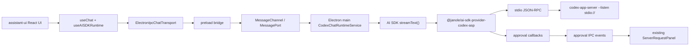

# Zero-HTTP Codex ASP Desktop Integration Implementation Plan

> **For agentic workers:** REQUIRED SUB-SKILL: Use superpowers:subagent-driven-development (recommended) or superpowers:executing-plans to implement this plan task-by-task. Steps use checkbox (`- [ ]`) syntax for tracking.

**Goal:** Replace the legacy `dasclaw-app-server` desktop protocol with a Zero-HTTP Electron IPC streaming architecture that connects assistant-ui to Codex App Server Protocol through `@janole/ai-sdk-provider-codex-asp`.

**Architecture:** Renderer uses assistant-ui with AI SDK v6, but the chat transport is a custom `ElectronIpcChatTransport` instead of `AssistantChatTransport` or HTTP. The renderer transport opens a `MessageChannel` through preload, Electron main runs `streamText()` with the janole Codex provider, and main streams `UIMessageChunk` objects back over `MessagePort`. Codex itself remains isolated behind the janole provider, which launches `codex-app-server --listen stdio://`.

**Tech Stack:** Electron, MessagePort IPC, React, TypeScript, assistant-ui, `@assistant-ui/react-ai-sdk`, `@ai-sdk/react`, Vercel AI SDK v6, `@janole/ai-sdk-provider-codex-asp`, Codex Rust `codex-app-server`, Vitest.

---

## Target Architecture



## Architecture Decisions

- No local HTTP server is created for chat. There is no `/api/chat`, no `fetch()`, no SSE endpoint, and no CORS/auth surface.
- AI SDK `UIMessageChunk` is the primary stream unit between main and renderer.
- `ipcRenderer.postMessage(..., [port])` is used because Electron documents it as the MessagePort transfer path. `ipcRenderer.invoke` is kept only for small request/response control APIs.
- The renderer-created `ReadableStream<UIMessageChunk>` lives in renderer code. Preload owns Electron IPC and forwards port events into renderer callbacks, so no `ReadableStream` object needs to cross `contextBridge`.
- `@assistant-ui/react-ai-sdk` is still used, but the renderer uses `useChat` from `@ai-sdk/react` plus `useAISDKRuntime` from assistant-ui. This avoids relying on `AssistantChatTransport`, whose useful context-forwarding behavior is HTTP-oriented.
- First implementation forwards `messages`, `modelId`, `metadata`, `trigger`, `messageId`, and AI SDK transport `body`. Any assistant-ui context previously supplied by `AssistantChatTransport` (`system`, frontend tools, call settings, config) must be placed in `body` by the renderer and explicitly consumed in main; Codex server-side command/file/tool approval remains supported through janole callbacks.
- Janole provider is pinned to AI SDK v6 because `@janole/ai-sdk-provider-codex-asp@0.4.15` peers on `ai:^6.0.0`.

## Source References Checked

- AI SDK `useChat` uses a transport-based architecture and defaults to HTTP only when no custom transport is supplied.
- AI SDK `DirectChatTransport` proves the SDK supports non-HTTP transports, although it is single-process and therefore not directly usable across Electron renderer/main.
- assistant-ui documents that `AssistantChatTransport` forwards system messages and frontend tools by default; the custom IPC transport must explicitly add anything it wants to forward.
- Electron documents that transferring a `MessagePort` from renderer to main uses `ipcRenderer.postMessage(channel, message, [transfer])`, and main receives transferred ports via `event.ports`.
- AI SDK v6 `convertToModelMessages()` returns a `Promise`, so main runtime code must `await` it before calling `streamText()`.
- AI SDK v6 `toUIMessageStream()` supports `originalMessages`, `sendReasoning`, and `sendSources`. In `ai@6.0.213`, `sendReasoning` defaults to `true`, while `sendSources` defaults to `false`; this plan sets both explicitly for readability and source support.
- Janole command/file approval decisions use Codex ASP protocol values such as `accept`, `acceptForSession`, `decline`, and `cancel`; UI actions like `approve` must be mapped before returning to janole callbacks.

## Review Reconciliation

- Adopted: command approval mapping is fixed to return `accept` / `acceptForSession` / `decline` / `cancel`, never UI-only `approve`.
- Adopted: `convertToModelMessages()` is awaited in the main runtime.
- Adopted: IPC payloads crossing into Electron main are validated with zod schemas before being passed to runtime methods.
- Adopted: abort now sends an abort request over `MessagePort` and waits for main to send a terminal `aborted`, `finish`, or `error` event before preload closes the port.
- Adopted: approval broker requests fail closed on timeout or app/window shutdown.
- Adopted: packaged app-server output is placed under `.bundle-resources/codex-app-server` to avoid mixing generated binaries with ordinary source resources.
- Corrected: the external review said `sendReasoning` defaults to `false`; local AI SDK v6 types show it defaults to `true`. This plan still passes `sendReasoning: true` explicitly, but treats it as clarity rather than a required bug fix.

## File Structure

### New Files

- `/Users/nallylin/Documents/code/dasCowork/desktop-app/src/shared/codexIpcApi.ts`
  - Shared renderer/main types for chat stream requests, stream events, status, model list, approvals, and preload bridge shape.
- `/Users/nallylin/Documents/code/dasCowork/desktop-app/src/main/codexAppServerLaunch.ts`
  - Resolves `codex-app-server` command, args, cwd, and packaged binary paths.
- `/Users/nallylin/Documents/code/dasCowork/desktop-app/src/main/codexApprovalBroker.ts`
  - Main-process awaitable approval queue that bridges janole approval callbacks to renderer UI.
- `/Users/nallylin/Documents/code/dasCowork/desktop-app/src/main/codexAspProvider.ts`
  - Creates the janole Codex provider with stdio transport and approval callbacks.
- `/Users/nallylin/Documents/code/dasCowork/desktop-app/src/main/codexChatRuntimeService.ts`
  - Main-process AI SDK runtime host. Owns `streamText()`, model selection, provider lifecycle, and MessagePort streaming.
- `/Users/nallylin/Documents/code/dasCowork/desktop-app/src/renderer/src/lib/ElectronIpcChatTransport.ts`
  - AI SDK `ChatTransport` implementation that returns renderer-owned `ReadableStream<UIMessageChunk>`.
- `/Users/nallylin/Documents/code/dasCowork/desktop-app/src/renderer/src/hooks/useCodexIpcAssistantRuntime.ts`
  - Creates `useChat` with `ElectronIpcChatTransport`, adapts it to assistant-ui with `useAISDKRuntime`, and manages approvals/models.

### Modified Files

- `/Users/nallylin/Documents/code/dasCowork/desktop-app/package.json`
  - Add AI SDK v6, assistant-ui AI SDK adapter, janole provider, and rename app-server build scripts.
- `/Users/nallylin/Documents/code/dasCowork/desktop-app/src/main/index.ts`
  - Replace legacy `AppServerManager` IPC with `CodexChatRuntimeService` IPC and MessagePort stream handler.
- `/Users/nallylin/Documents/code/dasCowork/desktop-app/src/preload/index.ts`
  - Expose `window.desktopCodex` and `window.desktopCodexChat`; preload manages `MessageChannel` and callback forwarding.
- `/Users/nallylin/Documents/code/dasCowork/desktop-app/src/preload/index.d.ts`
  - Update global bridge types.
- `/Users/nallylin/Documents/code/dasCowork/desktop-app/src/renderer/src/App.tsx`
  - Use `useCodexIpcAssistantRuntime` and pass approval/model state into existing UI.
- `/Users/nallylin/Documents/code/dasCowork/desktop-app/src/renderer/src/components/assistant-ui/server-request-panel.tsx`
  - Adapt approval panel from raw legacy app-server request types to `CodexApprovalRequest`.
- `/Users/nallylin/Documents/code/dasCowork/desktop-app/electron-builder.yml`
  - Bundle `codex-app-server`.
- `/Users/nallylin/Documents/code/dasCowork/desktop-app/scripts/build-dasclaw-app-server.mjs`
  - Rename to `build-codex-app-server.mjs` and build upstream Codex app-server.

### Deleted Files After Replacement

- `/Users/nallylin/Documents/code/dasCowork/desktop-app/src/main/appServerRpc.ts`
- `/Users/nallylin/Documents/code/dasCowork/desktop-app/src/main/appServerManager.ts`
- `/Users/nallylin/Documents/code/dasCowork/desktop-app/src/main/appServerRpc.test.ts`
- `/Users/nallylin/Documents/code/dasCowork/desktop-app/src/main/appServerManager.test.ts`
- `/Users/nallylin/Documents/code/dasCowork/desktop-app/src/renderer/src/hooks/useDasclawAssistantRuntime.ts`
- `/Users/nallylin/Documents/code/dasCowork/desktop-app/src/renderer/src/lib/appServerTurnTracker.ts`

---

### Task 1: Dependency Baseline

**Files:**
- Modify: `/Users/nallylin/Documents/code/dasCowork/desktop-app/package.json`
- Modify: `/Users/nallylin/Documents/code/dasCowork/desktop-app/package-lock.json`

- [ ] **Step 1: Install AI SDK v6 and Codex ASP dependencies**

Run:

```bash
cd /Users/nallylin/Documents/code/dasCowork/desktop-app
npm install ai@6.0.213 @ai-sdk/react@3.0.215 @assistant-ui/react-ai-sdk@1.3.38 @janole/ai-sdk-provider-codex-asp@0.4.15 zod@^4.1.8
```

Expected:

```text
added ... packages
found 0 vulnerabilities
```

- [ ] **Step 2: Verify dependency graph**

Run:

```bash
cd /Users/nallylin/Documents/code/dasCowork/desktop-app
npm ls ai @ai-sdk/react @assistant-ui/react-ai-sdk @janole/ai-sdk-provider-codex-asp
```

Expected:

```text
desktop-app@1.0.0
├── @ai-sdk/react@3.0.215
├── @assistant-ui/react-ai-sdk@1.3.38
├── @janole/ai-sdk-provider-codex-asp@0.4.15
└── ai@6.0.213
```

- [ ] **Step 3: Commit**

```bash
cd /Users/nallylin/Documents/code/dasCowork
git add desktop-app/package.json desktop-app/package-lock.json
git commit -m "build: add ai sdk codex asp dependencies"
```

---

### Task 2: Shared Zero-HTTP IPC Types

**Files:**
- Create: `/Users/nallylin/Documents/code/dasCowork/desktop-app/src/shared/codexIpcApi.ts`
- Modify: `/Users/nallylin/Documents/code/dasCowork/desktop-app/src/preload/index.d.ts`

- [ ] **Step 1: Create shared IPC API types**

Create `/Users/nallylin/Documents/code/dasCowork/desktop-app/src/shared/codexIpcApi.ts`:

```ts
import type { UIMessage, UIMessageChunk } from 'ai'
import { z } from 'zod'

export type CodexRunState = 'stopped' | 'starting' | 'ready' | 'stopping' | 'failed'

export type CodexStatus = {
  state: CodexRunState
  binary: string
  startedAt?: string
  lastError?: string
}

export type CodexModel = {
  id: string
  displayName: string
  description?: string
  inputModalities: string[]
  isDefault: boolean
}

export type CodexModelList = {
  models: CodexModel[]
  selectedModelId?: string
  unavailableReason?: string
}

export type CodexChatRequest = {
  chatId: string
  trigger: 'submit-message' | 'regenerate-message'
  messageId?: string
  messages: UIMessage[]
  modelId?: string
  metadata?: unknown
  body?: Record<string, unknown>
}

export type CodexChatStreamEvent =
  | { type: 'chunk'; chunk: UIMessageChunk }
  | { type: 'finish' }
  | { type: 'aborted' }
  | { type: 'error'; error: string }

export type CodexChatStreamCallbacks = {
  onChunk(chunk: UIMessageChunk): void
  onFinish(): void
  onAbort(): void
  onError(error: string): void
}

export type CodexApprovalKind =
  | 'command'
  | 'file-change'
  | 'tool-user-input'
  | 'mcp-elicitation'

export type CodexApprovalRequest = {
  id: string
  kind: CodexApprovalKind
  params: unknown
  createdAt: string
}

export type CodexApprovalResponse =
  | { action: 'approve' }
  | { action: 'approveForSession' }
  | { action: 'alwaysApprove' }
  | { action: 'decline'; reason?: string }
  | { action: 'answer'; answers: Record<string, string[]> }

export const codexChatRequestSchema = z.object({
  chatId: z.string().min(1),
  trigger: z.enum(['submit-message', 'regenerate-message']),
  messageId: z.string().optional(),
  messages: z.array(z.custom<UIMessage>((value) => Boolean(value && typeof value === 'object'))),
  modelId: z.string().optional(),
  metadata: z.unknown().optional(),
  body: z.record(z.string(), z.unknown()).optional()
}) satisfies z.ZodType<CodexChatRequest>

export const codexApprovalResponseSchema = z.discriminatedUnion('action', [
  z.object({ action: z.literal('approve') }),
  z.object({ action: z.literal('approveForSession') }),
  z.object({ action: z.literal('alwaysApprove') }),
  z.object({ action: z.literal('decline'), reason: z.string().optional() }),
  z.object({ action: z.literal('answer'), answers: z.record(z.string(), z.array(z.string())) })
]) satisfies z.ZodType<CodexApprovalResponse>

export const codexRespondApprovalPayloadSchema = z.object({
  requestId: z.string().min(1),
  response: codexApprovalResponseSchema
})

export const codexSetSelectedModelPayloadSchema = z.object({
  modelId: z.string().min(1)
})

export const codexOpenExternalHttpUrlPayloadSchema = z.object({
  url: z.string().url()
})

export type DesktopCodexApi = {
  getStatus(): Promise<CodexStatus>
  listModels(): Promise<CodexModelList>
  setSelectedModel(modelId: string): Promise<{ selectedModelId: string }>
  respondApproval(requestId: string, response: CodexApprovalResponse): Promise<void>
  openExternalHttpUrl(url: string): Promise<void>
  onStatusChange(callback: (status: CodexStatus) => void): () => void
  onApprovalRequest(callback: (request: CodexApprovalRequest) => void): () => void
}

export type DesktopCodexChatApi = {
  startChatStream(request: CodexChatRequest, callbacks: CodexChatStreamCallbacks): string
  abortChatStream(streamId: string): void
}
```

- [ ] **Step 2: Update global bridge declarations**

Replace `/Users/nallylin/Documents/code/dasCowork/desktop-app/src/preload/index.d.ts` with:

```ts
import { ElectronAPI } from '@electron-toolkit/preload'
import type { DesktopCodexApi, DesktopCodexChatApi } from '../shared/codexIpcApi'

declare global {
  interface Window {
    electron: ElectronAPI
    desktopCodex: DesktopCodexApi
    desktopCodexChat: DesktopCodexChatApi
  }
}
```

- [ ] **Step 3: Run typecheck to confirm old bridge references still fail**

Run:

```bash
cd /Users/nallylin/Documents/code/dasCowork/desktop-app
npm run typecheck:web
```

Expected at this point:

```text
error TS2339: Property 'desktopAppServer' does not exist on type 'Window & typeof globalThis'.
```

- [ ] **Step 4: Commit**

```bash
cd /Users/nallylin/Documents/code/dasCowork
git add desktop-app/src/shared/codexIpcApi.ts desktop-app/src/preload/index.d.ts
git commit -m "feat: define zero-http codex ipc bridge"
```

---

### Task 3: Codex App Server Launch Resolver

**Files:**
- Create: `/Users/nallylin/Documents/code/dasCowork/desktop-app/src/main/codexAppServerLaunch.ts`
- Create: `/Users/nallylin/Documents/code/dasCowork/desktop-app/src/main/codexAppServerLaunch.test.ts`

- [ ] **Step 1: Write launch resolver tests**

Create `/Users/nallylin/Documents/code/dasCowork/desktop-app/src/main/codexAppServerLaunch.test.ts`:

```ts
import { mkdtempSync, mkdirSync, rmSync, writeFileSync } from 'node:fs'
import { tmpdir } from 'node:os'
import { join, resolve } from 'node:path'
import { afterEach, describe, expect, it } from 'vitest'

import {
  resolveBundledCodexAppServerBinary,
  resolveCodexAppServerLaunchOptions
} from './codexAppServerLaunch'

const tempDirs: string[] = []

afterEach(() => {
  for (const dir of tempDirs.splice(0)) rmSync(dir, { recursive: true, force: true })
})

function tempResourcesDir(): string {
  const dir = mkdtempSync(join(tmpdir(), 'codex-app-server-resources-'))
  tempDirs.push(dir)
  return dir
}

function createBinary(resourcesPath: string, platform: NodeJS.Platform): string {
  const binaryName = platform === 'win32' ? 'codex-app-server.exe' : 'codex-app-server'
  const binary = join(resourcesPath, 'codex-app-server', binaryName)
  mkdirSync(join(resourcesPath, 'codex-app-server'), { recursive: true })
  writeFileSync(binary, 'binary')
  return binary
}

describe('codex app-server launch resolution', () => {
  it('uses CODEX_APP_SERVER_BIN override with stdio listener args', () => {
    expect(
      resolveCodexAppServerLaunchOptions({
        env: { CODEX_APP_SERVER_BIN: '/custom/codex-app-server' },
        isPackaged: true,
        resourcesPath: '/missing'
      })
    ).toEqual({
      command: '/custom/codex-app-server',
      args: ['--listen', 'stdio://'],
      displayBinary: '/custom/codex-app-server --listen stdio://',
      env: { CODEX_APP_SERVER_BIN: '/custom/codex-app-server' }
    })
  })

  it('uses packaged resources/codex-app-server binary', () => {
    const resourcesPath = tempResourcesDir()
    const binary = createBinary(resourcesPath, 'darwin')

    expect(resolveBundledCodexAppServerBinary(resourcesPath, 'darwin')).toBe(binary)
    expect(
      resolveCodexAppServerLaunchOptions({
        env: {},
        isPackaged: true,
        platform: 'darwin',
        resourcesPath
      })
    ).toEqual({
      command: binary,
      args: ['--listen', 'stdio://'],
      displayBinary: `${binary} --listen stdio://`,
      env: {}
    })
  })

  it('runs cargo from codex/codex-rs in development', () => {
    expect(
      resolveCodexAppServerLaunchOptions({
        env: {},
        isPackaged: false,
        mainDir: resolve('/repo/desktop-app/out/main')
      })
    ).toEqual({
      command: 'cargo',
      args: [
        'run',
        '--quiet',
        '-p',
        'codex-app-server',
        '--bin',
        'codex-app-server',
        '--',
        '--listen',
        'stdio://'
      ],
      cwd: resolve('/repo/codex/codex-rs'),
      displayBinary:
        'cargo run --quiet -p codex-app-server --bin codex-app-server -- --listen stdio://',
      env: {}
    })
  })
})
```

- [ ] **Step 2: Run the failing launch tests**

Run:

```bash
cd /Users/nallylin/Documents/code/dasCowork/desktop-app
npm test -- src/main/codexAppServerLaunch.test.ts
```

Expected:

```text
FAIL  src/main/codexAppServerLaunch.test.ts
Cannot find module './codexAppServerLaunch'
```

- [ ] **Step 3: Implement launch resolver**

Create `/Users/nallylin/Documents/code/dasCowork/desktop-app/src/main/codexAppServerLaunch.ts`:

```ts
import { existsSync } from 'node:fs'
import { join, resolve } from 'node:path'

export type CodexAppServerLaunchOptions = {
  command: string
  args: string[]
  cwd?: string
  displayBinary: string
  env?: NodeJS.ProcessEnv
}

export type CodexAppServerLaunchOptionsInput = {
  env?: NodeJS.ProcessEnv
  isPackaged?: boolean
  mainDir?: string
  platform?: NodeJS.Platform
  resourcesPath?: string
}

const BUNDLE_DIR = 'codex-app-server'
const SERVER_ARGS = ['--listen', 'stdio://']
const CARGO_ARGS = [
  'run',
  '--quiet',
  '-p',
  'codex-app-server',
  '--bin',
  'codex-app-server',
  '--',
  ...SERVER_ARGS
]

export function resolveBundledCodexAppServerBinary(
  resourcesPath: string,
  platform: NodeJS.Platform = process.platform
): string | null {
  const binaryName = platform === 'win32' ? 'codex-app-server.exe' : 'codex-app-server'
  const candidates = [
    join(resourcesPath, BUNDLE_DIR, binaryName),
    join(resourcesPath, BUNDLE_DIR, 'bin', binaryName)
  ]

  return candidates.find((candidate) => existsSync(candidate)) ?? null
}

export function resolveCodexAppServerLaunchOptions(
  options: CodexAppServerLaunchOptionsInput = {}
): CodexAppServerLaunchOptions {
  const env = options.env ?? process.env
  const explicitBinary = env.CODEX_APP_SERVER_BIN
  if (explicitBinary) {
    return {
      command: explicitBinary,
      args: [...SERVER_ARGS],
      displayBinary: `${explicitBinary} ${SERVER_ARGS.join(' ')}`,
      env
    }
  }

  if (options.isPackaged) {
    const resourcesPath = options.resourcesPath ?? process.resourcesPath
    const binary = resolveBundledCodexAppServerBinary(
      resourcesPath,
      options.platform ?? process.platform
    )
    if (!binary) {
      throw new Error(
        `Packaged codex-app-server binary was not found under ${join(resourcesPath, BUNDLE_DIR)}`
      )
    }
    return {
      command: binary,
      args: [...SERVER_ARGS],
      displayBinary: `${binary} ${SERVER_ARGS.join(' ')}`,
      env
    }
  }

  return {
    command: 'cargo',
    args: [...CARGO_ARGS],
    cwd: resolveCodexRustWorkspaceRoot(options.mainDir ?? __dirname, env),
    displayBinary: `cargo ${CARGO_ARGS.join(' ')}`,
    env
  }
}

function resolveCodexRustWorkspaceRoot(mainDir: string, env: NodeJS.ProcessEnv): string {
  return env.CODEX_RUST_WORKSPACE_ROOT ?? resolve(mainDir, '..', '..', '..', 'codex', 'codex-rs')
}
```

- [ ] **Step 4: Run launch tests**

Run:

```bash
cd /Users/nallylin/Documents/code/dasCowork/desktop-app
npm test -- src/main/codexAppServerLaunch.test.ts
```

Expected:

```text
PASS  src/main/codexAppServerLaunch.test.ts
```

- [ ] **Step 5: Commit**

```bash
cd /Users/nallylin/Documents/code/dasCowork
git add desktop-app/src/main/codexAppServerLaunch.ts desktop-app/src/main/codexAppServerLaunch.test.ts
git commit -m "feat: resolve codex app-server launch"
```

---

### Task 4: Approval Broker

**Files:**
- Create: `/Users/nallylin/Documents/code/dasCowork/desktop-app/src/main/codexApprovalBroker.ts`
- Create: `/Users/nallylin/Documents/code/dasCowork/desktop-app/src/main/codexApprovalBroker.test.ts`

- [ ] **Step 1: Write approval broker tests**

Create `/Users/nallylin/Documents/code/dasCowork/desktop-app/src/main/codexApprovalBroker.test.ts`:

```ts
import { describe, expect, it, vi } from 'vitest'

import { CodexApprovalBroker } from './codexApprovalBroker'

describe('CodexApprovalBroker', () => {
  it('publishes and resolves approval requests', async () => {
    const broker = new CodexApprovalBroker({ timeoutMs: 30_000 })
    const listener = vi.fn()
    broker.onRequest(listener)

    const pending = broker.request({ kind: 'command', params: { command: 'pwd' } })
    const request = listener.mock.calls[0][0]

    expect(request.kind).toBe('command')
    expect(request.params).toEqual({ command: 'pwd' })

    broker.respond(request.id, { action: 'approve' })
    await expect(pending).resolves.toEqual({ action: 'approve' })
  })

  it('throws for unknown response ids', () => {
    const broker = new CodexApprovalBroker({ timeoutMs: 30_000 })
    expect(() => broker.respond('missing', { action: 'decline' })).toThrow(
      'Unknown approval request: missing'
    )
  })

  it('rejects pending approvals on shutdown', async () => {
    const broker = new CodexApprovalBroker({ timeoutMs: 30_000 })
    const pending = broker.request({ kind: 'file-change', params: { reason: 'edit' } })
    broker.rejectAll(new Error('stopping'))
    await expect(pending).rejects.toThrow('stopping')
  })

  it('fails closed when an approval times out', async () => {
    vi.useFakeTimers()
    const broker = new CodexApprovalBroker({ timeoutMs: 100 })
    const pending = broker.request({ kind: 'command', params: { command: 'pwd' } })

    await vi.advanceTimersByTimeAsync(100)

    await expect(pending).resolves.toEqual({
      action: 'decline',
      reason: 'Approval timed out'
    })
    vi.useRealTimers()
  })
})
```

- [ ] **Step 2: Run failing tests**

Run:

```bash
cd /Users/nallylin/Documents/code/dasCowork/desktop-app
npm test -- src/main/codexApprovalBroker.test.ts
```

Expected:

```text
FAIL  src/main/codexApprovalBroker.test.ts
Cannot find module './codexApprovalBroker'
```

- [ ] **Step 3: Implement approval broker**

Create `/Users/nallylin/Documents/code/dasCowork/desktop-app/src/main/codexApprovalBroker.ts`:

```ts
import type {
  CodexApprovalKind,
  CodexApprovalRequest,
  CodexApprovalResponse
} from '../shared/codexIpcApi'

type PendingApproval = {
  resolve: (response: CodexApprovalResponse) => void
  reject: (error: Error) => void
  timeout: NodeJS.Timeout
}

export type CodexApprovalRequestInput = {
  kind: CodexApprovalKind
  params: unknown
}

export class CodexApprovalBroker {
  private readonly timeoutMs: number
  private readonly pending = new Map<string, PendingApproval>()
  private readonly listeners = new Set<(request: CodexApprovalRequest) => void>()

  constructor(options: { timeoutMs?: number } = {}) {
    this.timeoutMs = options.timeoutMs ?? 300_000
  }

  onRequest(listener: (request: CodexApprovalRequest) => void): () => void {
    this.listeners.add(listener)
    return () => this.listeners.delete(listener)
  }

  request(input: CodexApprovalRequestInput): Promise<CodexApprovalResponse> {
    const request: CodexApprovalRequest = {
      id: crypto.randomUUID(),
      kind: input.kind,
      params: input.params,
      createdAt: new Date().toISOString()
    }

    const promise = new Promise<CodexApprovalResponse>((resolve, reject) => {
      const timeout = setTimeout(() => {
        this.pending.delete(request.id)
        resolve({ action: 'decline', reason: 'Approval timed out' })
      }, this.timeoutMs)
      this.pending.set(request.id, { resolve, reject, timeout })
    })

    for (const listener of this.listeners) listener(request)
    return promise
  }

  respond(requestId: string, response: CodexApprovalResponse): void {
    const pending = this.pending.get(requestId)
    if (!pending) throw new Error(`Unknown approval request: ${requestId}`)
    this.pending.delete(requestId)
    clearTimeout(pending.timeout)
    pending.resolve(response)
  }

  rejectAll(error: Error): void {
    for (const [id, pending] of this.pending) {
      this.pending.delete(id)
      clearTimeout(pending.timeout)
      pending.reject(error)
    }
  }
}
```

- [ ] **Step 4: Run approval broker tests**

Run:

```bash
cd /Users/nallylin/Documents/code/dasCowork/desktop-app
npm test -- src/main/codexApprovalBroker.test.ts
```

Expected:

```text
PASS  src/main/codexApprovalBroker.test.ts
```

- [ ] **Step 5: Commit**

```bash
cd /Users/nallylin/Documents/code/dasCowork
git add desktop-app/src/main/codexApprovalBroker.ts desktop-app/src/main/codexApprovalBroker.test.ts
git commit -m "feat: broker codex approval requests"
```

---

### Task 5: Janole Provider Factory

**Files:**
- Create: `/Users/nallylin/Documents/code/dasCowork/desktop-app/src/main/codexAspProvider.ts`
- Create: `/Users/nallylin/Documents/code/dasCowork/desktop-app/src/main/codexAspProvider.test.ts`

- [ ] **Step 1: Write provider factory tests**

Create `/Users/nallylin/Documents/code/dasCowork/desktop-app/src/main/codexAspProvider.test.ts`:

```ts
import { describe, expect, it } from 'vitest'

import { createCodexAspProviderSettings } from './codexAspProvider'

describe('createCodexAspProviderSettings', () => {
  it('uses direct codex-app-server stdio transport', () => {
    const settings = createCodexAspProviderSettings({
      launch: {
        command: '/bin/codex-app-server',
        args: ['--listen', 'stdio://'],
        displayBinary: '/bin/codex-app-server --listen stdio://',
        env: { CODEX_HOME: '/tmp/codex-home' }
      },
      cwd: '/repo',
      defaultModel: 'gpt-5.5-codex',
      onCommandApproval: async () => 'accept',
      onFileChangeApproval: async () => 'accept',
      onToolUserInput: async () => ({ answers: {} }),
      onElicitation: async () => ({ action: 'accept' })
    })

    expect(settings).toMatchObject({
      defaultModel: 'gpt-5.5-codex',
      clientInfo: {
        name: 'dascowork_desktop',
        title: 'dasCowork Desktop',
        version: '1.0.0'
      },
      transport: {
        type: 'stdio',
        stdio: {
          command: '/bin/codex-app-server',
          args: ['--listen', 'stdio://'],
          env: { CODEX_HOME: '/tmp/codex-home' }
        }
      },
      defaultThreadSettings: {
        cwd: '/repo',
        approvalPolicy: 'on-request',
        approvalsReviewer: 'user',
        sandbox: 'workspace-write'
      },
      persistent: {
        scope: 'provider',
        poolSize: 1,
        idleTimeoutMs: 300000
      }
    })
  })
})
```

- [ ] **Step 2: Run failing tests**

Run:

```bash
cd /Users/nallylin/Documents/code/dasCowork/desktop-app
npm test -- src/main/codexAspProvider.test.ts
```

Expected:

```text
FAIL  src/main/codexAspProvider.test.ts
Cannot find module './codexAspProvider'
```

- [ ] **Step 3: Implement provider factory**

Create `/Users/nallylin/Documents/code/dasCowork/desktop-app/src/main/codexAspProvider.ts`:

```ts
import {
  createCodexAppServer,
  type CodexProvider,
  type CodexProviderSettings,
  type CommandApprovalHandler,
  type ElicitationHandler,
  type FileChangeApprovalHandler,
  type ToolUserInputHandler
} from '@janole/ai-sdk-provider-codex-asp'

import type { CodexAppServerLaunchOptions } from './codexAppServerLaunch'

export type CodexAspProviderSettingsInput = {
  launch: CodexAppServerLaunchOptions
  cwd: string
  defaultModel?: string
  onCommandApproval: CommandApprovalHandler
  onFileChangeApproval: FileChangeApprovalHandler
  onToolUserInput: ToolUserInputHandler
  onElicitation: ElicitationHandler
}

export function createCodexAspProviderSettings(
  input: CodexAspProviderSettingsInput
): CodexProviderSettings {
  return {
    defaultModel: input.defaultModel,
    clientInfo: {
      name: 'dascowork_desktop',
      title: 'dasCowork Desktop',
      version: '1.0.0'
    },
    experimentalApi: true,
    transport: {
      type: 'stdio',
      stdio: {
        command: input.launch.command,
        args: input.launch.args,
        cwd: input.launch.cwd,
        env: input.launch.env
      }
    },
    defaultThreadSettings: {
      cwd: input.cwd,
      approvalPolicy: 'on-request',
      approvalsReviewer: 'user',
      sandbox: 'workspace-write'
    },
    defaultTurnSettings: {
      cwd: input.cwd,
      summary: 'auto'
    },
    approvals: {
      onCommandApproval: input.onCommandApproval,
      onFileChangeApproval: input.onFileChangeApproval,
      onToolUserInput: input.onToolUserInput,
      onElicitation: input.onElicitation
    },
    persistent: {
      scope: 'provider',
      poolSize: 1,
      idleTimeoutMs: 300_000
    },
    toolTimeoutMs: 120_000,
    interruptTimeoutMs: 10_000
  }
}

export function createCodexAspProvider(input: CodexAspProviderSettingsInput): CodexProvider {
  return createCodexAppServer(createCodexAspProviderSettings(input))
}
```

- [ ] **Step 4: Run provider factory tests**

Run:

```bash
cd /Users/nallylin/Documents/code/dasCowork/desktop-app
npm test -- src/main/codexAspProvider.test.ts
```

Expected:

```text
PASS  src/main/codexAspProvider.test.ts
```

- [ ] **Step 5: Commit**

```bash
cd /Users/nallylin/Documents/code/dasCowork
git add desktop-app/src/main/codexAspProvider.ts desktop-app/src/main/codexAspProvider.test.ts
git commit -m "feat: configure codex asp provider"
```

---

### Task 6: Main AI SDK Runtime Service

**Files:**
- Create: `/Users/nallylin/Documents/code/dasCowork/desktop-app/src/main/codexChatRuntimeService.ts`
- Create: `/Users/nallylin/Documents/code/dasCowork/desktop-app/src/main/codexChatRuntimeService.test.ts`

- [ ] **Step 1: Write runtime service unit tests**

Create `/Users/nallylin/Documents/code/dasCowork/desktop-app/src/main/codexChatRuntimeService.test.ts`:

```ts
import { describe, expect, it, vi } from 'vitest'

import { CodexChatRuntimeService, type CodexPortLike } from './codexChatRuntimeService'

class FakePort implements CodexPortLike {
  readonly messages: unknown[] = []
  private handler: ((event: { data: unknown }) => void) | undefined

  postMessage(message: unknown): void {
    this.messages.push(message)
  }

  on(event: 'message', handler: (event: { data: unknown }) => void): void {
    if (event === 'message') this.handler = handler
  }

  start(): void {}

  close(): void {}

  emit(message: unknown): void {
    this.handler?.({ data: message })
  }
}

describe('CodexChatRuntimeService', () => {
  it('streams UI message chunks to the provided port', async () => {
    const port = new FakePort()
    const service = new CodexChatRuntimeService({
      cwd: '/repo',
      launch: {
        command: '/bin/codex-app-server',
        args: ['--listen', 'stdio://'],
        displayBinary: '/bin/codex-app-server --listen stdio://'
      },
      streamText: async () => ({
        toUIMessageStream: () =>
          (async function* () {
            yield { type: 'text-start', id: 'text-1' }
            yield { type: 'text-delta', id: 'text-1', delta: 'hello' }
            yield { type: 'text-end', id: 'text-1' }
          })()
      })
    })

    await service.startChatStream(
      {
        chatId: 'chat-1',
        trigger: 'submit-message',
        messages: [],
        modelId: 'gpt-test'
      },
      port
    )

    expect(port.messages).toEqual([
      { type: 'chunk', chunk: { type: 'text-start', id: 'text-1' } },
      { type: 'chunk', chunk: { type: 'text-delta', id: 'text-1', delta: 'hello' } },
      { type: 'chunk', chunk: { type: 'text-end', id: 'text-1' } },
      { type: 'finish' }
    ])
  })

  it('sends stream errors to the provided port', async () => {
    const port = new FakePort()
    const service = new CodexChatRuntimeService({
      cwd: '/repo',
      launch: {
        command: '/bin/codex-app-server',
        args: ['--listen', 'stdio://'],
        displayBinary: '/bin/codex-app-server --listen stdio://'
      },
      streamText: async () => {
        throw new Error('boom')
      }
    })

    await service.startChatStream(
      {
        chatId: 'chat-1',
        trigger: 'submit-message',
        messages: [],
        modelId: 'gpt-test'
      },
      port
    )

    expect(port.messages).toEqual([{ type: 'error', error: 'boom' }])
  })

  it('broadcasts approval requests', async () => {
    const listener = vi.fn()
    const service = new CodexChatRuntimeService({
      cwd: '/repo',
      launch: {
        command: '/bin/codex-app-server',
        args: ['--listen', 'stdio://'],
        displayBinary: '/bin/codex-app-server --listen stdio://'
      }
    })
    service.onApprovalRequest(listener)

    const requestPromise = service.requestApprovalForTest({
      kind: 'command',
      params: { command: 'pwd' }
    })
    const request = listener.mock.calls[0][0]
    service.respondApproval(request.id, { action: 'approve' })

    await expect(requestPromise).resolves.toEqual({ action: 'approve' })
  })
})
```

- [ ] **Step 2: Run failing tests**

Run:

```bash
cd /Users/nallylin/Documents/code/dasCowork/desktop-app
npm test -- src/main/codexChatRuntimeService.test.ts
```

Expected:

```text
FAIL  src/main/codexChatRuntimeService.test.ts
Cannot find module './codexChatRuntimeService'
```

- [ ] **Step 3: Implement runtime service**

Create `/Users/nallylin/Documents/code/dasCowork/desktop-app/src/main/codexChatRuntimeService.ts`:

```ts
import { app } from 'electron'
import { convertToModelMessages, streamText as aiStreamText, type UIMessageChunk } from 'ai'
import {
  codexCallOptions,
  type CodexProvider,
  type CommandApprovalHandler,
  type ElicitationHandler,
  type FileChangeApprovalHandler,
  type ToolUserInputHandler
} from '@janole/ai-sdk-provider-codex-asp'

import { CodexApprovalBroker, type CodexApprovalRequestInput } from './codexApprovalBroker'
import {
  resolveCodexAppServerLaunchOptions,
  type CodexAppServerLaunchOptions
} from './codexAppServerLaunch'
import { createCodexAspProvider } from './codexAspProvider'
import type {
  CodexApprovalRequest,
  CodexApprovalResponse,
  CodexChatRequest,
  CodexChatStreamEvent,
  CodexModel,
  CodexModelList,
  CodexStatus
} from '../shared/codexIpcApi'

export type CodexPortLike = {
  postMessage(message: CodexChatStreamEvent): void
  on(event: 'message', handler: (event: { data: unknown }) => void): void
  start(): void
  close(): void
}

type StreamTextLikeResult = {
  toUIMessageStream(options?: {
    originalMessages?: CodexChatRequest['messages']
    sendReasoning?: boolean
    sendSources?: boolean
  }): AsyncIterable<UIMessageChunk>
}

type StreamTextLike = (input: {
  request: CodexChatRequest
  modelId: string
  provider: CodexProvider
  abortSignal: AbortSignal
}) => Promise<StreamTextLikeResult> | StreamTextLikeResult

export type CodexChatRuntimeServiceOptions = {
  cwd?: string
  defaultModel?: string
  launch?: CodexAppServerLaunchOptions
  streamText?: StreamTextLike
}

export class CodexChatRuntimeService {
  private readonly approvalBroker = new CodexApprovalBroker()
  private readonly provider: CodexProvider
  private readonly launch: CodexAppServerLaunchOptions
  private readonly streamText: StreamTextLike
  private selectedModelId: string | undefined
  private status: CodexStatus

  constructor(options: CodexChatRuntimeServiceOptions = {}) {
    const cwd = options.cwd ?? app.getAppPath()
    this.launch =
      options.launch ??
      resolveCodexAppServerLaunchOptions({
        env: process.env,
        isPackaged: app.isPackaged,
        mainDir: __dirname,
        resourcesPath: process.resourcesPath
      })
    this.streamText = options.streamText ?? defaultStreamText
    this.provider = createCodexAspProvider({
      launch: this.launch,
      cwd,
      defaultModel: options.defaultModel,
      onCommandApproval: this.handleCommandApproval,
      onFileChangeApproval: this.handleFileChangeApproval,
      onToolUserInput: this.handleToolUserInput,
      onElicitation: this.handleElicitation
    })
    this.status = {
      state: 'stopped',
      binary: this.launch.displayBinary
    }
  }

  getStatus(): CodexStatus {
    return { ...this.status }
  }

  onApprovalRequest(listener: (request: CodexApprovalRequest) => void): () => void {
    return this.approvalBroker.onRequest(listener)
  }

  requestApprovalForTest(input: CodexApprovalRequestInput): Promise<CodexApprovalResponse> {
    return this.approvalBroker.request(input)
  }

  respondApproval(requestId: string, response: CodexApprovalResponse): void {
    this.approvalBroker.respond(requestId, response)
  }

  async listModels(): Promise<CodexModelList> {
    try {
      const models = await this.provider.listModels()
      const mapped = models.map<CodexModel>((model) => ({
        id: model.id,
        displayName: model.displayName || model.model || model.id,
        description: model.description || undefined,
        inputModalities: model.inputModalities ?? [],
        isDefault: Boolean(model.isDefault)
      }))
      const selectedModelId =
        this.selectedModelId ?? mapped.find((model) => model.isDefault)?.id ?? mapped[0]?.id
      this.selectedModelId = selectedModelId
      return { models: mapped, selectedModelId }
    } catch (error) {
      return { models: [], unavailableReason: errorMessage(error) }
    }
  }

  async setSelectedModel(modelId: string): Promise<{ selectedModelId: string }> {
    if (!modelId.trim()) throw new Error('modelId is required')
    this.selectedModelId = modelId
    return { selectedModelId: modelId }
  }

  async startChatStream(request: CodexChatRequest, port: CodexPortLike): Promise<void> {
    const abortController = new AbortController()
    port.on('message', (event) => {
      if (isAbortMessage(event.data)) abortController.abort()
    })
    port.start()

    try {
      this.status = {
        state: 'starting',
        binary: this.launch.displayBinary
      }
      const modelId = request.modelId ?? this.selectedModelId
      if (!modelId) throw new Error('No Codex model selected')
      const result = await this.streamText({
        request,
        modelId,
        provider: this.provider,
        abortSignal: abortController.signal
      })
      this.status = {
        state: 'ready',
        binary: this.launch.displayBinary,
        startedAt: new Date().toISOString()
      }
      for await (const chunk of result.toUIMessageStream({
        originalMessages: request.messages,
        sendReasoning: true,
        sendSources: true
      })) {
        port.postMessage({ type: 'chunk', chunk })
      }
      port.postMessage({ type: abortController.signal.aborted ? 'aborted' : 'finish' })
    } catch (error) {
      if (abortController.signal.aborted) {
        port.postMessage({ type: 'aborted' })
      } else {
        this.status = {
          state: 'failed',
          binary: this.launch.displayBinary,
          lastError: errorMessage(error)
        }
        port.postMessage({ type: 'error', error: errorMessage(error) })
      }
    } finally {
      port.close()
    }
  }

  async stop(): Promise<void> {
    this.status = { state: 'stopping', binary: this.launch.displayBinary }
    this.approvalBroker.rejectAll(new Error('Codex runtime is stopping'))
    await this.provider.shutdown()
    this.status = { state: 'stopped', binary: this.launch.displayBinary }
  }

  private readonly handleCommandApproval: CommandApprovalHandler = async (params) => {
    const response = await this.approvalBroker.request({ kind: 'command', params })
    if (response.action === 'approveForSession' || response.action === 'alwaysApprove') {
      return 'acceptForSession'
    }
    if (response.action === 'approve') return 'accept'
    if (response.action === 'decline') return 'decline'
    return 'cancel'
  }

  private readonly handleFileChangeApproval: FileChangeApprovalHandler = async (params) => {
    const response = await this.approvalBroker.request({ kind: 'file-change', params })
    if (response.action === 'approveForSession' || response.action === 'alwaysApprove') {
      return 'acceptForSession'
    }
    if (response.action === 'approve') return 'accept'
    if (response.action === 'decline') return 'decline'
    return 'cancel'
  }

  private readonly handleToolUserInput: ToolUserInputHandler = async (params) => {
    const response = await this.approvalBroker.request({ kind: 'tool-user-input', params })
    return response.action === 'answer' ? { answers: response.answers } : { answers: {} }
  }

  private readonly handleElicitation: ElicitationHandler = async (params) => {
    const response = await this.approvalBroker.request({ kind: 'mcp-elicitation', params })
    if (response.action === 'alwaysApprove') return { action: 'accept', _meta: { persist: 'always' } }
    if (response.action === 'approveForSession') return { action: 'accept', _meta: { persist: 'session' } }
    if (response.action === 'approve') return { action: 'accept' }
    return { action: 'decline', _meta: { reason: response.action === 'decline' ? response.reason : undefined } }
  }
}

async function defaultStreamText({
  request,
  modelId,
  provider,
  abortSignal
}: {
  request: CodexChatRequest
  modelId: string
  provider: CodexProvider
  abortSignal: AbortSignal
}): Promise<StreamTextLikeResult> {
  const modelMessages = await convertToModelMessages(request.messages)
  const system = typeof request.body?.system === 'string' ? request.body.system : undefined

  return aiStreamText({
    model: provider.chat(modelId),
    messages: modelMessages,
    system,
    abortSignal,
    providerOptions: {
      ...codexCallOptions({ model: modelId, summary: 'auto' })
    }
  })
}

function isAbortMessage(value: unknown): value is { type: 'abort' } {
  return Boolean(value && typeof value === 'object' && (value as { type?: unknown }).type === 'abort')
}

function errorMessage(error: unknown): string {
  return error instanceof Error ? error.message : String(error)
}
```

- [ ] **Step 4: Run runtime service tests**

Run:

```bash
cd /Users/nallylin/Documents/code/dasCowork/desktop-app
npm test -- src/main/codexChatRuntimeService.test.ts
```

Expected:

```text
PASS  src/main/codexChatRuntimeService.test.ts
```

- [ ] **Step 5: Commit**

```bash
cd /Users/nallylin/Documents/code/dasCowork
git add desktop-app/src/main/codexChatRuntimeService.ts desktop-app/src/main/codexChatRuntimeService.test.ts
git commit -m "feat: host codex chat runtime in main"
```

---

### Task 7: Main IPC and Preload MessagePort Bridge

**Files:**
- Modify: `/Users/nallylin/Documents/code/dasCowork/desktop-app/src/main/index.ts`
- Modify: `/Users/nallylin/Documents/code/dasCowork/desktop-app/src/preload/index.ts`

- [ ] **Step 1: Replace main IPC with Codex runtime service**

Replace legacy `AppServerManager` usage in `/Users/nallylin/Documents/code/dasCowork/desktop-app/src/main/index.ts` with:

```ts
import { app, shell, BrowserWindow, ipcMain, Menu, nativeTheme } from 'electron'
import { join } from 'path'
import { electronApp, optimizer, is } from '@electron-toolkit/utils'
import icon from '../../resources/icon.png?asset'
import { CodexChatRuntimeService } from './codexChatRuntimeService'
import { installWindowContextMenu } from './contextMenu'
import { createMainWindowOptions } from './windowOptions'
import {
  codexChatRequestSchema,
  codexOpenExternalHttpUrlPayloadSchema,
  codexRespondApprovalPayloadSchema,
  codexSetSelectedModelPayloadSchema
} from '../shared/codexIpcApi'

const codexRuntime = new CodexChatRuntimeService()

function isExternalHttpUrl(value: string): boolean {
  try {
    const url = new URL(value)
    return url.protocol === 'http:' || url.protocol === 'https:'
  } catch {
    return false
  }
}

async function openExternalHttpUrl(url: string): Promise<void> {
  if (!isExternalHttpUrl(url)) throw new Error('external URL must be http(s)')
  await shell.openExternal(url)
}

function broadcastStatus(): void {
  const status = codexRuntime.getStatus()
  for (const window of BrowserWindow.getAllWindows()) {
    if (!window.isDestroyed()) window.webContents.send('codex:status-change', status)
  }
}

function createWindow(): void {
  const mainWindow = new BrowserWindow(
    createMainWindowOptions({
      preloadPath: join(__dirname, '../preload/index.js'),
      icon
    })
  )

  mainWindow.on('ready-to-show', () => mainWindow.show())
  mainWindow.webContents.setWindowOpenHandler((details) => {
    if (isExternalHttpUrl(details.url)) {
      void shell.openExternal(details.url).catch(() => console.error('failed to open external URL'))
    }
    return { action: 'deny' }
  })
  installWindowContextMenu(mainWindow, Menu)

  const unsubscribeApprovals = codexRuntime.onApprovalRequest((request) => {
    if (!mainWindow.isDestroyed()) {
      mainWindow.webContents.send('codex:approval-request', request)
    }
  })
  mainWindow.on('closed', () => unsubscribeApprovals())

  if (is.dev && process.env['ELECTRON_RENDERER_URL']) {
    mainWindow.loadURL(process.env['ELECTRON_RENDERER_URL'])
  } else {
    mainWindow.loadFile(join(__dirname, '../renderer/index.html'))
  }
}

app.whenReady().then(() => {
  electronApp.setAppUserModelId('com.electron')
  nativeTheme.themeSource = 'system'

  app.on('browser-window-created', (_, window) => optimizer.watchWindowShortcuts(window))
  ipcMain.on('ping', () => console.log('pong'))

  ipcMain.handle('codex:get-status', () => codexRuntime.getStatus())
  ipcMain.handle('codex:list-models', () => codexRuntime.listModels())
  ipcMain.handle('codex:set-selected-model', (_, payload: unknown) => {
    const request = codexSetSelectedModelPayloadSchema.parse(payload)
    return codexRuntime.setSelectedModel(request.modelId)
  })
  ipcMain.handle('codex:respond-approval', (_, payload: unknown) => {
    const request = codexRespondApprovalPayloadSchema.parse(payload)
    codexRuntime.respondApproval(request.requestId, request.response)
  })
  ipcMain.handle('codex:open-external-http-url', (_, payload: unknown) => {
    const request = codexOpenExternalHttpUrlPayloadSchema.parse(payload)
    return openExternalHttpUrl(request.url)
  })
  ipcMain.on('codex-chat:start', (event, payload: unknown) => {
    const port = event.ports[0]
    if (!port) return
    const request = codexChatRequestSchema.parse(payload)
    void codexRuntime.startChatStream(request, port)
  })

  createWindow()
  broadcastStatus()

  app.on('activate', () => {
    if (BrowserWindow.getAllWindows().length === 0) createWindow()
  })
})

app.on('window-all-closed', () => {
  if (process.platform !== 'darwin') app.quit()
})

app.on('before-quit', () => {
  void codexRuntime.stop()
})
```

- [ ] **Step 2: Replace preload bridge**

Replace `/Users/nallylin/Documents/code/dasCowork/desktop-app/src/preload/index.ts` with:

```ts
import { contextBridge, ipcRenderer } from 'electron'
import { electronAPI } from '@electron-toolkit/preload'
import type {
  CodexApprovalRequest,
  CodexApprovalResponse,
  CodexChatRequest,
  CodexChatStreamCallbacks,
  CodexChatStreamEvent,
  CodexModelList,
  CodexStatus,
  DesktopCodexApi,
  DesktopCodexChatApi
} from '../shared/codexIpcApi'

const activePorts = new Map<string, MessagePort>()

const desktopCodex: DesktopCodexApi = {
  getStatus: () => ipcRenderer.invoke('codex:get-status') as Promise<CodexStatus>,
  listModels: () => ipcRenderer.invoke('codex:list-models') as Promise<CodexModelList>,
  setSelectedModel: (modelId: string) =>
    ipcRenderer.invoke('codex:set-selected-model', { modelId }) as Promise<{
      selectedModelId: string
    }>,
  respondApproval: (requestId: string, response: CodexApprovalResponse) =>
    ipcRenderer.invoke('codex:respond-approval', { requestId, response }) as Promise<void>,
  openExternalHttpUrl: (url: string) =>
    ipcRenderer.invoke('codex:open-external-http-url', { url }) as Promise<void>,
  onStatusChange: (callback: (status: CodexStatus) => void) => {
    const listener = (_event: Electron.IpcRendererEvent, status: CodexStatus): void => callback(status)
    ipcRenderer.on('codex:status-change', listener)
    return () => ipcRenderer.removeListener('codex:status-change', listener)
  },
  onApprovalRequest: (callback: (request: CodexApprovalRequest) => void) => {
    const listener = (_event: Electron.IpcRendererEvent, request: CodexApprovalRequest): void =>
      callback(request)
    ipcRenderer.on('codex:approval-request', listener)
    return () => ipcRenderer.removeListener('codex:approval-request', listener)
  }
}

const desktopCodexChat: DesktopCodexChatApi = {
  startChatStream: (request: CodexChatRequest, callbacks: CodexChatStreamCallbacks) => {
    const streamId = crypto.randomUUID()
    const channel = new MessageChannel()
    activePorts.set(streamId, channel.port1)
    channel.port1.onmessage = (event: MessageEvent<CodexChatStreamEvent>) => {
      const message = event.data
      if (message.type === 'chunk') callbacks.onChunk(message.chunk)
      if (message.type === 'finish') {
        callbacks.onFinish()
        activePorts.delete(streamId)
        channel.port1.close()
      }
      if (message.type === 'aborted') {
        callbacks.onAbort()
        activePorts.delete(streamId)
        channel.port1.close()
      }
      if (message.type === 'error') {
        callbacks.onError(message.error)
        activePorts.delete(streamId)
        channel.port1.close()
      }
    }
    ipcRenderer.postMessage('codex-chat:start', request, [channel.port2])
    return streamId
  },
  abortChatStream: (streamId: string) => {
    const port = activePorts.get(streamId)
    if (!port) return
    port.postMessage({ type: 'abort' })
  }
}

if (process.contextIsolated) {
  try {
    contextBridge.exposeInMainWorld('electron', electronAPI)
    contextBridge.exposeInMainWorld('desktopCodex', desktopCodex)
    contextBridge.exposeInMainWorld('desktopCodexChat', desktopCodexChat)
  } catch (error) {
    console.error(error)
  }
} else {
  // @ts-ignore (define in dts)
  window.electron = electronAPI
  // @ts-ignore (define in dts)
  window.desktopCodex = desktopCodex
  // @ts-ignore (define in dts)
  window.desktopCodexChat = desktopCodexChat
}
```

- [ ] **Step 3: Run node typecheck**

Run:

```bash
cd /Users/nallylin/Documents/code/dasCowork/desktop-app
npm run typecheck:node
```

Expected:

```text
typecheck:node exits 0
```

- [ ] **Step 4: Commit**

```bash
cd /Users/nallylin/Documents/code/dasCowork
git add desktop-app/src/main/index.ts desktop-app/src/preload/index.ts
git commit -m "feat: stream codex chat over messageport"
```

---

### Task 8: Renderer AI SDK Transport

**Files:**
- Create: `/Users/nallylin/Documents/code/dasCowork/desktop-app/src/renderer/src/lib/ElectronIpcChatTransport.ts`
- Create: `/Users/nallylin/Documents/code/dasCowork/desktop-app/src/renderer/src/lib/ElectronIpcChatTransport.test.ts`

- [ ] **Step 1: Write transport tests**

Create `/Users/nallylin/Documents/code/dasCowork/desktop-app/src/renderer/src/lib/ElectronIpcChatTransport.test.ts`:

```ts
import { describe, expect, it, vi } from 'vitest'

import { ElectronIpcChatTransport } from './ElectronIpcChatTransport'
import type { DesktopCodexChatApi } from '../../../../shared/codexIpcApi'

describe('ElectronIpcChatTransport', () => {
  it('returns a stream that yields chunks from the desktop bridge', async () => {
    let callbacks:
      | Parameters<DesktopCodexChatApi['startChatStream']>[1]
      | undefined
    const bridge: DesktopCodexChatApi = {
      startChatStream: vi.fn((_request, nextCallbacks) => {
        callbacks = nextCallbacks
        return 'stream-1'
      }),
      abortChatStream: vi.fn()
    }
    const transport = new ElectronIpcChatTransport({
      chatBridge: bridge,
      getSelectedModelId: () => 'gpt-test'
    })

    const stream = await transport.sendMessages({
      chatId: 'chat-1',
      trigger: 'submit-message',
      messageId: undefined,
      messages: [],
      abortSignal: undefined
    })
    callbacks?.onChunk({ type: 'text-start', id: 'text-1' })
    callbacks?.onFinish()

    const chunks: unknown[] = []
    for await (const chunk of stream) chunks.push(chunk)

    expect(chunks).toEqual([{ type: 'text-start', id: 'text-1' }])
    expect(bridge.startChatStream).toHaveBeenCalledWith(
      expect.objectContaining({ chatId: 'chat-1', modelId: 'gpt-test' }),
      expect.any(Object)
    )
  })

  it('aborts active stream through the desktop bridge', async () => {
    const bridge: DesktopCodexChatApi = {
      startChatStream: vi.fn(() => 'stream-1'),
      abortChatStream: vi.fn()
    }
    const abortController = new AbortController()
    const transport = new ElectronIpcChatTransport({
      chatBridge: bridge,
      getSelectedModelId: () => 'gpt-test'
    })

    await transport.sendMessages({
      chatId: 'chat-1',
      trigger: 'submit-message',
      messageId: undefined,
      messages: [],
      abortSignal: abortController.signal
    })
    abortController.abort()

    expect(bridge.abortChatStream).toHaveBeenCalledWith('stream-1')
  })
})
```

- [ ] **Step 2: Run failing tests**

Run:

```bash
cd /Users/nallylin/Documents/code/dasCowork/desktop-app
npm test -- src/renderer/src/lib/ElectronIpcChatTransport.test.ts
```

Expected:

```text
FAIL  src/renderer/src/lib/ElectronIpcChatTransport.test.ts
Cannot find module './ElectronIpcChatTransport'
```

- [ ] **Step 3: Implement transport**

Create `/Users/nallylin/Documents/code/dasCowork/desktop-app/src/renderer/src/lib/ElectronIpcChatTransport.ts`:

```ts
import type { ChatTransport, UIMessage, UIMessageChunk } from 'ai'

import type { DesktopCodexChatApi } from '../../../../shared/codexIpcApi'

export type ElectronIpcChatTransportOptions = {
  chatBridge: DesktopCodexChatApi
  getSelectedModelId: () => string | undefined
}

export class ElectronIpcChatTransport implements ChatTransport<UIMessage> {
  private readonly chatBridge: DesktopCodexChatApi
  private readonly getSelectedModelId: () => string | undefined

  constructor(options: ElectronIpcChatTransportOptions) {
    this.chatBridge = options.chatBridge
    this.getSelectedModelId = options.getSelectedModelId
  }

  async sendMessages(options: Parameters<ChatTransport<UIMessage>['sendMessages']>[0]) {
    let streamId: string | undefined

    return new ReadableStream<UIMessageChunk>({
      start: (controller) => {
        streamId = this.chatBridge.startChatStream(
          {
            chatId: options.chatId,
            trigger: options.trigger,
            messageId: options.messageId,
            messages: options.messages,
            modelId: this.getSelectedModelId(),
            metadata: options.metadata,
            body: options.body as Record<string, unknown> | undefined
          },
          {
            onChunk: (chunk) => controller.enqueue(chunk),
            onFinish: () => controller.close(),
            onAbort: () => controller.close(),
            onError: (error) => controller.error(new Error(error))
          }
        )
        options.abortSignal?.addEventListener(
          'abort',
          () => {
            if (streamId) this.chatBridge.abortChatStream(streamId)
          },
          { once: true }
        )
      },
      cancel: () => {
        if (streamId) this.chatBridge.abortChatStream(streamId)
      }
    })
  }

  async reconnectToStream(): Promise<ReadableStream<UIMessageChunk> | null> {
    return null
  }
}
```

- [ ] **Step 4: Run transport tests**

Run:

```bash
cd /Users/nallylin/Documents/code/dasCowork/desktop-app
npm test -- src/renderer/src/lib/ElectronIpcChatTransport.test.ts
```

Expected:

```text
PASS  src/renderer/src/lib/ElectronIpcChatTransport.test.ts
```

- [ ] **Step 5: Commit**

```bash
cd /Users/nallylin/Documents/code/dasCowork
git add desktop-app/src/renderer/src/lib/ElectronIpcChatTransport.ts desktop-app/src/renderer/src/lib/ElectronIpcChatTransport.test.ts
git commit -m "feat: add electron ipc chat transport"
```

---

### Task 9: Renderer Runtime Hook and UI Wiring

**Files:**
- Create: `/Users/nallylin/Documents/code/dasCowork/desktop-app/src/renderer/src/hooks/useCodexIpcAssistantRuntime.ts`
- Modify: `/Users/nallylin/Documents/code/dasCowork/desktop-app/src/renderer/src/App.tsx`
- Modify: `/Users/nallylin/Documents/code/dasCowork/desktop-app/src/renderer/src/components/assistant-ui/server-request-panel.tsx`

- [ ] **Step 1: Create runtime hook**

Create `/Users/nallylin/Documents/code/dasCowork/desktop-app/src/renderer/src/hooks/useCodexIpcAssistantRuntime.ts`:

```ts
import { useCallback, useEffect, useMemo, useRef, useState } from 'react'
import { useChat } from '@ai-sdk/react'
import { useAISDKRuntime } from '@assistant-ui/react-ai-sdk'

import type {
  CodexApprovalRequest,
  CodexApprovalResponse,
  CodexModelList,
  CodexStatus
} from '../../../shared/codexIpcApi'
import type { AssistantModelOption } from '../lib/assistantMessages'
import { ElectronIpcChatTransport } from '../lib/ElectronIpcChatTransport'

export type CodexIpcAssistantRuntimeState = {
  runtime: ReturnType<typeof useAISDKRuntime>
  status: CodexStatus | undefined
  serverRequests: readonly CodexApprovalRequest[]
  models: readonly AssistantModelOption[]
  selectedModelId: string | undefined
  setSelectedModelId: (modelId: string) => Promise<void>
  respondToServerRequest: (
    request: CodexApprovalRequest,
    response: CodexApprovalResponse
  ) => Promise<void>
  rejectServerRequest: (request: CodexApprovalRequest) => Promise<void>
}

export function useCodexIpcAssistantRuntime(): CodexIpcAssistantRuntimeState {
  const [status, setStatus] = useState<CodexStatus>()
  const [serverRequests, setServerRequests] = useState<CodexApprovalRequest[]>([])
  const [models, setModels] = useState<AssistantModelOption[]>([])
  const [selectedModelId, setSelectedModelIdState] = useState<string | undefined>()
  const selectedModelIdRef = useRef<string | undefined>()
  selectedModelIdRef.current = selectedModelId

  useEffect(() => {
    let cancelled = false
    void window.desktopCodex.getStatus().then((nextStatus) => {
      if (!cancelled) setStatus(nextStatus)
    })
    void window.desktopCodex.listModels().then((list) => {
      if (cancelled) return
      setModels(toModelOptions(list))
      setSelectedModelIdState(list.selectedModelId)
    })
    const removeStatus = window.desktopCodex.onStatusChange(setStatus)
    const removeApproval = window.desktopCodex.onApprovalRequest((request) => {
      setServerRequests((current) => [...current, request])
    })

    return () => {
      cancelled = true
      removeStatus()
      removeApproval()
    }
  }, [])

  const transport = useMemo(
    () =>
      new ElectronIpcChatTransport({
        chatBridge: window.desktopCodexChat,
        getSelectedModelId: () => selectedModelIdRef.current
      }),
    []
  )
  const chat = useChat({ transport })
  const runtime = useAISDKRuntime(chat)

  const setSelectedModelId = useCallback(async (modelId: string) => {
    const response = await window.desktopCodex.setSelectedModel(modelId)
    setSelectedModelIdState(response.selectedModelId)
  }, [])

  const respondToServerRequest = useCallback(
    async (request: CodexApprovalRequest, response: CodexApprovalResponse) => {
      await window.desktopCodex.respondApproval(request.id, response)
      setServerRequests((current) => current.filter((item) => item.id !== request.id))
    },
    []
  )

  const rejectServerRequest = useCallback(async (request: CodexApprovalRequest) => {
    await window.desktopCodex.respondApproval(request.id, {
      action: 'decline',
      reason: 'Rejected from desktop UI'
    })
    setServerRequests((current) => current.filter((item) => item.id !== request.id))
  }, [])

  return {
    runtime,
    status,
    serverRequests,
    models,
    selectedModelId,
    setSelectedModelId,
    respondToServerRequest,
    rejectServerRequest
  }
}

function toModelOptions(list: CodexModelList): AssistantModelOption[] {
  if (list.unavailableReason) {
    return [{ id: '__unavailable__', label: list.unavailableReason, disabled: true }]
  }
  return list.models.map((model) => ({
    id: model.id,
    label: model.displayName,
    description: model.description,
    disabled: false
  }))
}
```

- [ ] **Step 2: Wire App.tsx to the new hook**

In `/Users/nallylin/Documents/code/dasCowork/desktop-app/src/renderer/src/App.tsx`, replace:

```ts
import {
  useAppServerModelSelectorState,
  useDasclawAssistantRuntime
} from './hooks/useDasclawAssistantRuntime'
```

with:

```ts
import { useCodexIpcAssistantRuntime } from './hooks/useCodexIpcAssistantRuntime'
```

Replace the runtime state in `App()`:

```ts
const {
  runtime,
  serverRequests,
  respondToServerRequest,
  rejectServerRequest,
  models,
  selectedModelId,
  setSelectedModelId
} = useCodexIpcAssistantRuntime()
```

Update the `Header` props and render so `ModelSelector` receives:

```tsx
<ModelSelector
  models={models}
  value={selectedModelId}
  onValueChange={setSelectedModelId}
/>
```

- [ ] **Step 3: Adapt approval panel types and responses**

In `/Users/nallylin/Documents/code/dasCowork/desktop-app/src/renderer/src/components/assistant-ui/server-request-panel.tsx`, change imports from `appServerApi` to:

```ts
import type {
  CodexApprovalRequest,
  CodexApprovalResponse
} from '../../../../shared/codexIpcApi'
```

Use these prop types:

```ts
type ServerRequestPanelProps = {
  requests: readonly CodexApprovalRequest[]
  onRespond: (request: CodexApprovalRequest, response: CodexApprovalResponse) => Promise<void>
  onReject: (request: CodexApprovalRequest) => Promise<void>
}
```

Use these button responses:

```ts
const approveOnce: CodexApprovalResponse = { action: 'approve' }
const approveSession: CodexApprovalResponse = { action: 'approveForSession' }
const approveAlways: CodexApprovalResponse = { action: 'alwaysApprove' }
const decline: CodexApprovalResponse = {
  action: 'decline',
  reason: 'Rejected from desktop UI'
}
```

Render request details by `request.kind`:

```ts
function requestTitle(request: CodexApprovalRequest): string {
  if (request.kind === 'command') return 'Command execution approval'
  if (request.kind === 'file-change') return 'File change approval'
  if (request.kind === 'tool-user-input') return 'User input requested'
  return 'MCP approval requested'
}
```

For `tool-user-input`, submit:

```ts
const response: CodexApprovalResponse = {
  action: 'answer',
  answers: Object.fromEntries(
    questions.map((question) => [question.id, [values[question.id] ?? '']])
  )
}
```

- [ ] **Step 4: Run renderer typecheck**

Run:

```bash
cd /Users/nallylin/Documents/code/dasCowork/desktop-app
npm run typecheck:web
```

Expected:

```text
typecheck:web exits 0
```

- [ ] **Step 5: Commit**

```bash
cd /Users/nallylin/Documents/code/dasCowork
git add desktop-app/src/renderer/src/hooks/useCodexIpcAssistantRuntime.ts desktop-app/src/renderer/src/App.tsx desktop-app/src/renderer/src/components/assistant-ui/server-request-panel.tsx
git commit -m "feat: wire assistant ui to ipc chat transport"
```

---

### Task 10: Packaging Rename to Codex App Server

**Files:**
- Modify: `/Users/nallylin/Documents/code/dasCowork/desktop-app/package.json`
- Rename: `/Users/nallylin/Documents/code/dasCowork/desktop-app/scripts/build-dasclaw-app-server.mjs` to `/Users/nallylin/Documents/code/dasCowork/desktop-app/scripts/build-codex-app-server.mjs`
- Modify: `/Users/nallylin/Documents/code/dasCowork/desktop-app/electron-builder.yml`

- [ ] **Step 1: Rename build script**

Run:

```bash
cd /Users/nallylin/Documents/code/dasCowork/desktop-app
mv scripts/build-dasclaw-app-server.mjs scripts/build-codex-app-server.mjs
```

- [ ] **Step 2: Replace build script contents**

Replace `/Users/nallylin/Documents/code/dasCowork/desktop-app/scripts/build-codex-app-server.mjs` with:

```js
import { mkdirSync, copyFileSync } from 'node:fs'
import { dirname, join, resolve } from 'node:path'
import { fileURLToPath } from 'node:url'
import { spawnSync } from 'node:child_process'

const __dirname = dirname(fileURLToPath(import.meta.url))
const desktopRoot = resolve(__dirname, '..')
const repoRoot = resolve(desktopRoot, '..')
const codexRustRoot = resolve(repoRoot, 'codex', 'codex-rs')
const target = process.env.CARGO_BUILD_TARGET
const profile = process.env.CARGO_PROFILE ?? 'release'
const binaryName = process.platform === 'win32' ? 'codex-app-server.exe' : 'codex-app-server'
const targetDir = target
  ? join(codexRustRoot, 'target', target, profile)
  : join(codexRustRoot, 'target', profile)
const builtBinary = join(targetDir, binaryName)
const resourcesDir = join(desktopRoot, '.bundle-resources', 'codex-app-server')
const bundledBinary = join(resourcesDir, binaryName)

const args = [
  'build',
  '--package',
  'codex-app-server',
  '--bin',
  'codex-app-server',
  '--profile',
  profile
]
if (target) args.push('--target', target)

const result = spawnSync('cargo', args, {
  cwd: codexRustRoot,
  stdio: 'inherit',
  env: process.env
})

if (result.status !== 0) process.exit(result.status ?? 1)

mkdirSync(resourcesDir, { recursive: true })
copyFileSync(builtBinary, bundledBinary)
console.log(`Bundled ${builtBinary} -> ${bundledBinary}`)
```

- [ ] **Step 3: Update package scripts**

Modify `/Users/nallylin/Documents/code/dasCowork/desktop-app/package.json` scripts:

```json
{
  "build:codex-app-server": "node scripts/build-codex-app-server.mjs",
  "build:unpack": "npm run build && npm run build:codex-app-server && electron-builder --dir",
  "build:win": "npm run build && npm run build:codex-app-server && electron-builder --win",
  "build:mac": "npm run build && npm run build:codex-app-server && electron-builder --mac",
  "build:linux": "npm run build && npm run build:codex-app-server && electron-builder --linux"
}
```

Remove `build:dasclaw-app-server`.

- [ ] **Step 4: Update electron-builder resources**

Set `/Users/nallylin/Documents/code/dasCowork/desktop-app/electron-builder.yml` resources to include:

```yaml
extraResources:
  - from: .bundle-resources/codex-app-server
    to: codex-app-server
    filter:
      - '**/*'
```

- [ ] **Step 5: Run build script smoke**

Run:

```bash
cd /Users/nallylin/Documents/code/dasCowork/desktop-app
npm run build:codex-app-server
```

Expected:

```text
Bundled /Users/nallylin/Documents/code/dasCowork/codex/codex-rs/target/release/codex-app-server -> /Users/nallylin/Documents/code/dasCowork/desktop-app/.bundle-resources/codex-app-server/codex-app-server
```

- [ ] **Step 6: Commit**

```bash
cd /Users/nallylin/Documents/code/dasCowork
git add desktop-app/package.json desktop-app/package-lock.json desktop-app/electron-builder.yml desktop-app/scripts/build-codex-app-server.mjs
git rm desktop-app/scripts/build-dasclaw-app-server.mjs
git commit -m "build: bundle upstream codex app-server"
```

---

### Task 11: Remove Legacy Protocol Code

**Files:**
- Delete: `/Users/nallylin/Documents/code/dasCowork/desktop-app/src/main/appServerRpc.ts`
- Delete: `/Users/nallylin/Documents/code/dasCowork/desktop-app/src/main/appServerManager.ts`
- Delete: `/Users/nallylin/Documents/code/dasCowork/desktop-app/src/main/appServerRpc.test.ts`
- Delete: `/Users/nallylin/Documents/code/dasCowork/desktop-app/src/main/appServerManager.test.ts`
- Delete: `/Users/nallylin/Documents/code/dasCowork/desktop-app/src/renderer/src/hooks/useDasclawAssistantRuntime.ts`
- Delete: `/Users/nallylin/Documents/code/dasCowork/desktop-app/src/renderer/src/lib/appServerTurnTracker.ts`

- [ ] **Step 1: Delete legacy files**

Run:

```bash
cd /Users/nallylin/Documents/code/dasCowork
git rm \
  desktop-app/src/main/appServerRpc.ts \
  desktop-app/src/main/appServerManager.ts \
  desktop-app/src/main/appServerRpc.test.ts \
  desktop-app/src/main/appServerManager.test.ts \
  desktop-app/src/renderer/src/hooks/useDasclawAssistantRuntime.ts \
  desktop-app/src/renderer/src/lib/appServerTurnTracker.ts
```

Expected:

```text
rm 'desktop-app/src/main/appServerRpc.ts'
rm 'desktop-app/src/main/appServerManager.ts'
rm 'desktop-app/src/main/appServerRpc.test.ts'
rm 'desktop-app/src/main/appServerManager.test.ts'
rm 'desktop-app/src/renderer/src/hooks/useDasclawAssistantRuntime.ts'
rm 'desktop-app/src/renderer/src/lib/appServerTurnTracker.ts'
```

- [ ] **Step 2: Search for legacy names**

Run:

```bash
cd /Users/nallylin/Documents/code/dasCowork
rg -n "dasclaw-app-server|dasclaw_app_server|DASCLAW_APP_SERVER|desktopAppServer|useDasclawAssistantRuntime|app-server:" desktop-app
```

Expected:

```text
No matches
```

- [ ] **Step 3: Run full verification**

Run:

```bash
cd /Users/nallylin/Documents/code/dasCowork/desktop-app
npm test
npm run typecheck
npm run lint
```

Expected:

```text
PASS
typecheck exits 0
lint exits 0
```

- [ ] **Step 4: Commit**

```bash
cd /Users/nallylin/Documents/code/dasCowork
git add desktop-app
git commit -m "refactor: remove legacy dasclaw app-server protocol"
```

---

### Task 12: End-to-End Zero-HTTP Validation

**Files:**
- Modify only the files from Tasks 2-11 if validation reveals a concrete failure.

- [ ] **Step 1: Run the desktop app**

Run:

```bash
cd /Users/nallylin/Documents/code/dasCowork/desktop-app
npm run dev
```

Expected terminal evidence:

```text
electron-vite dev server running
```

- [ ] **Step 2: Confirm no chat HTTP server exists**

While the app is running, run:

```bash
lsof -nP -iTCP -sTCP:LISTEN | rg "Electron|desktop-app|node|codex" || true
```

Expected:

```text
No desktop-app / Electron local chat HTTP listener appears.
```

The Vite dev server may appear during development; that does not count as chat transport.

- [ ] **Step 3: Send a basic prompt**

In the desktop composer, send:

```text
用一句话回答：2+2 等于多少？
```

Expected:

```text
assistant-ui streams an answer and the final text includes 4.
```

- [ ] **Step 4: Validate command approval**

In the desktop composer, send:

```text
运行 pwd，然后告诉我当前目录。
```

Expected:

```text
ServerRequestPanel shows a command approval request. Approving it lets the turn continue. Rejecting it fails closed and the assistant reports the command was not allowed.
```

- [ ] **Step 5: Validate abort**

Send a long prompt, then press the stop button.

Expected:

```text
Renderer calls abortChatStream(streamId), main receives { type: 'abort' } on the MessagePort, main sends { type: 'aborted' }, and the assistant message stops without starting a second stream.
```

- [ ] **Step 6: Validate packaged binary**

Run:

```bash
cd /Users/nallylin/Documents/code/dasCowork/desktop-app
npm run build:unpack
```

Expected:

```text
electron-builder exits 0
```

Run the unpacked app and verify:

```text
Codex status binary points at resources/codex-app-server/codex-app-server and chat still streams over MessagePort.
```

- [ ] **Step 7: Commit validation fixes**

```bash
cd /Users/nallylin/Documents/code/dasCowork
git add desktop-app
git commit -m "test: validate zero-http codex ipc integration"
```

---

## Self-Review

### Spec Coverage

- Completely removes HTTP from assistant-ui to Electron main chat transport.
- Keeps renderer as UI-only and keeps provider/Codex process in main.
- Uses janole Codex ASP provider over stdio to `codex-app-server`.
- Uses AI SDK v6 `ChatTransport` and `UIMessageChunk` as the stream contract.
- Keeps existing approval panel concept while replacing legacy request types.
- Adds explicit abort behavior over MessagePort.
- Includes packaging and legacy code deletion.

### Placeholder Scan

The plan contains exact files, code, commands, expected failure states, expected success states, and commit points. It does not contain unresolved placeholder markers.

### Type Consistency

- Shared API file is `codexIpcApi.ts`.
- Window bridges are `window.desktopCodex` and `window.desktopCodexChat`.
- Renderer transport class is `ElectronIpcChatTransport`.
- Main runtime class is `CodexChatRuntimeService`.
- Main chat channel is `codex-chat:start`.
- Control IPC prefix is `codex:*`.
- Stream events are `chunk`, `finish`, and `error`.

## Residual Risks

- `AssistantChatTransport` default forwarding of assistant-ui system messages and frontend tools is not inherited. This plan preserves `body` and consumes string `body.system`; frontend tools, richer call settings, and config should be added deliberately by extending `CodexChatRequest` parsing and feeding the corresponding AI SDK `streamText()` options in main.
- Janole handles permissions requests internally rather than through the approval broker used for command/file approval. If desktop UX requires a permissions prompt, fork or patch the provider instead of assuming `ServerRequestPanel` will see those requests.
- MessagePort streaming has less browser-devtools visibility than HTTP. Keep the unit tests around `ElectronIpcChatTransport` and `CodexChatRuntimeService` small and direct.
- Janole remains a 0.x dependency. Provider usage is isolated to `codexAspProvider.ts` and `codexChatRuntimeService.ts` so future provider changes stay localized.
